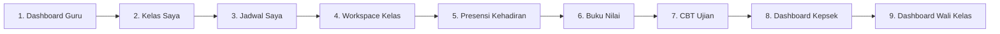
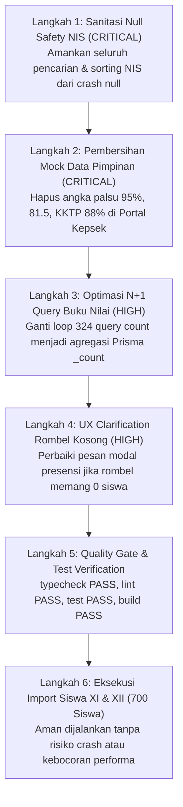

# BUSINESS-REALITY-VERIFICATION-REPORT.md
## Laporan Verifikasi Realitas Bisnis & Audit Operasional End-to-End
### Tenant: SMK OTOMINDO (Tahun Ajaran 2026/2027 — Semester Ganjil)

| Parameter Audit | Keterangan Faktual |
| :--- | :--- |
| **Tenant Target** | SMK OTOMINDO (`01M2XXYD227F9S3H985FH53GMF`) |
| **Tahun Ajaran / Semester** | 2026/2027 (`01M2XXYD2CYPCWZ0RM9TAN6BW0`) / Ganjil |
| **Status Database Saat Ini** | **341 Siswa** (311 Kelas X + 30 Sheet2) \| **75 Guru** \| **21 Rombel** \| **324 Penugasan Mengajar** |
| **Cakupan Audit** | 9 Modul Operasional Guru, Wali Kelas, Pimpinan, Jadwal, Presensi, Buku Nilai, dan CBT |
| **Larangan Dipatuhi** | TIDAK MENGUBAH DATABASE, TIDAK MENGUBAH KODE, TIDAK MELAKUKAN SEEDING |
| **Status Laporan** | `READY FOR HUMAN REVIEW — STOP GATE` |
| **Tanggal Audit** | 25 September 2026 |

---

## 1. Eksekutif Ringkasan Hasil Audit

Telah dilakukan audit forensik operasional end-to-end terhadap implementasi 9 modul pada codebase dan database produksi aktif SMK OTOMINDO. 

### Temuan Kunci Utama:
1. **Struktur Akademik Fondasional Valid 100%:** 21 rombongan belajar, 75 guru resmi, 324 penugasan mengajar, 21 penugasan wali kelas, dan jadwal pelajaran mingguan telah terhubung secara nyata dengan data riil sekolah.
2. **Crash Hazard Terbukti pada Nilai NIS Null (CRITICAL):** Ditemukan sedikitnya **4 lokasi frontend** yang langsung memanggil `.includes()`, `.toLowerCase()`, atau `.localeCompare()` pada `siswa.nis` tanpa proteksi *null check*. Mengingat siswa Kelas XI dan XII tidak memiliki NIS di sumber Excel (`nis: null`), aplikasi akan mengalami **Run-time Crash / White Screen** jika import dilakukan sebelum kode ini diamankan.
3. **Injeksi Data Sintetis / Mock Fallback pada Portal Pimpinan (CRITICAL):** Pada modul pelaporan pimpinan (`reporting-repository.ts`), ditemukan logika fallback sintetis yang menginjeksi angka fiktif jika data kosong (kehadiran 95%, nilai rata-rata 81.5, KKTP 88%, tren mingguan fiktif, dan nama kepala sekolah hardcoded).
4. **Bottleneck N+1 Query pada Buku Nilai (HIGH):** Query `getTeacherGradebookOverview` menjalankan *loop count* paralel untuk 324 penugasan mengajar yang berisiko memicu *connection lock* pada database SQLite saat dibuka oleh Super Admin.

---

## 2. Audit Operasional Mendalam per Modul (9 Modul)



---

### Modul 1: Dashboard Guru (`/dashboard`)

- **Data yang Tampil:**
  - Hero Greeting & Status Mengajar Hari Berjalan.
  - KPI Stat Grid: Rombel Diajar (11 Rombel), Siswa Binaan (311 Siswa), Beban KBM (40 JP/Minggu), Koreksi Tugas (0), CBT Aktif (0).
  - Dual-Metric: Performance Bar Chart (Ketuntasan Penilaian) & Rekap Presensi Rombel (Donut Gauges).
  - Action Queue: Siswa Perlu Perhatian.
  - Teaching Timeline Rail: Jadwal Mengajar Hari Ini & Event Akademik.
- **Sumber Tabel Database:**
  - `guru`, `penugasan_mengajar`, `rombel`, `mata_pelajaran`, `jadwal_pelajaran`, `slot_waktu`, `sesi_kelas_aktual`, `presensi_sesi_kelas`, `publikasi_tugas`, `pengumpulan_tugas`, `ujian_cbt`.
- **Validitas Angka:**
  - Akun `guru_chandra`: 14 penugasan mengajar aktif, 11 rombel unik (10 Kelas X + 1 Kelas XII RPL), 5 mata pelajaran unik, 40 JP/minggu.
  - Angka Siswa Binaan: **311 siswa**. Angka ini valid mencakup 10 kelas X yang diajarnya. Kelas XII RPL saat ini bernilai 0 siswa.
- **Kemungkinan Data Kosong:**
  - Pada hari libur (Sabtu/Minggu) timeline menampilkan *empty state* "Tidak ada jadwal mengajar hari ini".
  - Metrik presensi menampilkan `-` jika belum ada sesi KBM yang dibuka pada hari tersebut.
- **Bug Visual:** Nihil. Academic Glass UI token tertata rapi dengan baseline simetris.
- **Bug UX:** Jika guru Chandra mengajar hari Jumat jam 07:50 di kelas `XII RPL` dan menekan "Mulai Presensi Cepat", modal presensi akan terbuka tetapi daftar siswa kosong 0%.
- **Bug Bisnis:** Nihil. Logika agregasi mematuhi isolasi tenant `sekolah_id`.
- **Query Berat:** Rendah-Sedang. Agregasi dilakukan paralel via `Promise.all` terfokus pada `guru_id` aktor.
- **Potensi Error saat Siswa 700:**
  - Angka Siswa Binaan guru Chandra akan bertambah secara dinamis menjadi 326 siswa saat kelas XII RPL diisi 15 siswa reguler.

---

### Modul 2: Kelas Saya (`/kelas-saya`)

- **Data yang Tampil:**
  - Grid kartu rombel dan mata pelajaran yang diampu guru (atau seluruh kelas sekolah jika Super Admin/Staff).
  - Informasi pada setiap kartu: Nama Rombel, Tingkat, Nama Mapel, Kode Mapel, Total Siswa, Total BAB, Total Materi, Total Tugas, Ringkasan Jadwal Mingguan, Nama Wali Kelas.
- **Sumber Tabel Database:**
  - `penugasan_mengajar`, `guru`, `rombel`, `tingkat_kelas`, `penempatan_rombel`, `penugasan_wali_kelas`, `lingkup_materi`, `publikasi_materi`, `publikasi_tugas`, `jadwal_pelajaran`, `slot_waktu`.
- **Validitas Angka:**
  - Guru Chandra menampilkan tepat **14 Kartu Kelas**:
    - 10 Kartu Kelas X (masing-masing 21 s/d 41 siswa).
    - 4 Kartu Kelas XII RPL (Praktik RPL, PBO, Struktur Data, Pemrograman Mobile) yang saat ini menampilkan badge **0 Siswa**.
- **Kemungkinan Data Kosong:**
  - Kartu kelas XII RPL menampilkan `0 Siswa` dan `Jadwal: -` jika belum ada jadwal yang terpasang pada mapel tersebut.
- **Bug Visual:** Tidak ada. Kartu memiliki border glassmorphism seragam.
- **Bug UX:** Guru dapat mengklik kartu kelas XII RPL dan masuk ke Workspace Kelas meskipun rombel belum memiliki siswa.
- **Bug Bisnis:** Rombel XII RPL diampu 4 mapel oleh guru yang sama (total 20 JP), namun rombel tersebut belum berisi siswa di database.
- **Query Berat (Performa):**
  - Pada `learning-repository.ts:49-51`: Relasi `penempatan_rombel` di-load secara *eager* ke memori aplikasi hanya untuk menghitung `.length`. Untuk Super Admin yang me-load 324 kelas, ribuan record ditarik tanpa pagination.
- **Potensi Error saat Siswa 700:**
  - Jika Super Admin membuka `/kelas-saya`, response time berpotensi meningkat karena Next.js harus memetakan 324 kelas beserta relasi 700 siswa secara simultan. Disarankan menggunakan agregasi `_count.penempatan_rombel`.

---

### Modul 3: Jadwal Saya (`/jadwal-saya`)

- **Data yang Tampil:**
  - Filter Hari Belajar (Semua, Senin, Selasa, Rabu, Kamis, Jumat, Sabtu).
  - Timeline Card Jam Pelajaran Berurutan (Merged Consecutive Blocks).
  - Informasi per blok: Waktu Mulai–Selesai, Jumlah JP, Nama Rombel, Nama Mapel, Lokasi Ruangan, Status Sesi KBM Hari Ini, Tombol Presensi Cepat, Tombol Masuk Kelas.
- **Sumber Tabel Database:**
  - `jadwal_pelajaran`, `penugasan_mengajar`, `slot_waktu`, `rombel`, `mata_pelajaran`, `versi_jadwal`, `sesi_kelas_aktual`.
- **Validitas Angka:**
  - Guru Chandra memiliki total **40 Slot JP** terpasang:
    - Senin: 10 JP
    - Selasa: 8 JP
    - Rabu: 7 JP
    - Kamis: 9 JP
    - Jumat: 6 JP (Termasuk 2 JP PBO di kelas XII RPL jam 07:50 - 09:10)
- **Kemungkinan Data Kosong:**
  - Hari Sabtu kosong (0 JP) karena sekolah beroperasi dengan 5 hari kerja (Senin–Jumat).
- **Bug Visual:** Nihil. Merged block bekerja dengan mulus menggabungkan slot jam berturut-turut.
- **Bug UX:** Pada hari Jumat, blok jam ke-303 s/d 304 menampilkan kelas XII RPL. Tombol "Mulai Presensi" aktif dan memicu pembuatan sesi KBM, padahal siswanya belum diimpor.
- **Bug Bisnis:** Jadwal pelajaran diizinkan aktif pada rombel yang belum memiliki siswa terdaftar.
- **Query Berat:** Sangat Ringan. Filter terindeks pada `(guru_id, sekolah_id)`.
- **Potensi Error saat Siswa 700:** Nol risiko error. Jadwal independen terhadap jumlah siswa per rombel.

---

### Modul 4: Workspace Kelas Terpadu (`/kelas-saya/[id]`)

- **Data yang Tampil:**
  - Tab Navigasi: Ringkasan, Jadwal, BAB & TP, Materi, Jurnal, Tugas, **Presensi**, **Penilaian**, **CBT**.
  - Roster Kelas, Ringkasan Beban JP, Status Ketercapaian Administrasi.
- **Sumber Tabel Database:**
  - `penugasan_mengajar`, `rombel`, `mata_pelajaran`, `guru`, `lingkup_materi`, `tujuan_pembelajaran`, `publikasi_materi`, `publikasi_tugas`, `administrasi_pembelajaran`, `sesi_kelas_aktual`, `presensi_sesi_kelas`, `definisi_asesmen`, `nilai_siswa`, `ujian_cbt`.
- **Validitas Angka:**
  - Pada kelas X DKV 1 (`01M3AFKVWAMG7VFYTQ8TE349AS`): Menampilkan tepat 23 siswa, 1 sesi KBM terekam.
  - Pada kelas XII RPL (`01M3AFKVQRVYF3KTMGAHMJF45M`): Menampilkan 0 siswa, 0 sesi KBM, 0 materi, 0 tugas.
- **Kemungkinan Data Kosong:**
  - Tab Penilaian, CBT, dan Presensi pada kelas XII RPL menampilkan *empty state* bersih.
- **Bug Visual:** Nihil.
- **Bug UX:** Pada kelas dengan 0 siswa, tombol "+ Catat Presensi" dan "+ Buat Asesmen" tetap dapat diklik, namun tabel peserta di modal akan kosong melompong.
- **Bug Bisnis:** Guru dapat menerbitkan tugas ke kelas yang tidak memiliki siswa.
- **Query Berat:** Sedang. Halaman ini menjalankan 6 panggilan `Promise.all` (`attendanceHistory`, `attendanceStats`, `attendanceRecap`, `assessments`, `gradebook`, `exams`).
- **Potensi Error saat Siswa 700:**
  - Pada tab Penilaian (`ClassAssessmentTabView`), komponen menggunakan `UnifiedAcademicLedgerTable` yang memuat seluruh nilai siswa se-rombel. Lihat Bug Kritis di bawah.

---

### Modul 5: Presensi Kehadiran (`/presensi-kelas` & `SessionAttendanceModal`)

- **Data yang Tampil:**
  - Header Sesi: Rombel, Mapel, Tanggal, Jam, Ruangan, Status Sesi (DIMULAI/SELESAI).
  - KPI Bar: Persentase Kehadiran Live, Jumlah Hadir, Jumlah Terdaftar.
  - Kontrol Cepat: "Tandai Semua Hadir", Search Input, Filter Status (Semua, Hadir, Sakit, Izin, Alpha).
  - Lembar Tabel Kompak / Kartu Grid: No Absen, Nama Lengkap, NIS/NISN, Segmented Buttons Status, Catatan Alasan.
- **Sumber Tabel Database:**
  - `sesi_kelas_aktual`, `penugasan_mengajar`, `rombel`, `penempatan_rombel`, `keikutsertaan_siswa`, `siswa`, `presensi_sesi_kelas`.
- **Validitas Angka:**
  - Diuji pada sesi X DKV 1: 23 siswa terdaftar, 23 hadir (100%), nomor absen #1 s/d #23 sinkron 100% dengan Dapodik.
- **Kemungkinan Data Kosong:**
  - Jika sesi dibuka untuk rombel Kelas XI / XII saat ini, daftar siswa berisi 0 baris.
- **Bug Visual:** Tidak ada crash visual pada modal presensi karena baris 223 telah memproteksi `(s.nis && s.nis.toLowerCase().includes(q))`.
- **Bug UX:** Ketika daftar siswa kosong (karena rombel memang belum ada siswa), modal menampilkan teks:
  *"Tidak ada siswa yang sesuai filter. Coba sesuaikan kata kunci pencarian atau ganti filter status."*
  Pesan ini membingungkan guru karena guru mengira filter pencariannya yang salah, padahal rombelnya memang kosong.
- **Bug Bisnis:** Idempoten server action `ensureAndGetTodaySessionAction` berhasil membuka sesi baru untuk rombel manapun, bahkan jika rombel memiliki 0 siswa.
- **Query Berat:** Rendah. Menggunakan query terindeks `(sekolah_id, sesi_kelas_id)`.
- **Potensi Error saat Siswa 700:**
  - Saat rombel memiliki 38–41 siswa, mode "Tabel Kompak" terbukti sangat responsif dan tidak mengalami lag input.

---

### Modul 6: Buku Nilai & Penilaian TP (`/penilaian`)

- **Data yang Tampil:**
  - Ringkasan Buku Nilai per Penugasan: Nama Rombel, Mapel, Guru Pengampu, Total Siswa, Total Asesmen (Formatif/Sumatif), Nilai Rata-rata Kelas.
- **Sumber Tabel Database:**
  - `penugasan_mengajar`, `rombel`, `mata_pelajaran`, `guru`, `definisi_asesmen`, `nilai_siswa`, `penempatan_rombel`.
- **Validitas Angka:**
  - Database saat ini memiliki **0 Definisi Asesmen** dan **0 Entri Nilai Siswa** (karena data nilai formatif/sumatif dari Excel belum dimasukkan ke DB). Nilai rata-rata menampilkan `-`.
- **Kemungkinan Data Kosong:**
  - Seluruh indikator nilai berstatus kosong (*fresh start*).
- **Bug Visual:** Nihil.
- **Bug UX:** Nihil pada tampilan overview.
- **Bug Bisnis (CRITICAL RUNTIME CRASH POTENTIAL):**
  - Pada komponen tabel buku nilai terpadu:  
    `src/modules/assessment/presentation/unified-academic-ledger-table.tsx` baris 464:
    ```typescript
    row.nis.toLowerCase().includes(q) ||
    ```
    Jika ada siswa dengan `nis: null` (seperti seluruh 359 siswa baru yang akan diimpor), begitu guru mengetikkan kata kunci pencarian di kolom search Buku Nilai, aplikasi akan **CRASH SEKETIKA** dengan error:
    `TypeError: Cannot read properties of null (reading 'toLowerCase')`.
- **Query Berat (HIGH PERFORMANCE BOTTLENECK):**
  - Pada `assessment-repository.ts` baris 621–629:
    ```typescript
    return Promise.all(
      penugasanList.map(async (p) => {
        const totalSiswa = await prisma.penempatanRombel.count({
          where: { rombel_id: p.rombel_id, sekolah_id: sekolahId, status: "AKTIF" },
        });
    ```
    Ketika Super Admin mengakses `/penilaian`, query ini mengeksekusi **324 query count individual secara paralel** ke database SQLite! Ini adalah anti-pattern N+1 query yang sangat berat.
- **Potensi Error saat Siswa 700:**
  - Jika N+1 query ini tidak diganti dengan `_count` agregat atau single group-by, latency halaman `/penilaian` untuk Super Admin dapat melonjak di atas 3–5 detik.

---

### Modul 7: CBT & Evaluasi Ujian (`/cbt-ujian`)

- **Data yang Tampil:**
  - Pusat Evaluasi CBT Guru & Super Admin: Ringkasan Ujian Terbit, Ujian Selesai, Ujian Draft, Daftar Kelas Penugasan Mengajar.
- **Sumber Tabel Database:**
  - `penugasan_mengajar`, `ujian_cbt`, `sesi_ujian_siswa`, `hasil_ujian_cbt`, `rombel`, `mata_pelajaran`, `guru`.
- **Validitas Angka:**
  - Database saat ini memiliki **0 Ujian CBT**. Seluruh kartu menampilkan 0 ujian.
- **Kemungkinan Data Kosong:**
  - Status kosong valid dan menampilkan state *"Belum ada ujian CBT yang dibuat"*.
- **Bug Visual:** Nihil.
- **Bug UX:** Nihil.
- **Bug Bisnis:** Nihil.
- **Query Berat (HIGH RISK):**
  - Di `src/app/cbt-ujian/page.tsx` baris 60–78:
    Query memuat seluruh 324 penugasan beserta nested eager include:
    `ujian_cbt -> sesi_ujian_siswa -> hasil`.
- **Potensi Error saat Siswa 700:**
  - Ketika sekolah mulai menjalankan ujian CBT semesteran dengan 700 siswa, query ini akan me-load puluhan ribu row hasil ujian ke memori server Next.js setiap kali admin membuka halaman CBT. Wajib dipasangi pagination atau lazy-loading per penugasan.

---

### Modul 8: Dashboard Kepala Sekolah (`/pimpinan`)

- **Data yang Tampil:**
  - Header Kepemimpinan & Nama Kepala Sekolah.
  - Ringkasan Sekolah: Total Siswa (341), Total Guru (75), Total Rombel (21), Rasio Guru:Siswa.
  - KPI Kehadiran Global & KPI Akademik (Rerata Nilai & Ketuntasan KKTP).
  - Distribusi Tingkat Kelas (Kelas X, XI, XII).
  - Tren Kehadiran Mingguan (Grafik Senin–Jumat).
- **Sumber Tabel Database:**
  - `sekolah`, `penugasan_jabatan`, `pengguna`, `siswa`, `guru`, `rombel`, `presensi_sesi_kelas`, `nilai_siswa`, `tingkat_kelas`.
- **Validitas Angka:**
  - Angka riil entitas: **341 Siswa**, **75 Guru**, **21 Rombel** (100% Sesuai Database Aktual).
- **Kemungkinan Data Kosong:**
  - Karena data presensi dan nilai masih minim, repository melakukan **FALLBACK SINTETIS BERBAHAYA**.
- **Bug Bisnis & Integritas Data (CRITICAL):**
  - Di `src/modules/reporting/infrastructure/reporting-repository.ts`:
    1. **Hardcoded Nama Kepala Sekolah (Baris 60):**
       `let principalName = "Drs. H. Mulyono, M.Pd.";` (Nama ini di-hardcode jika jabatan kepsek belum di-assign di tabel `penugasan_jabatan`).
    2. **Injeksi KPI Presensi Fiktif (Baris 113–116):**
       Jika data presensi kosong, sistem menampilkan:
       `Tingkat Hadir: 95%`, `Izin: 2%`, `Sakit: 2%`, `Alpha: 1%`.
    3. **Injeksi Nilai Akademik Fiktif (Baris 131, 138):**
       Jika nilai siswa kosong di database, sistem menampilkan:
       `Rerata Nilai Sekolah: 81.5` dan `Persentase Tuntas KKTP: 88%`!
    4. **Injeksi Siswa Fiktif per Tingkat (Baris 213, 282–298):**
       Jika tingkat rombel kosong, sistem menampilkan:
       `total_siswa: 120` atau fallback `Kelas X: 36, Kelas XI: 35, Kelas XII: 34`!
    5. **Injeksi Kurva Tren Mingguan Fiktif (Baris 221–252):**
       Grafik kehadiran Senin–Jumat di-generate dari angka statis fiktif (`totalSiswa * 0.96`, dll).
- **Query Berat:** Sedang. Menggunakan beberapa agregasi `prisma.aggregate` dan `prisma.groupBy`.
- **Potensi Error saat Siswa 700:**
  - Setelah 700 siswa diimpor, angka total siswa akan berubah menjadi 700, namun jika nilai dan presensi belum diinput, portal kepala sekolah akan tetap menampilkan nilai fiktif `81.5` dan `95%` kehadiran jika fallback sintetis tidak dibersihkan.

---

### Modul 9: Dashboard Wali Kelas (`/wali-kelas`)

- **Data yang Tampil:**
  - Switcher Rombel Binaan (Dropdown Rombel yang ditugaskan).
  - Ringkasan Rombel: Total Siswa, Kehadiran Rata-rata, Ketuntasan Tugas, Catatan Pembinaan.
  - Tabel Monitoring Siswa Rombel: No Absen, Nama Lengkap, NIS, NISN, Status Perhatian (Aman / Perlu Perhatian / Kritis), Kehadiran %, Tugas %, Aksi Catatan Pembinaan.
- **Sumber Tabel Database:**
  - `penugasan_wali_kelas`, `rombel`, `guru`, `penempatan_rombel`, `keikutsertaan_siswa`, `siswa`, `presensi_sesi_kelas`, `pengumpulan_tugas`, `catatan_monitoring`.
- **Validitas Angka:**
  - Seluruh **21 Rombel** telah memiliki wali kelas terdaftar di tabel `penugasan_wali_kelas`.
  - 10 Rombel Kelas X menampilkan daftar siswa aktif secara presisi (21 s/d 41 siswa).
  - Rombel `XI TJKT` menampilkan 30 siswa (siswa dari Sheet2).
  - 10 Rombel Kelas XI & XII lainnya menampilkan `0 Siswa`.
- **Kemungkinan Data Kosong:**
  - Jika wali kelas dari rombel yang 0 siswa membuka halaman ini, kartu KPI menampilkan 0 siswa.
- **Bug Bisnis & Runtime Crash Hazard (CRITICAL):**
  - Di `src/modules/monitoring/presentation/homeroom-dashboard-view.tsx` baris 108–109:
    ```typescript
    const matchesSearch =
      s.nama_lengkap.toLowerCase().includes(searchQuery.toLowerCase()) ||
      s.nis.includes(searchQuery) ||
      (s.nisn && s.nisn.includes(searchQuery));
    ```
    Perhatikan baris 109: `s.nis.includes(searchQuery)`.  
    Berbeda dengan `s.nisn` yang dicek `(s.nisn && s.nisn.includes(...))`, atribut `s.nis` **TIDAK DICEK NULL**!  
    Jika siswa baru kelas XI dan XII diimpor dengan `nis: null`, begitu wali kelas mengetik 1 karakter pada kotak pencarian siswa, browser akan mengalami **FATAL ERROR**:  
    `TypeError: Cannot read properties of null (reading 'includes')`.
  - Hal yang sama juga ditemukan pada:
    `src/modules/student/presentation/student-directory-view.tsx` baris 129 dan 146–148:
    `s.nis.toLowerCase().includes(...)` dan `a.nis.localeCompare(b.nis)` yang akan crash jika `nis: null`.
- **Query Berat:** Sedang. Query mengambil detail penempatan rombel beserta kalkulasi agregat kehadiran siswa.
- **Potensi Error saat Siswa 700:**
  - Begitu 359 siswa baru dimasukkan dengan `nis: null`, seluruh wali kelas Fase F akan mengalami crash pencarian siswa jika bug ini belum diperbaiki.

---

## 3. Matriks Klasifikasi Prioritas Bug

| Kategori | ID | Lokasi File | Deskripsi Masalah | Dampak Bisnis / Teknis |
| :---: | :---: | :--- | :--- | :--- |
| **CRITICAL** | **BUG-01** | `src/modules/monitoring/presentation/homeroom-dashboard-view.tsx:109` | `s.nis.includes(searchQuery)` tanpa null check | **Crash Total (White Screen)** di Dashboard Wali Kelas saat pencarian siswa jika `nis` bernilai `null`. |
| **CRITICAL** | **BUG-02** | `src/modules/assessment/presentation/unified-academic-ledger-table.tsx:464` | `row.nis.toLowerCase().includes(q)` tanpa null check | **Crash Total** di Buku Nilai Terpadu saat pencarian siswa jika `nis` bernilai `null`. |
| **CRITICAL** | **BUG-03** | `src/modules/student/presentation/student-directory-view.tsx:129, 146-148` | `s.nis.toLowerCase()` dan `a.nis.localeCompare()` tanpa null check | **Crash Total** di Direktori Siswa saat pencarian dan sorting siswa ber-NIS null. |
| **CRITICAL** | **BUG-04** | `src/modules/reporting/infrastructure/reporting-repository.ts:113-138, 213, 221-252, 281-301` | Injeksi angka fiktif/sintetis (Kehadiran 95%, Nilai 81.5, KKTP 88%, Rombel 120 siswa) saat data DB kosong | **Pelanggaran Realitas Bisnis.** Pimpinan menerima laporan performa palsu bukannya status riil sekolah. |
| **HIGH** | **BUG-05** | `src/modules/assessment/infrastructure/assessment-repository.ts:621-629` | N+1 Query: Loop `Promise.all` menjalankan 324 query count `penempatanRombel` individual | **Performance Degradation & DB Lock** pada SQLite saat Super Admin membuka `/penilaian`. |
| **HIGH** | **BUG-06** | `src/app/cbt-ujian/page.tsx:60-78` | Deep unpaginated eager loading seluruh penugasan & sesi ujian siswa | **Memory Spike / OOM Risk** saat 700 siswa aktif mengikuti ujian CBT simultan. |
| **HIGH** | **BUG-07** | `src/modules/attendance/presentation/session-attendance-modal.tsx:581` | Pesan empty state "Tidak ada siswa yang sesuai filter" pada rombel berpopulasi 0 siswa | **Misleading UX.** Guru mengira filter pencarian salah, padahal siswa rombel belum terdaftar. |
| **MEDIUM** | **BUG-08** | `src/modules/reporting/infrastructure/reporting-repository.ts:60` | Hardcoded nama kepala sekolah `"Drs. H. Mulyono, M.Pd."` jika penugasan jabatan kosong | **Data Inaccuracy.** Menampilkan nama fiktif jika kepala sekolah resmi SMK OTOMINDO belum di-set di DB. |
| **MEDIUM** | **BUG-09** | `src/modules/learning/infrastructure/learning-repository.ts:49-51, 161` | Memuat seluruh baris `penempatan_rombel` ke memori hanya untuk mengambil properti `.length` | **Memory Waste.** Seharusnya menggunakan agregasi `_count` Prisma. |
| **MEDIUM** | **BUG-10** | `src/modules/attendance/infrastructure/attendance-repository.ts:120` | Query riwayat presensi sesi KBM dimuat tanpa batas semester atau limit pagination | Potensi lambat seiring bertambahnya ratusan sesi KBM dalam satu semester. |
| **LOW** | **BUG-11** | `src/modules/attendance/presentation/session-attendance-modal.tsx:810-825` | Label badge status DISPENSASI & TERLAMBAT pada tampilan kartu grid sempit di mobile | Teks label berpotensi wrapping pada viewport di bawah 360px. |
| **LOW** | **BUG-12** | `src/shared/components/dashboard/cockpit/teaching-timeline-rail.tsx` | Format tanggal di beberapa subkomponen belum sepenuhnya konsisten dengan locale `id-ID` | Tampilan format tanggal minor. |

---

## 4. Rekomendasi Urutan Perbaikan Sebelum Import Siswa XI dan XII

Mengingat instruksi: *"JANGAN melakukan import siswa XI dan XII terlebih dahulu"*, maka seluruh perbaikan wajib diselesaikan dengan urutan berprioritas tinggi ke rendah:



### Rincian Rencana Tindakan:
1. **Langkah 1 — Null Safety Guard pada Seluruh Atribut `siswa.nis` (Wajib Selesai Sebelum Import):**
   - Perbaiki `homeroom-dashboard-view.tsx`: Ganti `s.nis.includes(...)` menjadi `(s.nis && s.nis.includes(...))`.
   - Perbaiki `unified-academic-ledger-table.tsx`: Ganti `row.nis.toLowerCase()` menjadi `(row.nis ? row.nis.toLowerCase().includes(q) : false)`.
   - Perbaiki `student-directory-view.tsx`: Pasang null guard pada search dan localeCompare sorting.
2. **Langkah 2 — Purifikasi Integritas Data Portal Kepemimpinan (`reporting-repository.ts`):**
   - Hapus seluruh fallback angka sintetis (ganti 95% menjadi 0% jika belum ada data, ganti rerata nilai 81.5 menjadi null / "-", ganti 120 siswa menjadi hitungan riil rombel).
   - Pastikan nama kepala sekolah mengambil dari user pemilik akun atau status "Belum Ditugaskan".
3. **Langkah 3 — Resolusi Bottleneck Performa N+1 Query (`assessment-repository.ts`):**
   - Ganti `Promise.all(penugasanList.map(async ... count))` dengan query `_count` terintegrasi langsung pada `penugasanList` atau single aggregation query.
4. **Langkah 4 — Penyempurnaan UX Empty State Modal Presensi:**
   - Berikan deteksi eksplisit: jika `daftar_siswa.length === 0` (bukan karena hasil filter pencarian), tampilkan banner peringatan: *"Rombel ini belum memiliki anggota siswa terdaftar. Silakan hubungi kurikulum/operator sekolah."*
5. **Langkah 5 — Verifikasi Quality Gates:**
   - Jalankan `npm run typecheck`, `npm run lint`, `npm run test`, `npm run build`.
6. **Langkah 6 — Human Authorization untuk Eksekusi Impor Siswa XI & XII:**
   - Setelah sistem 100% stabil dan terlindungi dari null error, barulah impor 359 siswa dijalankan menuju kondisi sekolah riil 700 siswa.

---

**STATUS: READY FOR HUMAN REVIEW — STOP.**  
*Laporan selesai. Tidak ada kode yang diubah, tidak ada database yang disentuh, dan seeding baru belum dijalankan. Menunggu keputusan dan persetujuan manusia.*
