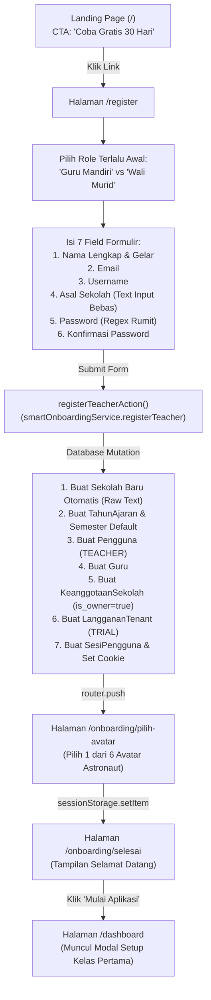
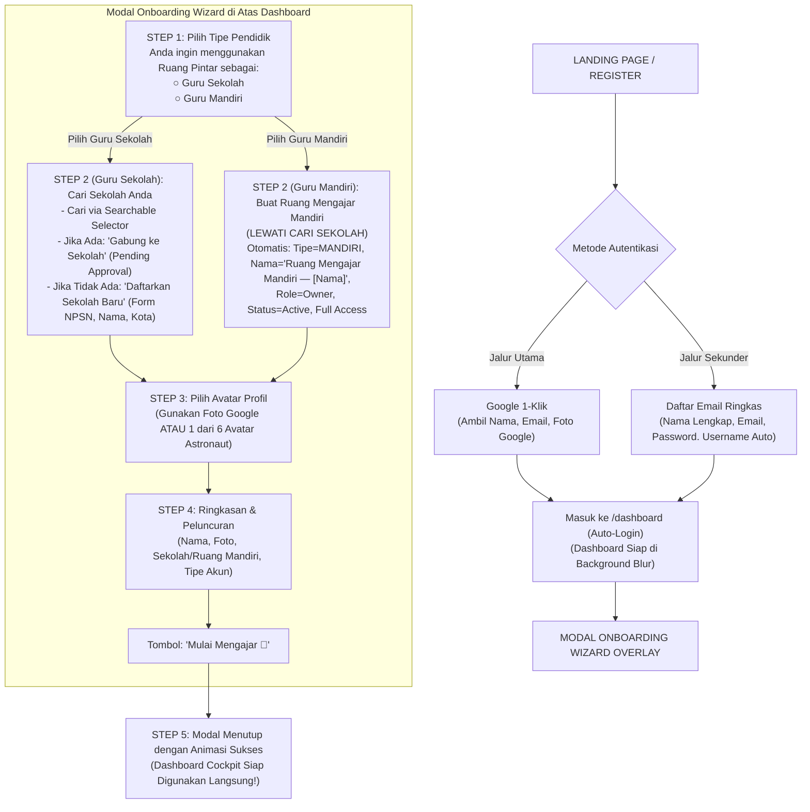

# LAPORAN AUDIT & REDESIGN ONBOARDING GURU MANDIRI
## Ruang Pintar — School Digital Operating Platform (SaaS Multi-Tenant)

> **Dokumen Audit:** `ONBOARDING-FLOW-AUDIT.md`  
> **Status:** APPROVED WITH REVISION (INCORPORATED) — READY FOR ARCHITECT REVIEW  
> **Tanggal Pembaruan:** 28 September 2026  
> **Kategori:** Product Architecture, User Experience (UX), & Multi-Tenant Onboarding  
> **Fokus Produk:** `Guru Sekolah` dan `Guru Mandiri`  
> *(Catatan Tegas: BUKAN Guru Les, Guru Privat, atau Guru Kursus)*  
> **Dokumen Pendamping Wajib:** `STAGE-UX-02-GURU-MANDIRI-DATA-OWNERSHIP-AUDIT.md`  
> **Referensi Kontrak:** `AGENTS.md`, `ADR-001`, `ADR-002`, `ADR-003`, `docs/WORKSPACE-ARCHITECTURE-RECOMMENDATION.md`

---

## DAFTAR ISI
1. [Ringkasan Eksekutif & Orientasi Produk](#1-ringkasan-eksekutif--orientasi-produk)
2. [Current Flow Audit (Alur Aktual Lapangan)](#2-current-flow-audit-alur-aktual-lapangan)
3. [Gap Analysis (ADR-001, ADR-002, ADR-003 & Reality Check)](#3-gap-analysis-adr-001-adr-002-adr-003--reality-check)
4. [UX Problems & Friksi Registrasi Publik](#4-ux-problems--friksi-registrasi-publik)
5. [Arsitektur Tenancy: Guru Sekolah vs Guru Mandiri](#5-arsitektur-tenancy-guru-sekolah-vs-guru-mandiri)
6. [Target Business Flow (Source of Truth Step 1–5 Berurutan)](#6-target-business-flow-source-of-truth-step-15-berurutan)
7. [Dampak Pengeluaran Wali Murid dari Registrasi Publik](#7-dampak-pengeluaran-wali-murid-dari-registrasi-publik)
8. [Required Database Changes (Prisma Schema)](#8-required-database-changes-prisma-schema)
9. [Required API & Server Action Changes](#9-required-api--server-action-changes)
10. [Required Frontend & UI Changes](#10-required-frontend--ui-changes)
11. [Migration Risk & Mitigation Strategy](#11-migration-risk--mitigation-strategy)
12. [Recommended Implementation Order (Roadmap Eksekusi)](#12-recommended-implementation-order-roadmap-eksekusi)

---

## 1. Ringkasan Eksekutif & Orientasi Produk

Audit ini dilakukan untuk mengevaluasi alur registrasi dan orientasi (*onboarding*) Ruang Pintar SaaS saat ini, mengidentifikasi friksi kognitif, kelemahan data, serta ketidaksesuaian arsitektural terhadap keputusan arsitektur multi-tenant (`ADR-001`, `ADR-002`, `ADR-003`).

### 1.1 Penegasan Batas Produk (Product Scope Invariant)
Fokus persona dan proposisi nilai Ruang Pintar berpusat pada:
1. **Guru Sekolah:** Pendidik formal yang mengajar di bawah naungan institusi sekolah/madrasah tertentu (`School Tenant`).
2. **Guru Mandiri:** Pendidik berdedikasi (misal: guru honorer, guru mata pelajaran lintas sekolah, atau pendidik yang menyiapkan ruang KBM dan bank soal secara mandiri sebelum sekolah resmi berlangganan) yang membutuhkan ruang kerja personal mandiri (`Personal Workspace Tenant`).

**Batas Eksklusif:**
Produk ini secara eksplisit **BUKAN** untuk Guru Les, Guru Privat, atau Guru Kursus bimbingan belajar. Seluruh terminologi, instrumen KBM, struktur rapor, dan format asesmen tetap berakar kuat pada **Standar Pendidikan Nasional / Kurikulum Merdeka** (Rombel, Mata Pelajaran, Capaian Pembelajaran, TP, KKTP, Presensi Pertemuan, Sumatif/Formatif, dan Leger Nilai).

---

## 2. Current Flow Audit (Alur Aktual Lapangan)

Berdasarkan inspeksi langsung terhadap repositori dan kode sumber aktif (`src/app/register/`, `src/app/actions/smart-onboarding-actions.ts`, `src/modules/ai-assistant/application/smart-onboarding-service.ts`, dan `src/app/onboarding/`):



### Penelusuran Langkah Aktual:
1. **Landing Page (`/`):** Hero section hanya menyediakan tombol standar `<Link href="/register">Coba Gratis 30 Hari</Link>`. Tidak ada Google 1-Tap atau Google OAuth Login.
2. **Halaman Registrasi (`/register`):** 
   - Di bagian atas, pengguna dipaksa memilih role: `Guru Mandiri` atau `Wali Murid` sebelum sistem memahami konteks sekolah.
   - Pengguna harus mengisi 6–7 kolom teks: Nama Lengkap, Email, Username, Asal Sekolah (input teks bebas tanpa validasi/dropdown), Password, dan Konfirmasi Password.
   - Validasi kata sandi mewajibkan kombinasi huruf besar, kecil, angka, dan simbol khusus (menimbulkan hambatan tinggi untuk sekadar mencoba trial).
3. **Backend Service (`smartOnboardingService.registerTeacher`):**
   - Setiap kali form disubmit, sistem **langsung membuat baris `Sekolah` baru** di tabel database menggunakan string teks mentah `nama_sekolah`.
   - Mengenerate data scaffolding: `TahunAjaran`, `Semester`, `Pengguna`, `Guru`, `KeanggotaanSekolah` (`is_owner: true`), `LanggananTenant` (`TRIAL`), dan `SesiPengguna`.
4. **Lompatan Halaman (Page Hops):**
   - Klien mengabaikan `redirectUrl` dan melakukan `router.push('/onboarding/pilih-avatar')`.
   - Pengguna memilih avatar kosmik, yang **hanya disimpan di `sessionStorage` browser**.
   - **Bug Kritis Ditemukan:** Pilihan avatar **sama sekali tidak disimpan ke kolom `Pengguna.foto_url` di database!** Jika sesi dibuka di perangkat lain atau tab di-refresh, pilihan avatar hilang.
   - Pengguna diarahkan ke `/onboarding/selesai`, lalu menekan "Mulai Aplikasi" untuk redirect ke `/dashboard`.
   - Di `/dashboard`, modal `TeacherFirstClassSetupModal` muncul di atas layar jika `totalRombel === 0`.

---

## 3. Gap Analysis (ADR-001, ADR-002, ADR-003 & Reality Check)

| Dimensi Arsitektur | Spesifikasi ADR Canonical | Realitas Implementasi Saat Ini | Status Evaluasi | Dampak Risiko |
| :--- | :--- | :--- | :---: | :--- |
| **Deduplikasi Sekolah (ADR-001 §5)** | Wajib cek NPSN dan kesamaan institusi (`nama_normalisasi + jenjang + kota_kabupaten`) sebelum tenant baru dibuat. | `nama_sekolah` berupa `<input type="text">` bebas. Setiap registrasi langsung membuat record `Sekolah` baru tanpa verifikasi. | **VIOLATION** | Polusi data sekolah, duplikasi institusi ("SMKN 1 Jakarta" vs "SMK Negeri 1 Jakarta"), data terpecah-pecah. |
| **Join School Request (ADR-001 §4, ADR-002 §6)** | Guru mencari sekolah existing, mengajukan join request (`status_keanggotaan: PENDING`), disetujui owner sekolah sebelum akses tenant aktif. | Tidak ada mekanisme pencarian sekolah saat daftar. Guru tidak bisa bergabung ke sekolah yang sudah ada melalui onboarding. | **VIOLATION** | Guru dari sekolah yang sama tidak bisa berkolaborasi dalam satu tenant sekolah resmi. |
| **Trial Ownership (ADR-001 §6, ADR-003 §3)** | Trial 30 hari adalah hak institusi/tenant, bukan akun pengguna. Bergabung ke sekolah existing tidak memperpanjang/membuat trial baru. | Setiap guru mendaftar otomatis mencetak record `LanggananTenant` dan `Sekolah` baru dengan trial 30 hari. | **VIOLATION** | Kebocoran kuota trial dan ketidakmampuan mengukur konversi institusi B2B/B2G secara akurat. |
| **Google Authentication** | Pintu masuk utama 1-klik untuk guru modern berbasis ekosistem Google Workspace for Education. | Hanya mendukung autentikasi lokal via password hash `bcrypt`. Belum ada adapter Google OAuth 2.0. | **MISSING** | Drop-off konversi pendaftaran tinggi akibat kelelahan mengetik form pendaftaran. |
| **Pola Presentasi Onboarding** | Sesuai standar SaaS modern (Notion, Slack, Canva): dashboard siap di background, onboarding berbentuk modal wizard overlay. | 3 kali redirect halaman terpisah (`/register` → `/onboarding/pilih-avatar` → `/onboarding/selesai` → `/dashboard`). | **SUBOPTIMAL** | User experience terasa terputus-putus, lambat, dan tidak profesional. |
| **Persistensi Avatar** | Pilihan avatar tersimpan permanen pada identitas profil `foto_url`. | Pilihan avatar hanya disimpan di browser `sessionStorage` (`rp_selected_avatar`), tidak pernah di-update ke tabel `pengguna`. | **BUG** | Avatar hilang saat pengguna logout, berganti browser, atau membuka aplikasi dari HP. |

---

## 4. UX Problems & Friksi Registrasi Publik

### Masalah 1: Formulir Registrasi Terlalu Gemuk (High Friction)
- Pengguna diminta mengisi 6–7 input sebelum melihat nilai manfaat produk (*Time to Value* lambat).
- Aturan validasi password yang ketat (huruf besar, huruf kecil, angka, simbol) menyebabkan kegagalan submit berulang pada pengguna awam.

### Masalah 2: Ekosistem Google Terabaikan
- Lebih dari 95% guru di Indonesia menggunakan akun Google (baik akun `@guru.kemdikbud.go.id`, `@belajar.id`, maupun akun Gmail pribadi) untuk Google Classroom, Drive materi, dan Google Meet.
- Ketiadaan tombol *Sign in with Google* memaksa pengguna mengingat password baru yang rentan dilupakan.

### Masalah 3: Pintu Masuk Wali Murid Mengotori Corong Guru
- Menampilkan pilihan role *Guru Mandiri vs Wali Murid* di halaman registrasi publik `/register` membingungkan pengguna guru dan merusak brand positioning Ruang Pintar.
- Orang tua yang mendaftar tanpa konteks sekolah/anak berakhir dengan akun kosong tak terhubung (*orphan accounts*).

### Masalah 4: Input Teks Bebas pada Asal Sekolah
- Menyebabkan variasi penulisan yang tak terkontrol (`SMKN 1 Jakarta` vs `SMK Negeri 1 Jkt`).
- Hal ini menghancurkan agregasi data akademik dan membuat fitur direktori sekolah Super Admin menjadi kacau.

### Masalah 5: Disorientasi Alur Redirect Halaman
- Alur redirect bertingkat (`/register` → `/pilih-avatar` → `/selesai` → `/dashboard`) memicu waktu muat berulang dan tampilan layar putih (*blank flash*).

---

## 5. Arsitektur Tenancy: Guru Sekolah vs Guru Mandiri

Sesuai dokumen arsitektur `docs/WORKSPACE-ARCHITECTURE-RECOMMENDATION.md` dan model data Prisma saat ini:
Seluruh tabel data akademik (`rombel`, `mata_pelajaran`, `penugasan_mengajar`, `presensi_sesi_kelas`, `nilai_siswa`, `ujian_cbt`) memiliki foreign key wajib:
```prisma
sekolah_id String // Relasi FK ke model Sekolah (onDelete: Restrict)
```

Jika seorang **Guru Mandiri** tidak memiliki `sekolah_id`, maka seluruh modul KBM, absensi, bank soal, dan buku nilai akan rusak karena kegagalan constraint database.

### Resolusi Arsitektur Tenancy:
1. **Guru Sekolah (Institutional Tenant):**
   - **Sekolah Ditemukan:** Guru mencari dan memilih sekolah via *Searchable School Selector*. Guru mengajukan permintaan bergabung (`KeanggotaanSekolah.status_keanggotaan = "PENDING"`, `sumber_pendaftaran = "JOIN_REQUEST"`). Sesi awal berada dalam mode terbatas sampai disetujui owner/operator sekolah.
   - **Sekolah Belum Ada:** Guru mendaftarkan sekolah resmi baru (mengisi nama resmi, NPSN, jenjang, kota/kabupaten). Divalidasi via deduplikasi institusi. Dibuatkan tenant sekolah bertipe `FORMAL` di mana guru menjadi `School Owner` pertama (`is_owner = true`, `status_keanggotaan = "ACTIVE"`).
2. **Guru Mandiri (Personal Workspace Tenant):**
   - Guru mengelola kelas sendiri tanpa afiliasi tenant sekolah formal.
   - Sistem **langsung membuatkan Ruang Kerja Mandiri Pendidik** tanpa melalui pencarian sekolah.
   - Tenant `Sekolah` otomatis diset: `tipe_sekolah = "MANDIRI"`, nama = `"Ruang Mengajar Mandiri — [Nama Guru]"`.
   - Guru otomatis memperoleh status `is_owner = true`, `status_keanggotaan = "ACTIVE"`, dan hak penuh (*Full Access*).
   - Di masa depan, jika sekolah guru tersebut resmi membeli lisensi institusi, riwayat nilai dan bank soal mandiri ini dapat dimigrasikan dengan mulus ke tenant sekolah (*Personal-to-School Data Handshake*).

---

## 6. Target Business Flow (Source of Truth Step 1–5 Berurutan)

Berdasarkan tinjauan arsitek, urutan alur onboarding direvisi agar **Tipe Pendidik dipilih di awal**, sehingga Guru Mandiri tidak dipaksa melewati pencarian sekolah yang tidak relevan.



### Rincian Langkah Canonical:
- **STEP 1 (Pilih Tipe Pendidik):**
  Pertanyaan utama: *"Anda ingin menggunakan Ruang Pintar sebagai:"*
  - **○ Guru Sekolah:** Mengajar dalam tenant sekolah resmi.
  - **○ Guru Mandiri:** Mengelola kelas sendiri tanpa tenant sekolah.
- **STEP 2 (Percabangan Alur):**
  - **Jika Guru Sekolah:** Masuk ke *School Discovery* (Cari sekolah di database. Jika ditemukan $\rightarrow$ Gabung Sekolah; jika belum ada $\rightarrow$ Buka form Daftarkan Sekolah Baru dengan validasi NPSN dan kota).
  - **Jika Guru Mandiri:** **Lewati School Discovery sepenuhnya!** Sistem langsung menyiapkan Ruang Mengajar Mandiri (`Tenant Type = MANDIRI`, nama `"Ruang Mengajar Mandiri — [Nama Guru]"`), status `Owner`, `Active`, dan `Full Access`.
- **STEP 3 (Pilih Avatar):**
  Pengguna memilih avatar: Foto Akun Google atau 1 dari 6 Avatar Astronaut yang sudah ada. Pilihan langsung disimpan permanen ke kolom `Pengguna.foto_url`.
- **STEP 4 (Ringkasan Onboarding):**
  Tampilkan kartu ringkasan identitas (Nama, Foto/Avatar, Nama Sekolah / Ruang Mandiri, Tipe Akun) dengan tombol utama: **"Mulai Mengajar 🚀"**.
- **STEP 5 (Masuk Dashboard):**
  Modal wizard menutup dengan animasi halus. Pengguna langsung berinteraksi dengan dashboard cockpit yang sudah siap di latar belakang.

---

## 7. Dampak Pengeluaran Wali Murid dari Registrasi Publik

Sesuai Revisi Wajib #2, opsi pendaftaran `Wali Murid` dikeluarkan secara permanen dari halaman registrasi publik `/register`.

### 7.1 Pemindahan Saluran Masuk Wali Murid
1. **Klaim Mandiri via Kode Siswa (`/guardian/klaim-anak`):** Wali murid memasukkan kode verifikasi siswa resmi dari sekolah.
2. **Undangan Khusus Sekolah (`/join/[code]`):** Menggunakan tautan undangan satu kali pakai dari operator atau wali kelas.
3. **Pendaftaran Tertutup Sekolah:** Nomor kontak wali didaftarkan oleh sekolah, memicu pengiriman kredensial aktivasi.

### 7.2 Analisis Dampak Teknis & Produk
- **Corong Registrasi:** Menghilangkan tab switcher di `/register`. Form registrasi menjadi 100% spesifik untuk guru.
- **Pencegahan Akun Zombi:** Tidak ada lagi orang tua yang mendaftar tanpa terhubung ke data siswa.
- **Database & Domain:** Tabel `wali_murid`, `hubungan_wali_siswa`, dan `pengajuan_wali` tetap aman dan tidak mengalami breaking change.
- Rincian analisis dampak lengkap didokumentasikan pada berkas **`STAGE-UX-02-GURU-MANDIRI-DATA-OWNERSHIP-AUDIT.md`**.

---

## 8. Required Database Changes (Prisma Schema)

Untuk mendukung alur bisnis di atas tanpa melanggar prinsip *expand-contract* dan mempertahankan integritas data yang ada:

### 8.1 Perubahan pada Model `Pengguna`
```prisma
model Pengguna {
  id                    String    @id
  sekolah_id            String?
  username              String    @unique
  email                 String?   @unique
  password_hash         String?   // DIUBAH: Menjadi opsional (nullable) untuk login Google OAuth
  auth_provider         String    @default("LOCAL") // BARU: LOCAL | GOOGLE
  google_id             String?   @unique // BARU: Subject identifier unik dari Google
  nama_lengkap          String
  peran_dasar           String    // SUPER_ADMIN | SCHOOL_STAFF | TEACHER | STUDENT | GUARDIAN
  status_akun           String    @default("AKTIF")
  harus_ganti_password  Boolean   @default(false)
  terakhir_login_pada   DateTime?
  percobaan_login_gagal Int       @default(0)
  dikunci_sampai        DateTime?
  foto_url              String?   // Digunakan untuk URL Foto Google atau ID Avatar Kosmik
  no_telepon            String?
  tipe_lisensi          String    @default("FREEMIUM")
  trial_berakhir_pada   DateTime?
  onboarding_selesai    Boolean   @default(false) // BARU: Flag status penyelesaian modal onboarding wizard
  created_at            DateTime  @default(now())
  updated_at            DateTime  @updatedAt

  // ... relasi lainnya dipertahankan ...
}
```

### 8.2 Perubahan pada Model `Sekolah`
```prisma
model Sekolah {
  id                  String   @id
  nama                String
  nama_normalisasi    String?  // BARU: Nama sekolah lowercase tanpa tanda baca untuk deduplikasi (ADR-001)
  npsn                String?  @unique
  jenjang             String   // SD | SMP | SMA | SMK | UMUM
  kota_kabupaten      String?  // BARU: Kota/Kabupaten untuk deduplikasi institusi kandidat (ADR-001)
  alamat              String?
  telepon             String?
  email               String?
  zona_waktu          String   @default("Asia/Jakarta")
  logo_url            String?
  tipe_sekolah        String   @default("FORMAL") // BARU: FORMAL (Tenant Sekolah) | MANDIRI (Personal Workspace)
  tipe_lisensi        String   @default("FREEMIUM")
  trial_berakhir_pada DateTime?
  status_aktif        Boolean  @default(true)
  created_at          DateTime @default(now())
  updated_at          DateTime @updatedAt

  // ... relasi lainnya dipertahankan ...
}
```

---

## 9. Required API & Server Action Changes

1. **Google OAuth Handler (`/api/auth/google/callback`):**
   - Menukar authorization code, mengambil data profil (`sub`, `name`, `email`, `picture`).
   - Membuat/mencocokkan identitas `Pengguna`, generate username otomatis, membuat `SesiPengguna`, dan redirect ke `/dashboard`.
2. **Streamlined Email Registration Action (`registerWithEmailAction`):**
   - Hanya menerima `nama_lengkap`, `email`, dan `password`.
   - Username otomatis dibuat oleh backend dari prefix email.
   - Menghapus tab switcher peran dan dropdown sekolah dari form registrasi awal.
3. **School Discovery Action (`searchSchoolsAction`):**
   - Pencarian sekolah publik yang aman dengan debounce dan rate-limiting per ADR-001.
4. **Onboarding Wizard Completion Action (`completeOnboardingWizardAction`):**
   - Jika `GURU_MANDIRI`: langsung buat tenant `tipe_sekolah = "MANDIRI"`, owner membership `ACTIVE`, profil guru, dan default KBM.
   - Jika `GURU_SEKOLAH` & Join: buat keanggotaan `status: PENDING` (`sumber: JOIN_REQUEST`).
   - Jika `GURU_SEKOLAH` & Create: jalankan deduplikasi dan panggil `tenantLifecycleService.provisionTenant`.
   - Simpan pilihan avatar ke `Pengguna.foto_url` database dan set `onboarding_selesai = true`.

---

## 10. Required Frontend & UI Changes

1. **Landing Page (`modern-landing-view.tsx`):**
   - Primary CTA: Tombol kapsul kontras tinggi *"Coba Gratis 30 Hari dengan Google"*.
   - Secondary CTA: Outline pill button *"Daftar dengan Email"*.
2. **Formulir Registrasi Email (`register-form.tsx`):**
   - Hapus pilihan *Wali Murid*.
   - Hapus kolom *Username*, *Konfirmasi Sandi*, dan *Asal Sekolah* input teks bebas.
   - Tersisa 3 kolom bersih: Nama Lengkap, Email, dan Kata Sandi.
3. **In-Dashboard Modal Wizard Component (`src/shared/components/dashboard/onboarding/`):**
   - Muncul otomatis di atas `/dashboard` saat `user.onboarding_selesai === false`.
   - Slide 1: Pilih Tipe Pendidik (Guru Sekolah vs Guru Mandiri).
   - Slide 2: School Discovery (hanya untuk Guru Sekolah) / Skip jika Guru Mandiri.
   - Slide 3: Avatar Selection (Foto Google atau 6 Avatar Astronaut).
   - Slide 4: Ringkasan & Peluncuran dengan tombol *"Mulai Mengajar 🚀"*.

---

## 11. Migration Risk & Mitigation Strategy

Penerapan perubahan arsitektur ini mematuhi prinsip **Expand → Backfill → Dual-Read → Cutover → Contract** sesuai mandat `ADR-001`:

| Aspek Risiko | Potensi Dampak | Strategi Mitigasi Teruji |
| :--- | :--- | :--- |
| **Pengguna Eksisting (Legacy Users)** | Akun guru yang sudah terdaftar dengan password lokal berisiko tidak bisa login jika schema diubah secara destruktif. | Kolom `password_hash` dibuat opsional (`nullable`), bukan dihapus. Seluruh akun lama tetap mempertahankan kredensial lokalnya. `AuthService.loginWithCredentials` tetap berfungsi 100% seperti semula. |
| **Data Sekolah Eksisting** | Data puluhan sekolah hasil seed dan impor KBM terganggu oleh penambahan field baru. | Kolom baru (`tipe_sekolah`, `nama_normalisasi`, `kota_kabupaten`) diberikan nilai default (`"FORMAL"`) pada migrasi Prisma. Tidak ada data yang hilang. |
| **Duplikasi Akun saat Login Google** | Guru yang sudah punya akun email lama login via tombol Google, menghasilkan akun ganda. | Pada callback Google OAuth, lakukan lookup ganda: pertama cari via `google_id`, jika tidak ada cari via `email`. Jika email cocok, otomatis tautkan `google_id` ke akun lama (*seamless identity link*). |
| **Status Onboarding Akun Lama** | Akun guru yang sudah aktif tiba-tiba terblokir oleh modal onboarding wizard di dashboard. | Skrip migrasi database melakukan backfill: seluruh akun `pengguna` yang dibuat sebelum tanggal rilis otomatis diset `onboarding_selesai = true`. |

---

## 12. Recommended Implementation Order (Roadmap Eksekusi)

Pelaksanaan redesign ini direkomendasikan dibagi menjadi 7 tahapan terstruktur yang dapat diverifikasi pada setiap gerbangnya:

```text
TAHAP 1: Database Schema Expansion
  ├── Update prisma/schema.prisma (Pengguna & Sekolah)
  ├── Generate migration lokal non-destruktif
  └── Backfill akun lama (onboarding_selesai = true)

TAHAP 2: Access Control Engine & Navigation (STAGE UX-02 Fixes)
  ├── Perluas ActorContext dengan is_owner dan tipe_sekolah
  ├── Berikan hak kelola kelas & siswa untuk Tenant Owner
  └── Tampilkan menu Data Siswa bagi Guru Mandiri di sidebar

TAHAP 3: Authentication & Registration Backend
  ├── Google OAuth Route Handler (/api/auth/google)
  ├── Auto-generate username pada IdentityService
  └── registerWithEmailAction ringkas (3 kolom)

TAHAP 4: School Discovery & Atomic Onboarding Provisioning
  ├── searchSchoolsAction publik
  └── completeOnboardingWizardAction (alur Guru Mandiri vs Guru Sekolah)

TAHAP 5: In-Dashboard Modal Onboarding Wizard
  ├── Komponen modal wizard di atas dashboard (/dashboard)
  └── Integrasi Slide 1 (Tipe) → Slide 2 (Sekolah/Skip) → Slide 3 (Avatar) → Slide 4 (Summary)

TAHAP 6: UI Redesign (Landing Page & /register)
  ├── Tombol Google CTA utama pada Landing Page
  └── Pembersihan formulir /register (hapus Wali Murid, username, konfirmasi sandi)

TAHAP 7: Quality Gate & Verification
  ├── Vitest automated tests
  └── Pengecekan typecheck, lint, format:check, dan build
```

---

Laporan audit revisi ini telah disinkronkan dengan berkas audit kedaulatan data `STAGE-UX-02-GURU-MANDIRI-DATA-OWNERSHIP-AUDIT.md` dan siap untuk ditinjau oleh Architect Owner sebelum tahap penulisan spesifikasi formal (`SPEC` / `PLAN`).
