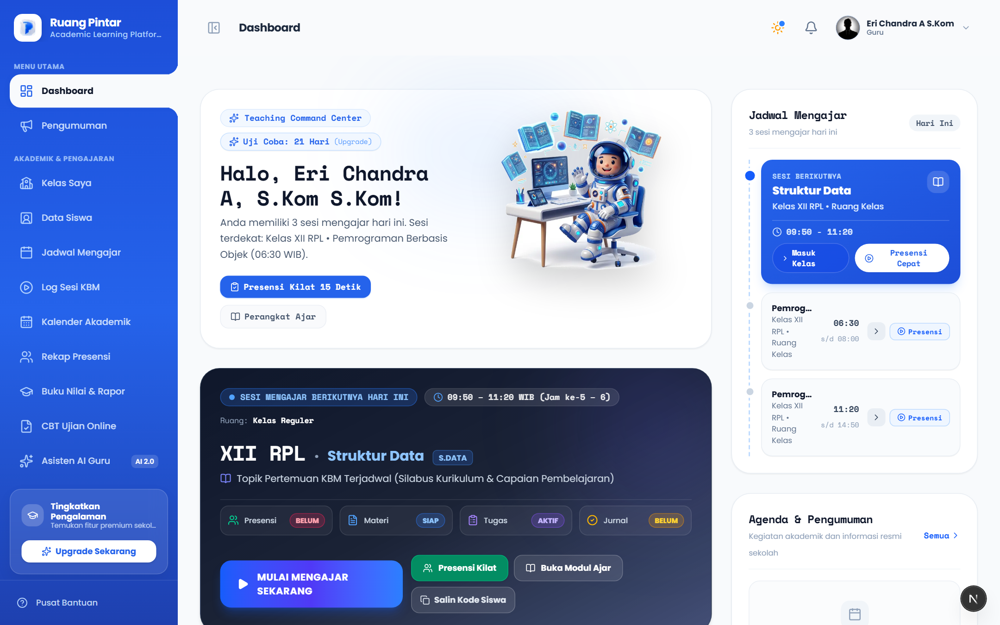
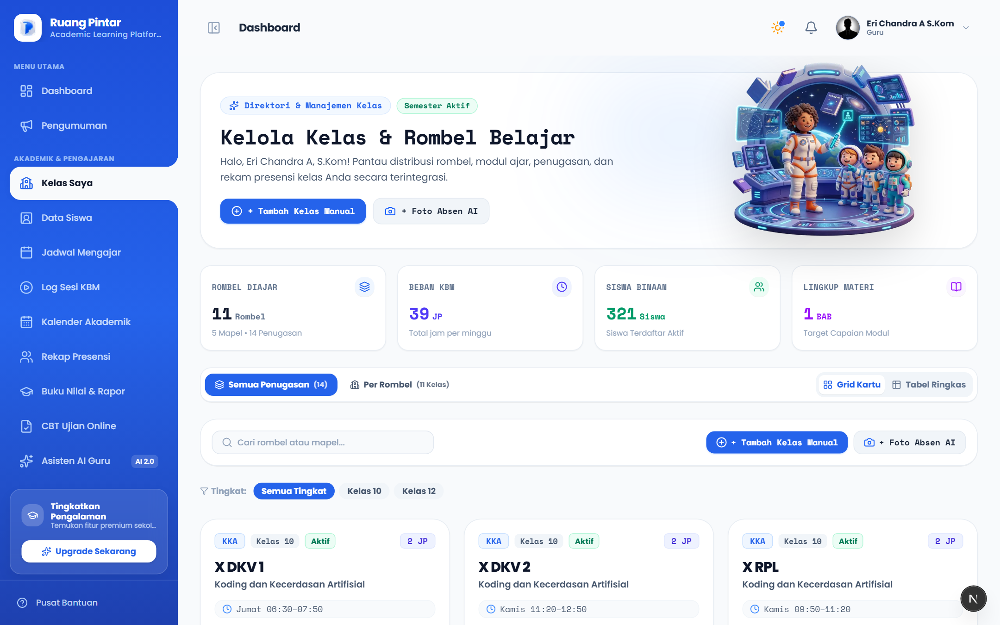
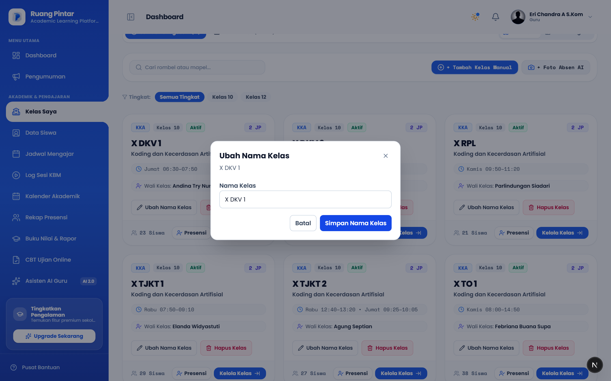
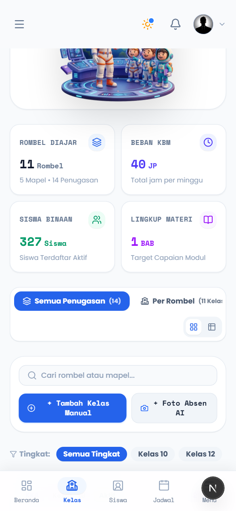

# P1 — Data Kelas & Dashboard Statistics

## 1. File yang Diubah

- `P1-IMPLEMENTATION-REPORT.md`
- `src/app/actions/academic-actions.ts`
- `src/app/struktur-akademik/page.tsx`
- `src/app/kelas-saya/page.tsx`
- `src/modules/academic/application/rombel-service.ts`
- `src/modules/academic/infrastructure/academic-repository.ts`
- `src/modules/academic/presentation/academic-management-tabs.tsx`
- `src/modules/academic/presentation/rombels-view.tsx`
- `src/modules/learning/presentation/teacher-classes-view.tsx`
- `src/modules/teacher/application/teacher-facade.ts`
- `src/shared/components/dashboard/role-views/teacher-dashboard.tsx`
- `scripts/capture-guru-mandiri-p0-evidence.mjs`
- `src/test/academic/academic-views.test.tsx`
- `src/test/academic/rombel-actions.test.ts`
- `src/test/academic/rombel.test.ts`
- `src/test/ai-assistant/smart-onboarding-service.test.ts`
- `src/test/authorization/tenant-owner-access.test.ts`
- `src/test/learning/learning-views.test.tsx`
- `src/test/teacher/teacher-facade.test.ts`
- `docs/specs/done/p1-data-kelas-dashboard-statistics.md`
- `docs/plans/done/p1-data-kelas-dashboard-statistics-plan.md`
- `docs/phases/screenshots/guru-mandiri-p1-dashboard-statistics.png`
- `docs/phases/screenshots/guru-mandiri-p1-kelas-desktop.png`
- `docs/phases/screenshots/guru-mandiri-p1-kelas-mobile.png`
- `docs/phases/screenshots/guru-mandiri-p1-ubah-nama-dialog.png`

The P0 evidence capture script received formatting-only normalization so the repository-wide format gate can pass, plus P1 screenshot capture steps.

## 2. Root Cause

- Rombel creation through the general academic-structure form only persisted `Rombel`; it had no subject input and therefore could not create a meaningful `PenugasanMengajar`.
- Guru Mandiri's dashboard calculated class and student counts from active teaching assignments/placements. Owner workspace data without those assignments was consequently omitted.
- The class directory had no owner-level rename/delete controls.
- Rombel delete used hard deletion despite academic relations protected by foreign keys and historical records.
- Partial update input mapped omitted nullable fields to `null`, risking accidental metadata clearing.

## 3. Perubahan Implementasi

- Guru Mandiri creates a class from the manual class flow, which creates `Rombel`, `MataPelajaran`, `PenugasanMengajar`, and supplied students inside one Prisma transaction. A duplicate-NIS failure test proves rollback of both rombel and assignment.
- Owner create requests to the general rombel action are rejected server-side with `USE_ATOMIC_CLASS_CREATION`; the non-atomic create control is hidden from owner UI. Staff/academic operators retain their existing structure workflow.
- Dashboard owner statistics count active rombel and active students with the active `sekolah_id`. Regular teachers continue to see assignment-scoped class/student counts, and learning workload remains based on active assignments.
- Owner KPI labels distinguish workspace totals from teaching-assignment metrics.
- Owner class cards now offer rename and confirmed delete. Rename sends only `nama`; server update preserves omitted fields.
- Delete is tenant-scoped soft archive: rombel becomes `DIARSIPKAN`, active teaching assignments become `ARSIP`, and historical attendance/assessment/learning relations remain intact. Cross-tenant ownership is checked before the archive transaction.
- Update/delete actions require `academic.classes.manage`; the access engine grants this to tenant owners and continues to deny regular teachers.
- Revalidation covers `/struktur-akademik`, `/kelas-saya`, and `/dashboard`.
- No dependencies or database migrations were added.

## 4. Test yang Ditambahkan

- Owner dashboard counts workspace classes and students while regular teacher counts remain assignment-scoped.
- Rombel archive keeps records and archives active assignments.
- Duplicate-NIS failure rolls back owner class and assignment creation atomically.
- Owner cannot bypass the UI and call the non-atomic rombel create action.
- Owner structure UI hides non-atomic create while retaining edit/delete controls.
- Owner class cards expose rename/delete only to owners; rename is partial and delete requires confirmation.
- Tenant-owner permission allow and regular-teacher permission deny assertions.

## 5. Hasil Quality Gate

| Gate | Result |
| --- | --- |
| `npm run typecheck` | Passed |
| `npm run lint` | Passed with 0 errors; 4 existing `` warnings in CBT presentation files |
| `npm run format:check` | Passed |
| `npm run test -- --reporter=dot` | Passed: 116 files, 711 tests |
| `npm run build` | Passed: Next.js production build, 27 static pages generated |

### Pemeriksaan Tambahan

- **Dependencies / migrations:** Tidak ada dependency atau migrasi yang ditambahkan.
- **Domain invariants:** Tidak ada perubahan schema/domain identity, enrollment, placement, attendance, grade, assessment, atau CBT records. Archive mempertahankan referensi historis.
- **Authorization & tenant isolation:** Rename/archive memerlukan `academic.classes.manage`; seluruh operasi membatasi `sekolah_id` aktif; direct non-atomic create owner ditolak. Test memastikan owner diizinkan, guru reguler ditolak, dan cross-tenant archive ditolak.
- **UI visual QA:** Screenshot owner desktop, mobile 390px, dashboard, dan dialog rename telah ditinjau; tombol dan dialog terbaca tanpa clipping. Capture tidak menyimpan mutasi.
- **Build verification:** Production build lulus setelah perubahan akhir; tidak ada migrasi/dependency.
- **Git status:** Worktree sudah berisi banyak perubahan tracked/untracked sebelum P1. Perubahan P1 tetap tidak di-commit; file P1 yang ditambahkan/diubah tercatat pada status git. Tidak ada perubahan baseline yang dibersihkan.

## 6. Screenshot Evidence

Capture uses an owner session and does not submit rename/delete mutations.

### Dashboard

### Class Directory — Desktop

### Rename Dialog

### Class Directory — Mobile

## 7. Risiko Regresi

- Delete now means archive rather than physical removal. Consumers that assumed deleted rombel rows disappear from storage must treat `DIARSIPKAN` as inactive; preserving historical references is intentional.
- Archived rombel and teaching assignments no longer appear in active workspace lists. Existing historical records remain available through their owning academic workflows.
- Guru Mandiri can no longer create a rombel from the general structure form; use the class flow that asks for a subject and creates its assignment atomically.
- Workspace student total counts active students for the tenant, not only students placed in a class taught by the owner. Regular teacher metrics remain assignment-scoped.
- Checklist manual tetap diperlukan untuk menilai alur rename/archive menggunakan akun nyata dan memastikan data riwayat tenant tetap dapat dibuka pada seluruh halaman akademik.

## 8. Manual Verification Checklist

- [ ] Sign in as Guru Mandiri; dashboard class/student totals match active data in the active tenant.
- [ ] Sign in as a regular teacher; class/student totals remain limited to active teaching assignments.
- [ ] Open `/kelas-saya`; verify owner class cards expose “Ubah Nama Kelas” and “Hapus Kelas”.
- [ ] Rename a class; verify the new name appears while year, semester, grade, program, status, and capacity remain unchanged.
- [ ] Confirm deletion; verify the class disappears from active workspace lists while historical attendance/assessment records remain accessible.
- [ ] Attempt cross-tenant update/delete; verify the action is denied and the other tenant remains unchanged.
- [ ] Open `/struktur-akademik` as Guru Mandiri; verify non-atomic “Bentuk Rombel” is unavailable. Create a class through `/kelas-saya` and verify its teaching assignment appears in class, attendance, assessment, and CBT contexts.
- [ ] Open `/struktur-akademik` as authorized school staff; verify the existing general rombel form remains available.
- [ ] Repeat the owner card workflow at desktop and 390px mobile widths.

## Phase Status

`APPROVED — PHASE P1 CLOSED BY HUMAN ARCHITECT`

P1 only. No P2, Google Login, School Discovery, or new onboarding work was performed. Await Human Architect review before continuing.
