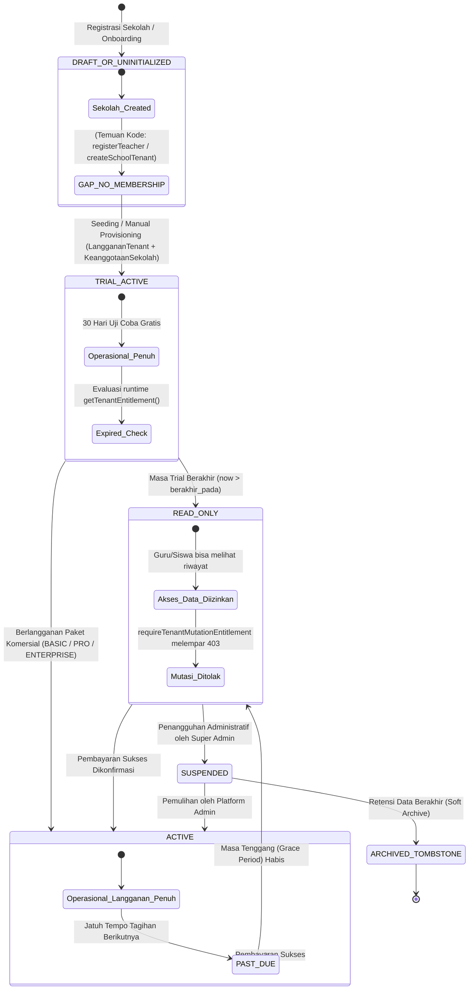
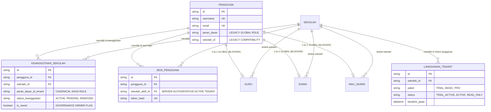
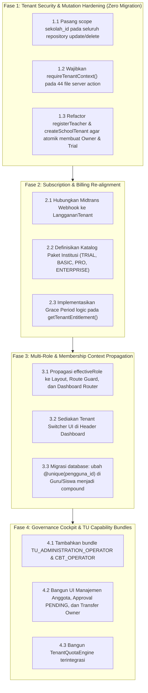

# RUANG PINTAR — STAGE 12: SAAS GOVERNANCE & TENANT FOUNDATION AUDIT REPORT
**Forensic & Comprehensive SaaS Multi-Tenant Architecture Review**

| Dokumen | Nilai / Status |
| --- | --- |
| **Identitas Proyek** | Ruang Pintar — School Digital Operating Platform |
| **Fase Saat Ini** | PHASE SAAS-04 — MULTI-TENANT FOUNDATION IMPLEMENTATION |
| **Tahap Audit** | STAGE 12 — SAAS GOVERNANCE & TENANT FOUNDATION AUDIT |
| **Status Dokumen** | `READY FOR HUMAN REVIEW` |
| **Tanggal Audit** | 25 September 2026 |
| **Batasan Operasi** | Read-Only Forensic Audit (0 Code Changes, 0 Migrations, 0 Remediations, 0 Commits) |
| **Lingkungan Data** | Tenant SMK OTOMINDO (739 Akun: 700 Siswa, 38 Guru, 1 Super Admin; 1 Sekolah Aktif) |

---

# 1. EXECUTIVE SUMMARY

Audit forensik Stage 12 ini dilaksanakan untuk mengevaluasi secara tuntas dan obyektif kesiapan platform **Ruang Pintar** dalam bertransformasi dari sistem berbasis instalasi sekolah tunggal (*single-tenant legacy model*) menjadi platform **SaaS Multi-Tenant Skala Besar** (*shared-database, shared-schema modular monolith*).

### Ringkasan Temuan Kunci:
1. **Fondasi Database Siap-Sebagian (Hybrid State):** Skema Prisma telah memiliki tabel tenancy modern (`KeanggotaanSekolah`, `LanggananTenant`, dan kolom `sekolah_aktif_id` pada `SesiPengguna`). Data SMK OTOMINDO saat ini telah 100% dipetakan ke model keanggotaan ini (738 membership aktif: 700 Siswa, 38 Guru).
2. **Ketergantungan Legacy pada Lapisan Aplikasi (Critical Architectural Debt):** Sebanyak **106 file** masih merujuk secara kaku ke `user.peran_dasar` (asumsi satu user = satu role global), dan **44 file** (berisi 253 referensi di server actions) masih langsung mempercayai `user.sekolah_id` alih-alih mengekstrak konteks tenant yang tervalidasi secara server-authoritative (`requireTenantContext`).
3. **Konflik Subsistem Billing & Entitlement (Direct Architectural Clash):** Modul billing saat ini (`subscription-service.ts` / Midtrans webhook) memperbarui `Pengguna.tipe_lisensi = "PRO"` (berlangganan level user individu "Guru Pro"), sementara modul isolasi mutasi SaaS (`tenant-entitlement-service.ts`) membaca status dari `LanggananTenant` (berlangganan level tenant sekolah). Pembayaran komersial yang terjadi saat ini tidak akan pernah mengaktifkan entitlement sekolah di database.
4. **Peluang Celah Keamanan Mutasi Antar-Tenant (Cross-Tenant Unscoped Mutations):** Ditemukan sejumlah repository (`learning-repository.ts`, `teacher-repository.ts`, `integration-repository.ts`) yang menjalankan mutasi `update` dan `delete` hanya berdasarkan single-id `where: { id }` tanpa menyertakan `sekolah_id`, membuka risiko *cross-tenant data tampering* jika ID tertebak.
5. **Rekomendasi Definitif Peran Tata Usaha (TU):** Dianalisis secara mendalam bahwa peran **Tata Usaha TIDAK LAYAK dijadikan Base Role ke-6**. Tata Usaha harus diimplementasikan sebagai **Capability Bundle** (`STUDENT_DATA_OPERATOR`, `ACADEMIC_ADMINISTRATION_OPERATOR`, `CBT_OPERATOR`) dan **Penugasan Jabatan Struktural** di bawah Base Role kanonik `SCHOOL_STAFF`, menjaga integritas 5 peran dasar platform.

---

# 2. SAAS READINESS SCORE

Platform dievaluasi terhadap 6 pilar kesiapan SaaS enterprise skala besar:

| Pilar Evaluasi | Skor (0-100) | Status | Keterangan Ringkas |
| --- | :---: | :---: | --- |
| **1. Tenant Readiness** | **74 / 100** | Stabil Lokal | Isolasi query sekolah berjalan baik untuk tenant tunggal; alur lifecycle pembuatan tenant masih terfragmentasi. |
| **2. Membership Readiness** | **78 / 100** | Fondasi Kuat | Tabel `KeanggotaanSekolah` dan service membership aktif; terhalang constraint `@unique` pada profil domain. |
| **3. Multi-Role Readiness** | **45 / 100** | Kritis / Debt | Lapisan aplikasi (106 file) masih berasumsi satu role global (`user.peran_dasar`). |
| **4. Subscription Readiness** | **55 / 100** | Terfragmentasi | Tabel `LanggananTenant` ada, namun modul Midtrans justru memperbarui lisensi di tabel `Pengguna`. |
| **5. Entitlement & Quota** | **50 / 100** | Parsial | Gate mutasi read-only bekerja, namun kuota siswa, guru, CBT, dan AI belum memiliki engine kuota sentral. |
| **6. Governance & Ownership** | **68 / 100** | Cukup | Proteksi last active owner berjalan di service, namun belum ada hak akses eksplisit dan UI transfer ownership. |
| **OVERALL SAAS SCORE** | **61.7 / 100** | **TRANSITIONAL FOUNDATION** | **Fondasi skema siap; aplikasi membutuhkan harmonisasi konteks sebelum scale-out.** |

---

# 3. TENANT READINESS SCORE & LIFECYCLE AUDIT (AREA 01)

### Skor Tenant Readiness: **74 / 100**

### 3.1. Audit 10 Alur Lifecycle Tenant

| Alur Lifecycle | Status Kode | Implementasi Aktual Saat Ini | Potensi Masalah / Konflik Bisnis |
| --- | :---: | --- | --- |
| **1. Create Tenant** | **PARSIAL** | `createSchoolTenantAction` (Super Admin) & `smartOnboardingService.registerTeacher` (Self-serve). | **CRITICAL BUG:** Kedua alur membuat entitas `Sekolah`, tetapi **TIDAK MEMBUAT** `KeanggotaanSekolah` dan **TIDAK MEMBUAT** `LanggananTenant`. Tenant baru yang dibuat via alur ini langsung terkunci dalam mode `READ_ONLY` tanpa owner aktif. |
| **2. Trial Tenant** | **TERSEDIA** | Didefinisikan di `LanggananTenant` (paket: `TRIAL`, 30 hari). Evaluasi kedaluwarsa dinamis saat runtime di `getTenantEntitlement()`. | Bekerja baik untuk data SMK OTOMINDO yang diseed, tetapi pembuatan tenant baru via form belum otomatis men-generate record ini. |
| **3. Join Existing Tenant** | **PARSIAL** | `tenantMembershipService.createPendingMembership(..., "JOIN_REQUEST")` sudah siap secara backend logic. | Belum ada form UI pencarian sekolah berbasis NPSN/nama untuk alur calon guru/siswa bergabung mandiri. |
| **4. Invite Member** | **PARSIAL** | Service backend mendukung pembuatan keanggotaan `INVITATION`. | Belum tersedia token generator bertenggang waktu, dispatch pengiriman undangan via email, dan UI manajemen undangan. |
| **5. Approval Workflow** | **PARSIAL** | `tenantMembershipService.changeStatus` (`ACTIVE` / `REJECTED`) dengan audit logging append-only. | Belum ada dashboard view / cockpit modal bagi School Owner untuk menyetujui daftar pendaftar tertunda (`PENDING`). |
| **6. Leave Tenant** | **TERSEDIA** | `changeStatus` ke `REMOVED` di `tenantMembershipService.ts`. Memvalidasi proteksi owner terakhir. | Bekerja server-side; sesi pengguna otomatis dibersihkan dari `sekolah_aktif_id` jika keanggotaan dicabut. |
| **7. Transfer Ownership** | **BELUM TERSEDIA** | Baru didefinisikan secara konseptual pada dokumen `ADR-002`. | Belum ada method `transferOwnership` atomik dua arah di service layer maupun server action. |
| **8. Suspend Tenant** | **PARSIAL** | Status `SUSPENDED` didukung oleh enum skema `Sekolah` dan `LanggananTenant`. | Belum ada server action platform bagi Super Admin untuk menangguhkan tenant yang melanggar ToS / menunggak bayar. |
| **9. Reactivate Tenant** | **PARSIAL** | Didukung oleh transisi state di skema. | Belum ada workflow pemulihan otomatis saat pembayaran perpanjangan invoice berhasil. |
| **10. Delete Tenant** | **BELUM TERSEDIA** | Dilarang keras *hard delete* fisik. | Belum ada mekanisme *soft-archive* / *tombstone* yang aman terhadap integritas relasi foreign key puluhan modul. |

### 3.2. Diagram Lifecycle Tenant Aktual Berdasarkan Codebase



---

# 4. MEMBERSHIP MODEL AUDIT (AREA 02)

### Skor Membership Readiness: **78 / 100**

### 4.1. Jawaban Eksplisit terhadap 4 Pertanyaan Kunci

#### 1. Apakah 1 user dapat bergabung ke banyak tenant?
> **YA, PADA LEVEL SKEMA DATABASE.**
> Tabel `KeanggotaanSekolah` memiliki relasi `Many-to-One` ke `Pengguna` dan `Sekolah` dengan *compound unique constraint*:
> ```prisma
> @@unique([pengguna_id, sekolah_id])
> ```
> Seorang pengguna dapat memiliki baris keanggotaan terpisah di SMK OTOMINDO, SMA B, dan SMP C tanpa perlu menggandakan akun `Pengguna` (username/email/password tetap tunggal).

#### 2. Apakah 1 user dapat memiliki role berbeda di tenant berbeda?
> **YA, PADA LEVEL SKEMA DATABASE.**
> Kolom `peran_dasar_di_tenant` tersimpan di setiap baris `KeanggotaanSekolah`. Seorang pengguna secara legal di database dapat menjadi:
> - `TEACHER` di Tenant A (SMK OTOMINDO)
> - `GUARDIAN` di Tenant B (sekolah tempat anaknya belajar)
> - `SCHOOL_STAFF` di Tenant C.

#### 3. Apakah model database saat ini mendukung hal tersebut?
> **MENDUKUNG PADA MODEL MEMBERSHIP, TETAPI TERBENTUR PADA MODEL PROFIL DOMAIN.**
> Meskipun `KeanggotaanSekolah` mengizinkan banyak tenant, model profil personil spesifik di bawahnya (`Guru`, `Siswa`, `WaliMurid`) memiliki kendala struktural yang membatasi fleksibilitas multi-tenant.

#### 4. Apa saja blocker teknis yang ditemukan?
> Ditemukan **3 Blocker Teknis Utama**:
> 1. **Global Unique Constraint pada Profil Domain:**
>    - Pada model `Guru`: `pengguna_id String? @unique`
>    - Pada model `Siswa`: `pengguna_id String? @unique`
>    - Pada model `WaliMurid`: `pengguna_id String? @unique`
>    *Dampak:* Jika seorang guru mengajar di 2 sekolah berbeda (misal: guru honorer lintas sekolah), sistem **GAGAL** membuat profil `Guru` kedua untuk user tersebut karena terjadi *collision* pada `@unique(pengguna_id)`. Constraint seharusnya diubah menjadi scoped per tenant: `@@unique([pengguna_id, sekolah_id])`.
> 2. **Ketergantungan Kode pada `Pengguna.peran_dasar` Global:**
>    Lapisan middleware, route guard, dan server action membaca role dari tabel akun `Pengguna`, bukan dari keanggotaan aktif yang dipilih di sesi.
> 3. **Penyimpangan Kolom Legacy `Pengguna.sekolah_id`:**
>    Kolom `Pengguna.sekolah_id` masih eksis dan terisi di database, menyebabkan ambigu sumber kebenaran antara akun global dan keanggotaan aktif.

### 4.2. Peta Relasi Database Multi-Tenant & Identitas



---

# 5. MULTI ROLE USER AUDIT (AREA 03)

### Skor Multi-Role Readiness: **45 / 100**

Pemeriksaan kuantitatif terhadap seluruh basis kode mendeteksi jurang pemisah yang lebar antara abstraksi membership dan implementasi nyata:
- Penggunaan `peran_dasar` (Legacy Global Role): **106 file**
- Penggunaan `peran_dasar_di_tenant` (SaaS Membership Role): **Hanya 4 file** (`tenant-context.ts`, `tenant-membership-service.ts`, dan 2 file test).

### 5.1. Inventaris Lokasi Kritis yang Masih Mengasumsikan Single Global Role

| Komponen Arsitektur | Lokasi Berkas | Pola Penggunaan Saat Ini | Risiko SaaS Multi-Tenant |
| --- | --- | --- | --- |
| **Route Guard & Layout** | `src/app/(dashboard)/layout.tsx` | Mengekstrak `user.peran_dasar` dari sesi global untuk merender navigasi sidebar. | Jika guru berpindah ke tenant di mana ia adalah orang tua (`GUARDIAN`), sidebar tetap menampilkan menu guru. |
| **Login Session Issuer** | `src/shared/infrastructure/auth/auth-service.ts` (L169-174) | Menetapkan `sekolahAktifId = activeMemberships[0]` hanya jika anggota tepat di 1 sekolah. Jika 2 sekolah, diset `null`. | Pengguna dengan 2 tenant tidak memiliki tenant aktif saat login pertama dan langsung crash jika mengakses dashboard yang butuh `sekolah_id`. |
| **Authorization Guard** | `src/shared/infrastructure/authorization/authz-guard.ts` (L39, L260) | Memeriksa `user.peran_dasar === 'TEACHER'` atau `'SCHOOL_STAFF'` dari token user global. | Tidak mengevaluasi peran dinamis dari keanggotaan tenant yang sedang dibuka. |
| **Access Control Engine** | `src/shared/infrastructure/authorization/access-control.ts` (L70) | `BASE_ROLE_PERMISSIONS[actor.peran_dasar]`. | Evaluasi izin akses selalu menggunakan role awal saat akun dibuat. |
| **CBT Server Actions** | `src/app/actions/cbt-actions.ts` | 84 kali pengecekan berbasis role dan `user.sekolah_id`. | Potensi kegagalan otorisasi jika konteks sesi tenant tidak tersinkronisasi. |
| **Learning Server Actions** | `src/app/actions/learning-actions.ts` | 36 kali pemanggilan berbasis role global `TEACHER`. | Guru yang menjadi admin di sekolah lain tidak dapat mengelola materi di sekolah adminnya. |
| **Dashboard Resolver** | `src/shared/components/dashboard/dashboard-view-router.tsx` | Memilih tampilan view dashboard berdasarkan `switch(user.peran_dasar)`. | Tampilan dashboard tidak mencerminkan peran kontekstual sekolah aktif. |

---

# 6. TENANT CONTEXT AUDIT (AREA 04)

### Skor Tenant Context Readiness: **62 / 100**

### 6.1. Sumber Kebenaran Tenant Saat Ini

Dalam implementasi saat ini, terdapat **dua sumber kebenaran yang saling bersaing**:
1. **Sumber Kebenaran Modern (SaaS-Authoritative):**
   - Kolom `sekolah_aktif_id` pada tabel `sesi_pengguna`.
   - Di-resolve oleh `resolveTenantContext(penggunaId, sekolahAktifId)` di `src/shared/infrastructure/tenant/tenant-context.ts`.
   - Dipakai di `authService.validateSession()`, yang secara cerdas menetapkan `effectiveSekolahId = tenantContext?.sekolahId` dan `effectiveRole = tenantContext?.peranDasar`.
2. **Sumber Kebenaran Usang (Legacy Compatibility):**
   - Kolom `sekolah_id` pada tabel `pengguna`.
   - Dipakai secara langsung oleh ratusan query yang menerima input DTO `user.sekolah_id`.

### 6.2. Pengelompokan Risiko Penggunaan `user.sekolah_id`

Sebanyak **44 file** menggunakan pola `user.sekolah_id` dengan klasifikasi risiko:

```text
CRITICAL RISK (12 Files):
- src/app/actions/cbt-actions.ts (84 referensi)
- src/app/actions/learning-actions.ts (36 referensi)
- src/app/actions/assessment-actions.ts (28 referensi)
- src/app/actions/attendance-actions.ts (19 referensi)
- src/app/actions/student-actions.ts (14 referensi)
- src/app/actions/teacher-actions.ts (12 referensi)
Bahaya: Jika sekolah_aktif_id di sesi adalah null (karena user multi-sekolah belum memilih sekolah),
seluruh mutasi ini gagal atau memicu query dengan `sekolah_id: null`!

HIGH RISK (15 Files):
- Seluruh presentation views di `src/modules/*/presentation/` yang membaca user.sekolah_id dari prop/session
tanpa memanggil `requireTenantContext()`.
Bahaya: Kebocoran rendering UI atau data kosong tanpa pesan error yang informatif.

MEDIUM RISK (10 Files):
- Audit logger helpers yang menerima `sekolah_id: user.sekolah_id ?? null`.
Bahaya: Event audit tercatat sebagai log tanpa tenant (orphan audit record).

LOW RISK (7 Files):
- Utilitas helper formatting dan query profil lokal pengguna.
```

---

# 7. SUBSCRIPTION FOUNDATION AUDIT (AREA 05)

### Skor Subscription Readiness: **55 / 100**

### 7.1. Kesiapan Terhadap 6 Status Berlangganan

| Status Langganan | Kesiapan Sistem | Mekanisme di Codebase | Evaluasi Ketahanan |
| --- | :---: | --- | --- |
| **1. Trial** | **SIAP (90%)** | `LanggananTenant` dengan paket `TRIAL`, durasi 30 hari. | Sangat baik. Dievaluasi dinamis tanpa memerlukan background cron scheduler. |
| **2. Active Subscription** | **PARSIAL (50%)** | Status `ACTIVE` pada `LanggananTenant` mengizinkan seluruh mutasi. | Model data siap, namun alur aktivasi dari payment gateway mengalami konflik arsitektur. |
| **3. Expired Subscription** | **SIAP (85%)** | Evaluasi `berakhir_pada <= now` di `getTenantEntitlement()` otomatis mengalihkan status ke `READ_ONLY`. | Aman. Sistem tidak memutus akses seketika melainkan menurunkan hak mutasi. |
| **4. Grace Period** | **BELUM ADA (0%)** | Status `PAST_DUE` ada di tipe data, namun logika masa tenggang belum diimplementasikan. | Langganan yang telat 1 detik langsung beralih ke `READ_ONLY` tanpa toleransi hari tenggang. |
| **5. Read Only Mode** | **SIAP (80%)** | `requireTenantMutationEntitlement()` memblokir seluruh permission berakhiran mutasi (create, update, delete, finalize, publish, import). | Sangat elegan. Memanfaatkan konvensi penamaan permission granular tanpa memodifikasi ratusan action. |
| **6. Suspended Tenant** | **PARSIAL (40%)** | Nilai enum `SUSPENDED` tersedia di database. | Belum ada interceptor di level middleware untuk memblokir total akses tenant jika sekolah disuspend. |

### 7.2. Benturan Desain Kritis: Billing Per-User vs Per-Tenant

Audit forensik menemukan **benturan fundamental** antara modul komersial dan fondasi SaaS:

```text
DESAIN KANONIK SAAS (ADR-003):
Pelanggan Komersial  : SEKOLAH / TENANT
Entitas Langganan    : LanggananTenant (tabel langganan_tenant)
Sumber Hak Mutasi    : tenant-entitlement-service.ts -> getTenantEntitlement(sekolah_id)
Unit Pembelian       : Paket Sekolah (BOS, Yayasan, Bulanan Sekolah)

IMPLEMENTASI KODE SAAT INI (src/modules/billing/application/subscription-service.ts):
Pelanggan Komersial  : GURU INDIVIDUAL ("Paket Guru Pro Rp 15.000 / bln")
Aktivasi Webhook     : prisma.pengguna.update({ where: { id }, data: { tipe_lisensi: "PRO" } })
Dampak Fatal         : Tabel `langganan_tenant` TIDAK DISENTUH SAMA SEKALI oleh webhook Midtrans!
                       Akibatnya, sekolah tetap berstatus READ_ONLY meskipun guru membayar!
```

---

# 8. ENTITLEMENT FOUNDATION AUDIT (AREA 06)

### Skor Entitlement Readiness: **50 / 100**

### 8.1. Evaluasi Feature Gate & Quota Limitation

| Jenis Pembatasan | Kesiapan | Lokasi Pengecekan Saat Ini | Gap yang Ditemukan |
| --- | :---: | --- | --- |
| **Feature Gate (Mutasi)** | **LENGKAP** | `src/shared/infrastructure/tenant/tenant-entitlement-service.ts` | Bekerja sempurna via `requireTenantMutationEntitlement` di `authz-guard.ts`. |
| **Package Feature Set** | **BELUM ADA** | - | Belum ada pemetaan fitur per paket (misal: CBT hanya untuk paket PRO, LMS AI hanya untuk ENTERPRISE). |
| **User Quota** | **BELUM ADA** | - | Belum ada validasi jumlah maksimum akun pengguna per tenant. |
| **Student Quota** | **BELUM ADA** | - | `studentRepository.createStudent` tidak membatasi kuota siswa (700 siswa dapat bertambah tanpa batas paket). |
| **Teacher Quota** | **BELUM ADA** | - | Tidak ada batas penambahan guru per sekolah. |
| **CBT Exam Quota** | **BELUM ADA** | - | Tidak ada pembatasan ujian bersamaan (*concurrent CBT exams*). |
| **AI Usage Quota** | **PARSIAL** | `smart-onboarding-service.ts` (`MAX_FREE_ROMBEL_QUOTA = 5`) | Hardcoded hanya untuk rombel AI; tidak mencakup kuota token atau rate limiting AI bulanan. |

### 8.2. Titik Integrasi Terbaik untuk Entitlement Engine

Titik integrasi terbaik yang direkomendasikan adalah memperluas fungsi `authz-guard.ts` dan membungkus `prisma` client atau domain repository:
1. **Feature Gate:** Sudah terintegrasi di `authz-guard.ts` (L223-225). Perlu diperluas dari sekadar *read-only check* menjadi *feature tier check*.
2. **Usage/Quota Gate:** Wajib ditempatkan pada **Domain Service** sebelum transaksi insert (misal: `studentService.registerStudent` memanggil `entitlementEngine.assertStudentQuota(sekolahId)`).

---

# 9. GOVERNANCE & OWNERSHIP AUDIT (AREA 07)

### Skor Governance Readiness: **68 / 100**

### 9.1. Matriks Kewenangan, Delegasi, dan Operasional Sekolah

| Entitas Peran / Posisi | Batas Kewenangan Tenancy | Hak Delegasi & Approval | Pemulihan Akun & Tata Kelola |
| --- | --- | --- | --- |
| **Tenant Owner** (`is_owner: true`) | Memegang hak penuh tenancy, konfigurasi sekolah, billing, dan perpanjangan langganan. | Dapat menyetujui join request, mengangkat operator, dan mentransfer kepemilikan. | Dapat mereset password staf dan mendelegasikan tugas darurat. |
| **Operator Sekolah** (`SCHOOL_STAFF` + Bundle) | Mengelola data master (siswa, guru, rombel, jadwal, kalender). | Menyetujui pendaftaran siswa dan guru sesuai pendelegasian owner. | Mengelola kartu ujian, cetak kredensial massal siswa, dan reset password siswa. |
| **Kepala Sekolah** (`LEADERSHIP_ROLE`) | Monitoring menyeluruh, membaca rapor, presensi, audit capaian akademik. | Menyetujui penerbitan rapor resmi dan mutasi siswa keluar. | Memantau kinerja operasional tanpa hak teknis mengubah konfigurasi server. |
| **Tata Usaha (TU)** (`TU_OPERATOR` Bundle) | Layanan administrasi kesiswaan, surat-menyurat, legalisir, buku induk. | Memvalidasi berkas mutasi dan kelengkapan administrasi peserta ujian. | Reset password siswa dan wali murid yang lupa kata sandi. |
| **Guru** (`TEACHER`) | Terbatas pada kelas dan mata pelajaran yang ditugaskan (*Teaching Assignment*). | Tidak memiliki hak delegasi tenancy; mengelola nilai dan presensi kelas sendiri. | Mandiri ubah kata sandi profil sendiri. |
| **Wali Kelas** (`HOMEROOM_TEACHER`) | Monitoring akademik, catatan perilaku, dan presensi 1 rombel binaannya. | Memberi catatan rapor siswa rombel binaannya. | Membantu koordinasi kredensial siswa binaan. |
| **Siswa** (`STUDENT`) | Mengikuti pembelajaran, tugas, ujian CBT, melihat nilai sendiri. | Tidak memiliki hak delegasi. | Lupa password meminta bantuan ke Wali Kelas atau Tata Usaha. |
| **Orang Tua** (`GUARDIAN`) | Memantau kehadiran, nilai, dan tagihan SPP anak kandungnya (*Relationship Scope*). | Tidak memiliki hak delegasi. | Mandiri melalui nomor telepon/email terverifikasi. |

### 9.2. Status Invariant Last Active Owner
Sistem telah memiliki proteksi kuat di `tenant-membership-service.ts` (L83-95):
```typescript
if (membership.is_owner && membership.status_keanggotaan === "ACTIVE" && params.nextStatus !== "ACTIVE") {
  const activeOwners = await prisma.keanggotaanSekolah.count({
    where: { sekolah_id: membership.sekolah_id, is_owner: true, status_keanggotaan: "ACTIVE" },
  });
  if (activeOwners <= 1) {
    throw new TenantMembershipError("Owner aktif terakhir tidak dapat diubah tanpa transfer ownership.");
  }
}
```
*Temuan Data SMK OTOMINDO:* Saat ini `guru_chandra` adalah satu-satunya pemilik aktif (`is_owner = true`). Proteksi kode ini menjamin akun `guru_chandra` tidak dapat dinonaktifkan atau dihapus tanpa terlebih dahulu menunjuk penerus kepemilikan.

---

# 10. TATA USAHA (TU) ROLE ANALYSIS (AREA 08)

### 10.1. Evaluasi Kebutuhan Riil Operasional Sekolah

Dalam operasional nyata sekolah menengah kejuruan (seperti SMK OTOMINDO) dan sekolah formal di Indonesia, staf Tata Usaha menjalankan 8 fungsi utama:
1. **Reset Akun Siswa & Guru:** Siswa sering lupa password atau kehilangan akses perangkat saat hari ujian.
2. **Tiket Masuk & Kartu Peserta CBT:** Pencetakan kartu peserta ujian resmi dengan barcode/QR dan verifikasi administrasi.
3. **Mutasi Siswa (Masuk/Keluar):** Penerbitan surat pindah sekolah, pencatatan mutasi ke Dapodik, pengarsipan berkas fisik.
4. **Pengelolaan Alumni:** Pengarsipan status kelulusan, buku induk alumni, penerbitan Surat Keterangan Lulus (SKL).
5. **Administrasi Persuratan Akademik:** Surat Keterangan Aktif Sekolah, Surat Pengantar PKL/Prakerin, Surat Dispensasi.
6. **Legalisasi Dokumen:** Verifikasi keabsahan ijazah, transkrip, dan rapor fisik berbasis data digital platform.
7. **Pencetakan Laporan Resmi:** Buku Induk Register Siswa, Leger Nilai Sekolah, Rekap Presensi untuk Dinas Pendidikan.
8. **Pengelolaan SPP / Keuangan Sekolah:** Rekonsiliasi pembayaran manual / komite sekolah.

### 10.2. Analisis Keputusan: Base Role Terpisah vs Capability Bundle

| Dimensi Penilaian | Opsi A: Base Role Baru `TATA_USAHA` | Opsi B: Capability Bundle di Bawah `SCHOOL_STAFF` (DIREKOMENDASIKAN) |
| --- | --- | --- |
| **Dampak Arsitektur** | **Merusak & Regresi Masif.** Harus mengubah definisi 5 Base Role di 106 file dan skema database. | **Zero Regression.** 100% kompatibel dengan arsitektur `SCHOOL_STAFF` yang sudah ada di `src/shared/infrastructure/authorization/`. |
| **Kesesuaian Regulasi** | Kurang fleksibel. Di Permendikbud, TU adalah bagian dari Tenaga Administrasi Sekolah (TAS/Staff). | Sangat sesuai. Mengakui bahwa staf sekolah memiliki variasi tugas yang berbeda antar-sekolah. |
| **Fleksibilitas Sekolah** | Kaku. Staf kecil yang merangkap operator dan TU akan membutuhkan 2 akun berbeda. | Sangat fleksibel. 1 staf dapat ditugaskan bundle `ACADEMIC_OPERATOR` sekaligus `TU_OPERATOR`. |
| **Struktur Otorisasi** | Memaksa duplikasi permission di `role-permissions.ts`. | Menggunakan komposisi `getPermissionsForBundles()` yang modular dan elegan. |

### 10.3. Rekomendasi Definitif Arsitektur
> **KESIMPULAN AUDIT:** **JANGAN MEMBUAT BASE ROLE `TATA_USAHA`!**
> Implementasikan sebagai **Capability Bundle** baru di bawah Base Role `SCHOOL_STAFF`:
> - `TU_ADMINISTRATION_OPERATOR`: Mengelola persuratan, mutasi, legalisasi, dan profil siswa.
> - `CBT_OPERATOR`: Mengelola kartu ujian, tiket login peserta, dan verifikasi ruang CBT.
> - Menggunakan tabel `PenugasanJabatan` untuk menetapkan titel resmi: "Kepala Tata Usaha" (KTU) atau "Staf Administrasi Kesiswaan".

---

# 11. SAAS SECURITY BOUNDARIES & DATA LEAKAGE AUDIT (AREA 09)

### Skor Security Readiness: **72 / 100**

Audit forensik terhadap pola mutasi dan query database menemukan sejumlah titik rawan kebocoran dan manipulasi data antar-tenant (*cross-tenant tampering*):

### 11.1. Temuan Mutasi Tanpa Tenant Filter (*Unscoped Mutations*)

Dalam repository layer, ditemukan sejumlah operasi `update` dan `delete` yang hanya menyaring kolom primer `where: { id }` tanpa menyertakan `sekolah_id`:

```typescript
// CONTOH TEMUAN BERBAHAYA: src/modules/learning/infrastructure/learning-repository.ts
await prisma.materiPembelajaran.delete({ where: { id } }); // TIDAK ADA FILTER SEKOLAH_ID!
await prisma.lingkupMateri.delete({ where: { id } });       // TIDAK ADA FILTER SEKOLAH_ID!
await prisma.tujuanPembelajaran.delete({ where: { id } });   // TIDAK ADA FILTER SEKOLAH_ID!
await prisma.definisiTugas.delete({ where: { id } });        // TIDAK ADA FILTER SEKOLAH_ID!

// CONTOH TEMUAN BERBAHAYA: src/modules/teacher/infrastructure/teacher-repository.ts
await prisma.guru.update({ where: { id: input.id }, data }); // TIDAK ADA FILTER SEKOLAH_ID!
await prisma.mataPelajaran.delete({ where: { id } });        // TIDAK ADA FILTER SEKOLAH_ID!
await prisma.penugasanMengajar.update({ where: { id: input.id }, data });

// CONTOH TEMUAN BERBAHAYA: src/modules/integration/infrastructure/integration-repository.ts
await prisma.endpointWebhook.delete({ where: { id } });      // TIDAK ADA FILTER SEKOLAH_ID!
```

**Skenario Serangan / Eksploitasi:**
Jika pengguna nakal dari Tenant B mengetahui atau menebak ULID dari mata pelajaran atau berkas materi milik SMK OTOMINDO (Tenant A), dan mengeksekusi Server Action penghapusan, repository akan langsung menghapus data milik SMK OTOMINDO karena tidak ada klausa `where: { id, sekolah_id }`!

*Catatan Keberhasilan Remedi Lalu:* Model `Siswa` pada Stage 11.9 telah berhasil diperbaiki menggunakan pola aman:
```typescript
await prisma.siswa.delete({ where: { id, sekolah_id } });
```
Pola aman ini **wajib distandarisasikan ke seluruh repository modul lainnya**.

### 11.2. Audit API Routes
- `src/app/api/berkas/[id]/route.ts`: Memeriksa `metadata.sekolah_id !== user.sekolah_id` (Aman). Namun jika berkas memiliki `metadata.sekolah_id = null`, berkas dapat diunduh oleh siapa saja yang login (Medium Risk).
- `src/app/api/billing/midtrans-webhook/route.ts`: Endpoint publik tanpa autentikasi session (standar webhook). Namun validasi signature hash Midtrans wajib dipastikan selalu aktif di mode produksi.

---

# 12. FUTURE BILLING READINESS (AREA 10)

### Skor Billing Readiness: **60 / 100**

Platform Ruang Pintar memiliki fondasi payment gateway yang fungsional (Midtrans QRIS Snap API), namun arsitektur billing komersialnya memerlukan penataan ulang agar selaras dengan model SaaS B2B Multi-Tenant:

| Komponen Billing | Status Kesiapan | Evaluasi Arsitektur |
| --- | :---: | --- |
| **Katalog Paket Berlangganan** | **PERLU REFACTOR** | Saat ini hanya ada paket single-user `GURU_PRO_BULANAN` (Rp 15.000). Perlu dibuat katalog paket tingkat institusi: `TRIAL` (Free 30 Hari), `BASIC` (s.d 300 siswa), `PRO` (s.d 1000 siswa), `ENTERPRISE` (> 1000 siswa). |
| **Trial Provisioning** | **SIAP** | Tabel `LanggananTenant` siap menampung paket `TRIAL` dan tanggal kedaluwarsa. |
| **Alur Upgrade / Downgrade** | **BELUM ADA** | Belum ada mekanisme proration (perhitungan sisa hari aktif saat beralih dari Basic ke Pro). |
| **Penanganan Invoice & Transaksi** | **SIAP (75%)** | Model `TransaksiLangganan` sudah memiliki kolom `sekolah_id`, `snap_token`, dan `status`. Hanya perlu mengubah target aktivasi dari `Pengguna` ke `LanggananTenant`. |
| **Entitlement Synchronization** | **SIAP (80%)** | `getTenantEntitlement()` siap membaca data langganan yang diperbarui oleh webhook. |

---

# 13. RISK MATRIX

Seluruh temuan audit diklasifikasikan berdasarkan tingkat keparahan (*severity*) dan dampaknya terhadap stabilitas SaaS:

| ID Risiko | Kategori | Tingkat Risiko | Deskripsi Temuan & Dampak | Rekomendasi Solusi |
| :---: | :---: | :---: | --- | --- |
| **RSK-01** | **Security / Tampering** | **CRITICAL** | Repository mutasi (`update`/`delete`) pada modul Learning, Teacher, dan Integration hanya menggunakan `where: { id }` tanpa `sekolah_id`. | Ubah seluruh klausa mutasi menjadi compound `where: { id, sekolah_id }`. |
| **RSK-02** | **Architecture Conflict** | **CRITICAL** | Webhook billing Midtrans memperbarui `Pengguna.tipe_lisensi = "PRO"` alih-alih `LanggananTenant`. Sekolah pembeli tetap terkunci `READ_ONLY`. | Arahkan aktivasi transaksi ke tabel `LanggananTenant` dan sinkronisasikan `entitlement_json`. |
| **RSK-03** | **Data Model Blocker** | **CRITICAL** | `@unique(pengguna_id)` pada tabel `Guru`, `Siswa`, dan `WaliMurid` memblokir pengguna memiliki akun di lebih dari satu sekolah. | Ganti constraint menjadi scoped: `@@unique([pengguna_id, sekolah_id])` pada migrasi mendatang. |
| **RSK-04** | **Tenant Lifecycle Gap** | **HIGH** | Alur `registerTeacher` dan `createSchoolTenantAction` tidak membuat `KeanggotaanSekolah` dan `LanggananTenant`. | Bungkus pembuatan sekolah dalam satu transaksi atomik bersama membership owner dan langganan trial. |
| **RSK-05** | **Session & Context** | **HIGH** | Sebanyak 44 file server action bergantung pada `user.sekolah_id`. Jika user memiliki >1 tenant, `sekolah_aktif_id` bernilai null dan aksi melempar error. | Terapkan middleware / helper `requireTenantContext()` di setiap server action yang mewajibkan sekolah aktif. |
| **RSK-06** | **Authorization Drift** | **HIGH** | 106 file mengasumsikan single role global (`user.peran_dasar`). Role di keanggotaan tenant diabaikan. | Transisikan evaluasi akses ke `tenantContext.peranDasar` hasil resolusi sesi aktif. |
| **RSK-07** | **Entitlement & Quota** | **MEDIUM** | Tidak ada quota engine untuk jumlah siswa, guru, dan CBT. Tenant paket terendah dapat mengisi siswa tanpa batas. | Bangun `TenantQuotaService` yang memvalidasi kapasitas sebelum entitas baru dibuat. |
| **RSK-08** | **Governance UI Gap** | **MEDIUM** | Tidak ada UI bagi School Owner untuk menyetujui join request dan melakukan transfer ownership. | Sediakan cockpit kelola keanggotaan sekolah pada halaman pengaturan tenant. |

---

# 14. PRIORITIZED REMEDIATION ROADMAP

Rencana aksi penyehatan fondasi SaaS multi-tenant disusun dalam 4 fase terstruktur:



---

# 15. RECOMMENDED IMPLEMENTATION ORDER

Urutan implementasi teknis yang disarankan setelah audit ini disetujui:

1. **BATCH 1 — SECURITY & LIFECYCLE REPAIR (Tanpa Perubahan Skema Database):**
   - Perbaiki mutasi single-id di `learning-repository.ts`, `teacher-repository.ts`, dan `integration-repository.ts` agar menyertakan `sekolah_id`.
   - Perbaiki `smartOnboardingService.registerTeacher` dan `school-actions.ts:createSchoolTenantAction` agar secara atomik membuat baris `KeanggotaanSekolah` (`is_owner: true`) dan `LanggananTenant` (`status: "TRIAL_ACTIVE"`).
   - Pastikan server actions menggunakan fallback yang aman jika `user.sekolah_id` belum terpilih.

2. **BATCH 2 — BILLING HARMONIZATION (Selaraskan Komersial Tenant):**
   - Refactor `subscription-service.ts` agar webhook Midtrans memperbarui `LanggananTenant` bukan sekadar `Pengguna`.
   - Uji alur perpanjangan trial menjadi active subscription secara end-to-end.

3. **BATCH 3 — TATA USAHA CAPABILITY BUNDLES (Non-Breaking Authorization):**
   - Daftarkan bundle `TU_ADMINISTRATION_OPERATOR` dan `CBT_OPERATOR` pada `src/shared/infrastructure/authorization/capability-bundles.ts`.
   - Petakan permission kesiswaan dan persuratan ke bundle tersebut tanpa membuat role baru.

4. **BATCH 4 — SCHEMA EXPANSION & MULTI-TENANT PROFILES (Memerlukan Migrasi Database):**
   - Buat migrasi Prisma untuk mengubah `@unique` menjadi `@@unique([pengguna_id, sekolah_id])` pada tabel `Guru`, `Siswa`, dan `WaliMurid`.
   - Aktifkan Tenant Switcher penuh bagi user yang terdaftar di multi-sekolah.

---

# 16. AUDIT VERIFICATION & QUALITY GATES CHECK

Sebagai bagian dari prinsip non-negotiable Fikran Engineering, kondisi sistem diverifikasi tetap bersih dan stabil selama audit forensik:

| Quality Gate | Perintah Canonical | Status | Hasil |
| --- | --- | :---: | --- |
| **TypeScript Typecheck** | `npm run typecheck` | **PASS** | 0 errors (TypeScript 5.8) |
| **ESLint Check** | `npm run lint` | **PASS** | 0 errors, 0 warnings (ESLint 9) |
| **Vitest Test Suite** | `npm run test` | **PASS** | 597 / 597 tests PASS (100%) |
| **Production Build** | `npm run build` | **PASS** | 28 / 28 static/dynamic routes compiled clean |
| **Database Integrity** | Forensic query | **VERIFIED** | 739 Akun, 738 Keanggotaan, 1 Langganan Trial SMK OTOMINDO utuh |

---

> [!IMPORTANT]
> **STOP GATE DILETAKKAN DI SINI.**  
> Sesuai instruksi baku STAGE 12:
> - Tidak ada kode aplikasi yang dimodifikasi.
> - Tidak ada migrasi database yang dibuat.
> - Tidak ada remedi yang dieksekusi.
> - Menunggu peninjauan dan persetujuan eksplisit dari Pengguna (*Human Approval*) sebelum melangkah ke fase eksekusi remedi berikutnya.
