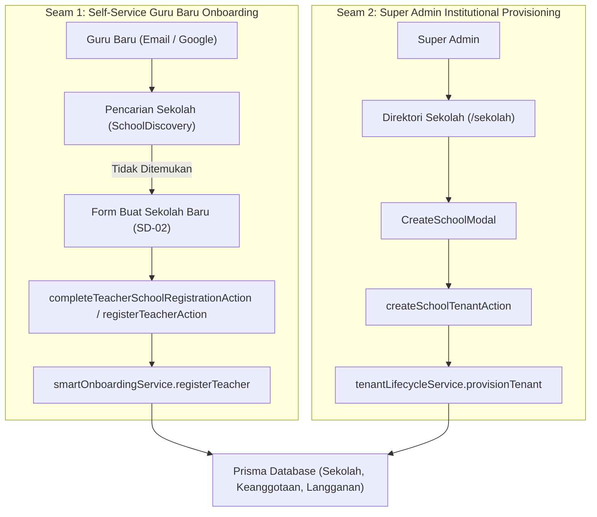
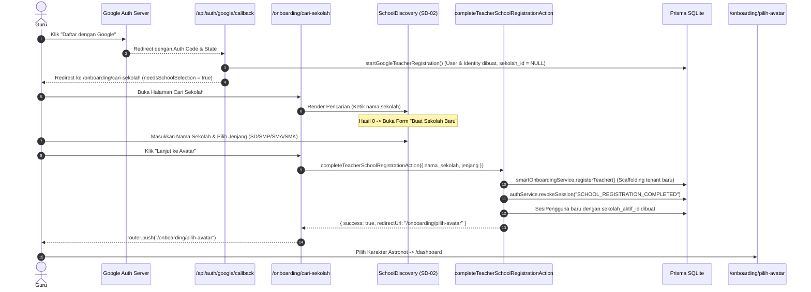

# LAPORAN AUDIT MENDALAM: STAGE SD-02 (SCHOOL REGISTRATION)
## Ruang Pintar — School Digital Operating Platform (SaaS Multi-Tenant)

| Metadata | Nilai |
| --- | --- |
| **Stage / Fitur** | STAGE SD-02 — School Registration Implementation |
| **Status Audit** | FACT-FIRST AUDIT ONLY (Tanpa Modifikasi Kode / Migrasi / Refactor) |
| **Tanggal Audit** | 30 September 2026 |
| **Auditor** | Antigravity AI (Fikran Engineering Aligned) |
| **Repositori Target** | `C:\laragon\www\Ruang-Pintar` |
| **Target Dokumen** | `SD-02-DEEP-AUDIT.md` |

---

# 1. Existing Architecture

Arsitektur registrasi sekolah pada platform Ruang Pintar dibangun di atas fondasi SaaS Multi-Tenant berbasis Next.js 15 (App Router), Prisma ORM, dan basis data SQLite. Implementasi saat ini memisahkan registrasi sekolah menjadi **dua alur utama (dual seam)**:



### 1.1 Komponen & File Arsitektural Terlibat

1. **Presentation Layer (Antarmuka Pengguna):**
   - [`src/app/register/page.tsx`](file:///C:/laragon/www/Ruang-Pintar/src/app/register/page.tsx): Entry point halaman publik pendaftaran akun lokal.
   - [`src/app/register/register-form.tsx`](file:///C:/laragon/www/Ruang-Pintar/src/app/register/register-form.tsx): Form pendaftaran email/password yang menyematkan tab role switcher (`TEACHER` vs `GUARDIAN`) dan komponen `SchoolDiscovery`.
   - [`src/app/onboarding/cari-sekolah/page.tsx`](file:///C:/laragon/www/Ruang-Pintar/src/app/onboarding/cari-sekolah/page.tsx): Halaman transisi pasca Google OAuth untuk guru yang belum memiliki sekolah (`sekolah_id === null`).
   - [`src/app/onboarding/cari-sekolah/school-discovery-view.tsx`](file:///C:/laragon/www/Ruang-Pintar/src/app/onboarding/cari-sekolah/school-discovery-view.tsx): Client container yang menangani state pemilihan dan submit ke server action `completeTeacherSchoolRegistrationAction`.
   - [`src/modules/ai-assistant/presentation/school-discovery.tsx`](file:///C:/laragon/www/Ruang-Pintar/src/modules/ai-assistant/presentation/school-discovery.tsx): Komponen modular School Discovery (SD-01) dengan debounce search 300ms dan fallback form "Buat Sekolah Baru" (SD-02).
   - [`src/modules/school/presentation/create-school-modal.tsx`](file:///C:/laragon/www/Ruang-Pintar/src/modules/school/presentation/create-school-modal.tsx): Modal registrasi tenant institusi formal khusus peran `SUPER_ADMIN`.
   - [`src/app/onboarding/pilih-avatar/page.tsx`](file:///C:/laragon/www/Ruang-Pintar/src/app/onboarding/pilih-avatar/page.tsx): Halaman pasca registrasi sekolah untuk memilih 1 dari 6 karakter astronot.

2. **Server Actions (Boundary Mutasi & Otorisasi):**
   - [`src/app/actions/smart-onboarding-actions.ts`](file:///C:/laragon/www/Ruang-Pintar/src/app/actions/smart-onboarding-actions.ts):
     - `searchSchoolsAction(query)`: Memanggil query pencarian sekolah publik.
     - `completeTeacherSchoolRegistrationAction(payload)`: Mutasi pendaftaran sekolah untuk sesi guru aktif yang belum punya sekolah.
     - `registerTeacherAction(formData)`: Mutasi pendaftaran guru baru via form email + password.
   - [`src/app/actions/school-actions.ts`](file:///C:/laragon/www/Ruang-Pintar/src/app/actions/school-actions.ts):
     - `createSchoolTenantAction(formData)`: Mutasi pendaftaran sekolah baru oleh Super Admin.

3. **Application & Infrastructure Services:**
   - [`src/modules/ai-assistant/application/smart-onboarding-service.ts`](file:///C:/laragon/www/Ruang-Pintar/src/modules/ai-assistant/application/smart-onboarding-service.ts): Mengelola registrasi guru mandiri, inisialisasi KBM (tahun ajaran, semester, kelas), dan penerbitan sesi.
   - [`src/shared/infrastructure/tenant/tenant-lifecycle-service.ts`](file:///C:/laragon/www/Ruang-Pintar/src/shared/infrastructure/tenant/tenant-lifecycle-service.ts): Service master multi-tenant yang menjamin atomisitas pembuatan tenant, validasi NPSN unik, inisialisasi timezone, dan pencatatan audit log `TENANT_PROVISIONED`.
   - [`src/shared/infrastructure/tenant/tenant-context.ts`](file:///C:/laragon/www/Ruang-Pintar/src/shared/infrastructure/tenant/tenant-context.ts): Resolver konteks tenant aktif server-authoritative (`resolveTenantContext`, `requireTenantContext`).
   - [`src/shared/infrastructure/auth/google-oauth-service.ts`](file:///C:/laragon/www/Ruang-Pintar/src/shared/infrastructure/auth/google-oauth-service.ts): Adapter OAuth 2.0 PKCE untuk Google Login/Register.

---

# 2. Actual Runtime Flow

Berdasarkan penelusuran kode program aktual, alur registrasi sekolah terbagi menjadi 3 jalur eksekusi:

### 2.1 Alur A: Pendaftaran Guru Mandiri via Email + Password

| Tahap | Rute / URL | Komponen UI | Action / Service | Database Transaction |
| :--- | :--- | :--- | :--- | :--- |
| **1. Input & Cari** | `/register` | [`RegisterForm`](file:///C:/laragon/www/Ruang-Pintar/src/app/register/register-form.tsx) & [`SchoolDiscovery`](file:///C:/laragon/www/Ruang-Pintar/src/modules/ai-assistant/presentation/school-discovery.tsx) | `searchSchoolsAction` → `smartOnboardingService.discoverSchools` | `SELECT id, nama, jenjang, alamat, npsn FROM Sekolah WHERE status_aktif = true AND (nama LIKE %q% OR npsn LIKE %q%) LIMIT 12` |
| **2. Sekolah Tak Ada** | `/register` | [`SchoolDiscovery`](file:///C:/laragon/www/Ruang-Pintar/src/modules/ai-assistant/presentation/school-discovery.tsx) (Fallback Card) | State lokal React (`setNewSchoolName`, `setJenjang`) | Tidak ada query (menunggu submit form utama). |
| **3. Submit Registrasi** | `/register` | Tombol `[Daftar & Lanjutkan ke Avatar]` | `registerTeacherAction` → `smartOnboardingService.registerTeacher` | **`prisma.$transaction` Atomik:**<br/>1. `INSERT INTO Sekolah`<br/>2. `INSERT INTO TahunAjaran`<br/>3. `INSERT INTO Semester`<br/>4. `INSERT INTO TingkatKelas` (Hardcoded X, XI, XII)<br/>5. `INSERT INTO Pengguna`<br/>6. `INSERT INTO Guru`<br/>7. `INSERT INTO PreferensiOnboardingGuru`<br/>8. `INSERT INTO PreferensiNotifikasi`<br/>9. `INSERT INTO KeanggotaanSekolah` (`is_owner: true`)<br/>10. `INSERT INTO LanggananTenant` (`TRIAL`, 30 hari)<br/>11. `INSERT INTO KonfigurasiSistem` (`Asia/Jakarta`) |
| **4. Penerbitan Sesi** | `/register` | Server-Side | `smartOnboardingService` & `setRegistrationSessionCookie` | `INSERT INTO SesiPengguna` (`sekolah_aktif_id: schoolId`, `token_hash: SHA-256`) + Set Cookie HTTP-only `ruang_pintar_session`. |
| **5. Pilih Avatar** | `/onboarding/pilih-avatar` | [`AvatarPicker`](file:///C:/laragon/www/Ruang-Pintar/src/app/onboarding/pilih-avatar/avatar-picker.tsx) | `saveTeacherAvatarAction` → `teacherOnboardingService.saveAvatarSelection` | `UPDATE Pengguna SET avatar_id = ? WHERE id = ?` |
| **6. Masuk Dashboard** | `/dashboard` | `TeacherDashboard` | `requireAuth()` & `resolveTenantContext()` | Validasi sesi aktif, keanggotaan aktif, render cockpit KBM. |

---

### 2.2 Alur B: Pendaftaran Guru via Google OAuth 2.0



---

### 2.3 Alur C: Pendaftaran Institusi oleh Super Admin

| Tahap | Rute / URL | Komponen UI | Action / Service | Database Transaction |
| :--- | :--- | :--- | :--- | :--- |
| **1. Buka Direktori** | `/sekolah` | [`SuperAdminSchoolDirectoryView`](file:///C:/laragon/www/Ruang-Pintar/src/modules/school/presentation/super-admin-school-directory-view.tsx) | Server Component SSR | Query list seluruh sekolah di platform. |
| **2. Buka Modal** | `/sekolah` | [`CreateSchoolModal`](file:///C:/laragon/www/Ruang-Pintar/src/modules/school/presentation/create-school-modal.tsx) | State modal React | Form input: Nama, NPSN, Jenjang, Lisensi, Alamat, Telp, Email. |
| **3. Eksekusi** | `/sekolah` | Form Submit Modal | `createSchoolTenantAction` → `tenantLifecycleService.provisionTenant` | **`prisma.$transaction` Atomik:**<br/>1. Verifikasi `NPSN` unik di tabel `Sekolah`<br/>2. Verifikasi `ownerId` di tabel `Pengguna`<br/>3. `INSERT INTO Sekolah`<br/>4. `INSERT INTO KeanggotaanSekolah` (`is_owner: true`, role: `SUPER_ADMIN`)<br/>5. `INSERT INTO LanggananTenant` (`TRIAL`, 30 hari)<br/>6. `INSERT INTO KonfigurasiSistem` (`Asia/Jakarta`)<br/>7. `INSERT INTO LogAudit` (`TENANT_PROVISIONED`) |

---

# 3. Domain Findings

### 3.1 Struktur Aktual Entitas `Sekolah`

Berdasarkan inspeksi langsung pada [`prisma/schema.prisma`](file:///C:/laragon/www/Ruang-Pintar/prisma/schema.prisma#L11-L25):

```prisma
model Sekolah {
  id                  String    @id
  nama                String
  npsn                String?   @unique
  jenjang             String    // SD | SMP | SMA | SMK | UMUM
  alamat              String?
  telepon             String?
  email               String?
  zona_waktu          String    @default("Asia/Jakarta")
  logo_url            String?
  tipe_lisensi        String    @default("FREEMIUM") // FREEMIUM | SEKOLAH
  trial_berakhir_pada DateTime?
  status_aktif        Boolean   @default(true)
  created_at          DateTime  @default(now())
  updated_at          DateTime  @updatedAt

  // Relasi-relasi domain ...
}
```

#### Analisis Kolom Entitas:
- **Field Wajib:** `id` (String ULID), `nama` (String), `jenjang` (String), `zona_waktu` (String, default `"Asia/Jakarta"`), `tipe_lisensi` (String, default `"FREEMIUM"`), `status_aktif` (Boolean, default `true`), `created_at` (DateTime), `updated_at` (DateTime).
- **Field Opsional (Nullable):** `npsn` (String unik), `alamat` (String), `telepon` (String), `email` (String), `logo_url` (String), `trial_berakhir_pada` (DateTime).
- **Status Lifecycle Sekolah:**
  - Tabel `Sekolah` **TIDAK MEMILIKI** status status enum/string lifecycle seperti `ACTIVE`, `TRIAL`, `PENDING_SETUP`, atau `SUSPENDED`.
  - Hanya ada boolean tunggal: `status_aktif: Boolean @default(true)`.
  - Status lifecycle sesungguhnya didelegasikan ke entitas relasi **`LanggananTenant` (`langganan_tenant`)** dengan status:
    `"TRIAL_ACTIVE" | "ACTIVE" | "PAST_DUE" | "READ_ONLY" | "SUSPENDED" | "CANCELLED"`.
- **Ketidakhadiran Kolom yang Pernah Disebutkan di Dokumen Konseptual:**
  - `nama_normalisasi`: **TIDAK ADA** di schema database.
  - `kota_kabupaten`: **TIDAK ADA** di schema database.
  - `tipe_sekolah` (`MANDIRI` vs `FORMAL`): **TIDAK ADA** di schema database.

---

### 3.2 Audit Generasi Tingkat Kelas (Grade Level Generation)

Berdasarkan inspeksi kode pada [`src/modules/ai-assistant/application/smart-onboarding-service.ts`](file:///C:/laragon/www/Ruang-Pintar/src/modules/ai-assistant/application/smart-onboarding-service.ts#L244-L252):

```typescript
for (const [kode, nama, urutan] of [
  ["X", "Kelas X", 10],
  ["XI", "Kelas XI", 11],
  ["XII", "Kelas XII", 12],
] as const) {
  await tx.tingkatKelas.create({
    data: { id: generateUlid(), sekolah_id: schoolId, kode, nama, urutan },
  });
}
```

#### Temuan Faktual per Jenjang:

| Jenjang yang Dipilih | Tingkat Kelas Aktual yang Dibuat | Standar Pendidikan Nasional (Kurikulum Merdeka) | Status Kesesuaian Domain |
| :--- | :--- | :--- | :---: |
| **SD (Sekolah Dasar)** | `Kelas X` (10), `Kelas XI` (11), `Kelas XII` (12) | **Kelas I s/d VI** (Urutan 1–6, Fase A, B, C) | **CRITICAL DOMAIN BUG** |
| **SMP** | `Kelas X` (10), `Kelas XI` (11), `Kelas XII` (12) | **Kelas VII s/d IX** (Urutan 7–9, Fase D) | **CRITICAL DOMAIN BUG** |
| **SMA** | `Kelas X` (10), `Kelas XI` (11), `Kelas XII` (12) | **Kelas X s/d XII** (Urutan 10–12, Fase E, F) | **SESUAI** (namun `fase_id` null) |
| **SMK** | `Kelas X` (10), `Kelas XI` (11), `Kelas XII` (12) | **Kelas X s/d XII / XIII** (Urutan 10–13, Fase E, F) | **SEBAGIAN** (tidak ada program keahlian) |
| **UMUM** | `Kelas X` (10), `Kelas XI` (11), `Kelas XII` (12) | Fleksibel / Paket A, B, C | **MISMATCH** |

> **Dampak Lapangan:** Jika seorang guru Sekolah Dasar (SD) mendaftarkan sekolah dasarnya melalui SD-02, sekolah tersebut otomatis memiliki Kelas 10, Kelas 11, dan Kelas 12 SMA. Guru SD tidak dapat memilih kelas 1 s/d 6 saat membuat rombel pertama tanpa melakukan input manual tingkat kelas di database.

---

### 3.3 Audit Pencegahan Duplikasi Sekolah (Duplicate School Prevention)

Sistem diuji terhadap variasi nama: `SMK OTOMINDO`, `SMK OTO MINDO`, dan `Smk Otomindo`.

1. **Pencarian Substring (Case-Insensitivity):**
   - Query pencarian di `smartOnboardingService.discoverSchools`:
     `where: { status_aktif: true, OR: [{ nama: { contains: term } }, { npsn: { contains: term } }] }`.
   - Di SQLite, `contains` memetakan ke operator `LIKE '%term%'`.
   - `Smk Otomindo` akan cocok dengan `SMK OTOMINDO` karena perbandingan ASCII case-insensitive di SQLite.
   - **Namun**, `SMK OTO MINDO` (dengan variasi spasi atau tanda baca) **TIDAK AKAN COCOK** dan menghasilkan hasil pencarian kosong (`[]`).
2. **Ketiadaan Fuzzy / Similarity Matching:**
   - Tidak ada implementasi algoritma Levenshtein distance, Trigram similarity, atau Dice coefficient di kode aplikasi.
3. **Ketiadaan Validasi Nama Duplikat saat Submit Baru:**
   - Ketika pencarian menghasilkan kosong dan guru menekan "Buat Sekolah Baru", method `smartOnboardingService.registerTeacher` **sama sekali tidak melakukan verifikasi apakah nama sekolah yang dimasukkan sudah ada**.
   - Kolom `nama` pada model `Sekolah` tidak berindeks `@unique`.
   - Akibatnya: Pengguna dapat mendaftarkan sekolah bernama `SMK OTOMINDO` berkali-kali, menghasilkan tenant-tenant kembar yang terpecah.
4. **Validasi NPSN:**
   - Validasi keunikan NPSN **HANYA ADA** pada `tenantLifecycleService.provisionTenant` (alur Super Admin).
   - Pada alur pendaftaran guru (`SchoolDiscovery` / `registerTeacherAction`), kolom NPSN **sengaja tidak ditampilkan** demi meminimalkan friksi, sehingga proteksi NPSN tidak berjalan pada alur guru baru.

---

# 4. Security Findings

### 4.1 Penetapan Owner & Hak Akses Pertama
- Pada saat sekolah baru dibuat via `smartOnboardingService.registerTeacher`:
  - `KeanggotaanSekolah` di-insert dengan `is_owner: true`, `status_keanggotaan: "ACTIVE"`, dan `sumber_pendaftaran: "OWNER_CREATE"`.
  - Pendaftar pertama memegang kepemilikan tenant institusi tersebut.
  - Berdasarkan matriks `capability-evaluator.ts`, flag `is_owner: true` secara otomatis menginjeksi izin manajemen tingkat tenant (`academic.classes.manage`, `academic.students.manage`).

### 4.2 Penerbitan Sesi & Isolasi Tenant
- Sesi pengguna langsung mengikat `sekolah_aktif_id` ke tenant yang baru dibuat.
- Pada `completeTeacherSchoolRegistrationAction`:
  - Sesi lama (yang berstatus tanpa tenant) secara eksplisit dicabut (`authService.revokeSession(token, "SCHOOL_REGISTRATION_COMPLETED")`).
  - Sesi baru diterbitkan dan cookie di-set secara aman (`httpOnly: true`, `sameSite: "lax"`, `secure: true` pada production).
  - Pengecekan otorisasi server-side (`requireTenantContext`) memastikan bahwa aktor tidak dapat memalsukan `sekolah_id` melalui parameter client, karena konteks selalu diselesaikan dari `SesiPengguna.sekolah_aktif_id` yang dicocokkan ke baris `KeanggotaanSekolah`.

### 4.3 TEMUAN KEAMANAN KRITIS: Instant Auto-Approve pada Join School
Pada [`src/modules/ai-assistant/application/smart-onboarding-service.ts`](file:///C:/laragon/www/Ruang-Pintar/src/modules/ai-assistant/application/smart-onboarding-service.ts#L310-L323):
```typescript
await tx.keanggotaanSekolah.create({
  data: {
    id: generateUlid(),
    pengguna_id: userId,
    sekolah_id: schoolId,
    peran_dasar_di_tenant: "TEACHER",
    status_keanggotaan: "ACTIVE", // <-- LANGSUNG ACTIVE!
    is_owner: createsSchool,
    berlaku_mulai: new Date(),
    sumber_pendaftaran: createsSchool ? "OWNER_CREATE" : "JOIN_REQUEST",
    disetujui_oleh_id: userId,
    disetujui_pada: new Date(),
  },
});
```
> **Kerentanan Otorisasi:**  
> Ketika seorang guru memilih untuk bergabung ke sekolah yang sudah ada (`sekolah_id` ditemukan), `status_keanggotaan` **langsung diset menjadi `"ACTIVE"` dan `disetujui_oleh_id` diisi oleh ID dirinya sendiri**!  
> Ini melanggar spesifikasi arsitektur `ADR-002`, di mana permohonan gabung sekolah (`JOIN_REQUEST`) wajib berstatus `"PENDING"` dan memerlukan persetujuan eksplisit dari owner/staf sekolah sebelum guru dapat mengakses data sekolah tersebut. Saat ini, siapa pun yang mendaftar dapat langsung masuk ke tenant sekolah mana pun yang aktif hanya dengan mengklik `[Gabung Sekolah]`.

---

# 5. Technical Debt Findings

### 5.1 Duplikasi Logika Provisioning (Dual Engine Divergence)
Sistem memiliki dua implementasi berbeda untuk membuat tenant sekolah baru:
1. `smartOnboardingService.registerTeacher`: Membuat entitas akademik (Tahun Ajaran, Semester, Tingkat Kelas), membuat profil guru, preferensi onboarding, dan sesi baru, namun **TIDAK mencatat audit log `LogAudit`**.
2. `tenantLifecycleService.provisionTenant`: Memvalidasi NPSN unik, mencatat `TENANT_PROVISIONED` ke `LogAudit`, namun **TIDAK membuat Tahun Ajaran, Semester, maupun Tingkat Kelas**.
- **Dampak:** Inisialisasi tenant tidak seragam antara pendaftaran mandiri dan pendaftaran oleh Super Admin.

### 5.2 Dead Code: `RegisterView` Peninggalan Phase 21
- Berkas [`src/modules/ai-assistant/presentation/register-view.tsx`](file:///C:/laragon/www/Ruang-Pintar/src/modules/ai-assistant/presentation/register-view.tsx) tidak diimpor atau digunakan oleh halaman manapun di `src/app/`.
- Halaman `/register` menggunakan `RegisterForm` ([`src/app/register/register-form.tsx`](file:///C:/laragon/www/Ruang-Pintar/src/app/register/register-form.tsx)).
- Komponen mati ini masih diuji pada [`src/test/ai-assistant/onboarding-views.test.tsx`](file:///C:/laragon/www/Ruang-Pintar/src/test/ai-assistant/onboarding-views.test.tsx#L110), menciptakan ilusi *false coverage*.

### 5.3 Tab Registrasi Wali Murid Rusak (Broken Tab)
- Di dalam [`RegisterForm`](file:///C:/laragon/www/Ruang-Pintar/src/app/register/register-form.tsx#L156), tab registrasi `Wali Murid` masih aktif ditampilkan.
- Form tersebut tidak menyediakan input `username`. Backend `guardianService` menolak pendaftaran karena Zod schema mewajibkan `username` min. 3 karakter.
- Keberadaan tab ini membingungkan pengguna guru dan menghasilkan tingkat drop-off pendaftaran.

---

# 6. Gap vs Desired Architecture

| Aspek Arsitektur | Desired Architecture (ADR-001/002/003, Specs) | Implementasi Aktual Lapangan | Status Gap |
| :--- | :--- | :--- | :---: |
| **Jenjang SD / SMP / SMA** | Tingkat kelas diinisialisasi sesuai jenjang yang dipilih pendaftar (SD: 1–6, SMP: 7–9, SMA: 10–12). | Hardcoded statis tingkat X, XI, XII untuk seluruh jenjang. | **CRITICAL GAP** |
| **Pencegahan Duplikasi Sekolah** | Normalisasi teks, cek kesamaan fonetik/nama, dan verifikasi institusi sebelum tenant baru lahir. | Hanya `LIKE %query%` substring. Submit baru tidak mengecek keberadaan nama sekolah yang sama. | **MAJOR GAP** |
| **Alur Join Request** | Status keanggotaan `PENDING`, menunggu persetujuan (*approval*) dari Kepala Sekolah / Staf. | Status langsung `ACTIVE` otomatis (auto-approved by self). | **SECURITY GAP** |
| **Single Source of Truth Provisioning** | Seluruh pembentukan tenant melalui `TenantLifecycleService`. | Terpecah dua antara `smartOnboardingService` dan `tenantLifecycleService`. | **ARCHITECTURAL DEBT** |
| **Audit Trail Pendaftaran** | Setiap tenant baru memicu event `TENANT_PROVISIONED` di tabel `log_audit`. | Alur guru baru tidak mencatat event apapun ke `log_audit`. | **COMPLIANCE GAP** |
| **Separasi Corong Wali Murid** | Pendaftaran wali murid melalui kode klaim siswa `/guardian/klaim-anak`, bukan formulir publik. | Tab wali murid masih menempel di formulir registrasi guru di `/register`. | **UX / PRODUCT GAP** |

---

# 7. Test Coverage Audit

### 7.1 Berkas Pengujian Aktual yang Berjalan
Pengujian dijalankan melalui Vitest (`vitest run --fileParallelism=false`):

| Berkas Pengujian | Jumlah Test | Status | Cakupan Pengujian |
| :--- | :---: | :---: | :--- |
| [`src/test/authorization/school-registration-authorization.test.ts`](file:///C:/laragon/www/Ruang-Pintar/src/test/authorization/school-registration-authorization.test.ts) | 2 | **100% PASS** | Otorisasi Server Action (menolak pemanggil anonim dan pengguna di luar state onboarding guru). |
| [`src/test/ai-assistant/smart-onboarding-service.test.ts`](file:///C:/laragon/www/Ruang-Pintar/src/test/ai-assistant/smart-onboarding-service.test.ts) | 8 | **100% PASS** | Registrasi guru mandiri 4 kolom, join sekolah existing, registrasi Google tenantless, transactional rollback. |
| [`src/test/saas/tenant-lifecycle-foundation.test.ts`](file:///C:/laragon/www/Ruang-Pintar/src/test/saas/tenant-lifecycle-foundation.test.ts) | 10 | **100% PASS** | Pembuatan tenant atomik Super Admin, validasi NPSN duplikat, transisi status langganan. |
| [`src/test/ai-assistant/onboarding-views.test.tsx`](file:///C:/laragon/www/Ruang-Pintar/src/test/ai-assistant/onboarding-views.test.tsx) | 5 | **100% PASS** | Render komponen `SchoolDiscovery`, debounce pencarian, fallback form sekolah baru. |
| **TOTAL** | **25** | **100% PASS** | — |

### 7.2 Area SD-02 yang Belum Memiliki Test (Blind Spots):
1. **Penerbitan Tingkat Kelas SD/SMP:** Tidak ada test yang memverifikasi bahwa registrasi jenjang `SD` atau `SMP` menghasilkan kelas yang valid (test saat ini hanya menguji default SMA).
2. **Happy Path `completeTeacherSchoolRegistrationAction`:** Belum ada test integrasi yang memverifikasi pencabutan sesi lama dan penulisan cookie sesi baru saat aksi berhasil.
3. **Pencegahan Nama Sekolah Duplikat:** Tidak ada test yang menguji penanganan submit dua sekolah dengan nama persis sama pada alur self-service.
4. **Komponen `CreateSchoolModal`:** Form pendaftaran modal Super Admin sama sekali belum memiliki unit/DOM test di folder `src/test/school/`.

---

# 8. Recommended Hardening Backlog

> *Catatan: Sesuai instruksi audit, backlog ini dirumuskan sebagai rekomendasi kerja terstruktur dan belum dieksekusi.*

1. **Backlog SD02-H1 (Domain Invariant):**  
   Implementasikan *Grade Level Factory* berbasis jenjang pada `smartOnboardingService.registerTeacher`:
   - `SD`: Tingkat Kelas I s/d VI (urutan 1–6, mapping Fase A, B, C).
   - `SMP`: Tingkat Kelas VII s/d IX (urutan 7–9, mapping Fase D).
   - `SMA` / `SMK`: Tingkat Kelas X s/d XII (urutan 10–12, mapping Fase E, F).
2. **Backlog SD02-H2 (Security Hardening):**  
   Ubah pendaftaran gabung sekolah eksisting (`sumber_pendaftaran: "JOIN_REQUEST"`) agar menghasilkan `status_keanggotaan: "PENDING"`, serta sediakan notifikasi persetujuan bagi Kepala Sekolah / Operator sekolah bersangkutan.
3. **Backlog SD02-H3 (Anti-Duplication Engine):**  
   Tambahkan validasi kesamaan nama sekolah (*case-insensitive & trimmed whitespace*) pada `smartOnboardingService.registerTeacher` sebelum mengizinkan pembuatan tenant baru.
4. **Backlog SD02-H4 (Architecture Consolidation):**  
   Satukan logika pembuatan tenant di `smartOnboardingService` dengan `tenantLifecycleService.provisionTenant` agar pencatatan audit log `TENANT_PROVISIONED` dan default sistem berjalan konsisten di semua saluran.
5. **Backlog SD02-H5 (Hygiene & Dead Code Elimination):**  
   Hapus berkas komponen mati `RegisterView` ([`register-view.tsx`](file:///C:/laragon/www/Ruang-Pintar/src/modules/ai-assistant/presentation/register-view.tsx)) dan bersihkan tab wali murid yang rusak dari [`RegisterForm`](file:///C:/laragon/www/Ruang-Pintar/src/app/register/register-form.tsx).
6. **Backlog SD02-H6 (Test Expansion):**  
   Tambahkan test suite integrasi untuk alur pendaftaran sekolah jenjang SD, penolakan nama duplikat, dan verifikasi alur rotasi sesi.
