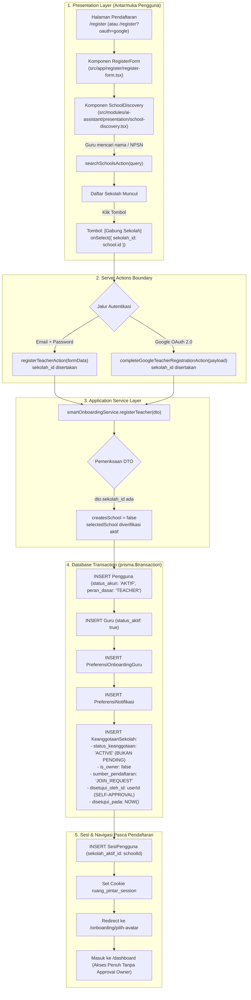
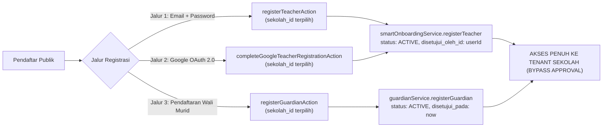

# LAPORAN AUDIT KESIAPAN: STAGE SD-03 (SCHOOL JOIN WORKFLOW)
## Ruang Pintar — School Digital Operating Platform (SaaS Multi-Tenant)

| Metadata | Nilai |
| --- | --- |
| **Stage / Fitur** | STAGE SD-03 — School Join Workflow & Approval Readiness |
| **Status Audit** | FACT-FIRST AUDIT ONLY (Tanpa Modifikasi Kode / Migrasi / Refactor) |
| **Tanggal Audit** | 30 September 2026 |
| **Auditor** | Antigravity AI (Fikran Engineering Aligned) |
| **Repositori Target** | `C:\laragon\www\Ruang-Pintar` |
| **Target Dokumen** | `SD-03-READINESS-AUDIT.md` |

---

# KESIMPULAN AUDIT

### **B. SD-03 ADA SEBAGIAN**

> **Ringkasan Penilaian Arsitektural Berdasarkan Fakta Source Code:**  
> 
> 1. **Fondasi Skema Basis Data & Application Service Tingkat Rendah: SUDAH ADA SEBAGIAN.**  
>    - Model Prisma [`KeanggotaanSekolah`](file:///C:/laragon/www/Ruang-Pintar/prisma/schema.prisma#L337-L360) telah mendefinisikan kolom `status_keanggotaan`, `is_owner`, `disetujui_oleh_id`, `disetujui_pada`, dan `sumber_pendaftaran`.
>    - Service master [`TenantMembershipService`](file:///C:/laragon/www/Ruang-Pintar/src/shared/infrastructure/tenant/tenant-membership-service.ts) telah menyediakan method `createPendingMembership` (status `PENDING`) dan mutasi `changeStatus` (`ACTIVE`, `REJECTED`, `SUSPENDED`, `REMOVED`) lengkap dengan pencatatan audit log `recordAuditEvent`.
>    - Tenant guard [`resolveTenantContext`](file:///C:/laragon/www/Ruang-Pintar/src/shared/infrastructure/tenant/tenant-context.ts#L23-L55) telah memproteksi tenant dengan menolak status keanggotaan selain `ACTIVE`.
> 
> 2. **Alur Eksekusi Runtime Aktual (End-to-End Workflow): TERPUTUS / BELUM TERINTEGRASI (CRITICAL GAP).**  
>    - Ketika guru mengklik tombol `[Gabung Sekolah]` pada komponen [`SchoolDiscovery`](file:///C:/laragon/www/Ruang-Pintar/src/modules/ai-assistant/presentation/school-discovery.tsx#L134-L150), server action pendaftaran memanggil [`smartOnboardingService.registerTeacher`](file:///C:/laragon/www/Ruang-Pintar/src/modules/ai-assistant/application/smart-onboarding-service.ts#L60).
>    - Di dalam service tersebut, alur gabung sekolah eksisting (`createsSchool = false`) **sama sekali tidak memanggil** `tenantMembershipService.createPendingMembership`.
>    - Sebaliknya, sistem langsung memasukkan record keanggotaan berstatus **`ACTIVE`** dan menyetel `disetujui_oleh_id: userId` (**Self-Approval / Bypass Total**).
> 
> 3. **Owner Approval Capability (UI, Server Actions, & Otorisasi): BELUM ADA SAMA SEKALI (0%).**  
>    - Tidak ada Server Action untuk `approve` atau `reject` permohonan keanggotaan.
>    - Tidak ada rute, halaman, maupun tab antrean pengajuan pada manajemen sekolah ([`SchoolManagementTabs`](file:///C:/laragon/www/Ruang-Pintar/src/modules/school/presentation/school-management-tabs.tsx)).
> 
> 4. **Notifikasi Siklus Keanggotaan: BELUM ADA SAMA SEKALI (0%).**  
>    - Tipe notifikasi domain pada [`notification-types.ts`](file:///C:/laragon/www/Ruang-Pintar/src/modules/notification/domain/notification-types.ts#L6-L12) belum memuat event permohonan masuk, persetujuan, atau penolakan keanggotaan tenant.
> 
> 5. **Test Coverage: BELUM ADA TEST UNTUK APPROVAL / REJECTION.**  
>    - Method `createPendingMembership` dan `changeStatus` memiliki 0 unit test di `src/test/`.
>    - Test pendaftaran guru non-owner yang ada ([`smart-onboarding-service.test.ts:89-121`](file:///C:/laragon/www/Ruang-Pintar/src/test/ai-assistant/smart-onboarding-service.test.ts#L89-L121)) saat ini meng-assert bahwa status keanggotaan langsung `ACTIVE`.

---

# 1. Join School Flow (Pemetaan Alur Aktual End-to-End)

Saat guru menemukan sekolah yang sudah ada di sistem melalui pencarian:

```text
Guru -> Cari Sekolah -> Pilih Sekolah -> Klik [Gabung Sekolah] -> Submit Formulir -> Auto-Active (Bypass)
```



### Rincian Komponen Aktual yang Terlibat:

1. **Route:**
   - Email: [`/register`](file:///C:/laragon/www/Ruang-Pintar/src/app/register/page.tsx)
   - Google OAuth: [`/register?oauth=google`](file:///C:/laragon/www/Ruang-Pintar/src/app/register/page.tsx) (Dialihkan oleh [`src/app/api/auth/google/callback/route.ts:55-56`](file:///C:/laragon/www/Ruang-Pintar/src/app/api/auth/google/callback/route.ts#L55-L56)).
   *(Catatan: Direktori `src/app/onboarding/cari-sekolah` berstatus folder kosong dan tidak digunakan pada runtime).*
2. **Page:**
   - [`src/app/register/page.tsx`](file:///C:/laragon/www/Ruang-Pintar/src/app/register/page.tsx) (Memeriksa cookie `GOOGLE_PENDING_REGISTRATION_COOKIE` dan merender `RegisterForm`).
3. **Component:**
   - [`src/app/register/register-form.tsx`](file:///C:/laragon/www/Ruang-Pintar/src/app/register/register-form.tsx) (Form pendaftaran guru/wali murid).
   - [`src/modules/ai-assistant/presentation/school-discovery.tsx`](file:///C:/laragon/www/Ruang-Pintar/src/modules/ai-assistant/presentation/school-discovery.tsx#L134-L150) (Tombol `[Gabung Sekolah]`).
4. **Action:**
   - [`registerTeacherAction`](file:///C:/laragon/www/Ruang-Pintar/src/app/actions/smart-onboarding-actions.ts#L135) di `src/app/actions/smart-onboarding-actions.ts`.
   - [`completeGoogleTeacherRegistrationAction`](file:///C:/laragon/www/Ruang-Pintar/src/app/actions/smart-onboarding-actions.ts#L66) di `src/app/actions/smart-onboarding-actions.ts`.
5. **Service:**
   - [`smartOnboardingService.registerTeacher`](file:///C:/laragon/www/Ruang-Pintar/src/modules/ai-assistant/application/smart-onboarding-service.ts#L60-L285) di `src/modules/ai-assistant/application/smart-onboarding-service.ts`.
6. **Database Transaction:**
   - Blok atomik `prisma.$transaction` di [`smart-onboarding-service.ts:109-258`](file:///C:/laragon/www/Ruang-Pintar/src/modules/ai-assistant/application/smart-onboarding-service.ts#L109-L258) yang langsung membuat entitas `Pengguna`, `Guru`, dan `KeanggotaanSekolah` aktif, dilanjutkan dengan pembuatan `SesiPengguna` dengan `sekolah_aktif_id` terikat ke sekolah target.

---

# 2. Membership Entity Audit (`KeanggotaanSekolah`)

Struktur model aktual pada [`prisma/schema.prisma`](file:///C:/laragon/www/Ruang-Pintar/prisma/schema.prisma#L337-L360):

```prisma
model KeanggotaanSekolah {
  id                    String   @id
  pengguna_id           String
  sekolah_id            String
  peran_dasar_di_tenant String
  status_keanggotaan    String   @default("PENDING") // PENDING | ACTIVE | REJECTED | SUSPENDED | REMOVED
  is_owner              Boolean  @default(false)
  berlaku_mulai         DateTime?
  berlaku_sampai        DateTime?
  sumber_pendaftaran    String   @default("MIGRASI_LEGACY") // MIGRASI_LEGACY | OWNER_CREATE | INVITATION | JOIN_REQUEST
  disetujui_oleh_id     String?
  disetujui_pada        DateTime?
  created_at            DateTime @default(now())
  updated_at            DateTime @updatedAt

  pengguna Pengguna @relation(fields: [pengguna_id], references: [id], onDelete: Restrict)
  sekolah  Sekolah  @relation(fields: [sekolah_id], references: [id], onDelete: Restrict)

  @@unique([pengguna_id, sekolah_id])
  @@index([sekolah_id, status_keanggotaan])
  @@index([pengguna_id, status_keanggotaan])
  @@index([sekolah_id, is_owner, status_keanggotaan])
  @@map("keanggotaan_sekolah")
}
```

### Verifikasi Field Spesifik:

| Parameter Audit | Nama Kolom Aktual di Prisma / SQLite | Tipe Data | Nilai Default | Nilai / Status yang Tersedia (Komentar Skema & Kode) |
| :--- | :--- | :--- | :--- | :--- |
| **status_keanggotaan** | `status_keanggotaan` | `String` (TEXT) | `"PENDING"` | `"PENDING"`, `"ACTIVE"`, `"REJECTED"`, `"SUSPENDED"`, `"REMOVED"` |
| **is_owner** | `is_owner` | `Boolean` (INTEGER) | `false` | `true`, `false` |
| **disetujui_oleh_id** | `disetujui_oleh_id` | `String?` (TEXT nullable) | `null` | ULID Pengguna penyetujui |
| **tanggal_disetujui** | `disetujui_pada` | `DateTime?` (DATETIME nullable) | `null` | Timestamp ISO UTC persetujuan |
| **sumber** | `sumber_pendaftaran` | `String` (TEXT) | `"MIGRASI_LEGACY"` | `"MIGRASI_LEGACY"`, `"OWNER_CREATE"`, `"INVITATION"`, `"JOIN_REQUEST"` |

> **Catatan Nomenklatur:**
> Kolom persetujuan di skema database bernama **`disetujui_pada`** (bukan `tanggal_disetujui`), dan sumber pendaftaran bernama **`sumber_pendaftaran`** (bukan `sumber`).

---

# 3. Approval Workflow Audit

Pemeriksaan status: `PENDING`, `APPROVED`, `REJECTED`, dan `CANCELLED`:

| Status Konsep | Ada / Tidak | Implementasi Aktual di Kode | Lokasi File & Kode | Keterangan & Keterbatasan |
| :--- | :---: | :--- | :--- | :--- |
| **PENDING** | **ADA (Service Level)** | `status_keanggotaan = "PENDING"` | [`tenant-membership-service.ts:130-162`](file:///C:/laragon/www/Ruang-Pintar/src/shared/infrastructure/tenant/tenant-membership-service.ts#L130-L162) | Ada method `createPendingMembership`, namun **tidak pernah dipanggil** oleh Server Action registrasi manapun. |
| **APPROVED** | **ADA SEBAGIAN (Sebagai `ACTIVE`)** | Menggunakan nama status `"ACTIVE"`, bukan `"APPROVED"` | [`tenant-membership-service.ts:68-128`](file:///C:/laragon/www/Ruang-Pintar/src/shared/infrastructure/tenant/tenant-membership-service.ts#L68-L128) | Method `changeStatus` dapat mengeset `nextStatus: "ACTIVE"`, mengisi `disetujui_oleh_id` dan `disetujui_pada`. **Tidak ada Server Action, Route, atau UI**. |
| **REJECTED** | **ADA SEBAGIAN (Service Level)** | `nextStatus: "REJECTED"` | [`tenant-membership-service.ts:68-128`](file:///C:/laragon/www/Ruang-Pintar/src/shared/infrastructure/tenant/tenant-membership-service.ts#L68-L128) | Didukung oleh logika `changeStatus`, mencabut sesi sekolah aktif pengguna dan mencatat audit event `TENANT_MEMBERSHIP_REJECTED`. **Tidak ada Server Action, Route, atau UI**. |
| **CANCELLED** | **TIDAK ADA** | Tidak ada status `CANCELLED` untuk keanggotaan | - | Konsep pembatalan tidak didefinisikan pada `KeanggotaanSekolah` (hanya ada pada model `LanggananTenant`). Penolakan dialokasikan ke `REJECTED`, dan pencabutan ke `REMOVED`. |

### Keberadaan Artefak Pendukung Workflow:
- **Lokasi Kode Service:** [`src/shared/infrastructure/tenant/tenant-membership-service.ts`](file:///C:/laragon/www/Ruang-Pintar/src/shared/infrastructure/tenant/tenant-membership-service.ts).
- **Route Halaman:** **TIDAK ADA** (Tidak ada URL rute seperti `/sekolah/pengajuan` atau `/sekolah/anggota`).
- **Komponen UI:** **TIDAK ADA** (Tidak ada kartu, tabel, atau badge antrean permohonan keanggotaan).
- **Server Action:** **TIDAK ADA** (Tidak ditemukan `approveMemberAction` atau `rejectMemberAction` di `src/app/actions/`).

---

# 4. Owner Approval Capability

Evaluasi kemampuan Owner Sekolah (atau Kepala Sekolah / Operator Sekolah):

| Kemampuan Owner | Status Aktual | Bukti Source Code |
| :--- | :---: | :--- |
| **1. Melihat daftar pengajuan** | **BELUM ADA** | Pada halaman institusi sekolah ([`src/app/sekolah/page.tsx`](file:///C:/laragon/www/Ruang-Pintar/src/app/sekolah/page.tsx)) dan tab navigasi ([`SchoolManagementTabs`](file:///C:/laragon/www/Ruang-Pintar/src/modules/school/presentation/school-management-tabs.tsx)), tab yang tersedia hanya: `profil`, `unit`, `jabatan`, `penugasan`, dan `billing`. Tidak ada antarmuka untuk membaca baris berstatus `PENDING`. |
| **2. Menyetujui pengajuan** | **BELUM ADA DI UI** | Logika bisnis tersedia di [`TenantMembershipService.changeStatus`](file:///C:/laragon/www/Ruang-Pintar/src/shared/infrastructure/tenant/tenant-membership-service.ts#L68), namun **tidak terhubung** ke Server Action maupun tombol UI apapun. (Hanya pernah dipanggil secara manual di file script testing [`scripts/qa-saas04-product-review.mjs:259`](file:///C:/laragon/www/Ruang-Pintar/scripts/qa-saas04-product-review.mjs#L259)). |
| **3. Menolak pengajuan** | **BELUM ADA DI UI** | Logika bisnis tersedia di [`TenantMembershipService.changeStatus`](file:///C:/laragon/www/Ruang-Pintar/src/shared/infrastructure/tenant/tenant-membership-service.ts#L68), namun belum memiliki antarmuka pengguna atau Server Action. |
| **4. Mencabut akses anggota** | **BELUM ADA DI UI** | Logika mutasi status `SUSPENDED` / `REMOVED` serta proteksi *last active owner* sudah ada di service (`tenant-membership-service.ts:87-95`), namun belum memiliki tombol aksi pada tabel personil manapun. |

---

# 5. Notification Audit

Pemeriksaan kontrak notifikasi pada [`src/modules/notification/domain/notification-types.ts`](file:///C:/laragon/www/Ruang-Pintar/src/modules/notification/domain/notification-types.ts#L6-L12):

```typescript
export type NotificationType =
  | "PENGUMUMAN_BARU"
  | "TUGAS_BARU"
  | "NILAI_DITERBITKAN"
  | "PENGAJUAN_IZIN"
  | "JADWAL_BERUBAH"
  | "SISTEM";
```

### Temuan Faktual:
1. **Notifikasi pengajuan masuk:** **TIDAK ADA.** Tidak ada event bus, pesan in-app, maupun outbox notifikasi yang dikirimkan ke Owner/Admin saat ada guru memilih sekolah.
2. **Notifikasi disetujui:** **TIDAK ADA.** Tidak ada pengiriman pemberitahuan saat status keanggotaan beralih ke `ACTIVE`.
3. **Notifikasi ditolak:** **TIDAK ADA.** Tidak ada pengiriman alasan penolakan kepada pemohon.

---

# 6. Security Audit (Evaluasi Celah Otorisasi)

### 6.1 Apakah guru dapat menyetujui dirinya sendiri?
**YA, TERBUKTI 100% SECARA FAKTUAL PADA SOURCE CODE.**

Pada file [`src/modules/ai-assistant/application/smart-onboarding-service.ts`](file:///C:/laragon/www/Ruang-Pintar/src/modules/ai-assistant/application/smart-onboarding-service.ts#L207-L220):

```typescript
await tx.keanggotaanSekolah.create({
  data: {
    id: generateUlid(),
    pengguna_id: userId,
    sekolah_id: schoolId,
    peran_dasar_di_tenant: "TEACHER",
    status_keanggotaan: "ACTIVE", // <-- LANGSUNG DIAKTIFKAN
    is_owner: createsSchool,       // bernilai false saat bergabung ke sekolah yang ada
    berlaku_mulai: new Date(),
    sumber_pendaftaran: createsSchool ? "OWNER_CREATE" : "JOIN_REQUEST",
    disetujui_oleh_id: userId,     // <-- SELF-APPROVAL (USER MENYETUJUI DIRINYA SENDIRI)
    disetujui_pada: new Date(),
  },
});
```

Akibat dari kode ini:
1. ID pengguna baru (`userId`) langsung dituliskan ke dalam kolom `disetujui_oleh_id`.
2. Keanggotaan langsung diberi status `"ACTIVE"`.
3. Session langsung diterbitkan dengan `sekolah_aktif_id: schoolId` ([`smart-onboarding-service.ts:264-274`](file:///C:/laragon/www/Ruang-Pintar/src/modules/ai-assistant/application/smart-onboarding-service.ts#L264-L274)).
4. Tenant guard [`resolveTenantContext`](file:///C:/laragon/www/Ruang-Pintar/src/shared/infrastructure/tenant/tenant-context.ts#L45) mengonfirmasi status `ACTIVE` dan memberikan akses instan ke KBM sekolah tersebut.

---

### 6.2 Seluruh Jalur yang Menghasilkan `status_keanggotaan = "ACTIVE"` Tanpa Approval

Berdasarkan audit menyeluruh di seluruh codebase, ditemukan **3 jalur registrasi mandiri** yang menghasilkan keanggotaan aktif tanpa approval institusi:



1. **Jalur 1: Registrasi Guru Mandiri via Form Email + Password**
   - **Entry Point:** [`src/app/actions/smart-onboarding-actions.ts:135`](file:///C:/laragon/www/Ruang-Pintar/src/app/actions/smart-onboarding-actions.ts#L135) (`registerTeacherAction`).
   - **Logika:** Memanggil `smartOnboardingService.registerTeacher`. Jika `sekolah_id` diberikan, record `KeanggotaanSekolah` di-insert dengan `status_keanggotaan: "ACTIVE"` dan `disetujui_oleh_id: userId`.
2. **Jalur 2: Registrasi Guru Mandiri via Google OAuth 2.0**
   - **Entry Point:** [`src/app/actions/smart-onboarding-actions.ts:66`](file:///C:/laragon/www/Ruang-Pintar/src/app/actions/smart-onboarding-actions.ts#L66) (`completeGoogleTeacherRegistrationAction`).
   - **Logika:** Mengambil data sementara dari `GOOGLE_PENDING_REGISTRATION_COOKIE`, kemudian memanggil method yang sama di `smartOnboardingService.registerTeacher`. Hasilnya keanggotaan langsung `ACTIVE`.
3. **Jalur 3: Registrasi Wali Murid Publik**
   - **Entry Point:** [`src/app/actions/guardian-actions.ts:10`](file:///C:/laragon/www/Ruang-Pintar/src/app/actions/guardian-actions.ts#L10) (`registerGuardianAction`).
   - **Logika:** Memanggil [`guardianService.registerGuardian`](file:///C:/laragon/www/Ruang-Pintar/src/modules/guardian/application/guardian-service.ts#L484-L494). Saat wali murid memilih `sekolah_id`, service langsung mengeksekusi:
     ```typescript
     await prisma.keanggotaanSekolah.create({
       data: {
         id: keanggotaanId,
         pengguna_id: user.id,
         sekolah_id: school.id,
         peran_dasar_di_tenant: "GUARDIAN",
         status_keanggotaan: "ACTIVE", // Langsung ACTIVE
         sumber_pendaftaran: "JOIN_REQUEST",
         disetujui_pada: new Date(),
       },
     });
     ```

---

# 7. Test Coverage Audit

Pemeriksaan inventaris tes pada `src/test/`:

| Subjek Pengujian | File Pengujian Terkait | Status Test | Temuan Faktual Audit |
| :--- | :--- | :---: | :--- |
| **Join Request Creation (Non-Owner)** | [`src/test/ai-assistant/smart-onboarding-service.test.ts`](file:///C:/laragon/www/Ruang-Pintar/src/test/ai-assistant/smart-onboarding-service.test.ts#L89-L121) | **PASS** | Test menguji registrasi guru ke sekolah existing. **Fakta kritis:** Test ini secara eksplisit menguji bahwa `status_keanggotaan === "ACTIVE"` (baris 114). Dengan kata lain, test suite yang ada saat ini mengunci perilaku *bypass approval* sebagai kriteria lulus. |
| **Pending Join Request Creation** | `src/shared/infrastructure/tenant/tenant-membership-service.ts` | **TIDAK ADA** | Method `createPendingMembership` tidak memiliki unit test maupun integration test di `src/test/`. |
| **Owner Approval Mutation (`changeStatus: ACTIVE`)** | `tenant-membership-service.ts` | **TIDAK ADA DI TEST SUITE** | Tidak ada test Vitest untuk mutasi status persetujuan. Hanya dipanggil ad-hoc pada script browser QA (`scripts/qa-saas04-product-review.mjs:259`). |
| **Owner Rejection Mutation (`changeStatus: REJECTED`)** | `tenant-membership-service.ts` | **TIDAK ADA DI TEST SUITE** | Tidak ada test Vitest untuk penolakan keanggotaan. |
| **Proteksi Owner Terakhir** | `tenant-membership-service.ts:87-95` | **TIDAK ADA DI TEST SUITE** | Logika pencegahan mutasi owner terakhir belum tercakup dalam test suite. |
| **Tenant Context Isolation untuk Non-Active** | [`src/test/saas/tenant-entitlement-foundation.test.ts:52-64`](file:///C:/laragon/www/Ruang-Pintar/src/test/saas/tenant-entitlement-foundation.test.ts#L52-L64) | **PASS** | Unit test membuktikan bahwa `resolveTenantContext` sukses menolak status `PENDING` (mengembalikan `null`). |

---

# 8. Matriks Kesiapan Fungsional SD-03

```text
========================================================================================
KOMPONEN SD-03                        STATUS      EVIDENCE SOURCE CODE
========================================================================================
1. Skema Database KeanggotaanSekolah  [ TERSEDIA ] prisma/schema.prisma:337-360
2. Service createPendingMembership    [ TERSEDIA ] tenant-membership-service.ts:130-162
3. Service changeStatus (Approval)    [ TERSEDIA ] tenant-membership-service.ts:68-128
4. Tenant Guard Non-Active Blocker    [ TERSEDIA ] tenant-context.ts:45 & test:52-64
5. Tombol UI [Gabung Sekolah]         [ TERSEDIA ] school-discovery.tsx:134-150
----------------------------------------------------------------------------------------
6. Integrasi Runtime Join -> Pending  [   GAP    ] smart-onboarding-service.ts:207-220
                                                   (Malah langsung set status ACTIVE)
7. Server Action Approve/Reject       [   GAP    ] src/app/actions/ (Belum ada)
8. Antarmuka Owner Review/Approval    [   GAP    ] school-management-tabs.tsx (Belum ada)
9. Halaman Menunggu Persetujuan Guru  [   GAP    ] src/app/ (Belum ada)
10. Event & Notifikasi Keanggotaan    [   GAP    ] notification-types.ts (Belum ada)
11. Unit & Regression Tests Approval  [   GAP    ] src/test/ (0 test untuk approval)
========================================================================================
```
