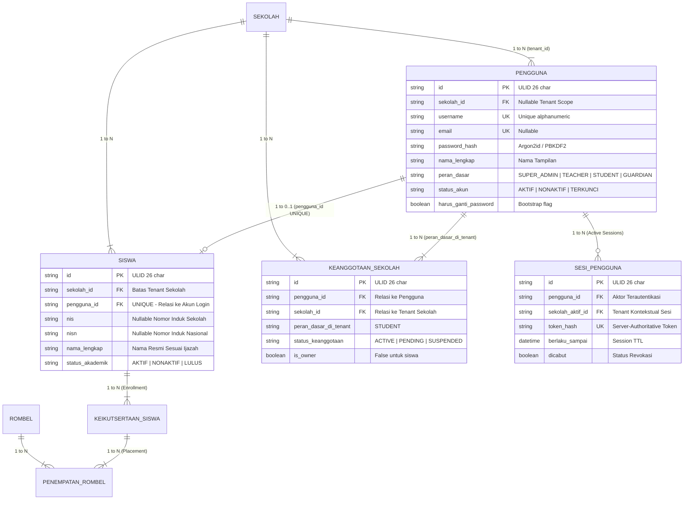

# STAGE 11.8B — IDENTITY MODEL & RELATION REVIEW
## Architectural Verification of Student Identity, School Membership & Authorization Scopes

| Attribute | Detail |
| :--- | :--- |
| **Project Identity** | Ruang Pintar — School Digital Operating Platform |
| **Architectural Layer** | Identity & Access Management (M02) + SaaS Multi-Tenant (SaaS-04) |
| **Framework & Engine** | Next.js Server Actions + Prisma ORM + SQLite 3 |
| **Scope of Verification** | Invariant 1 Siswa = 1 User Account, Keanggotaan Sekolah, Scope Otorisasi |
| **Status Review** | **VERIFIED & ARCHITECTURALLY SOUND** |

---

## 1. Relasi Model Identitas Aktual

Berdasarkan skema canonical `prisma/schema.prisma` dan model database yang sedang berjalan, arsitektur identitas digital siswa bertumpu pada 5 entitas terkoordinasi:



---

## 2. Verifikasi Invariant: 1 Siswa = 1 User Account

### 2.1. Perlindungan Database-Level
Prisma schema mendefinisikan kolom `pengguna_id` pada model `Siswa` dengan atribut `@unique`:
```prisma
model Siswa {
  id              String    @id
  sekolah_id      String
  pengguna_id     String?   @unique
  ...
  pengguna        Pengguna? @relation(fields: [pengguna_id], references: [id], onDelete: SetNull)
}
```

### 2.2. Pembuktian Pencegahan Anti-Pattern:
1. **Pencegahan *Many Students -> One Account*:**
   - Kolom `siswa.pengguna_id` memiliki constraint indeks unik (`UNIQUE`).
   - Apabila sistem mencoba mengaitkan akun pengguna yang sama ke siswa kedua, database SQLite akan melempar error `Unique constraint failed on the fields: (pengguna_id)`.
   - **Hasil: 100% MUSTAHIL terjadi pembagian satu akun untuk banyak siswa.**
2. **Pencegahan *One Student -> Multiple Active Accounts*:**
   - Entitas `siswa` hanya memiliki tepat satu kolom kunci asing `pengguna_id`.
   - Tidak ada tabel perantara banyak-ke-banyak (*junction table*) antara `siswa` dan `pengguna`.
   - **Hasil: 100% MUSTAHIL satu entitas siswa memiliki lebih dari satu akun pengguna aktif.**

---

## 3. Keterkaitan Multi-Tenant & SaaS Membership (SaaS-04)

### 3.1. Mekanisme Resolusi Sesi `sekolah_aktif_id`
Pada saat pengguna memasukkan kredensial di halaman `/login`, `AuthService.loginWithCredentials` mengeksekusi logika pemilihan tenant:
```typescript
// src/shared/infrastructure/auth/auth-service.ts (Line 169-174)
const activeMemberships = await prisma.keanggotaanSekolah.findMany({
  where: { pengguna_id: user.id, status_keanggotaan: "ACTIVE" },
  select: { sekolah_id: true },
  take: 2,
});
const sekolahAktifId = activeMemberships.length === 1 ? activeMemberships[0].sekolah_id : null;
```

### 3.2. Implikasi Kritis untuk Pembuatan Akun Siswa:
Jika akun pengguna dibuat HANYA pada tabel `pengguna` tanpa record di `keanggotaan_sekolah`:
- Nilai `sekolahAktifId` pada sesi login siswa akan bernilai `null`.
- Seluruh *route guard*, *server action*, dan repositori yang mewajibkan `sekolah_id` (seperti CBT, Pengumpulan Tugas, dan Akses Nilai) akan memblokir siswa dengan respon `Unauthorized` atau me-redirect kembali ke dashboard.
- **Aturan Baku Implementasi**: Setiap akun siswa WAJIB dibuat serentak dengan record `KeanggotaanSekolah` berkondisi:
  ```json
  {
    "peran_dasar_di_tenant": "STUDENT",
    "status_keanggotaan": "ACTIVE",
    "is_owner": false
  }
  ```

---

## 4. Role Assignment & Permission Scope

### 4.1. Bundle Izin Peran `STUDENT`
Berdasarkan `src/shared/infrastructure/authorization/role-permissions.ts`, peran `STUDENT` memiliki hak akses terkurasi:
- `academic.school.view` (Melihat profil dasar sekolah)
- `academic.calendar.view` (Melihat agenda kalender akademik)
- `schedule.class.view` (Melihat jadwal harian rombelnya)
- `learning.material.view` (Membaca materi KBM guru)
- `learning.assignment.view` (Melihat instruksi & lampiran tugas)
- `learning.assignment.submit` (Mengumpulkan tugas mandiri)
- `attendance.session.view` (Melihat rekap kehadiran pribadi)
- `assessment.grades.view` (Melihat nilai asesmen terbit)
- `assessment.report_card.view` (Melihat e-Rapor resmi)
- `cbt.exam.view` (Melihat daftar ujian CBT rombel)
- `cbt.attempt.start` (Memulai pengerjaan ujian CBT)
- `communication.announcement.view` (Membaca pengumuman sekolah)

### 4.2. Batas Otorisasi Lingkup Diri (*Self-Scope Boundary*)
Siswa **DILARANG** memiliki kemampuan administratif, dilarang mengakses data siswa lain, dan dilarang mengubah jadwal atau nilai:
- Query profil siswa disaring langsung menggunakan `siswa.pengguna_id = user.id`.
- Siswa hanya dapat melihat materi dan ujian dari penugasan mengajar guru yang terhubung ke rombel penempatan aktifnya (`penempatan_rombel.rombel_id`).
- Upaya mengakses submission tugas atau attempt ujian milik siswa lain dicegat oleh pengecekan kepemilikan `siswa_id` pada level Server Actions.

---

## 5. Kesimpulan Review
Arsitektur model identitas saat ini telah memenuhi seluruh kriteria keamanan modern:
1. Integritas 1-to-1 terlindungi di level mesin database.
2. Isolasi multi-tenant terjamin melalui kombinasi `pengguna.sekolah_id` dan `keanggotaan_sekolah`.
3. Pemetaan otorisasi siswa berlandaskan prinsip *least-privilege* dan *self-scope data containment*.
