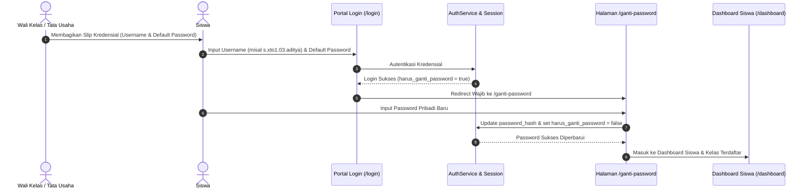

# STAGE 11.8C — STUDENT ACCOUNT GENERATION STRATEGY
## Production-Safe Strategy for Digital Credentials, Bootstrap & Activation Lifecycle

| Attribute | Detail |
| :--- | :--- |
| **Project Identity** | Ruang Pintar — School Digital Operating Platform |
| **Target Audience** | 700 Siswa Aktif SMK OTOMINDO (Kelas X, XI, XII) |
| **Core Constraints** | No Synthetic NIS, No Student Emails in DB, 5 Cross-Grade Identical Names |
| **Status Document** | **RECOMMENDATION SPECIFICATION — PENDING HUMAN APPROVAL** |

---

## 1. Analisis Kendala & Kondisi Riil Sekolah

Merancang skema akun untuk 700 siswa SMK OTOMINDO harus berpijak pada realitas data hasil Stage 11.7:
1. **Asimetri NIS**:
   - 341 siswa (Kelas X dan Sheet2) memiliki nomor NIS (misal `242510001`).
   - 359 siswa (Kelas XI dan XII) **TIDAK MEMILIKI NIS (`nis: null`)** karena belum terdata di master roster Excel.
   - Sesuai mandat non-negotiable: **Dilarang membuat NIS sintetis**.
2. **Ketiadaan Data Kontak Mandiri**:
   - Tabel siswa tidak memiliki email pribadi maupun nomor ponsel siswa.
   - Alur aktivasi via email magic-link atau SMS OTP mandiri **tidak memungkinkan secara fisik**.
3. **Anomali Nama Identik Antar-Tingkat**:
   - Terdapat 5 pasang nama yang identik antar-jenjang (contoh: *Aditya Pratama* ada di X TO 1 #3 dan XI DKV #2).
   - Skema username berbasis nama saja berisiko tinggi menimbulkan tabrakan (*collision*).

---

## 2. Perbandingan Tiga Opsi Strategi Username

| Parameter | Opsi 1: Berbasis NIS | Opsi 2: Berbasis Nama Slug Acak | Opsi 3: Kanonikal Terstruktur (RECOMMENDED) |
| :--- | :--- | :--- | :--- |
| **Format** | `<nis>` (contoh: `242510001`) | `<nama_depan>.<nama_belakang><angka>` | `s.<rombel_slug>.<absen_2digit>.<nama_slug>` |
| **Contoh Kasus** | `242510001` | `aditya.pratama92` | `s.xto1.03.aditya` |
| **Dukungan Null-NIS** | **GAGAL (0%)** — 359 siswa tidak punya NIS | **Mendukung** | **Mendukung 100% (Tanpa bergantung NIS)** |
| **Resistensi Tabrakan** | Rendah untuk siswa null-NIS | Rendah (Butuh random seed) | **Nir-Tabrakan (100% Deterministik)** |
| **Kemudahan Distribusi** | Sulit bagi kelas XI & XII | Sangat Sulit (Format tidak seragam) | **Sangat Mudah (Wali kelas per rombel)** |
| **Human Ergonomics** | Cukup mudah diingat jika ada NIS | Membingungkan bagi siswa | **Sangat jelas, mencerminkan kelas & absen** |
| **Kepatuhan Tenant** | Netral | Rentan overlap | **Terisolasi per rombel sekolah** |

### Evaluasi Mendalam:
- **Opsi 1 DITOLAK**: Memaksa pembuatan NIS sintetis untuk 359 siswa kelas XI dan XII, yang melanggar aturan baku arsitektur data.
- **Opsi 2 DITOLAK**: Format acak menyulitkan tata kelola sekolah, sulit diverifikasi saat siswa lupa username, dan tidak profesional untuk sistem sekolah.
- **Opsi 3 DIREKOMENDASIKAN (WINNER)**:
  Menggunakan kombinasi terstruktur: `s.<rombel_slug>.<nomor_absen_2digit>.<nama_depan_slug>`.
  - Format seragam, elegan, dan profesional.
  - Setiap siswa di rombel memiliki nomor absen unik (1–41), sehingga username dijamin 100% unik tanpa collision.
  - Dua siswa bernama sama tidak akan pernah bentrok karena kode rombelnya berbeda:
    - *Aditya Pratama* (X TO 1 absen 3) -> `s.xto1.03.aditya`
    - *Aditya Pratama* (XI DKV absen 2) -> `s.xidkv.02.aditya`

---

## 3. Strategi Kredensial & Bootstrap Password

Mengingat siswa belum memiliki email, strategi bootstrap kredensial dirancang dengan pendekatan **Zero-Trust Initial Password with Mandatory First-Login Rotation**:

### 3.1. Master Bootstrap Password
Seluruh 700 akun diinisialisasi dengan kata sandi bawaan terstandarisasi:
```text
Default Initial Password: Otomindo@2026!
```
- Memenuhi standar kompleksitas: huruf besar, huruf kecil, angka, dan simbol.
- Dihash menggunakan algoritma kriptografi yang sama dengan seluruh pengguna sistem (`verifyPassword` / PBKDF2).

### 3.2. Penegakan Rotasi Sandi Wajib (`harus_ganti_password`)
Pada pembuatan akun, kolom `pengguna.harus_ganti_password` diatur ke nilai `true`.
- Ketika siswa berhasil login pertama kali, middleware autentikasi mendeteksi `harus_ganti_password = true`.
- Pengguna otomatis diarahkan ke halaman `/ganti-password`.
- Seluruh rute lain (`/dashboard`, `/cbt-ujian`, `/tugas-siswa`) diblokir hingga siswa menetapkan password baru yang hanya diketahui oleh siswa tersebut.
- Setelah password baru disimpan, flag diubah menjadi `false`, dan sesi diperbarui.

---

## 4. Alur Distribusi & Aktivasi (Activation Workflow)



---

## 5. Alur Pemulihan Sandi (Reset Password Workflow)

Karena tidak adanya email siswa, alur lupa password diselesaikan melalui **Assisted School Staff Workflow**:

1. **Self-Service Restriction**: Form `/forgot-password` memberi instruksi bahwa reset akun siswa dilayani melalui Wali Kelas masing-masing.
2. **Homeroom Assisted Reset**:
   - Wali Kelas memiliki menu "Kelola Akun Siswa" di Dashboard Wali Kelas (`/wali-kelas`).
   - Wali kelas dapat menekan tombol **"Reset Sandi ke Bawaan"** untuk siswa yang melapor lupa password.
   - Tindakan ini:
     - Mengembalikan password ke `Otomindo@2026!`.
     - Mengubah status `harus_ganti_password = true`.
     - Mencabut seluruh sesi aktif siswa yang bersangkutan (`SesiPengguna.dicabut = true`).
     - Mencatat mutasi pada `log_audit` sekolah.

---

## 6. Rekomendasi Eksekusi Final

Kami merekomendasikan:
1. **Gunakan Opsi 3** untuk format username: `s.<rombel_slug>.<absen_2digit>.<nama_depan_slug>`.
2. **Gunakan Bootstrap Kredensial Terkendali** dengan password default `Otomindo@2026!` dan mandatory change password.
3. **Eksekusi secara Transaksional** melalui skrip CLI `scripts/generate-student-accounts.mjs` yang idempoten, dengan opsi `--dry-run` sebelum eksekusi commit nyata.
