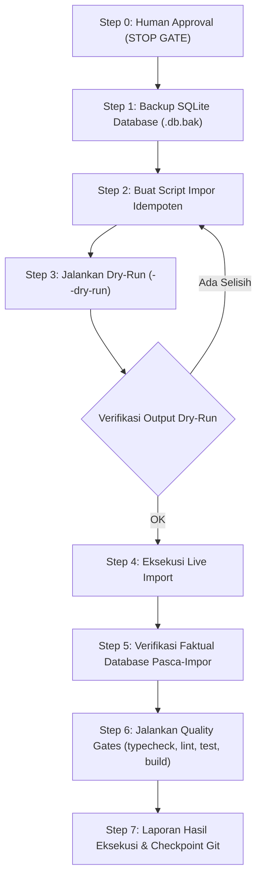

# STUDENT-IMPORT-EXECUTION-PLAN.md
## Rencana Eksekusi Impor Data Siswa & Penugasan Wali Kelas SMK OTOMINDO
### Phase F (Kelas XI & XII) + Rekonsiliasi Rombel X TJKT 1 & Sheet2

| Parameter Eksekusi | Spesifikasi Rencana |
| :--- | :--- |
| **Tenant Target** | SMK OTOMINDO (`id: 01M2XXYD227F9S3H985FH53GMF`) |
| **Tahun Ajaran / Semester** | 2026/2027 (`01M2XXYD2CYPCWZ0RM9TAN6BW0`) / Ganjil |
| **File Sumber Master** | `C:\Users\vitam\Downloads\FORM NILAI ATS GANJIL.xlsx` (153.365 bytes) |
| **Total Siswa Baru Diimpor** | **359 Siswa Riil** (1 Siswa X TJKT 1 + 205 Siswa Kelas XI + 153 Siswa Kelas XII) |
| **Total Populasi Akhir DB** | **700 Siswa Riil** (312 Tingkat X + 235 Tingkat XI Termasuk Sheet2 + 153 Tingkat XII) |
| **Total Wali Kelas Ditugaskan**| **11 Wali Kelas Fase F** (6 Rombel XI + 5 Rombel XII) |
| **Kebijakan NIS / NISN** | **ZERO SYNTHETIC DATA** (`nis: null`, `nisn: null` sesuai nullable schema) |
| **Status Rencana** | `PROPOSED — AWAITING HUMAN APPROVAL (STOP GATE)` |
| **Tanggal Penyusunan** | 25 September 2026 |

---

## 1. Prinsip & Batasan Eksekusi

Rencana eksekusi ini tunduk pada aturan ketat operasional:

1. **Zero Synthetic Data Policy:**
   - DILARANG mengarang nomor NIS, NISN, atau NIK sintetis.
   - Kolom `nis`, `nisn`, dan `nik` pada tabel `siswa` bersifat **nullable (`String?`)** di `prisma/schema.prisma`. Siswa baru akan diimpor secara sah dengan nilai `null`.
2. **Idempotensi & Keamanan Transaksional:**
   - Script impor dirancang *idempotent* menggunakan pencocokan `(sekolah_id, nama_lengkap)` atau `id` tetap.
   - Eksekusi database dibungkus dalam `prisma.$transaction` per batch rombel untuk mencegah data parsial (*half-written state*).
3. **Pemisahan Fase & Stop Gate:**
   - Dokumen ini adalah cetak biru rencana kerja.
   - **TIDAK ADA PERUBAHAN DATABASE** yang dilakukan hingga rencana ini disetujui secara eksplisit oleh pengguna (*Human Approval*).
4. **Non-Destructive Data Preservation:**
   - Tidak ada penghapusan data master sekolah, jadwal pelajaran, rombel, akun guru, atau nilai formatif/sumatif yang telah tercatat sebelumnya.

---

## 2. Rincian Roster Siswa & Target Penempatan Rombel

### 2.1. Kelas X — Rekonsiliasi 1 Siswa Terlewat
- **Rombel Sasaran:** `X TJKT 1` (`id: 01M3AFJD9S8Q0340XG3GXZ2C1V`)
- **Data Siswa:**
  - Nomor Absen: **#9**
  - Nama Lengkap: **Flantzaa Saqyah Rayfy Tameno**
  - `nis`: `null` | `nisn`: `null`
  - Hasil: Rombel `X TJKT 1` menjadi genap **29 siswa** (sinkron 100% dengan Sheet X).

### 2.2. Kelas XI (Fase F) — 205 Siswa Reguler di 6 Rombel

| No | Nama Rombel di Jadwal | ID Rombel di Database | Wali Kelas Terverifikasi | ID Guru Wali | Jumlah Siswa |
| :-: | :--- | :--- | :--- | :--- | :-: |
| 1 | `XI TO 1` | `01M3AFJDH1WYGFJVANVZC1SHSY` | **Shafara Salsabila, S.Pd** | `01M3AFEFTJZFM6K24VQ6P4EQNE` | **36 Siswa** |
| 2 | `XI TO 2` | `01M3AFJDH7XHKMNY0C1QJSX6XS` | **Shabrina A Mubiina AL-H, S.Pd** | `01M3AFEG65AFYSYFJR7E5Q8DSZ` | **37 Siswa** |
| 3 | `XI TO 3` | `01M3AFJDHDE256T5VYZY7TDXZB` | **Nurhayati, S.Pd** | `01M3AFEG4PV4GWQQKJC4DMG666` | **36 Siswa** |
| 4 | `XI TJKT` | `01M3AFJDHK0YQ2N1W60JCV0N89` | **Aprilla Hayati, S.Pd** | `01M3AFEG22JNH94DZ6QDPPN0Q0` | **37 Siswa** |
| 5 | `XI DKV` | `01M3AFJDHPSN8B4ACAGC0NZCXT` | **Wayan Budi Ismawati, M.Pd** | `01M3AFEFSR694R641P0H1N2KK2` | **31 Siswa** |
| 6 | `XI RPL` | `01M3AFJDHS7KNNWVV0MHT793VR` | **Fransina Tresia A, SP, MM** | `01M3AFEG3AMSCWCG2NEPZR9KSW` | **28 Siswa** |
| **Total**| **6 Rombel** | | | | **205 Siswa** |

### 2.3. Kelas XII (Fase F) — 153 Siswa Reguler di 5 Rombel

| No | Nama Rombel di Jadwal | ID Rombel di Database | Wali Kelas Terverifikasi | ID Guru Wali | Jumlah Siswa |
| :-: | :--- | :--- | :--- | :--- | :-: |
| 1 | `XII TKRO 1` | `01M3AFJDHYG656W3006093ZJSN` | **Drs. Rekson Pangaribuan** | `01M3AFEFS6PX2RHKFSNPK1RN17` | **38 Siswa** |
| 2 | `XII TKRO 2` | `01M3AFJDJ41730D7NTSF01W6CV` | **Arnah Fajarwati, SE** | `01M3AFEG2KDM5VGSH9YED34Q95` | **38 Siswa** |
| 3 | `XII TKJ 1` | `01M3AFJDJJM5B707NF92N8FJ5Q` | **Meta Pradi Wijayanti, S.Pd** | `01M3AFEFYPBQ8DEZ8W20X6P6ZC` | **37 Siswa** |
| 4 | `XII DKV 1` | `01M3AFJDJRBWZYCCJKEB56KPB4` | **Suryani, S.Ds** | `01M3AFEFT79W7W3G03SRJK5FAM` | **25 Siswa** |
| 5 | `XII RPL` | `01M3AFJDMHDM2AY4HP771CXBN0` | **Sri Siswati, M.Pd** | `01M3AFEFW7JWA8BYC00AHXWM2K` | **15 Siswa** |
| **Total**| **5 Rombel** | | | | **153 Siswa** |

---

## 3. Strategi Penataan Rombel & Reposisi 30 Siswa Sheet2

### 3.1. Masalah Faktual Sheet2
- Saat ini di database terdapat 30 siswa unik dari Sheet2 (Praktik Sistem Operasi) yang ditempatkan di rombel `XI TJKT` (`01M3AFJDHK0YQ2N1W60JCV0N89`).
- Berdasarkan Sheet XI Master Excel, rombel reguler `XI TJKT` memiliki **37 siswa reguler** yang berbeda 100% dari 30 siswa Sheet2.

### 3.2. Solusi Rekonsiliasi Rombel Sheet2 (Opsi Rekomendasi)
1. **Buat Rombel Praktik Khusus:**
   - Buat entitas rombel baru di tabel `rombel`:
     - `nama`: `XI TJKT 2` (atau `XI TJKT (Praktik SO)`)
     - `tingkat`: `11`
     - `tahun_ajaran_id`: `01M2XXYD2CYPCWZ0RM9TAN6BW0`
     - `sekolah_id`: `01M2XXYD227F9S3H985FH53GMF`
2. **Reposisi Keanggotaan 30 Siswa Sheet2:**
   - Perbarui relasi `AnggotaRombel` untuk 30 siswa tersebut dari rombel `XI TJKT` ke rombel baru `XI TJKT 2`.
3. **Alokasi 37 Siswa Reguler XI TJKT:**
   - Daftarkan 37 siswa reguler Sheet XI ke rombel utama `XI TJKT`.
   - Wali kelas Aprilla Hayati, S.Pd memegang rombel reguler `XI TJKT`.
4. **Hasil Akhir:** Rombel reguler terisi siswa reguler murni, dan siswa praktik SO tetap aman tersimpan tanpa ada kehilangan data.

---

## 4. Penugasan 11 Wali Kelas di Tabel `PenugasanWaliKelas`

Untuk setiap rombel Fase F (6 di XI, 5 di XII), script akan membuat/memperbarui record pada model `PenugasanWaliKelas`:

```prisma
model PenugasanWaliKelas {
  id              String      // ULID 26 karakter
  sekolah_id      String      // 01M2XXYD227F9S3H985FH53GMF
  tahun_ajaran_id String      // 01M2XXYD2CYPCWZ0RM9TAN6BW0
  rombel_id       String      // ID Rombel terkait
  guru_id         String      // ID Guru Wali Kelas terverifikasi
  status          StatusAktif // AKTIF
  created_at      DateTime
  updated_at      DateTime
}
```

Semua 11 guru telah diverifikasi memiliki `guru.id` dan akun `pengguna` aktif (lihat [STUDENT-DATA-RECONCILIATION-REPORT.md](file:///c:/laragon/www/Ruang-Pintar/STUDENT-DATA-RECONCILIATION-REPORT.md#L162-L175)).

---

## 5. Arsitektur Teknis Script Impor

### 5.1. Lokasi & Struktur Script
Script mandiri terisolasi akan disiapkan pada:
`scripts/seed-students-phase-f.ts`

Script memanfaatkan data terstruktur yang telah diekstrak secara presisi di:
`scratch/excel_detailed_roster.json` (atau pembacaan Excel langsung melalui `xlsx`).

### 5.2. Format Payload Siswa Baru
Setiap record siswa baru dibuat dengan spesifikasi:
```typescript
{
  id: ulid(),                       // ULID baru yang unik
  sekolah_id: TENANT_ID,            // SMK OTOMINDO
  nis: null,                        // DILARANG SINTETIS (NULLABLE)
  nisn: null,                       // NULLABLE
  nik: null,                        // NULLABLE
  nama_lengkap: student.nama,       // Nama resmi dari Sheet Excel
  jenis_kelamin: student.gender,    // L / P (diinferensi atau DEFAULT_L)
  status: 'AKTIF',
  created_at: new Date(),
  updated_at: new Date(),
}
```

### 5.3. Format Payload Anggota Rombel
```typescript
{
  id: ulid(),
  rombel_id: rombelId,
  siswa_id: siswaId,
  nomor_absen: student.absen,       // Nomor urut presensi resmi dari Kolom A
  status: 'AKTIF',
  created_at: new Date(),
  updated_at: new Date(),
}
```

---

## 6. Rencana Eksekusi Langkah Demi Langkah (Step-by-Step Execution)



### Rincian Tiap Langkah:
1. **Step 0 — Human Approval (Gerbang Berhenti Wajib):**
   - Menunggu persetujuan pengguna terhadap dokumen `STUDENT-DATA-RECONCILIATION-REPORT.md` dan `STUDENT-IMPORT-EXECUTION-PLAN.md`.
2. **Step 1 — Snapshot Backup Database:**
   - Jalankan: `Copy-Item prisma/data/ruang-pintar.db prisma/data/ruang-pintar.db.bak`
   - Memastikan pemulihan instan (< 10 detik) jika terjadi anomali.
3. **Step 2 — Penyiapan Script Impor:**
   - Menyusun `scripts/seed-students-phase-f.ts` dengan dukungan flag `--dry-run`.
4. **Step 3 — Verifikasi Dry-Run:**
   - Eksekusi simulasi: `npx tsx scripts/seed-students-phase-f.ts --dry-run`
   - Memeriksa jumlah record insert: 1 (X) + 205 (XI) + 153 (XII) = 359 siswa baru, 11 penugasan wali kelas, dan reposisi 30 siswa Sheet2.
5. **Step 4 — Eksekusi Live Database:**
   - Jalankan: `npx tsx scripts/seed-students-phase-f.ts`
6. **Step 5 — Verifikasi Faktual Database:**
   - Jalankan query count per rombel dan cek bahwa:
     - Total siswa tenant = 700.
     - Seluruh 21 rombel terisi siswa.
     - 11 wali kelas Fase F terhubung aktif.
     - 0 NIS sintetis yang tercipta (`nis IS NULL` untuk 359 siswa baru).
7. **Step 6 — Kepatuhan Quality Gate:**
   - Jalankan `npm run typecheck`, `npm run lint`, `npm run test`, `npm run build`.

---

## 7. Rencana Penanggulangan Risiko & Prosedur Rollback

| Risiko Potensial | Probabilitas | Dampak | Strategi Mitigasi / Prosedur Rollback |
| :--- | :---: | :---: | :--- |
| **Error Foreign Key / Relasi Gagal** | Sangat Rendah | Sedang | Seluruh `rombel_id`, `guru_id`, dan `tahun_ajaran_id` telah diverifikasi eksistensinya 100% pada audit rekonsiliasi. Transaksi rollback otomatis jika gagal. |
| **Kompatibilitas Nilai NIS Null pada UI/LMS** | Rendah | Rendah | Skema database dan kode aplikasi mendukung `nis: null`. Tampilan antarmuka menampilkan nama siswa dan nomor absen jika NIS belum tersedia. |
| **Anomali Data Tak Terduga** | Rendah | Tinggi | **Rollback Prosedur:** Kembalikan snapshot database dengan perintah: `Copy-Item prisma/data/ruang-pintar.db.bak prisma/data/ruang-pintar.db -Force`. |

---

## 8. Kriteria Selesai (Definition of Done)

Eksekusi dinyatakan berhasil jika dan hanya jika:
- [ ] Database SMK OTOMINDO memuat tepat **700 siswa riil faktual**.
- [ ] Rombel `X TJKT 1` memiliki 29 siswa (termasuk `Flantzaa Saqyah Rayfy Tameno`).
- [ ] 6 Rombel Tingkat XI terisi 205 siswa reguler.
- [ ] 5 Rombel Tingkat XII terisi 153 siswa reguler.
- [ ] 30 Siswa Sheet2 tersimpan aman di rombel terpisah tanpa mengganggu rombel reguler.
- [ ] 11 Guru resmi tercatat sebagai Wali Kelas di `PenugasanWaliKelas`.
- [ ] 359 Siswa baru memiliki `nis: null` (100% bebas dari NIS sintetis).
- [ ] Seluruh Quality Gate (`typecheck`, `lint`, `test`, `build`) lulus 100% PASS.

---

**STATUS: READY FOR HUMAN REVIEW — STOP.**
*Menunggu persetujuan eksplisit pengguna sebelum mengeksekusi impor data.*
