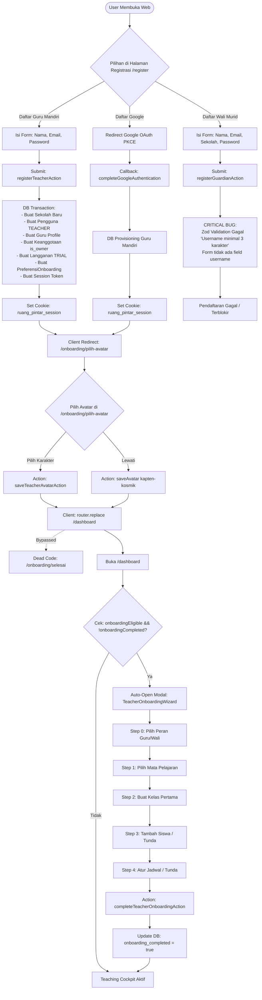

# AUDIT WORKFLOW: REGISTRASI, AUTENTIKASI & ONBOARDING
## Ruang Pintar — School Digital Operating Platform

| Metadata | Nilai |
| --- | --- |
| **Tanggal Audit** | 30 September 2026 |
| **Tipe Dokumen** | Technical & UX Reality Audit |
| **Fokus Area** | Registrasi, Autentikasi, Username, Avatar, Onboarding, School Discovery, Guru Mandiri, Role & Access |
| **Status Kode Saat Audit** | Locked (Tidak ada refactor / Tidak ada perubahan kode aplikasi) |
| **Target Deliverable** | `docs/AUDIT-REGISTRATION-ONBOARDING-WORKFLOW.md` |

---

# 1. Executive Summary

Audit ini dilakukan secara menyeluruh terhadap implementasi aktual kode program (front-end, server actions, services, database schema Prisma, dan API routes) pada sistem **Ruang Pintar**. Audit ini bertujuan mengungkap **workflow aktual yang benar-benar berjalan saat ini**, mengidentifikasi bug pemblokir (*blockers*), inkonsistensi pengalaman pengguna (UX), risiko teknis arsitektur, dan celah (*gap analysis*) dibandingkan spesifikasi produk.

### Ringkasan Temuan Utama:
1. **Registrasi Guru Mandiri Berjalan & Teruji**: Jalur registrasi mandiri untuk guru (baik via formulir email/password maupun Google OAuth PKCE) berfungsi dan secara otomatis membuat tenant sekolah baru bertipe `FREEMIUM` dengan masa uji coba (`TRIAL`) 30 hari.
2. **BUG KRITIS: Registrasi Wali Murid 100% Gagal (Blocker)**: Formulir registrasi tab Wali Murid (`RegisterForm`) tidak menyediakan input field `username`. Namun, Zod schema `GuardianRegistrationSchema` pada service backend mewajibkan field `username` (min. 3 karakter). Akibatnya, setiap pendaftaran wali murid melalui UI pasti tertolak dengan pesan error *"Username minimal 3 karakter"*.
3. **Simulasi Kosong pada Reset Password**: Halaman `/forgot-password` dan form pemulihan di `/ganti-password` tidak terhubung ke backend pengiriman email maupun tabel database token reset; alur ini hanya menjalankan simulasi dummy `setTimeout(800ms)`. Password tidak pernah berubah di database jika dilakukan tanpa sesi login.
4. **Ketiadaan Verifikasi Email**: Verifikasi email belum diimplementasikan. Seluruh pengguna baru yang mendaftar langsung berstatus `status_akun = "AKTIF"`.
5. **School Discovery Dikecualikan (Out of Scope)**: Fitur "Cari Sekolah" sebelum mendaftar yang dirancang pada dokumen konseptual awal (`SAAS-ONBOARDING-SPECIFICATION.md`) tidak ada di kode aplikasi. Penentuan tenant untuk guru saat ini dipaksa selalu membuat sekolah dummy baru (`Ruang Mengajar Mandiri - [Nama]`).
6. **Inkonsistensi Step & Dead Code Onboarding**: Halaman `/onboarding/pilih-avatar` menampilkan badge *"Langkah 2 dari 3"*, namun tombol simpannya langsung melompat ke `/dashboard`, menyebabkan halaman `/onboarding/selesai` menjadi *orphaned/dead code*. Di dashboard guru, proses onboarding dilanjutkan oleh modal pop-up `TeacherOnboardingWizard` (5 langkah) yang menyimpan progres di tabel `preferensi_onboarding_guru`.

---

# 2. Area Audit 1: Registrasi & Authentication

## 2.1 Alur Registrasi Email + Password

### A. Registrasi Guru Mandiri (`role === "TEACHER"`)
- **Halaman yang Digunakan**: `/register` ([`src/app/register/page.tsx`](file:///C:/laragon/www/Ruang-Pintar/src/app/register/page.tsx))
- **Komponen Form**: `RegisterForm` ([`src/app/register/register-form.tsx`](file:///C:/laragon/www/Ruang-Pintar/src/app/register/register-form.tsx))
- **Server Action**: `registerTeacherAction` ([`src/app/actions/smart-onboarding-actions.ts`](file:///C:/laragon/www/Ruang-Pintar/src/app/actions/smart-onboarding-actions.ts#L64))
- **Service Domain**: `smartOnboardingService.registerTeacher` ([`src/modules/ai-assistant/application/smart-onboarding-service.ts`](file:///C:/laragon/www/Ruang-Pintar/src/modules/ai-assistant/application/smart-onboarding-service.ts#L36))
- **Field Input yang Diminta**:
  - `nama_lengkap` (Nama Lengkap & Gelar)
  - `email` (Email Akun)
  - `password` & `confirmPassword` (Kata sandi min. 8 karakter memadukan huruf besar, huruf kecil, angka, dan simbol)
- **Logika Eksekusi Server**:
  1. Validasi Zod via `SmartOnboardingRegistrationSchema`.
  2. Pengecekan duplikasi email pada tabel `pengguna`.
  3. Pembuatan `username` otomatis dari prefix email (misal: `budi_santoso` atau `budi_santoso_1`).
  4. Eksekusi transaksi atomik Prisma (`prisma.$transaction`):
     - Membuat `Sekolah` baru: `nama: "Ruang Mengajar Mandiri - [Nama]"`, `jenjang: "SMA"`, `tipe_lisensi: "FREEMIUM"`.
     - Membuat `TahunAjaran` aktif default: `2026/2027`.
     - Membuat `Semester` ganjil aktif default.
     - Membuat 3 `TingkatKelas`: `X`, `XI`, `XII`.
     - Membuat `Pengguna`: `peran_dasar: "TEACHER"`, `status_akun: "AKTIF"`.
     - Membuat profil `Guru`: `status_kepegawaian: "TETAP"`, `status_aktif: true`.
     - Membuat `PreferensiOnboardingGuru`: `onboarding_eligible: true`, `onboarding_completed: false`, `wizard_step: 0`.
     - Membuat `PreferensiNotifikasi`: in-app, whatsapp, email default aktif.
     - Membuat `KeanggotaanSekolah`: `peran_dasar_di_tenant: "TEACHER"`, `status_keanggotaan: "ACTIVE"`, `is_owner: true`.
     - Membuat `LanggananTenant`: `paket: "TRIAL"`, `status: "TRIAL_ACTIVE"`, masa aktif 30 hari.
     - Membuat `KonfigurasiSistem`: timezone `Asia/Jakarta`.
  5. Membuat token sesi server-authoritative (`sesiPengguna`) yang mengikat `sekolah_aktif_id` ke tenant baru.
  6. Menulis HTTP cookie `ruang_pintar_session`.
- **Redirect Setelah Berhasil**: Client redirect via `router.push("/onboarding/pilih-avatar")`.

---

### B. Registrasi Wali Murid (`role === "GUARDIAN"`)
- **Halaman yang Digunakan**: `/register` ([`src/app/register/page.tsx`](file:///C:/laragon/www/Ruang-Pintar/src/app/register/page.tsx))
- **Komponen Form**: `RegisterForm` tab *"Wali Murid"*.
- **Server Action**: `registerGuardianAction` ([`src/app/actions/guardian-actions.ts`](file:///C:/laragon/www/Ruang-Pintar/src/app/actions/guardian-actions.ts#L249))
- **Service Domain**: `guardianService.registerGuardian` ([`src/modules/guardian/application/guardian-service.ts`](file:///C:/laragon/www/Ruang-Pintar/src/modules/guardian/application/guardian-service.ts#L449))
- **Field Input yang Tampil di Form**:
  - `nama_lengkap` (Nama Orang Tua / Wali)
  - `email`
  - `sekolah_id` (Dropdown list dari `getAvailableSchoolsAction()`)
  - `password` & `confirmPassword`
- **STATUS AKTUAL**: **GAGAL TOTAL (CRITICAL BUG / BLOCKER)**.
  - Form tidak memiliki input field `username`.
  - Di `guardian-actions.ts`: `username: formData.get("username")?.toString()?.trim() || ""`.
  - Service memvalidasi dengan `GuardianRegistrationSchema` ([`guardian-validation.ts`](file:///C:/laragon/www/Ruang-Pintar/src/modules/guardian/domain/guardian-validation.ts#L57)) yang mewajibkan:
    `username: z.string().min(3, "Username minimal 3 karakter")`.
  - Validasi Zod selalu melempar error: *"Username minimal 3 karakter"*.
  - Pengguna tidak dapat menyelesaikan registrasi wali murid melalui antarmuka web.
- **Redirect Jika Berhasil (Teoretis)**: `router.push("/dashboard")` tanpa melewati alur avatar.

---

## 2.2 Alur Registrasi Google

- **Route Inisiasi**: `GET /api/auth/google?mode=register` ([`src/app/api/auth/google/route.ts`](file:///C:/laragon/www/Ruang-Pintar/src/app/api/auth/google/route.ts))
- **Service**: `google-oauth-service.ts` ([`src/shared/infrastructure/auth/google-oauth-service.ts`](file:///C:/laragon/www/Ruang-Pintar/src/shared/infrastructure/auth/google-oauth-service.ts))
- **Alur Teknis**:
  1. Server menghasilkan state bertanda tangan kriptografis HMAC-SHA256 (`createSignedState`), `nonce`, dan PKCE `code_verifier`.
  2. Menyimpan state, nonce, dan verifier ke dalam HTTP-only cookies:
     - `ruang_pintar_google_oauth_state`
     - `ruang_pintar_google_oauth_nonce`
     - `ruang_pintar_google_oauth_verifier`
  3. Mengarahkan browser ke Google OAuth 2.0 Auth Server (`https://accounts.google.com/o/oauth2/v2/auth`) dengan scope `openid email profile`.
  4. Google mengarahkan kembali ke Callback Route: `GET /api/auth/google/callback` ([`src/app/api/auth/google/callback/route.ts`](file:///C:/laragon/www/Ruang-Pintar/src/app/api/auth/google/callback/route.ts)).
  5. Server mengeksekusi `completeGoogleAuthentication`:
     - Memverifikasi signed state cookie dan mencocokkan `code_verifier`.
     - Menukar `code` ke Google Token Endpoint untuk mendapatkan `id_token`.
     - Memverifikasi keabsahan JWT `id_token` menggunakan Google Public JWKs (`https://www.googleapis.com/oauth2/v3/certs`), validasi issuer, audience, expired, dan `email_verified === true`.
     - Cek apakah identitas Google sudah terdaftar di tabel `identitas_provider`.
       - Jika sudah ada: Buat sesi baru, cek apakah sudah memiliki `avatar_id`.
       - Jika belum ada dan `mode === "register"`:
         Memanggil `smartOnboardingService.registerTeacher` dengan:
         - `nama_lengkap`: klaim nama Google atau prefix email.
         - `email`: email Google terverifikasi.
         - `password`: password acak kriptografis (`randomPassword()`).
         - `provider_identity`: `{ provider: "GOOGLE", subject: claims.sub }`.
         - Otomatis mencatat record di `identitas_provider` dan membuat tenant guru mandiri baru.
  6. Menulis session cookie `ruang_pintar_session`.
- **Redirect Setelah Berhasil**:
  - Jika belum memiliki avatar (`needsAvatar: true`): diarahkan ke `/onboarding/pilih-avatar`.
  - Jika sudah memiliki avatar: diarahkan ke `/dashboard`.
- **Batasan**: Registrasi Google **hanya mendukung peran Guru Mandiri (TEACHER)**. Tidak ada opsi mendaftar sebagai Wali Murid menggunakan Google.

---

## 2.3 Alur Login

- **Halaman yang Digunakan**: `/login` ([`src/app/login/page.tsx`](file:///C:/laragon/www/Ruang-Pintar/src/app/login/page.tsx))
- **Komponen Form**: `LoginForm` ([`src/app/login/login-form.tsx`](file:///C:/laragon/www/Ruang-Pintar/src/app/login/login-form.tsx))
- **Metode Login 1: Username atau Email + Password**:
  - **Server Action**: `loginAction` ([`src/app/actions/auth-actions.ts`](file:///C:/laragon/www/Ruang-Pintar/src/app/actions/auth-actions.ts#L24))
  - **Service**: `authService.loginWithCredentials` ([`src/shared/infrastructure/auth/auth-service.ts`](file:///C:/laragon/www/Ruang-Pintar/src/shared/infrastructure/auth/auth-service.ts#L124))
  - **Pemeriksaan Keamanan**:
    1. *Rate Limiting*: Cek brute-force berdasarkan identifier dan IP via `checkLoginRateLimit` & `LogPercobaanLogin`.
    2. *User Lookup*: Mencari record pengguna via dual query `OR: [{ username }, { email: username }]`.
    3. *Status Akun*: Wajib `status_akun === "AKTIF"` (jika `NONAKTIF`, `TERKUNCI`, atau `DITANGGUHKAN` akan ditolak).
    4. *Verifikasi Password*: Membandingkan hash bcrypt (`verifyPassword`). Jika 5x berturut-turut salah, akun dikunci (`status_akun` -> `TERKUNCI`).
    5. *Tenant Resolution*: Query `keanggotaanSekolah` aktif milik pengguna. Jika pengguna memiliki tepat 1 tenant aktif, `sekolah_aktif_id` diikatkan ke sesi pengguna.
    6. *Pembuatan Sesi*: Menghasilkan token acak 32-byte, menyimpan SHA-256 hash di tabel `sesiPengguna`, dan mencatat `LogAudit` (`AUTH_LOGIN_SUCCESS`).
    7. *Session Cookie*: Menulis cookie `ruang_pintar_session` (durasi 24 jam standar, atau 30 hari jika `Ingat saya` dicentang).
  - **Redirect Setelah Berhasil**:
    - Jika `harus_ganti_password === true`: diarahkan ke `/ganti-password`.
    - Jika normal: diarahkan ke `/dashboard`.
- **Metode Login 2: Google Login**:
  - Tombol pada halaman login mengarah ke `GET /api/auth/google?mode=login`.
  - Jika akun Google ditemukan di `identitas_provider`, sesi login diterbitkan dan diarahkan ke `/dashboard` (atau `/onboarding/pilih-avatar` jika `avatar_id` masih kosong).
  - Jika akun Google belum terdaftar, pengguna diredirect kembali ke `/login?error=google_failed`.

---

## 2.4 Alur Logout

- **Komponen Pemicu**: Menu pengguna pada navigasi atas / Shell (`UserMenu` di [`src/shared/components/shell/user-menu.tsx`](file:///C:/laragon/www/Ruang-Pintar/src/shared/components/shell/user-menu.tsx)).
- **Server Action**: `logoutAction` ([`src/app/actions/auth-actions.ts`](file:///C:/laragon/www/Ruang-Pintar/src/app/actions/auth-actions.ts#L90)).
- **Mekanisme Eksekusi**:
  1. Membaca cookie `ruang_pintar_session`.
  2. Menandai sesi pada tabel `sesiPengguna` menjadi `dicabut: true` dan `alasan_cabut: "USER_LOGOUT"` via `authService.revokeSession`.
  3. Menghapus cookie `ruang_pintar_session` dari browser (maxAge: 0, expires: epoch 0).
  4. Server-side redirect ke `/login`.

---

## 2.5 Alur Reset Password & Ganti Password

- **Halaman Lupa Password**: `/forgot-password` ([`src/app/forgot-password/page.tsx`](file:///C:/laragon/www/Ruang-Pintar/src/app/forgot-password/page.tsx))
- **Komponen Form**: `ForgotPasswordForm` ([`src/app/forgot-password/forgot-password-form.tsx`](file:///C:/laragon/www/Ruang-Pintar/src/app/forgot-password/forgot-password-form.tsx))
- **TEMUAN KRITIS**:
  1. Halaman `/forgot-password` **tidak melakukan apa pun ke backend**.
  2. Kode submit form ([`forgot-password-form.tsx:17-21`](file:///C:/laragon/www/Ruang-Pintar/src/app/forgot-password/forgot-password-form.tsx#L17-L21)):
     ```typescript
     startTransition(async () => {
       // Simulasi pengiriman token reset
       await new Promise((resolve) => setTimeout(resolve, 800));
       setIsSubmitted(true);
     });
     ```
  3. Layar sukses menampilkan instruksi palsu bahwa email telah terkirim dan tombol *"Buka Halaman Atur Kata Sandi Baru"* menuju `/ganti-password`.
  4. Pada halaman `/ganti-password` ([`src/app/ganti-password/ganti-password-form.tsx`](file:///C:/laragon/www/Ruang-Pintar/src/app/ganti-password/ganti-password-form.tsx#L46-L51)), jika user tidak memiliki sesi aktif (belum login):
     ```typescript
     } else {
       // Mode pemulihan kata sandi (dari Forgot Password)
       await new Promise((resolve) => setTimeout(resolve, 800));
       router.push("/login?reset=success");
     }
     ```
  5. Password di database **TIDAK PERNAH DIUBAH**. Pengguna yang lupa kata sandi tidak akan bisa memulihkan akunnya secara mandiri.
- **Alur Ganti Password Riil**: Hanya berfungsi jika pengguna **sudah dalam keadaan login** (`hasSession === true`). Server Action `changePasswordAction` memverifikasi `oldPassword`, melakukan hash `newPassword`, dan mengupdate tabel `pengguna`.

---

## 2.6 Alur Verifikasi Email

- **Status Aktual**: **TIDAK ADA / TIDAK DIIMPLEMENTASIKAN (Non-existent)**.
- **Fakta Kode**:
  1. Tidak ada tabel token verifikasi email di Prisma schema.
  2. Tidak ada endpoint `/api/verify-email` atau route sejenis.
  3. Nilai enum `status_akun = "MENUNGGU_VERIFIKASI"` ada di schema Prisma, namun tidak pernah dipakai saat pembuatan akun. Akun langsung diset ke `status_akun = "AKTIF"`.
  4. Pengguna langsung dapat masuk dan menggunakan sistem tanpa konfirmasi email sama sekali.

---

# 3. Area Audit 2: Username

| Pertanyaan Audit | Fakta Hasil Inspeksi Kode | Bukti File & Lokasi Kode |
| --- | --- | --- |
| **Apakah username wajib?** | **YA, WAJIB di level Database**. Kolom `Pengguna.username` berstatus `String @unique` (NOT NULL). | [`prisma/schema.prisma:239`](file:///C:/laragon/www/Ruang-Pintar/prisma/schema.prisma#L239) |
| **Apakah username unik?** | **YA, unik di seluruh database global**. Ditegakkan dengan Prisma unique constraint `@unique`. | [`prisma/schema.prisma:239`](file:///C:/laragon/www/Ruang-Pintar/prisma/schema.prisma#L239) |
| **Apakah login menggunakan username?** | **YA**. Field input login menerima username. | [`src/app/login/login-form.tsx:66`](file:///C:/laragon/www/Ruang-Pintar/src/app/login/login-form.tsx#L66) |
| **Apakah login menggunakan email?** | **YA**. Query backend mencari via: `OR: [{ username }, { email: username }]`. | [`src/shared/infrastructure/auth/auth-service.ts:151`](file:///C:/laragon/www/Ruang-Pintar/src/shared/infrastructure/auth/auth-service.ts#L151) |
| **Bagaimana flow jika user mendaftar via Google?** | Username di-generate otomatis dari prefix email Google (`claims.email.split("@")[0]`), disaring regex alphanumeric, max 20 karakter. Jika sudah ada duplikat, ditambahkan angka counter berulang (`_1`, `_2`, dst). | [`src/modules/ai-assistant/application/smart-onboarding-service.ts:56-64`](file:///C:/laragon/www/Ruang-Pintar/src/modules/ai-assistant/application/smart-onboarding-service.ts#L56-L64) |
| **Apakah username dibuat otomatis atau diminta dari user?** | - **Guru Mandiri (Email & Google)**: **OTOMATIS** dibuat dari email. Tidak diminta dari user.<br>- **Wali Murid**: Diwajibkan oleh schema backend, tetapi **LUPA DIMINTA** di form UI (Bug Blocker).<br>- **Siswa & Staff**: Dibuat oleh operator/admin sekolah atau script seeding. | [`src/app/register/register-form.tsx`](file:///C:/laragon/www/Ruang-Pintar/src/app/register/register-form.tsx) & [`smart-onboarding-service.ts:60`](file:///C:/laragon/www/Ruang-Pintar/src/modules/ai-assistant/application/smart-onboarding-service.ts#L60) |

---

# 4. Area Audit 3: Avatar

### 4.1 Kapan Avatar Dipilih?
Avatar dipilih segera setelah registrasi akun Guru Mandiri selesai (baik registrasi lokal maupun pendaftaran Google baru). Sistem langsung mengarahkan pengguna ke halaman `/onboarding/pilih-avatar` ([`src/app/onboarding/pilih-avatar/page.tsx`](file:///C:/laragon/www/Ruang-Pintar/src/app/onboarding/pilih-avatar/page.tsx)).

### 4.2 Apakah Avatar Wajib?
**TIDAK WAJIB (Dapat Dilewati)**.
1. Pada halaman `/onboarding/pilih-avatar`, tersedia tombol *"Lewati dengan Avatar Default"*. Tombol ini akan otomatis menetapkan avatar default `"kapten-kosmik"`.
2. Jika pengguna menutup browser atau langsung mengetik URL `/dashboard`, kolom `avatar_id` di database tetap bernilai `null`.
3. Komponen navigasi (`user-menu.tsx`) menangani kondisi `avatar_id === null` dengan fallback menampilkan inisial dua huruf dari nama lengkap pengguna (misal: "BS").

### 4.3 Disimpan di Tabel Apa?
Disimpan di tabel **`pengguna`**, kolom **`avatar_id`** bertipe `String?` (nullable).
Katalog ID avatar yang diizinkan (`TEACHER_AVATAR_IDS` di [`teacher-onboarding-service.ts`](file:///C:/laragon/www/Ruang-Pintar/src/modules/teacher/application/teacher-onboarding-service.ts#L5)):
1. `kapten-kosmik` (Default)
2. `insinyur-orbit`
3. `profesor-nebula`
4. `pionir-surya`
5. `navigator-bintang`
6. `kadet-galaksi`

### 4.4 Digunakan di Bagian Mana Saja?
1. **User Menu Shell**: Menampilkan ilustrasi SVG astronot terpilih di pojok kanan atas topbar ([`src/shared/components/shell/user-menu.tsx:122`](file:///C:/laragon/www/Ruang-Pintar/src/shared/components/shell/user-menu.tsx#L122)).
2. **Topbar Mobile Shell**: Ikon profil pada drawer navigasi mobile.
3. **Layar Onboarding**: `/onboarding/pilih-avatar` dan layar penyambutan `/onboarding/selesai`.
4. **Google OAuth Checkpoint**: Memeriksa apakah akun Google yang login membutuhkan inisialisasi avatar (`needsAvatar: !user.avatar_id`).

---

# 5. Area Audit 4: Onboarding

### 5.1 Apakah Onboarding Aktif?
**YA, AKTIF khusus untuk peran Guru (`TEACHER`)**.
Status eligibility onboarding diikatkan per kombinasi pengguna dan tenant aktif di tabel `preferensi_onboarding_guru` (`onboarding_eligible: true`, `onboarding_completed: false`).

Role `GUARDIAN`, `STUDENT`, `SCHOOL_STAFF`, dan `SUPER_ADMIN` **TIDAK MEMILIKI ONBOARDING**.

### 5.2 Jumlah Step & Rincian Seluruh Step
Terdapat **5 Step Interaktif** di dalam modal cockpit (`TeacherOnboardingWizard` di [`src/shared/components/dashboard/cockpit/teacher-onboarding-wizard.tsx`](file:///C:/laragon/www/Ruang-Pintar/src/shared/components/dashboard/cockpit/teacher-onboarding-wizard.tsx)):

| Step Index | Nama Step | Key / Identifier | Aksi yang Dilakukan Pengguna | Action & Dampak Data | Opsi Tunda (Defer)? |
| :---: | :--- | :--- | :--- | :--- | :---: |
| **0** | **Peran Mengajar** | `roles` | Memilih fokus peran: Guru Mata Pelajaran (`guruMapelAktif`) dan/atau Wali Kelas (`waliKelasAktif`). | Memanggil `saveTeacherRolePreferencesAction()`, mencatat timestamp `peran_dikonfirmasi_pada`. | Tidak |
| **1** | **Pilih Mata Pelajaran** | `subjects` | Memilih satu atau beberapa mata pelajaran yang diampu dari master sekolah. | Memanggil `saveTeacherSubjectPreferencesAction()`, menyimpan array JSON di `mata_pelajaran_ids_json`. | Tidak |
| **2** | **Buat Kelas Pertama** | `class` | Mengetik nama rombel (misal: "X RPL 1") dan memilih tingkat kelas ("X", "XI", "XII"). | Memanggil `createFirstTeacherClassAction()`, membuat record entitas `Rombel` baru di database. | Tidak |
| **3** | **Tambah Siswa Pertama** | `students` | Mengunggah file template Excel (.xlsx) roster siswa ke kelas yang baru dibuat. | Memanggil `importStudentsToTeacherClassAction()` atau menekan tombol *"Lanjutkan Nanti"*. | **YA** (`deferStep("students")`) |
| **4** | **Atur Jadwal Pertama** | `schedule` | Menentukan hari mengajar dan slot jam KBM (mulai - selesai). | Memanggil `createTeacherInitialScheduleAction()` atau menekan tombol *"Lanjutkan Nanti"*. | **YA** (`deferStep("schedule")`) |

### 5.3 Bagaimana Progress Onboarding Disimpan?
Progress disimpan secara persisten di database pada tabel **`preferensi_onboarding_guru`** dengan skema:
- `wizard_step` (Integer 0 - 4): Menandai posisi langkah aktif terakhir.
- `guru_mapel_aktif` & `wali_kelas_aktif` (Boolean).
- `peran_dikonfirmasi_pada` (DateTime nullable).
- `mata_pelajaran_ids_json` (String JSON array).
- `mapel_dikonfirmasi_pada` (DateTime nullable).
- `siswa_ditunda_pada` (DateTime nullable): Diset jika guru menunda impor siswa.
- `jadwal_ditunda_pada` (DateTime nullable): Diset jika guru menunda jadwal.

Jika guru menutup modal wizard (`X`), posisi step tidak hilang. Saat guru me-refresh dashboard, modal akan otomatis melanjutkan dari checkpoint terakhir.

### 5.4 Bagaimana Onboarding Dianggap Selesai?
Onboarding dianggap selesai jika:
1. Guru menekan tombol final *"Selesaikan Persiapan"* pada step terakhir.
2. Server Action `completeTeacherOnboardingAction()` memvalidasi bahwa **seluruh 5 step berstatus `"complete"` atau `"deferred"`** (tidak ada yang `"pending"`).
3. Kolom `onboarding_completed` pada tabel `preferensi_onboarding_guru` diubah menjadi **`true`**.
4. Begitu `onboarding_completed === true`, komponen `TeacherOnboardingWizard` tidak akan pernah dirender lagi di dashboard guru tersebut.

---

# 6. Area Audit 5: School Discovery (Cari Sekolah)

### 6.1 Apakah Fitur Cari Sekolah Masih Ada?
**TIDAK ADA di antarmuka publik registrasi guru**.
Pengguna yang masuk ke `/register` untuk mendaftar sebagai guru tidak diberikan kotak pencarian sekolah, tidak dapat mencari NPSN, dan tidak dapat memilih sekolah yang sudah ada.

### 6.2 Jika Ada, Dimana Implementasinya?
Satu-satunya implementasi pencarian sekolah parsial ada pada tab **Wali Murid**, berupa dropdown statis `<select name="sekolah_id">` yang memuat seluruh sekolah aktif dari query `getAvailableSchoolsAction()`. Tidak ada fitur pencarian dinamis (autocomplete/search).

### 6.3 Mengapa Tidak Ada / Kapan Dikecualikan?
Berdasarkan dokumen spesifikasi arsitektur aktif:
1. Dokumen konseptual awal ([`docs/SAAS-ONBOARDING-SPECIFICATION.md:89-108`](file:///C:/laragon/www/Ruang-Pintar/docs/SAAS-ONBOARDING-SPECIFICATION.md#L89-L108)) memang merencanakan alur *"Langkah 1: Cari Sekolah"* untuk mencegah duplikasi tenant sekolah.
2. Namun, saat penyusunan spesifikasi teknis fase implementasi ([`docs/specs/active/P2A-SPEC.md:43-51`](file:///C:/laragon/www/Ruang-Pintar/docs/specs/active/P2A-SPEC.md#L43-L51) dan [`docs/specs/active/UX-02-SPEC.md:183`](file:///C:/laragon/www/Ruang-Pintar/docs/specs/active/UX-02-SPEC.md#L183)), **School Discovery secara eksplisit DITANGGUHKAN / DIKECUALIKAN (Out of Scope)** demi memangkas friksi pendaftaran Guru Mandiri.
3. Catatan resmi di `P2A-SPEC.md`:
   > *"Karena deduplikasi dan School Discovery dikecualikan P2A, provisioning sekolah baru mempertahankan perilaku registrasi owner yang sekarang dan risiko sekolah ganda belum diselesaikan."*

### 6.4 Bagaimana `sekolah_id` Ditentukan Saat Ini?
- **Guru Mandiri**: Sistem secara otomatis men-generate ID ULID baru dan membuat record tenant `Sekolah` baru bernama `"Ruang Mengajar Mandiri - [Nama Guru]"`. `sekolah_id` baru ini langsung diikatkan ke `KeanggotaanSekolah` dan sesi login pengguna.
- **Wali Murid**: Dipilih manual oleh pengguna dari dropdown daftar sekolah yang ada di database.
- **Siswa & Staff**: Di-assign oleh Operator Sekolah saat akun didaftarkan melalui modul tata usaha atau script import.
- **Siswa Masuk Rombel Mandiri**: Siswa memasukkan 6 digit kode rombel di halaman `/join`, di mana `sekolah_id` diambil dari rombel pemilik kode tersebut.

---

# 7. Area Audit 6: Guru Mandiri

### 7.1 Apakah Konsep Guru Mandiri Masih Ada?
**YA, konsep ini masih ada dan menjadi workflow utama pendaftaran mandiri saat ini**.

### 7.2 Bagaimana Implementasinya di Level Kode & Database?
Implementasi Guru Mandiri saat ini merupakan **abstraksi transisional (hack arsitektur)**:
1. Sistem belum memiliki tabel terpisah `Workspace` atau `PersonalWorkspace`.
2. Setiap kali seorang Guru Mandiri mendaftar, sistem memperlakukannya sebagai **Institusi Sekolah Baru** (`Sekolah`) dengan:
   - Nama: `Ruang Mengajar Mandiri - [Nama Guru]`
   - Lisensi: `FREEMIUM`
   - Langganan Tenant: `TRIAL_ACTIVE` (30 hari)
   - Status Keanggotaan: `is_owner = true` di tabel `keanggotaan_sekolah`.
3. Guru mandiri tersebut menjadi "Pemilik Sekolah" dari ruang mengajarnya sendiri.

### 7.3 Hak Akses yang Dimiliki Guru Mandiri
Karena guru mandiri berstatus `is_owner === true` pada tenant-nya, engine otorisasi ([`src/shared/infrastructure/authorization/access-control.ts:81-89`](file:///C:/laragon/www/Ruang-Pintar/src/shared/infrastructure/authorization/access-control.ts#L81-L89)) secara khusus menginjeksi izin tambahan yang biasanya hanya dimiliki operator/admin sekolah:

```typescript
// Resolusi otoritas Tenant Owner (Guru Mandiri / Pemilik Tenant)
if (actor.is_owner) {
  grantedPermissions.add("academic.students.view");
  grantedPermissions.add("academic.students.manage");
  grantedPermissions.add("academic.classes.view");
  grantedPermissions.add("academic.classes.manage");
  grantedPermissions.add("academic.structure.view");
  grantedPermissions.add("academic.structure.manage");
}
```

**Daftar Hak Akses Efektif Guru Mandiri**:
- Mengelola kelas/rombel mandiri (membuat, mengubah, menonaktifkan rombel).
- Mengelola data siswa mandiri (mengimpor roster siswa via Excel tanpa butuh TU).
- Mengelola materi pembelajaran dan penugasan mandiri.
- Mencatat dan mengoreksi presensi KBM per sesi kelas.
- Menyusun bank soal dan menyelenggarakan ujian CBT mandiri.
- Menginput dan mempublikasikan daftar nilai siswa.

**Batasan Akses Guru Mandiri**:
- Dibatasi kuota trial (maksimal 5 rombel).
- Tidak memiliki izin konfigurasi sistem sekolah global (`system.config.manage`, `system.school.bootstrap`).
- Tidak memiliki izin pengesahan e-Rapor resmi kepala sekolah (`assessment.report_card.sign`).

---

# 8. Area Audit 7: Post Registration Flow

## 8.1 Diagram Alur Aktual Keseluruhan



## 8.2 Rincian Detail Transisi Antar Layar

```text
User Registrasi (/register)
       ↓ (1. Auto Login via Cookie ruang_pintar_session)
Pilih Avatar Karakter (/onboarding/pilih-avatar)
       ↓ (2. router.replace — melewati /onboarding/selesai)
Dashboard Utama Guru (/dashboard)
       ↓ (3. Auto-Trigger Modal Wizard karena onboarding_completed === false)
Teacher Onboarding Wizard (5 Step Overlay Modal)
  ├─ 0. Peran Mengajar (Guru Mapel / Wali Kelas)
  ├─ 1. Mata Pelajaran (Pilih dari kurikulum)
  ├─ 2. Buat Rombel Pertama (Nama & Tingkat Kelas)
  ├─ 3. Tambah Roster Siswa (Upload Excel atau Tunda)
  └─ 4. Atur Slot Jadwal KBM (Set Waktu atau Tunda)
       ↓ (4. completeTeacherOnboardingAction)
Full Teaching Cockpit (Siap Mengajar & Mengabsen)
```

---

# 9. Area Audit 8: Role & Permission

### 9.1 Base Role yang Tersedia di Sistem
Definisi tipe resmi di [`src/shared/infrastructure/authorization/types.ts:8`](file:///C:/laragon/www/Ruang-Pintar/src/shared/infrastructure/authorization/types.ts#L8):
```typescript
export type BaseRole = "SUPER_ADMIN" | "SCHOOL_STAFF" | "TEACHER" | "STUDENT" | "GUARDIAN";
```

### 9.2 Role yang Aktif Digunakan
1. **`TEACHER`**: Sangat aktif. Memiliki landing registrasi mandiri, Google login, avatar picker, cockpit dashboard khusus, dan onboarding wizard.
2. **`SUPER_ADMIN`**: Aktif. Mengakses dashboard global SaaS, kontrol multi-tenant sekolah, direktori lisensi, dan log audit.
3. **`SCHOOL_STAFF`**: Aktif. Mengakses dashboard operasional sekolah yang diproteksi berdasarkan `KemampuanStaff` (`ACADEMIC_OPERATOR`, `STUDENT_DATA_OPERATOR`, `REPORT_OPERATOR`, `SYSTEM_ADMIN`).
4. **`STUDENT`**: Aktif. Mengakses dashboard siswa, jadwal KBM, penyerahan tugas, portal ujian CBT, dan e-Rapor.
5. **`GUARDIAN`**: Aktif di dashboard pemantauan anak (`/presensi-anak`, `/nilai-anak`, `/guardian/klaim-anak`), tetapi **pendaftaran publiknya terblokir bug validasi username**.

### 9.3 Role yang Sudah Tidak Digunakan / Bukan Base Role
Sesuai rancangan arsitektur modern di `docs/04-ROLE-ACCESS.md`, peran-peran berikut **sengaja tidak dijadikan Base Role**, melainkan di-resolve secara dinamis melalui konteks:
- **`HEADMASTER`**: Bukan Base Role. Di-resolve dari tabel `Jabatan` (`kode_jabatan = "HEADMASTER"`) dan memberikan izin kepala sekolah (seperti penandatanganan rapor).
- **`VICE_PRINCIPAL_CURRICULUM` & `VICE_PRINCIPAL_STUDENT_AFFAIRS`**: Bukan Base Role, melainkan jabatan struktural di tabel `Jabatan`.
- **`HOMEROOM_TEACHER`**: Bukan Base Role. Di-resolve dari tabel penugasan `PenugasanWaliKelas` bagi pengguna yang memiliki base role `TEACHER`.
- **`ADMIN` / `OPERATOR`**: Bukan Base Role. Diimplementasikan sebagai `SCHOOL_STAFF` ditambah penugasan kapabilitas di tabel `kemampuan_staff`.

### 9.4 Hubungan Role dengan Onboarding
- **Hanya `TEACHER`** yang memiliki siklus onboarding (`onboarding_eligible = true` pada model `PreferensiOnboardingGuru`).
- Role lain (`GUARDIAN`, `STUDENT`, `SCHOOL_STAFF`, `SUPER_ADMIN`) langsung diarahkan ke antarmuka kerja masing-masing tanpa melalui flow pemilihan avatar maupun wizard persiapan.

---

# 10. Temuan Masalah Kritis (Bugs & Blockers)

### 🔴 BUG 1: Registrasi Wali Murid 100% Gagal (Blocker Total)
- **Lokasi**: [`src/app/register/register-form.tsx:170-285`](file:///C:/laragon/www/Ruang-Pintar/src/app/register/register-form.tsx#L170-L285) & [`src/modules/guardian/domain/guardian-validation.ts:57-74`](file:///C:/laragon/www/Ruang-Pintar/src/modules/guardian/domain/guardian-validation.ts#L57-L74)
- **Deskripsi**: Form registrasi tab Wali Murid tidak merender `<Input name="username">`. Namun schema backend `GuardianRegistrationSchema` mewajibkan username string non-empty minimal 3 karakter.
- **Dampak**: Setiap pengunjung yang mencoba mendaftar sebagai orang tua/wali murid akan mendapatkan error validasi dan tidak dapat membuat akun sama sekali.

### 🔴 BUG 2: Fitur Lupa Kata Sandi Adalah Simulasi Kosong (Fake Reset Password)
- **Lokasi**: [`src/app/forgot-password/forgot-password-form.tsx:17-21`](file:///C:/laragon/www/Ruang-Pintar/src/app/forgot-password/forgot-password-form.tsx#L17-L21) & [`src/app/ganti-password/ganti-password-form.tsx:47-51`](file:///C:/laragon/www/Ruang-Pintar/src/app/ganti-password/ganti-password-form.tsx#L47-L51)
- **Deskripsi**: Kedua formulir hanya melakukan `setTimeout(800ms)`. Tidak ada endpoint API, tidak ada pengiriman token email, dan tidak ada query update password ke database jika pengguna belum login.
- **Dampak**: Pengguna yang lupa kata sandi tertipu oleh pesan sukses palsu (*"Tautan Reset Terkirim"*) dan diarahkan mengatur sandi baru, tetapi kata sandi di database tidak pernah berubah. Akun akan terkunci selamanya jika password lupa.

### 🔴 BUG 3: Ketiadaan Mekanisme Verifikasi Email
- **Lokasi**: Seluruh modul autentikasi
- **Deskripsi**: Sistem mengizinkan siapa pun mendaftarkan email sembarang (termasuk email yang tidak valid atau milik orang lain) dan langsung aktif tanpa bukti kepemilikan email.

---

# 11. Inkonsistensi UX & Dead Code

### 🟡 UX 1: Inkonsistensi Badge Langkah Onboarding
- **Lokasi**: [`src/app/onboarding/pilih-avatar/page.tsx:26`](file:///C:/laragon/www/Ruang-Pintar/src/app/onboarding/pilih-avatar/page.tsx#L26)
- **Masalah**: Header halaman bertuliskan *"Langkah 2 dari 3"*. Pengguna mengharapkan ada Langkah 3 sebelum aplikasi dimulai. Namun, saat tombol ditekan, pengguna langsung dilempar ke `/dashboard`.

### 🟡 UX 2: Dead Code Halaman `/onboarding/selesai`
- **Lokasi**: [`src/app/onboarding/selesai/page.tsx`](file:///C:/laragon/www/Ruang-Pintar/src/app/onboarding/selesai/page.tsx) & [`selesai-view.tsx`](file:///C:/laragon/www/Ruang-Pintar/src/app/onboarding/selesai/selesai-view.tsx)
- **Masalah**: Halaman ini merupakan artefak lama yang ditinggalkan (*orphaned*). Tidak ada satu pun route atau tombol di aplikasi yang mengarahkan ke halaman ini lagi.

### 🟡 UX 3: Komponen Onboarding Lama Tidak Terpakai di Dashboard
- **Lokasi**: [`src/shared/components/dashboard/cockpit/teacher-first-class-setup-modal.tsx`](file:///C:/laragon/www/Ruang-Pintar/src/shared/components/dashboard/cockpit/teacher-first-class-setup-modal.tsx) & [`teacher-onboarding-card.tsx`](file:///C:/laragon/www/Ruang-Pintar/src/shared/components/dashboard/cockpit/teacher-onboarding-card.tsx)
- **Masalah**:
  - `teacher-first-class-setup-modal.tsx` dipasang di `teacher-dashboard.tsx` dengan prop hardcode `shouldOpen={false}` (tidak pernah bisa terbuka).
  - `teacher-onboarding-card.tsx` sama sekali tidak diimpor di mana pun.

---

# 12. Risiko Teknis & Arsitektural

### ⚠️ RISIKO 1: Proliferasi Tenant Sekolah Palsu (School Sprawl)
- Setiap kali seorang guru mendaftar, database membuat entitas `Sekolah` baru. Jika ada 10 guru dari sekolah yang sama (misal: SMK Negeri 1 Jakarta) mendaftar sendiri-sendiri, akan tercipta 10 record sekolah independen tanpa keterkaitan satu sama lain.
- Data siswa dan kurikulum akan terpecah (*data silo*).

### ⚠️ RISIKO 2: Dual Password Model (Google OAuth vs Password Lokal)
- Saat user mendaftar via Google, akun diberikan kata sandi acak `randomPassword()`. Pengguna tidak tahu kata sandinya. Jika di kemudian hari pengguna mencoba login via username/email dan password biasa, mereka tidak akan bisa masuk kecuali menggunakan Google Login atau fitur ganti password di profil.

### ⚠️ RISIKO 3: Tidak Ada Proteksi CSRF Terpisah Selain Lax Cookie
- Autentikasi mengandalkan cookie `SameSite: "lax"`. Meskipun Next.js Server Actions memiliki built-in origin check, route handler kustom seperti OAuth callback harus dijaga ketat agar verifikasi state token tidak bocor.

---

# 13. Gap Analysis terhadap Spesifikasi Desain

| Area Spesifikasi | Rencana Dokumen Awal (`BRD`/`PRD`/`SAAS-ONBOARDING`) | Implementasi Aktual di Kode Saat Ini | Status Kepatuhan |
| :--- | :--- | :--- | :---: |
| **School Discovery** | Calon pendaftar mencari sekolah terlebih dahulu untuk bergabung ke institusi resmi. | Ditiadakan. Guru langsung dibuatkan sekolah dummy pribadi. | **DIVERGENT (Out of Scope via P2A)** |
| **Registrasi Guru** | Form 4 kolom + pilihan sekolah atau ruang mandiri. | Form 4 kolom (tanpa pilihan sekolah) -> auto-create sekolah mandiri. | **COMPLIANT (Sesuai P2A)** |
| **Registrasi Wali** | Form memilih sekolah dan mendaftar akun orang tua. | Form ada di UI, tetapi eksekusi server gagal karena field username hilang. | **BROKEN / DEFECTIVE** |
| **Avatar Persistensi** | Avatar astronot disimpan server-side pada profil akun. | Disimpan di kolom `Pengguna.avatar_id` dan tampil di shell user-menu. | **COMPLIANT** |
| **Layar Selesai** | Ada layar selebrasi profil sebelum masuk dashboard. | Dibypass langsung ke dashboard; layarnya menjadi dead code. | **INCONSISTENT** |
| **First-Use Onboarding** | Panduan wizard interaktif untuk menyiapkan kelas pertama. | Modal Glass Wizard 5-step dengan progress server-side dan opsi tunda. | **COMPLIANT (Sesuai UX-02 v2)** |
| **Pemulihan Akun** | Pengiriman link reset via email terenkripsi. | Simulasi `setTimeout(800ms)` tanpa backend handler. | **NON-COMPLIANT / MOCK** |

---

# 14. Rekomendasi Perbaikan (Tanpa Implementasi)

Berikut adalah rekomendasi prioritas perbaikan yang disarankan untuk ditindaklanjuti pada fase pengembangan berikutnya:

### Prioritas 1: Perbaikan Bug Blocker (Urgent)
1. **Perbaikan Registrasi Wali Murid**:
   - *Opsi A (Sesuai Pola Guru)*: Ubah `registerGuardianAction` agar men-generate `username` otomatis dari prefix email atau nama lengkap, dan ubah `GuardianRegistrationSchema` agar `username` bersifat opsional/auto-generated.
   - *Opsi B*: Tambahkan input field `username` pada tab Wali Murid di `register-form.tsx`.
2. **Implementasi Nyata Alur Reset Password**:
   - Buat tabel `token_reset_password` pada schema Prisma (kolom: `id`, `pengguna_id`, `token_hash`, `berlaku_sampai`, `digunakan`).
   - Buat email sender service (SMTP / Resend / Sendgrid / NodeMailer) untuk mengirim tautan reset yang sah.
   - Perbaiki halaman `/ganti-password` agar memvalidasi token dari query parameter (`/ganti-password?token=XYZ`) sebelum mengizinkan pembaruan hash kata sandi di database.

### Prioritas 2: Pembersihan Dead Code & UX Alignment
3. **Penyelarasan Badge Onboarding Avatar**:
   - Ubah badge pada `/onboarding/pilih-avatar` dari *"Langkah 2 dari 3"* menjadi *"Personalisasi Profil"* atau *"Langkah Terakhir"*.
   - Hapus berkas dead code `/src/app/onboarding/selesai/` jika Human Architect memutuskan alur selebrasi tidak lagi diperlukan, ATAU aktifkan kembali alur `/onboarding/selesai` sebelum diarahkan ke dashboard.
4. **Pembersihan Modal Usang di Dashboard**:
   - Bersihkan instansiasi `TeacherFirstClassSetupModal` dan berkas `teacher-onboarding-card.tsx` dari repositori agar tidak membingungkan pemeliharaan kode.

### Prioritas 3: Evolusi Arsitektur SaaS Multi-Tenant
5. **Implementasi Entitas `Workspace` Sejati**:
   - Pisahkan konsep `Personal Workspace` (untuk Guru Mandiri) dari `School Tenant` (untuk Sekolah Resmi), sehingga satu guru dapat memiliki satu ruang mandiri dan dapat diundang ke beberapa sekolah resmi tanpa perlu menduplikasi akun atau membuat sekolah palsu.
6. **Implementasi School Discovery & Join Request**:
   - Jika aplikasi dibuka untuk institusi publik secara luas, hidupkan kembali fitur pencarian sekolah terpusat (berdasarkan NPSN Dapodik/Kemenag) dan mekanisme *Join Request* dengan persetujuan Operator/Kepala Sekolah.
