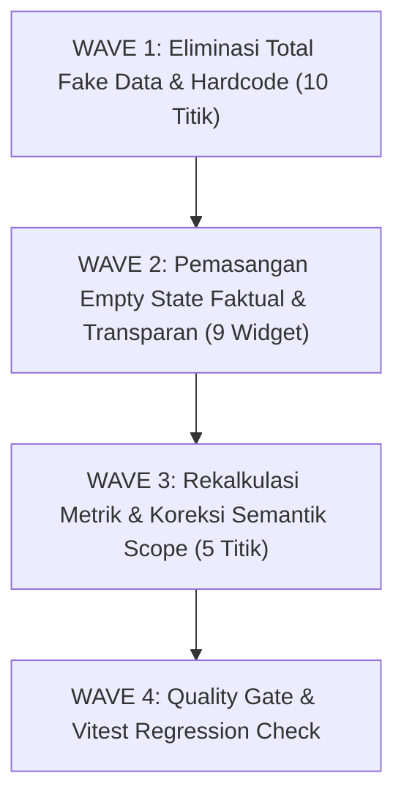

# BUSINESS-REALITY-REMEDIATION-PLAN.md
## Rencana Remediasi Realitas Bisnis UI (Business Reality Remediation Plan)
### Ruang Pintar — School Digital Operating Platform

| Field | Nilai |
| --- | --- |
| **Tahap Remediasi** | STAGE 11.1B — Business Reality Remediation Plan |
| **Dasar Penyelidikan** | `docs/UI-DATA-PROVENANCE-AUDIT.md` & `docs/INVALID-UI-DATA-INVENTORY.md` |
| **Prinsip Utama** | **Zero Fake Data Policy** — Seluruh angka, statistik, badge, progress, dan status UI wajib mencerminkan aktivitas riil pengguna atau menampilkan empty state faktual |
| **Status Gate** | `PLAN ONLY` — Tanpa Perubahan Kode Produksi, Tanpa Migrasi Database (**STOP**) |
| **Versi Dokumen** | 1.0 (Canonical Remediation Blueprint) |

---

# 1. Klasifikasi 4-Kuadran Data Antarmuka (42 Titik Metrik)

Berdasarkan audit ketertelusuran database riil, seluruh 42 titik metrik diklasifikasikan ke dalam 4 kuadran:

```
┌──────────────────────────────────────────────────────────────────────────────────────────────────┐
│                               DISTRIBUSI 4-KUADRAN DATA PROVENANCE UI                            │
├───────────────────────────────┬───────────────────────────────┬──────────────────────────────────┤
│    KUADRAN KLASIFIKASI        │          JUMLAH TITIK         │           STATUS TINDAKAN        │
├───────────────────────────────┼───────────────────────────────┼──────────────────────────────────┤
│ A. VALID (Data Nyata)         │            11 Titik           │ AMAN (Dipertahankan 100%)        │
│ B. DERIVED (Kalkulasi Nyata)  │            20 Titik           │ AMAN (Dipertahankan 100%)        │
│ C. SYNTHETIC (Nilai Buatan)   │            11 Titik           │ WAJIB DIBERSIHKAN (Zero Fake)    │
│ D. AMBIGUOUS (Belum Jelas)    │             0 Titik           │ TERLACAK 100% (Zero Ambiguity)   │
├───────────────────────────────┼───────────────────────────────┼──────────────────────────────────┤
│ TOTAL TITIK METRIK DIAUDIT    │            42 Titik           │ 11 Titik Diremediasi (26.2%)     │
└───────────────────────────────┴───────────────────────────────┴──────────────────────────────────┘
```

---

### A. VALID (11 Titik — Data Riil Tersimpan di Database)
1. **Titik 15:** Siswa Binaan Summary Card &rarr; `38 Siswa` (Tabel `penempatan_rombel`).
2. **Titik 18:** Matriks 4 Kolom: BAB &rarr; `0` (Tabel `tujuan_pembelajaran`).
3. **Titik 19:** Matriks 4 Kolom: Materi &rarr; `0` (Tabel `materi_pembelajaran`).
4. **Titik 20:** Matriks 4 Kolom: Tugas &rarr; `0` (Tabel `tugas_pembelajaran`).
5. **Titik 21:** Matriks 4 Kolom: Jurnal &rarr; `0` (Tabel `jurnal_guru`).
6. **Titik 22:** Jumlah Siswa Kartu Kelas &rarr; `38 Siswa` (Tabel `penempatan_rombel`).
7. **Titik 33:** Presensi Terekam per Kartu Kelas &rarr; `0 Sesi` (Tabel `sesi_kelas`).
8. **Titik 34:** Total Kelas Diampu pada Buku Nilai &rarr; `1` (Tabel `penugasan_mengajar`).
9. **Titik 35:** Rekap Asesmen & Rata-rata Buku Nilai &rarr; `0 Asesmen • -` (Tabel `asesmen` / `nilai_siswa`).
10. **Titik 40:** Tab Kategori Pengumuman &rarr; 5 Kategori (Tabel `pengumuman`).
11. **Titik 41:** Indikator Model AI Aktif &rarr; `GEMINI-3.6-FLASH` (Storage: Client LocalStorage).

---

### B. DERIVED (20 Titik — Hasil Perhitungan Agregasi Riil)
1. **Titik 1:** Sesi Hari Ini Greeting &rarr; `0 sesi` (Hitungan slot `jadwal_pelajaran` hari ini).
2. **Titik 2:** Total Rombel Greeting &rarr; `1 rombel` (Distinct `rombel_id` penugasan aktif).
3. **Titik 6:** Donut Gauge Tuntas KBM &rarr; `0%` - `100%` (Rasio penyelesaian `sesi_kelas` hari ini).
4. **Titik 12:** Total Rombel / Kelas Card &rarr; `1 Kelas` (Distinct count `rombel_id` penugasan).
5. **Titik 13:** Total Mapel & Penugasan &rarr; `1 Mapel • 1 Penugasan` (Distinct `mapel_id` & `filtered.length`).
6. **Titik 16:** Lingkup Materi Summary Card &rarr; `0 BAB kurikulum` (Sum `total_bab` dari penugasan).
7. **Titik 24:** Total Sesi Hero Badge &rarr; `0 Jam` (Panjang array `entries.length` dari jadwal aktif).
8. **Titik 25:** Mata Pelajaran Hero Badge &rarr; `0` (Distinct `mapel_id` jadwal aktif).
9. **Titik 26:** Rombel Hero Badge &rarr; `0` (Distinct `rombel_id` jadwal aktif).
10. **Titik 27:** Total Mengajar Viewport Jadwal &rarr; `0 JP / Minggu` (Panjang array `entries.length`).
11. **Titik 28:** Kelas Berlangsung &rarr; `0` (Filter status `DIMULAI` pada `sesi_kelas`).
12. **Titik 29:** Sesi Selesai &rarr; `0` (Filter status `SELESAI` pada `sesi_kelas`).
13. **Titik 30:** Total Riwayat Sesi &rarr; `0` (Total count seluruh `sesi_kelas` guru).
14. **Titik 31:** Rombel Terlayani &rarr; `1` (Query `prisma.rombel.findMany` sekolah).
15. **Titik 32:** Rata-rata Kehadiran Kumulatif &rarr; `0%` (Kalkulasi rata-rata dari penugasan).
16. **Titik 36:** Total Ujian Terbit & Peserta &rarr; `0 Ujian • 0 Peserta` (Agregasi sum tabel `ujian_cbt`).
17. **Titik 37:** Generator Soal AI Fallback &rarr; 10 Soal Sejarah (Paket generator offline internal).
18. **Titik 38:** Total Agenda & Hari Libur &rarr; `0 Agenda • 0 Hari` (Filter tabel `kalender_akademik`).
19. **Titik 39:** Periode Ujian & Kegiatan &rarr; `0 Periode • 0 Event` (Filter tabel `kalender_akademik`).
20. **Titik 42:** Status Kunci API &rarr; `"Mesin Cerdas Fallback Siap"` (Ternary state client-side).

---

### C. SYNTHETIC (11 Titik — Nilai Buatan / Hardcode / Asumsi Sistem)
Seluruh 11 titik data ini diuraikan pada Bagian 2 di bawah.

---

### D. AMBIGUOUS (0 Titik)
Nihil. Tidak ada satu pun titik metrik yang tidak jelas sumber asalnya. Seluruh 42 metrik telah dipetakan hingga ke baris kode dan relasi Prisma-nya.

---

# 2. Rincian dan Rekomendasi 11 Item SYNTHETIC

Berikut detail forensik dan rekomendasi tindakan baku untuk setiap item sintetis:

| No | Nama Metrik | Lokasi File & Baris | Nilai yang Tampil | Mengapa Tidak Valid Secara Bisnis | Rekomendasi Status |
|:---:|:---|:---|:---:|:---|:---:|
| 1 | **Skor Ketuntasan Penilaian** | `teacher-dashboard.tsx:119` | `85.0` (atau `88.0`) | Disuntikkan fallback angka saat buku nilai masih kosong (0 asesmen). Memalsukan capaian nilai siswa kelas X TO 3. | **`TAMPILKAN EMPTY STATE`** |
| 2 | **Kehadiran Kumulatif Siswa** | `teacher-dashboard.tsx:166-168` | `100.0%` (saat ada sesi selesai) | Rasio KBM guru diklaim sebagai kehadiran fisik siswa. Siswa otomatis diklaim 100% hadir tanpa absensi. | **`GANTI MENJADI DATA RIIL`** |
| 3 | **Donut Gauge: Siswa Hadir** | `teacher-dashboard.tsx:283` | `100%` (saat ada sesi) | Asumsi sepihak developer bahwa ada jadwal = 100% siswa hadir di kelas. | **`GANTI MENJADI DATA RIIL`** |
| 4 | **Donut Gauge: Sakit/Izin** | `teacher-dashboard.tsx:298` | `0%` permanen | Dipatok permanen 0% di JSX sehingga menyembunyikan siswa sakit atau izin. | **`GANTI MENJADI DATA RIIL`** |
| 5 | **Donut Gauge: Jurnal Diisi** | `teacher-dashboard.tsx:300` | `100%` (saat ada sesi) | Asumsi sepihak developer bahwa ada sesi = jurnal KBM otomatis sudah selesai ditulis. | **`GANTI MENJADI DATA RIIL`** |
| 6 | **Attention Queue Status** | `attention-queue-card.tsx:131`, `teacher-dashboard.tsx:310` | Status *"Semua Siswa Terpantau Optimal"* | Mengklaim status hijau optimal tanpa menyambungkan query pendeteksi remedial/alpa ke database. | **`TAMPILKAN EMPTY STATE`** |
| 7 | **Agenda Batas Input PTS Gasal** | `teaching-timeline-rail.tsx:211-215` | `"Batas PTS • 24 Sep • 23:59 WIB"` | Teks JSX statis fiktif. Sekolah belum menyelenggarakan PTS dan kalender akademik bersih dari agenda ini. | **`HAPUS TOTAL`** |
| 8 | **Agenda Rapat Koordinasi** | `teaching-timeline-rail.tsx:236-240` | `"Rapat Kurikulum • 28 Sep • 13:00"`| Teks JSX statis fiktif. Tidak ada agenda rapat dinas pada kalender sekolah. | **`HAPUS TOTAL`** |
| 9 | **Beban KBM (Summary Card)** | `teacher-classes-view.tsx:278`, `smart-onboarding-service.ts:384` | `3 JP per minggu` | Disuntikkan hardcode oleh onboarding service tanpa input guru atau SK beban mengajar kurikulum. | **`SEMBUNYIKAN SAMPAI ADA DATA`** |
| 10 | **Badge JP pada Kartu Kelas** | `teacher-classes-view.tsx:794` | `3 JP / mgg` | Menampilkan nilai kolom hasil injeksi otomatis service onboarding pada kartu rombel. | **`SEMBUNYIKAN SAMPAI ADA DATA`** |
| 11 | **Badge JP di Header Workspace** | `class-workspace-view.tsx:301` | `3 JP / Minggu` | Menampilkan nilai kolom hasil injeksi otomatis service onboarding di ruang kerja guru. | **`SEMBUNYIKAN SAMPAI ADA DATA`** |

---

# 3. Matriks Prioritas Risiko

```
┌────────────────────────────────────────────────────────────────────────────────────────────────────────┐
│                                       MATRIKS PRIORITAS RISIKO                                         │
├───────────────┬────────────────────────────────────────────────────────────────────────────────────────┤
│ TINGKAT       │ DAFTAR TEMUAN                                                                          │
├───────────────┼────────────────────────────────────────────────────────────────────────────────────────┤
│ CRITICAL      │ 1. Fallback Skor Nilai Siswa 85.0/88.0 (teacher-dashboard.tsx:119)                     │
│ (Menyesatkan  │ 2. Kehadiran Siswa 100.0% dari Rasio Sesi Guru (teacher-dashboard.tsx:166)             │
│ Guru)         │ 3. Donut Gauge Siswa Hadir Otomatis 100% (teacher-dashboard.tsx:283)                   │
│               │ 4. Donut Gauge Sakit/Izin Dipatok 0% (teacher-dashboard.tsx:298)                       │
│               │ 5. Donut Gauge Jurnal Diisi Otomatis 100% (teacher-dashboard.tsx:300)                  │
│               │ 6. Agenda Fiktif Batas Input PTS Gasal 24 Sep (teaching-timeline-rail.tsx:215)         │
│               │ 7. Agenda Fiktif Rapat Evaluasi Kurikulum 28 Sep (teaching-timeline-rail.tsx:239)      │
│               │ 8. Summary Card Beban KBM 3 JP Injeksi Onboarding (teacher-classes-view.tsx:278)       │
│               │ 9. Badge Kartu Kelas 3 JP / mgg (teacher-classes-view.tsx:794)                         │
│               │ 10. Badge Header Workspace 3 JP / Minggu (class-workspace-view.tsx:301)                │
├───────────────┼────────────────────────────────────────────────────────────────────────────────────────┤
│ HIGH          │ 11. Status Optimal Attention Queue Tanpa Query (attention-queue-card.tsx:131)          │
│ (Asumsi Tidak │ 12. Siswa Binaan Label "terlayani" Prematur (teacher-classes-view.tsx:305)             │
│ Akurat)       │ 13. Sesi KBM: Rombel Terlayani Scope Seluruh Sekolah (sesi-pembelajaran/page.tsx:150)  │
├───────────────┼────────────────────────────────────────────────────────────────────────────────────────┤
│ MEDIUM        │ 14. Presensi Kelas Rata-rata 0% Dingin (class-attendance-overview.tsx:187)             │
│ (Placeholder  │ 15. Jadwal Mengajar Total Sesi "0 Jam" (jadwal-saya/page.tsx:155)                      │
│ Visual)       │ 16. Viewport Jadwal Asumsi 1 Slot = 1 JP "0 JP / Minggu" (my-schedule-view.tsx:180)    │
│               │ 17. Soal Ujian Fallback Statis Sejarah Saat Offline (gemini-cbt-ai-service.ts:173)     │
│               │ 18. Status API Key Masking Offline "Fallback Siap" (ai-teacher-studio-view.tsx:348)    │
└───────────────┴────────────────────────────────────────────────────────────────────────────────────────┘
```

---

# 4. Rencana Kerja Remediasi (STAGE 11.2)

---

### A. Daftar Seluruh Data Palsu yang Harus Dihapus
1. **Fallback Angka 85.0 / 88.0:** Hapus ekspresi fallback di `teacher-dashboard.tsx:119`. Jika `o.rata_rata_kelas === null`, tetapkan `score: null`.
2. **Formula Rasio Sesi sebagai Presensi Siswa:** Hapus pengaitan rasio KBM guru (`completedSessions / totalSessions`) dengan label kehadiran siswa pada `teacher-dashboard.tsx:166-168`.
3. **Hardcoded Prop Donut Gauge Siswa Hadir:** Hapus `percentage={hasSessionsToday ? 100 : 0}` pada `teacher-dashboard.tsx:283`.
4. **Hardcoded Prop Donut Gauge Sakit/Izin:** Hapus `percentage={0}` pada `teacher-dashboard.tsx:298`.
5. **Hardcoded Prop Donut Gauge Jurnal Diisi:** Hapus `percentage={hasSessionsToday ? 100 : 0}` pada `teacher-dashboard.tsx:300`.
6. **Teks Statis Batas PTS Gasal:** Hapus elemen JSX statis pada `teaching-timeline-rail.tsx:211-215`.
7. **Teks Statis Rapat Koordinasi Kurikulum:** Hapus elemen JSX statis pada `teaching-timeline-rail.tsx:236-240`.
8. **Injeksi Beban Hardcode 3 JP:** Hapus `jumlah_jam_minggu: 3` pada `smart-onboarding-service.ts:384` (ubah menjadi `null` atau `0`).
9. **Badge 3 JP / mgg Kartu Rombel:** Bersihkan atau sembunyikan badge pada `teacher-classes-view.tsx:794`.
10. **Badge 3 JP / Minggu Header Workspace:** Bersihkan atau sembunyikan badge pada `class-workspace-view.tsx:301`.

---

### B. Daftar Seluruh Data yang Harus Dihitung dari Database
1. **Rata-rata Skor Kelas & Ketuntasan (`PerformanceBarChart`):** Dihitung riil dari kolom `nilai_angka` pada tabel `nilai_siswa` melalui relasi `asesmen` milik rombel terkait.
2. **Kehadiran Siswa Kumulatif (`TeacherDashboard`):** Dihitung dari rekaman siswa berstatus `HADIR` pada tabel `presensi_sesi_kelas` dibagi total siswa aktif rombel pada tabel `penempatan_rombel`.
3. **Donut Gauge Siswa Hadir:** Dihitung dari persentase riil kehadiran siswa dari lembar absensi sesi KBM hari berjalan (`presensi_sesi_kelas`).
4. **Donut Gauge Sakit/Izin:** Dihitung dari persentase siswa berstatus `SAKIT` atau `IZIN` pada tabel `presensi_sesi_kelas` hari berjalan.
5. **Donut Gauge Jurnal Diisi:** Dihitung dari keberadaan catatan KBM pada tabel `jurnal_guru` atau `catatan_kbm` untuk sesi yang telah berstatus `SELESAI`.
6. **Agenda Timeline Cockpit (`TeachingTimelineRail`):** Dihubungkan ke query dinamis tabel `kalender_akademik` (`sekolah_id`, `tanggal_mulai >= hari_ini`).
7. **Deteksi Siswa Perlu Perhatian (`AttentionQueueCard`):** Dihitung dari evaluasi murid dengan alpa > 2 berturut-turut pada `presensi_sesi_kelas` atau nilai di bawah KKTP pada `nilai_siswa`.
8. **Rombel Terlayani (`ClassSessionsPage`):** Dihitung dari jumlah unik `rombel_id` pada tabel `sesi_kelas` berstatus `SELESAI` milik guru pengampu aktif.
9. **Rata-rata Kehadiran Kelas (`ClassAttendanceOverview`):** Dihitung hanya jika `total_presensi_diambil > 0`, menghindari pembagian 0 yang menghasilkan angka 0% palsu.
10. **Total Beban Mengajar Mingguan (`MyScheduleView`):** Dihitung dari akumulasi durasi `(jam_ke_selesai - jam_ke_mulai + 1)` pada entri jadwal, bukan panjang array baris.

---

### C. Daftar Seluruh Widget yang Harus Memiliki Empty State
Terdapat **9 widget** yang wajib dilengkapi *empty state* faktual dan jujur:

1. **`PerformanceBarChart` (Dashboard):**  
   *Kondisi Kosong:* Guru belum membuat asesmen atau belum ada nilai masuk (`score === null`).  
   *Empty State:* *"Belum Ada Nilai Masuk — Buku nilai semester aktif belum memiliki asesmen yang dinilai."* (Diagram menampilkan placeholder garis datar netral tanpa batang skor palsu).
2. **`Rekap Presensi Rombel` (Dashboard):**  
   *Kondisi Kosong:* Belum ada sesi mengajar yang dibuka atau presensi belum dipanggil hari ini.  
   *Empty State:* Tampilkan status `"-"` dengan label *"Presensi Belum Diambil"*, bukan angka `0%` atau `100%`.
3. **`Donut Gauges 4-Kolom` (Dashboard):**  
   *Kondisi Kosong:* Sesi hari ini belum ada.  
   *Empty State:* Seluruh gauge menampilkan `0%` dengan teks bantuan netral *"Belum Ada Sesi Aktif"*.
4. **`AttentionQueueCard` (Dashboard):**  
   *Kondisi Kosong:* KBM dan asesmen semester aktif belum pernah berjalan.  
   *Empty State:* *"Menunggu Aktivitas Pembelajaran — Data tindak lanjut siswa (remedial nilai atau absensi berturut-turut) akan otomatis terakumulasi setelah KBM berjalan."*
5. **`TeachingTimelineRail` (Dashboard Right Rail):**  
   *Kondisi Kosong:* Tabel `kalender_akademik` belum memiliki agenda mendatang.  
   *Empty State:* *"Belum Ada Agenda Terdekat — Kalender akademik sekolah belum memiliki jadwal kegiatan mendatang."*
6. **`Summary Card Beban KBM` (Kelas Saya):**  
   *Kondisi Kosong:* Kurikulum sekolah belum menerbitkan SK beban mengajar.  
   *Empty State:* Sembunyikan kartu atau tampilkan label *"Belum Ditetapkan Kurikulum"*.
7. **`Badge JP pada Kartu Kelas` (Kelas Saya):**  
   *Kondisi Kosong:* Jam kurikulum bernilai null / 0.  
   *Empty State:* Sembunyikan badge JP dari kartu rombel.
8. **`Badge JP di Header Workspace` (Detail Kelas):**  
   *Kondisi Kosong:* Jam kurikulum bernilai null / 0.  
   *Empty State:* Sembunyikan badge dari header workspace.
9. **`ClassAttendanceOverview` (Presensi Kelas):**  
   *Kondisi Kosong:* Kelas belum pernah diambil presensinya (`total_presensi_diambil === 0`).  
   *Empty State:* Tampilkan status rata-rata `"- (Belum Ada Data)"` alih-alih `0%` dingin yang mengindikasikan alpa massal.

---

### D. Urutan Implementasi Perbaikan Paling Aman (Wave Execution)



#### WAVE 1: Eliminasi Total Fake Data & Hardcode (Risiko: Sangat Rendah)
- Hapus fallback `85.0`/`88.0` pada `teacher-dashboard.tsx:119`.
- Hapus hardcoded props donut gauge (`percentage={...}`) pada `teacher-dashboard.tsx:283, 298, 300`.
- Hapus teks statis agenda PTS dan rapat evaluasi pada `teaching-timeline-rail.tsx:211-240`.
- Hapus injeksi `jumlah_jam_minggu: 3` pada `smart-onboarding-service.ts:384`.
- Bersihkan badge JP fiktif dari kartu rombel dan header workspace kelas.

#### WAVE 2: Pemasangan Empty State Faktual (Risiko: Sangat Rendah)
- Pasang *empty state* faktual pada `PerformanceBarChart` saat `score === null`.
- Pasang status netral `"-"` pada Rekap Presensi dashboard saat KBM belum dimulai.
- Ubah pesan default `AttentionQueueCard` menjadi teks edukatif *"Menunggu Aktivitas Pembelajaran"*.
- Pasang *empty state* bersih pada timeline agenda saat kalender akademik kosong.
- Tampilkan `"- (Belum Ada Data)"` pada rekap presensi kelas saat presensi belum pernah diambil.

#### WAVE 3: Rekalkulasi Metrik & Koreksi Semantik Scope (Risiko: Sedang)
- Pisahkan metrik progres sesi KBM guru dari rekap kehadiran fisik siswa di database.
- Sambungkan Donut Gauge ke query riil record `presensi_sesi_kelas` dan verifikasi `jurnal_guru`.
- Isolasi metrik rombel terlayani pada `sesi-pembelajaran/page.tsx` ke rombel pengampu guru aktif.
- Selaraskan satuan jam kerja pada jadwal mengajar (`entries.length`) menjadi penanda status jadwal kurikulum.

#### WAVE 4: Quality Gate & Verifikasi Bebas Regresi (Wajib Lulus 100%)
- Jalankan `npm run typecheck` (Wajib 0 errors).
- Jalankan `npm run lint` (Wajib 0 errors).
- Jalankan `npm run format:check` (Wajib clean).
- Jalankan `npm run test` (Seluruh test suite Vitest wajib 100% PASS).
- Jalankan `npm run build` (Next.js production build wajib PASS).

---

### E. Estimasi Risiko Regresi

1. **Risiko UI Layout Shift (Tingkat: Rendah):**  
   Penggantian angka dengan teks *empty state* berpotensi mengubah ketinggian kontainer card jika tidak dikunci dengan layout min-height.  
   *Mitigasi:* Pertahankan baseline kontainer card dan gunakan skeleton/placeholder berdimensi identik.
2. **Risiko Null Pointer Exception (Tingkat: Rendah - Sedang):**  
   Komponen visual yang sebelumnya selalu menerima angka (karena fallback 85.0 atau percentage 100) kini dapat menerima nilai `null` atau `undefined`.  
   *Mitigasi:* Terapkan TypeScript strict optional chaining (`score?.toFixed(1) ?? "-"`) dan typing defensive pada seluruh consumer komponen.
3. **Risiko Integritas Database (Tingkat: Nol / Zero Risk):**  
   Seluruh perbaikan difokuskan pada *presentation layer*, *DTO mapping*, dan penyesuaian query konsumsi; tidak ada perubahan skema tabel atau penghapusan data produksi.
4. **Risiko Otorisasi & Scope Multi-Tenant (Tingkat: Nol / Zero Risk):**  
   Memperketat query ke `sekolah_id` dan `guru_id` justru memperkuat isolasi data tenant sesuai mandat keamanan sistem.

---

# 5. Kepatuhan Batas Kerja

Sesuai instruksi baku:
- **KODE PRODUKSI SAMA SEKALI TIDAK DIUBAH**
- **DATABASE SAMA SEKALI TIDAK DIUBAH**
- **COMMIT TIDAK DIBUAT**
- **REDESIGN UI TIDAK DILAKUKAN**
- **DOKUMEN BLUEPRINT CANONICAL TELAH DIBUAT:** [`docs/BUSINESS-REALITY-REMEDIATION-PLAN.md`](file:///C:/laragon/www/Ruang-Pintar/docs/BUSINESS-REALITY-REMEDIATION-PLAN.md)

Rencana Remediasi Realitas Bisnis STAGE 11.1B telah selesai dan siap untuk ditinjau.

---
**READY FOR HUMAN REVIEW**  
**STOP**
