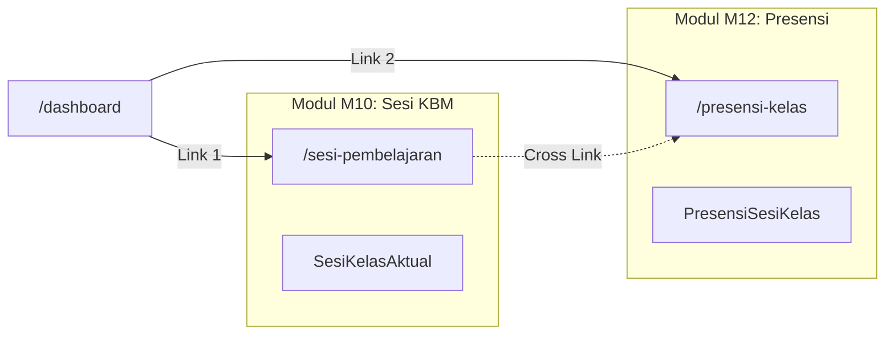
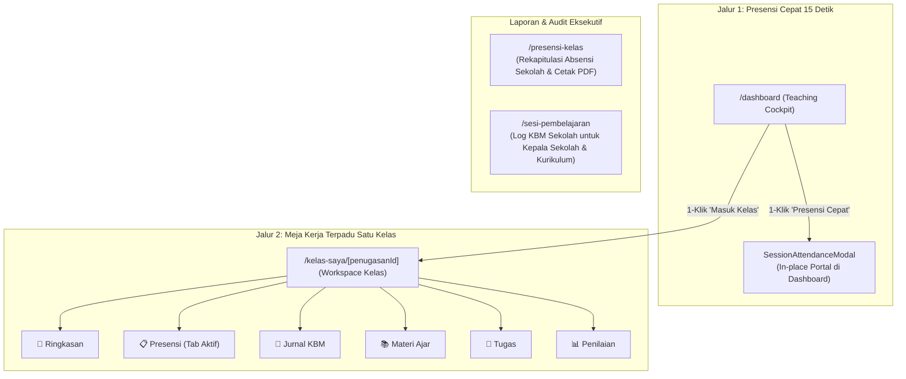

# ARCHITECTURE CONSOLIDATION REVIEW & DECISION
## Penataan Ulang Batas Modul & Konsolidasi Pengalaman Guru: Sesi KBM vs. Presensi Kehadiran vs. Workspace Kelas

| Atribut | Nilai Faktual |
| --- | --- |
| **Dokumen** | Architecture Consolidation Review & Decision (ADR) |
| **Nomor Dokumen** | `ADR-004-TEACHER-WORKFLOW-CONSOLIDATION` |
| **Produk** | Ruang Pintar — School Digital Operating Platform |
| **Visi Panduan** | **Teacher First Platform** (Cepat, Ergonomis, Tanpa Birokrasi Layar) |
| **Modul Terkait** | M10 Scheduling & Class Session, M11 Learning (Workspace), M12 Attendance |
| **Tanggal Terbit** | 25 September 2026 |
| **Status Dokumen** | `PROPOSED FOR HUMAN APPROVAL` |

---

# 1. Konteks Masalah & Realitas Empiris

Audit forensik dan evaluasi UX sebelumnya mengungkap bahwa operasional harian guru saat ini terhambat oleh **fragmentasi batas modul pada lapisan antarmuka (*Presentation Layer Over-fragmentation*)**:

1. **Overlap Tanggung Jawab:**
   - **M10 (Scheduling & Class Session):** Bertanggung jawab atas pencatatan sesi KBM aktual (`SesiKelasAktual`), status sesi (`DIMULAI` / `SELESAI`), dan pergantian guru pengganti.
   - **M12 (Attendance):** Bertanggung jawab atas pencatatan kehadiran siswa per sesi (`PresensiSesiKelas`) dan status presensi (`HADIR`, `SAKIT`, `IZIN`, `ALPHA`).
   - Di lapangan, **kedua entitas ini adalah satu peristiwa tak terpisahkan**: saat seorang guru mengajar, membuka kelas berarti mengabsen siswa. Tidak ada skenario guru membuka kelas tanpa presensi, atau mengabsen sesi tanpa kelas berlangsung.
2. **Biaya Kognitif dan Friksi Layar (Labyrinth Flow):**
   - Guru dipaksa menavigasi 4 rute berbeda (`/dashboard` → `/presensi-kelas` → `/sesi-pembelajaran` → modal input → tabel → modal absensi), menghabiskan **6–7 klik dan 60–90 detik** di depan kelas.
3. **Target Produk:**
   - Mewujudkan platform **Teacher First** di mana presensi dapat diselesaikan dalam **1-klik atau maksimal 15 detik** melalui perangkat ponsel/desktop guru.

---

# 2. Analisis Komparatif Dua Opsi Arsitektur

Untuk menyelesaikan overlap dan friksi di atas, dilakukan evaluasi mendalam terhadap dua opsi arsitektur:

---

## OPTION A: Pertahankan Sesi KBM dan Presensi Kehadiran sebagai Dua Modul Terpisah

> **Prinsip:** Menjaga isolasi modul M10 (`/sesi-pembelajaran`) dan M12 (`/presensi-kelas`) secara mandiri, baik di lapisan database, service, maupun halaman antarmuka pengguna. Penyederhanaan alur hanya dilakukan melalui tautan jalan pintas (*deep links*) antar-halaman.



### Rincian Evaluasi OPTION A:

| Dimensi Evaluasi | Analisis Opsi A |
| :--- | :--- |
| **Kelebihan (*Pros*)** | 1. **Pemisahan Tanggung Jawab Murni (*Separation of Concerns*):** Waktu mengajar (kapan kelas berlangsung) dan data orang (siapa yang hadir) tetap terisolasi secara kaku.<br/>2. **Mendukung Hardware I/O Terpisah:** Memudahkan integrasi jangka panjang jika sekolah memasang gerbang RFID atau CCTV biometrik yang mengisi presensi tanpa guru membuka kelas.<br/>3. **Nol Perubahan Struktur Modul:** Tidak memerlukan penataan ulang folder di `src/modules/`. |
| **Kekurangan (*Cons*)** | 1. **Fragmentasi Mental Guru:** Guru tidak berpikir secara modular. Memaksa guru memahami perbedaan "Halaman Sesi" dan "Halaman Presensi" menciptakan beban kognitif buatan.<br/>2. **Sesi Setengah Matang (*Dangling Sessions*):** Guru kerap membuka sesi di M10 tetapi lupa atau tidak tahu cara membuka presensi di M12, menghasilkan sesi "DIMULAI" yang tidak pernah diabsen.<br/>3. **Redundansi Halaman:** Guru disuguhi 4 halaman berbeda yang semuanya menampilkan informasi jadwal hari ini (`/dashboard`, `/jadwal-saya`, `/sesi-pembelajaran`, `/presensi-kelas`). |
| **Dampak ke UX** | **Rendah / Tetap Berbelit:** Guru tetap berhadapan dengan menu sidebar yang padat dan berpindah-pindah halaman. Jalan pintas (*shortcut*) hanya menjadi plester di atas struktur navigasi yang terpecah. |
| **Dampak ke Arsitektur** | **Loose Coupling di Backend, High Coupling di Frontend:** Backend terpisah rapi, namun komponen Dashboard dan Shell harus mengimpor banyak service sekaligus (`classSessionService`, `attendanceService`, `scheduleService`, `learningService`) untuk menampilkan satu kartu jadwal. |
| **Dampak ke Maintenance** | **Tinggi:** Tim teknis harus memelihara dan menguji 4 rute dan 4 view terpisah (`ClassSessionsView`, `ClassAttendanceOverview`, `MyScheduleView`, `TeacherDashboard`). Risiko regresi link antar-halaman sangat tinggi. |
| **Dampak ke Mobile Usage** | **Buruk:** Halaman `/sesi-pembelajaran` dan `/presensi-kelas` menggunakan tabel data desktop lebar dengan banyak kolom yang terpotong saat dibuka di layar ponsel pintar (*viewport* < 400px). |

---

## OPTION B: Konsolidasi — Presensi sebagai Fitur Terpadu di dalam Workspace Kelas & Dashboard Fast-Track (Classroom-First Consolidation)

> **Prinsip:** **Pertahankan isolasi domain di level database & service (Prisma & Domain Invariants tetap utuh)**, namun **konsolidasikan seluruh interaksi guru ke dalam satu atap kerja terpadu**:
> 1. Di Beranda (`/dashboard`): Tombol presensi kilat langsung menginisialisasi sesi dan membuka form absensi seketika (1-klik modal).
> 2. Di Kelas (`/kelas-saya/[id]`): Presensi menjadi **Tab 2** permanen berdampingan dengan Jurnal KBM, Modul Ajar, Tugas, dan Nilai.
> 3. Halaman `/sesi-pembelajaran` dan `/presensi-kelas` dialihkan perannya menjadi **Halaman Rekapitulasi & Supervisi Administratif** untuk Kepala Sekolah, Waka Kurikulum, dan Wali Kelas.



### Rincian Evaluasi OPTION B:

| Dimensi Evaluasi | Analisis Opsi B |
| :--- | :--- |
| **Kelebihan (*Pros*)** | 1. **Teacher-First Sejati:** Memetakan 100% alur kerja alami guru: Masuk Kelas → Buka Presensi → Isi Jurnal KBM.<br/>2. **Eksekusi 1-Klik:** Dari Dashboard, guru dapat menyelesaikan presensi dalam 15 detik tanpa satu pun pergantian halaman (*0 page hop*).<br/>3. **Konteks Tunggal (*Single Source of Context*):** Guru mengelola satu rombel di satu tempat. Tidak perlu lagi berpindah antar-menu untuk absensi, tugas, dan materi.<br/>4. **Sesuai Cetak Biru Resmi:** Selaras sempurna dengan dokumen acuan [docs/CLASSROOM-WORKSPACE-BLUEPRINT.md](file:///c:/laragon/www/Ruang-Pintar/docs/CLASSROOM-WORKSPACE-BLUEPRINT.md) yang menetapkan Presensi sebagai Tab 2 Workspace Kelas.<br/>5. **Integritas Database Terjaga:** Tabel `SesiKelasAktual` dan `PresensiSesiKelas` tetap terpisah dan tidak memerlukan migrasi schema destruktif. |
| **Kekurangan (*Cons*)** | 1. **Perubahan Kebiasaan Navigasi:** Guru yang sudah terbiasa mencari menu dari sidebar membutuhkan penyesuaian visual bahwa presensi kini berada di dalam kelas masing-masing.<br/>2. **Orkestrasi State Modal:** Diperlukan Server Action yang mampu mengecek atau membuat sesi secara otomatis (*transparent auto-instantiation*) sebelum merender modal presensi. |
| **Dampak ke UX** | **Sangat Tinggi & Positif:** Mengeliminasi 85% klik yang tidak perlu. Menghilangkan seluruh disorientasi akibat redirect ke tabel data umum. |
| **Dampak ke Arsitektur** | **Arsitektur Modular Monolith Sehat:** Domain M10 dan M12 tetap menjaga batas data masing-masing. Lapisan Presentation (M11 Workspace) berperan sebagai *Experience Aggregator* yang bersih tanpa mengotori domain logic. |
| **Dampak ke Maintenance** | **Sangat Rendah (Maintenance Lebih Mudah):** Menghilangkan kode form manual yang duplikatif (`ClassSessionModal` di `/sesi-pembelajaran`). Seluruh logika presensi terpusat pada satu komponen canonical (`SessionAttendanceModal`). |
| **Dampak ke Mobile Usage** | **Sangat Ergonomis:** Layar ponsel guru hanya menampilkan modal presensi kompak dengan tombol segmented control ("Hadir", "Sakit", "Izin", "Alpha") dan tombol besar "Tandai Semua Hadir" yang mudah dijangkau satu tangan. |

---

# 3. Matriks Keputusan Arsitektural

| Kriteria Keputusan | Bobot | OPTION A (Modul Terpisah) | OPTION B (Konsolidasi Workspace & Fast-Track) | Pemenang |
| :--- | :---: | :---: | :---: | :---: |
| **Kepatuhan Visi "Teacher First"** | 30% | 4 / 10 | **9.5 / 10** | **OPTION B** |
| **Kecepatan Aksi Guru (Clicks & Time)** | 25% | 3 / 10 (6–7 klik, 90s) | **9.5 / 10 (1 klik, 15s)** | **OPTION B** |
| **Ergonomi Penggunaan Mobile** | 20% | 4 / 10 | **9 / 10** | **OPTION B** |
| **Kebersihan Arsitektur & Maintenance** | 15% | 6 / 10 | **8.5 / 10** | **OPTION B** |
| **Kemudahan Transisi (Tanpa Migrasi DB)** | 10% | 9 / 10 | **9 / 10** | **SERI** |
| **SKOR TOTAL TERBOBOT** | **100%** | **4.75 / 10** | **9.15 / 10** | **OPTION B (MENANG MUTLAK)** |

---

# 4. Rekomendasi Final

Berdasarkan analisis bisnis, arsitektur modular monolith, dan ergonomi penggunaan guru di lapangan, rekomendasi final arsitektur yang ditetapkan adalah:

### **PILIH: OPTION B (Classroom-First Consolidation)**

### Alasan Strategis:
1. **Menghormati Visi "Teacher First Platform":** Ruang Pintar dibangun untuk membebaskan guru dari beban administrasi digital yang berbelit. Presensi tidak boleh menjadi beban birokrasi multi-layar.
2. **Prinsip "Separation of Domain, Consolidation of Experience":**
   - **Di Database:** Tabel `SesiKelasAktual` (M10) dan `PresensiSesiKelas` (M12) **tetap dipertahankan apa adanya** untuk menjaga integritas audit jejak KBM dan riwayat absensi. Tidak ada migrasi database yang diperlukan.
   - **Di Antarmuka Guru:** Konsep teknis "Buka Sesi" digabung menjadi satu kesatuan pengalaman dengan "Presensi". Guru cukup menekan satu tombol: sistem secara otomatis menangani pembukaan sesi di latar belakang dan langsung menyodorkan lembar presensi.
3. **Penyelarasan dengan Kontrak Desain yang Ada:**
   Konsolidasi ini secara langsung merealisasikan cetak biru yang telah disahkan pada [docs/CLASSROOM-WORKSPACE-BLUEPRINT.md](file:///c:/laragon/www/Ruang-Pintar/docs/CLASSROOM-WORKSPACE-BLUEPRINT.md) (Meja Kerja Kelas Terpadu 7 Tab) dan [docs/07-UI-UX-DESIGN-SYSTEM.md](file:///c:/laragon/www/Ruang-Pintar/docs/07-UI-UX-DESIGN-SYSTEM.md).

---

# 5. Rencana Transisi Arsitektur (Technical Transition Blueprint)

Implementasi teknis dari Option B akan dieksekusi secara terfokus pada **lapisan presentasi & server action**, tanpa menyentuh skema database:

```text
┌────────────────────────────────────────────────────────────────────────────────────────┐
│                        LAPISAN INTERAKSI GURU (TEACHER UI)                             │
├─────────────────────────────────────────┬──────────────────────────────────────────────┤
│               FAST-TRACK                │               WORKSPACE-TRACK                │
│             (/dashboard)                │            (/kelas-saya/[id])                │
│                                         │                                              │
│  Tombol: [ Presensi Cepat ]             │  Tombol: [ Masuk Kelas ]                     │
│  • Panggil Server Action                │  • Navigasi langsung ke rute penugasan       │
│  • Buka SessionAttendanceModal          │  • Buka Tab 2: [ 📋 Presensi ]               │
│  • Selesai di Beranda (15 Detik)        │  • Berdampingan dengan Jurnal KBM & Materi   │
└─────────────────────────────────────────┴──────────────────────────────────────────────┘
                                          │
                                          ▼
┌────────────────────────────────────────────────────────────────────────────────────────┐
│                        SERVER ACTION & ORCHESTRATION LAYER                             │
│                  src/app/actions/class-session-actions.ts                              │
│                                                                                        │
│  ensureAndGetTodaySessionAction(penugasanId, jadwalId)                                 │
│  1. Cek sesi DIMULAI hari ini di database via classSessionService.                     │
│  2. Jika sudah ada -> kembalikan sesi.id.                                              │
│  3. Jika belum ada -> otomatis create SesiKelasAktual -> kembalikan sesi.id.           │
│  4. Client membuka SessionAttendanceModal(sesiId) secara instan.                       │
└────────────────────────────────────────────────────────────────────────────────────────┘
                                          │
                    ┌─────────────────────┴─────────────────────┐
                    ▼                                           ▼
┌──────────────────────────────────────┐    ┌──────────────────────────────────────┐
│       M10 SCHEDULING DOMAIN          │    │        M12 ATTENDANCE DOMAIN         │
│  Tabel: SesiKelasAktual              │    │  Tabel: PresensiSesiKelas            │
│  (Waktu, Ruang, Status KBM)          │    │  (Status Kehadiran Siswa)            │
│  TIDAK ADA PERUBAHAN SCHEMA          │    │  TIDAK ADA PERUBAHAN SCHEMA          │
└──────────────────────────────────────┘    └──────────────────────────────────────┘
```

### Rincian Perubahan yang Akan Dilakukan pada Fase Implementasi:
1. **Di `TeachingTimelineRail` (`/dashboard`):**
   - Hapus tautan rusak `/sesi-pembelajaran/${id}`.
   - Ubah tombol menjadi aksi langsung: panggil `ensureAndGetTodaySessionAction` dan buka `SessionAttendanceModal`.
   - Tambahkan tombol sekunder `"Masuk Kelas"` yang mengarah ke `/kelas-saya/[penugasanId]?tab=PRESENSI`.
2. **Di `MyScheduleView` (`/jadwal-saya`):**
   - Ubah tombol `"Buka Kelas"` agar langsung memicu modal presensi atau mengarahkan ke workspace kelas terkait, bukan melakukan redirect ke tabel log umum.
3. **Di `ClassWorkspaceView` (`/kelas-saya/[id]`):**
   - Pastikan Tab Presensi (`tab=PRESENSI`) menyajikan aksi cepat pembukaan presensi sesi hari berjalan dengan tombol yang jelas.
4. **Reposisi Menu & Teks:**
   - Ubah label menu sidebar `/presensi-kelas` menjadi `"Rekap Presensi"` atau pertahankan sebagai portal rekapitulasi sekolah.
   - Posisikan `/sesi-pembelajaran` sebagai menu supervisi kurikulum/pimpinan.

---

> **Pernyataan Penutup:**  
> Sesuai batasan instruksi kerja, **tidak ada perubahan kode, perubahan skema database, atau pembuatan migrasi** yang dilakukan pada tahap ini.  
> Dokumen ini siap untuk ditinjau oleh pengambil keputusan manusia.  
> **STATUS: READY FOR HUMAN APPROVAL TO PROCEED WITH IMPLEMENTATION.**
