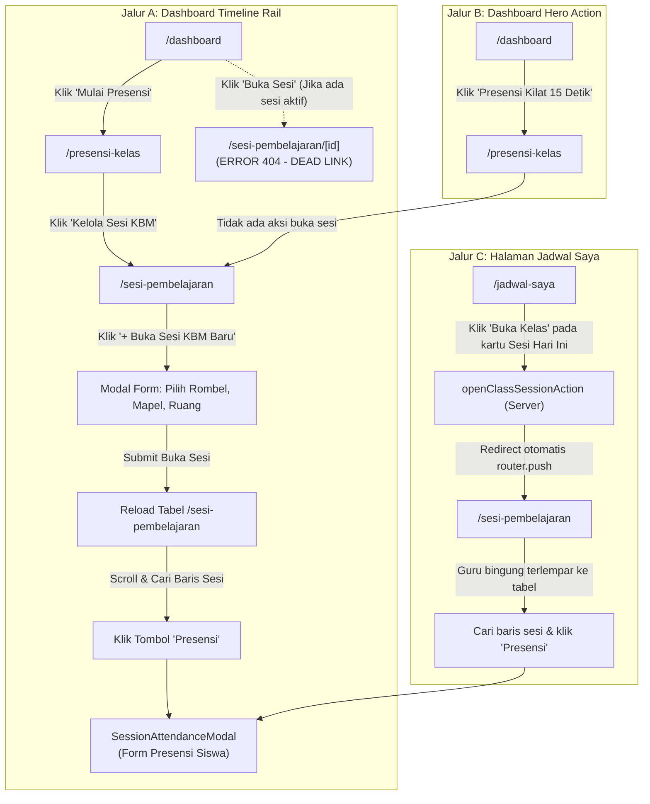

# BUSINESS UX REVIEW — TEACHER WORKFLOW SIMPLIFICATION
## Audit & Rekomendasi Penyederhanaan Alur Operasional Guru (Dashboard → Presensi)

| Atribut | Nilai Faktual |
| --- | --- |
| **Dokumen** | Business UX Review & Workflow Simplification |
| **Kode Dokumen** | `RP-UXR-2026-09-01` |
| **Produk** | Ruang Pintar — School Digital Operating Platform |
| **Sasaran Pengguna** | Guru Mata Pelajaran (`TEACHER`) & Guru Kelas |
| **Fokus Area** | Alur Presensi Harian, Jadwal Mengajar, Sesi KBM, dan Workspace Kelas |
| **Tanggal Audit** | 25 September 2026 |
| **Status Dokumen** | `PROPOSED FOR HUMAN APPROVAL` |

---

# 1. Ringkasan Eksekutif & Latar Belakang Bisnis

Dalam operasional harian sekolah, **pencatatan presensi kehadiran siswa di awal jam pelajaran adalah aktivitas berfrekuensi tertinggi dengan toleransi waktu terketat**. Guru rata-rata hanya memiliki jendela waktu 2–5 menit saat pergantian jam pelajaran sebelum memulai aktivitas belajar-mengajar efektif.

Berdasarkan audit empiris terhadap codebase dan database Ruang Pintar yang sedang berjalan, alur navigasi guru saat ini mengalami **fragmentasi arsitektural multi-halaman (labyrinth flow)** yang memaksa guru melakukan 5 hingga 6 interaksi layar:
```text
[Dashboard] → [Mulai Presensi] → [Presensi Kehadiran] → [Kelola Sesi KBM] → [Buka Kelas (Modal Form)] → [Cari Baris Sesi di Tabel] → [Form Presensi Siswa]
```

Alur yang panjang ini bertentangan dengan prinsip bisnis Ruang Pintar: **"Presensi Kilat 15 Detik"** dan **"Classroom-First Operating System"**. Guru yang mengajar menggunakan perangkat bergerak (*smartphone* / tablet) di depan kelas menghadapi friksi tinggi, kebingungan navigasi (*navigation fatigue*), dan risiko kesalahan input.

Tinjauan ini menyajikan analisis mendalam atas kondisi alur saat ini (*Current Flow*), rincian titik friksi (*Pain Points*), perancangan alur target yang disederhanakan (*Proposed Flows*), analisis dampak bisnis (*Impact Analysis*), serta mitigasi risiko implementasi (*Implementation Risks*).

---

# 2. Audit Alur Saat Ini (Current Flow Analysis)

Saat ini, guru yang berniat melakukan presensi kelas hari ini dapat menempuh 3 jalur berbeda di dalam aplikasi, namun ketiganya menemui hambatan navigasi yang substansial:



### Rincian Langkah Jalur Utama (Jalur A):
1. **Langkah 1 (`/dashboard`):** Guru membuka aplikasi, melihat kartu jadwal hari ini pada kolom linimasa kanan (*Teaching Timeline Rail*). Tombol bertuliskan `"Mulai Presensi"` (atau `"Buka Sesi"` jika sesi sudah berstatus DIMULAI).
2. **Langkah 2 (`/presensi-kelas`):** Guru mengklik `"Mulai Presensi"`, browser melakukan navigasi penuh ke halaman `/presensi-kelas` (*Class Attendance Overview*). Halaman ini menampilkan rekapitulasi persentase kehadiran sekolah dan tabel sesi yang sudah lewat. Di sini **tidak ada kontrol atau form untuk memulai sesi dari jadwal hari ini**.
3. **Langkah 3 (`/sesi-pembelajaran`):** Guru membaca tombol jalan pintas di kanan atas `/presensi-kelas` bertuliskan `"Kelola Sesi KBM"`, lalu mengkliknya dan berpindah ke rute `/sesi-pembelajaran`.
4. **Langkah 4 (Modal Form `ClassSessionModal`):** Guru melihat tabel administrasi sesi KBM. Guru harus mengklik tombol `"+ Buka Sesi KBM Baru"`. Sebuah modal terbuka, mewajibkan guru memilih kembali dropdown rombel, dropdown penugasan/mapel, mengisi topik pembelajaran, dan ruangan (padahal data ini sudah ada di jadwal hari ini).
5. **Langkah 5 (Pencarian Baris):** Guru menekan tombol submit modal. Halaman me-revalidate data. Guru harus memindai tabel untuk menemukan baris sesi yang baru saja dibuat.
6. **Langkah 6 (Form Presensi Siswa):** Guru menekan tombol aksi kecil `"Presensi"` pada baris tabel tersebut, yang akhirnya memicu pop-up `SessionAttendanceModal`.

**Total Interaksi:** 5 kali pergantian konteks layar, 6–7 klik, durasi rata-rata 60–90 detik.

---

# 3. Identifikasi Masalah & Titik Friksi (Pain Points)

### 3.1. Halaman yang Redundan dalam Alur Harian Guru
1. **Halaman `/sesi-pembelajaran` sebagai Perantara:**
   Halaman ini secara arsitektur dirancang sebagai log data master (CRUD) sesi pembelajaran tingkat modul M10. Bagi guru yang berada di kelas, halaman ini adalah penghalang (*roadblock*) karena guru tidak membutuhkan tabel log seluruh riwayat sesi sekolah hanya untuk mengabsen siswa hari ini.
2. **Halaman `/presensi-kelas` sebagai Gerbang Buntu:**
   Halaman ini berfungsi sebagai halaman rekapitulasi monitoring (M12). Menjadikannya tujuan klik pertama dari tombol `"Mulai Presensi"` di Dashboard merupakan miskoneksi UX karena halaman tersebut tidak menyediakan mekanisme pembukaan sesi dari jadwal mengajar.

### 3.2. Klik dan Input yang Tidak Perlu
1. **Pengisian Formulir Berulang (*Data Re-entry*):**
   Pada kartu linimasa dashboard, sistem sudah mengetahui secara presisi bahwa saat ini adalah jam mengajar **Kelas X DKV 1**, mata pelajaran **Koding dan Kecerdasan Artifisial**, jam **06:30 – 07:50 WIB**. Namun alur saat ini mewajibkan guru memilih ulang kelas dan mata pelajaran pada dropdown `ClassSessionModal`.
2. **Pencarian Baris Tabel Manual (*Visual Scanning Friction*):**
   Setelah sesi dibuat, guru terlempar ke dalam tabel dan harus mencari baris kelasnya di antara puluhan baris sesi guru lain atau sesi masa lalu.
3. **Multi-Step Modal:**
   Guru harus membuka modal pembukaan sesi terlebih dahulu, menutupnya, lalu membuka modal presensi terpisah.

### 3.3. Redirect yang Membingungkan (*Disorienting Redirects*)
1. **Critical Bug 404 pada Dashboard:**
   Saat sesi kelas hari ini sudah dibuka, tombol pada `TeachingTimelineRail` mengarahkan ke `/sesi-pembelajaran/${activeBlock.actualSessionId}`. Karena rute dinamis ini tidak ada dalam codebase, guru langsung disambut layar 404 Not Found.
2. **Redirect Tanpa Konteks dari `/jadwal-saya`:**
   Pada `/jadwal-saya`, tombol `"Buka Kelas"` memanggil `openClassSessionAction` lalu melakukan `router.push('/sesi-pembelajaran')`. Guru tidak diarahkan ke lembar presensi, melainkan ke tabel log umum, sehingga guru mengira aksinya gagal atau bingung apa langkah selanjutnya.

---

# 4. Rancang Alur Baru (Proposed Flow Architecture)

Untuk mewujudkan pengalaman guru modern bertaraf dunia (*Academic Glass UI*), alur kerja disederhanakan menjadi **dua jalur terpadu yang saling melengkapi** dengan mematuhi prinsip:
* **Teacher-First:** Prioritaskan kecepatan eksekusi di ruang kelas nyata.
* **Minimum Click:** Maksimal 1–2 klik dari beranda menuju lembar absensi.
* **Direct Action:** Sistem otomatis membuat record sesi aktual di latar belakang saat tombol presensi ditekan.
* **Mobile-Friendly:** Responsif di layar ponsel guru tanpa tabel horizontal yang terpotong.

---

## 4.1. Jalur Target 1: Fast-Track / Express Direct Action (Selesai 15 Detik)
> **Gunakan saat:** Guru berdiri di depan kelas dan ingin langsung mengabsen siswa secepat mungkin tanpa membuka fitur lain.

```text
[ DASHBOARD GURU ]
  │
  ├─ Sesi Hari Ini Aktif: "X DKV 1 • KKA (06:30 - 07:50)"
  │
  ▼  (1-KLIK LANGSUNG)
[ Tombol: "Presensi Cepat" ] 
  │
  ├─ 1. Sistem memeriksa apakah sesi aktual sudah ada hari ini.
  ├─ 2. Jika belum, otomatis buat SesiKelasAktual (Status: DIMULAI) via Server Action.
  │
  ▼  (POP-UP SEKETIKA TANPA PINDAH HALAMAN)
[ SessionAttendanceModal (Form Presensi Siswa) ]
  │
  ├─ Klik "Tandai Semua Hadir" (1-Klik)
  ├─ Ubah siswa yang Sakit / Izin (1-Klik per siswa)
  │
  ▼
[ Tombol: "Simpan Presensi" ]
  │
  ▼
Kembali ke Dashboard dengan Status Sesi Berubah Hijau ("Aktif / Berlangsung")
```

### Keunggulan Jalur 1:
* **0 Pergantian Halaman:** Guru tetap berada di Dashboard; modal presensi muncul seketika menggunakan portal React.
* **1 Klik Menuju Form:** Dari Dashboard langsung berhadapan dengan daftar nama siswa kelas tersebut.
* **Waktu Eksekusi:** Dapat diselesaikan dalam waktu kurang dari 15 detik.

---

## 4.2. Jalur Target 2: Classroom Workspace Track (Meja Kerja Kelas Terpadu)
> **Gunakan saat:** Guru ingin mengajar secara komprehensif (mengabsen, membuka materi ajar, mencatat jurnal KBM, atau memberikan tugas).

```text
[ DASHBOARD GURU ]
  │
  ├─ Sesi Hari Ini: "X DKV 1 • KKA"
  │
  ▼  (1-KLIK LANGSUNG)
[ Tombol: "Masuk Kelas" ]
  │
  ▼  (NAVIGASI PRESISI DENGAN PARAMETER TAB)
[ /kelas-saya/[penugasanId]?tab=PRESENSI ]
  │
  ├─ Header Kelas: Identitas Rombel, Jam Berjalan, Status Sesi KBM
  ├─ Tab Aktif Langsung pada: [ 📋 Presensi ]
  │    ├─ Widget Presensi Sesi Hari Ini
  │    ├─ Tombol Aksi Cepat "Buka Lembar Presensi"
  │    └─ Rekapitulasi Kehadiran Siswa Rombel Ini
  │
  └─ Tab Pendamping Berada di Bilah yang Sama:
       [ 📌 Ringkasan ] [ 📋 Presensi ] [ 📖 Jurnal KBM ] [ 📚 Materi ] [ 📝 Tugas ] [ 📊 Penilaian ]
```

### Keunggulan Jalur 2:
* **Konteks Utuh:** Guru masuk ke meja kerja rombel spesifik tanpa disuguhi data rombel lain.
* **Alur Mengajar Lengkap:** Setelah presensi selesai, guru cukup menggeser ke tab `[ 📖 Jurnal KBM ]` untuk mencatat materi hari ini tanpa meninggalkan halaman.
* **Menghilangkan Halaman Redundan:** Guru tidak perlu lagi membuka `/sesi-pembelajaran` atau `/presensi-kelas`.

---

## 4.3. Matriks Perbandingan Alur (Current vs. Proposed)

| Aspek | Alur Saat Ini (*Current Flow*) | Alur Cepat Target (*Fast-Track*) | Alur Meja Kerja Target (*Workspace-Track*) |
| :--- | :--- | :--- | :--- |
| **Langkah Navigasi** | Dashboard → Presensi → Sesi KBM → Modal Buka Sesi → Tabel Sesi → Form Presensi | Dashboard → Form Presensi | Dashboard → Workspace Kelas (Tab Presensi) |
| **Jumlah Klik** | **5 – 7 Klik** | **1 Klik** | **1 Klik** |
| **Perpindahan Rute (Page Hops)** | 2 kali navigasi (`/presensi-kelas`, `/sesi-pembelajaran`) | **0 kali (In-place Modal)** | 1 kali navigasi langsung (`/kelas-saya/[id]`) |
| **Form Input Tambahan** | Wajib input rombel & mapel pada modal | **Nol (Data diambil dari jadwal)** | **Nol (Data otomatis dari jadwal)** |
| **Responsivitas Mobile** | Buruk (tabel data horizontal lebar) | **Sangat Baik (Mobile Dense Sheet)** | **Sangat Baik (Tab Horisontal Mobile)** |
| **Estimasi Waktu Guru** | 60 – 90 detik | **10 – 15 detik** | **15 – 25 detik** |

---

## 4.4. Reposisi Halaman Pendukung

Agar tidak terjadi tumpang tindih fungsi di masa depan, peranan halaman yang sebelumnya membingungkan ditata ulang:

1. **Halaman `/kelas-saya/[id]` (Workspace Kelas Terpadu):**
   * **Menjadi:** Pusat utama interaksi pembelajaran guru untuk satu penugasan rombel (Presensi, Jurnal KBM, Modul Ajar, Tugas, Nilai, CBT).
   * **Aksesibilitas:** Menjadi target utama tombol `"Masuk Kelas"` dari Dashboard dan menu navigasi.
2. **Halaman `/presensi-kelas`:**
   * **Menjadi:** Halaman audit & rekapitulasi kehadiran (bukan tempat memulai presensi harian). Digunakan guru untuk melihat rekapitulasi semester, persentase absensi akumulatif, dan ekspor laporan ke format cetak/PDF.
3. **Halaman `/sesi-pembelajaran`:**
   * **Menjadi:** Log audit KBM sekolah untuk Kepala Sekolah, Wakil Kepala Sekolah bidang Kurikulum, dan Guru Piket guna memantau keterlaksanaan jam belajar riil di seluruh kelas secara terpusat.
4. **Halaman `/jadwal-saya`:**
   * **Menjadi:** Kalender jadwal pelajaran personal. Tombol `"Buka Kelas"` pada jadwal hari berjalan langsung membuka modal presensi secara instan atau mengarahkan ke `/kelas-saya/[id]?tab=PRESENSI`.

---

# 5. Analisis Dampak Bisnis (Impact Analysis)

### 5.1. Dampak terhadap Efisiensi & Kepuasan Pengguna Guru
* **Eliminasi Friction Time:** Pengurangan durasi administratif hingga 80% per sesi kelas. Bagi guru yang mengajar 4 sesi sehari, waktu yang dihemat mencapai 5–10 menit per hari kerja.
* **Peningkatan Kepatuhan Presensi:** Semakin sedikit klik yang dibutuhkan, semakin tinggi kepatuhan guru untuk mencatat presensi tepat waktu di awal jam pelajaran (*real-time compliance*).
* **Kepuasan Mobile:** Guru tidak lagi merasa frustrasi saat mengoperasikan aplikasi melalui ponsel di depan kelas.

### 5.2. Dampak terhadap Bisnis & Nilai Jual SaaS Ruang Pintar
* **Diferensiasi Produk yang Kuat:** Alur "Presensi 1-Klik dari Beranda" menjadi nilai jual utama (*killer feature*) saat demo produk kepada pimpinan yayasan atau kepala sekolah.
* **Pencegahan Churn Pengguna:** Alur administrasi yang rumit adalah alasan nomor satu penolakan digitalisasi oleh guru-guru senior di sekolah mitra. Alur sederhana mempermudah proses *onboarding*.

### 5.3. Dampak terhadap Kualitas Data & Arsitektur
* **Pencegahan Sesi Yatim (*Orphaned Sessions*):** Karena sesi di-instansiasi langsung dari data alokasi jadwal resmi (`jadwal_pelajaran_id` dan `slot_waktu_id` terisi otomatis), data analitik sekolah terbebas dari sesi-sesi ad-hoc tanpa penugasan valid.
* **Penurunan Beban Query Database:** Menghilangkan navigasi berantai mengurangi query pembacaan tabel riwayat sesi yang berat saat pergantian jam sibuk pagi hari.

---

# 6. Risiko Implementasi & Strategi Mitigasi

| No | Risiko Potensial | Tingkat Risiko | Dampak | Strategi Mitigasi Terbukti |
| :--- | :--- | :---: | :--- | :--- |
| **1** | **Race Condition / Duplikasi Sesi saat Klik Cepat:** Guru mengklik tombol "Presensi Cepat" berkali-kali secara cepat sehingga membuat beberapa record sesi bersamaan. | Sedang | Database mencatat sesi ganda pada jam yang sama. | Gunakan pengecekan idempotensi yang sudah ada di `classSessionService.openSession` (baris 49–62) dengan constraint unique check pada rentang hari yang sama, serta tambahkan `useTransition` / disabled state pada tombol client. |
| **2** | **Kebutuhan Parameter Sesi pada Modal Presensi:** `SessionAttendanceModal` membutuhkan `sesiId` aktif agar dapat memuat daftar kehadiran. | Tinggi | Modal tidak dapat terbuka jika sesi belum berstatus `DIMULAI`. | Buat Server Action terpadu `ensureAndGetTodaySessionAction(penugasanId, jadwalId)` yang mengecek atau menginisialisasi sesi terlebih dahulu secara transaksional, lalu mengembalikan `sesiId` ke modal tanpa reload. |
| **3** | **Sesi di Luar Jadwal Resmi (Kelas Pengganti / Jam Tambahan):** Guru ingin mengabsen kelas tambahan di luar jadwal mingguan resmi. | Rendah | Guru tidak menemukan tombol pada linimasa jadwal. | Sediakan tombol alternatif "Buka Sesi Tambahan / Mandiri" pada halaman `/kelas-saya/[id]` di bawah tab Presensi. |
| **4** | **Kebiasaan Navigasi Guru Lama:** Guru yang sudah terbiasa mencari menu melalui bilah samping (*sidebar*). | Rendah | Guru kebingungan mencari tombol presensi. | Pertahankan tautan navigasi standar di sidebar, namun arahkan `/presensi-kelas` untuk menyediakan kartu tindakan cepat yang membawa guru ke kelas aktif masing-masing. |

---

# 7. Rekomendasi Langkah Implementasi (Tahap Selanjutnya)

Setelah dokumen tinjauan bisnis UX ini disetujui oleh Human, implementasi teknis disarankan mengikuti tahapan vertikal:

1. **Tahap 1 (Fast-Track Integration pada Dashboard):**
   - Perbaiki `TeachingTimelineRail` agar memanggil aksi pembukaan sesi langsung dan me-mount `SessionAttendanceModal` di tingkat Dashboard.
   - Hapus tautan rusak `/sesi-pembelajaran/${id}`.
2. **Tahap 2 (Deep Workspace Linkage):**
   - Tambahkan tombol `"Masuk Kelas"` pada kartu linimasa dan kartu hero dashboard yang mengarah ke `/kelas-saya/[penugasanId]?tab=PRESENSI`.
3. **Tahap 3 (Sinkronisasi `/jadwal-saya`):**
   - Hubungkan tombol `"Buka Kelas"` di `/jadwal-saya` dengan modal presensi terpadu tanpa redirect liar ke tabel sesi.

---

> **Pernyataan Penutup:**  
> Dokumen ini disusun berdasarkan realitas kode dan kebutuhan bisnis Ruang Pintar. Tidak ada perubahan kode, perubahan skema database, atau modifikasi file aplikasi yang dieksekusi pada tahap ini.  
> **STATUS: READY FOR HUMAN REVIEW & APPROVAL.**
