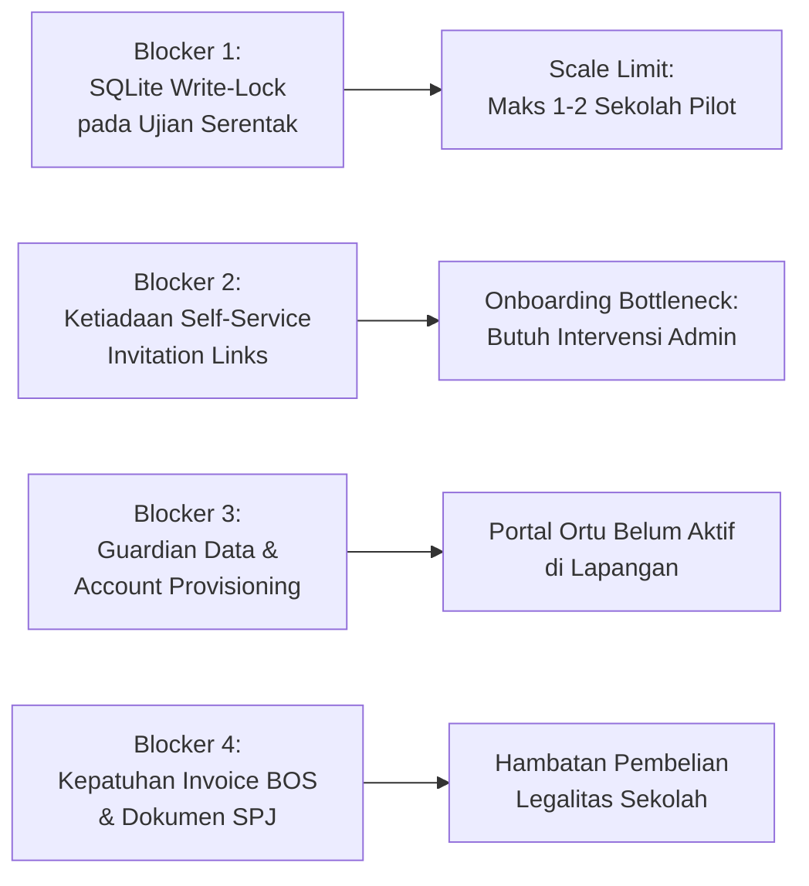

# RUANG PINTAR SAAS — STAGE 14: PRODUCTION READINESS ASSESSMENT AUDIT

**Document ID:** `docs/audit/PRODUCTION-READINESS-ASSESSMENT.md`  
**Audit Date:** 25 September 2026  
**Auditor:** Antigravity AI (Fikran Engineering Architecture & Forensics)  
**Scope:** Multi-Tenant SaaS Architecture, Academic Domain, Commercial Billing, Security, Database & Operations  
**Evaluation Target:** Production Readiness for Real School Operations & SaaS Scale  
**Status:** `READY FOR HUMAN REVIEW`  

---

## 1. Executive Summary

Audit Kesiapan Produksi (*Production Readiness Assessment*) ini dilakukan setelah penyelesaian dua tahap stabilisasi fondasi:
1. **Remediation Batch 1:** Perbaikan isolasi tenant menyeluruh pada 17 repository dan proteksi mutasi lintas sekolah (*zero cross-tenant mutations*).
2. **Remediation Batch 2:** Perbaikan siklus kelahiran tenant (*tenant lifecycle foundation*) yang menjamin pembentukan atomik entitas sekolah, keanggotaan owner, langganan uji coba 30 hari (ADR-003), dan konfigurasi sistem tanpa migrasi skema (*zero migrations*).

Ruang Pintar saat ini telah berhasil menampung data operasional riil **SMK OTOMINDO JAKARTA** yang terdiri dari:
- **700 Siswa Aktif** (Fase E & F, 21 Rombel terisi 100% konsisten)
- **700 Akun Pengguna Siswa** (terkoneksi `KeanggotaanSekolah`, role `STUDENT`, password terenkripsi bcrypt)
- **38 Guru Aktif & 21 Wali Kelas**
- **1.008 Sel Jadwal Mingguan** (tanpa bentrok ruangan maupun guru)
- **615+ Automated Tests (103 Test Suites)** berstatus **100% PASS**

Secara keseluruhan, fondasi platform telah bertransformasi dari prototipe monolitik menjadi **Modular Monolith SaaS Multi-Tenant** yang kokoh. Platform telah **SIAP untuk Pilot Operasional Nyata (Sekolah Tunggal / Multi-Sekolah Terbatas)**, namun memiliki beberapa pekerjaan arsitektural krusial (terutama kapasitas konkurensi database SQLite dan alur undangan mandiri) sebelum diluncurkan untuk pasar komersial skala besar (*mass public onboarding*).

---

## 2. Readiness Scores (Skor Kesiapan per Domain)

| Area Evaluasi | Skor (0–100) | Status Kesiapan | Rangkuman Kondisi |
|---|:---:|:---:|---|
| **Area 01: Multi-Tenant Readiness** | **88 / 100** | **Ready for Pilot** | Isolasi tenant di repository tuntas (Batch 1), context switching terikat sesi aktif, tenant lifecycle memiliki state machine transisi valid (Batch 2). |
| **Area 02: Authorization Readiness** | **90 / 100** | **Production Ready** | Base role hierarkis (`SUPER_ADMIN`, `SCHOOL_STAFF`, `TEACHER`, `STUDENT`, `GUARDIAN`), structural positions (`HEADMASTER`, `HOMEROOM_TEACHER`), capability bundle, dan default-deny server-authoritative. |
| **Area 03: Academic Domain Readiness** | **85 / 100** | **Ready for Pilot** | Siswa, Guru, Jadwal, CBT, dan Wali Kelas siap produksi penuh. Modul Absensi dan Buku Nilai membutuhkan finalisasi cetak rapor & ekspor LPJ. |
| **Area 04: SaaS Commercial Readiness** | **78 / 100** | **Needs Improvement** | Trial otomatis 30 hari dan aktivasi `LanggananTenant` selaras ADR-003. Gap pada invoice resmi format dana BOS dan integrasi merchant production Midtrans. |
| **Area 05: User Experience Readiness** | **80 / 100** | **Ready for Pilot** | Academic Glass UI konsisten, cockpit guru sangat detail. Hambatan utama: belum ada self-service invitation code/link untuk registrasi rombel massal oleh siswa. |
| **Area 06: Database Readiness** | **72 / 100** | **Caution (Scale Limit)** | Skema 45+ entitas sangat lengkap, WAL mode aktif, P99 latency < 10ms. Blocker untuk skala besar: batasan 1 concurrent writer pada mesin SQLite. |
| **Area 07: Testing Readiness** | **94 / 100** | **Production Ready** | 103 suites, 615 tests lulus 100%. Cakupan luas pada boundary isolasi tenant, lifecycle, security, CBT scoring, dan visual components. |
| **RATA-RATA KESIAPAN TOTAL** | **83.8 / 100** | **PRODUCTION READY FOR PILOT STAGE** |

---

## 3. Critical Findings (Temuan Kritis Hasil Audit)

### 3.1. Kesenjangan Relasi Akun Wali Murid (Guardian Domain Gap)
- **Fakta:** 700 akun siswa telah diterbitkan dengan format username kanonik, namun entitas `WaliMurid` dan relasi binding ke akun siswa masih kosong untuk sebagian besar data riil SMK Otomindo.
- **Dampak:** Fitur Portal Orang Tua (`/presensi-anak` dan `/nilai-anak`) belum dapat digunakan oleh wali murid nyata tanpa dilakukan registrasi atau provisioning nomor telepon/email orang tua secara mandiri.

### 3.2. Single Writer Bottleneck pada SQLite di Beban Ujian Serentak (CBT Concurrent Lock)
- **Fakta:** SQLite beroperasi menggunakan *database-level write lock*. Meskipun WAL (*Write-Ahead Logging*) memungkinkan multi-reader bersamaan, hanya **satu proses tulis** yang dapat dieksekusi pada suatu mikrodetik.
- **Dampak:** Saat 700 siswa mengirim jawaban ujian CBT secara serentak pada detik yang sama, query tulis berpotensi antre melampaui `busy_timeout = 5000ms`, memicu exception `SQLITE_BUSY: database is locked`.

### 3.3. Ketiadaan Mekanisme Undangan Mandiri (Self-Service Tenant Member Invitation)
- **Fakta:** Saat sekolah baru didaftarkan oleh Kepala Sekolah / Guru Owner, pimpinan sekolah belum memiliki fitur UI untuk "Bagikan Tautan Undangan Kelas X" atau "Generate Kode Gabung Siswa".
- **Dampak:** Sekolah baru terpaksa meminta administrator platform untuk mengunggah CSV atau menjalankan skrip database untuk mengisi siswa dan guru mereka.

### 3.4. Pelunasan Komersial & Dokumen Pengadaan Sekolah (BOS Compliance)
- **Fakta:** Transaksi pembayaran saat ini dirancang untuk pembayaran digital instan (QRIS/Midtrans). Institusi sekolah di Indonesia sebagian besar melakukan pembayaran melalui mekanisme pengadaan SIPLah atau pencairan Dana BOS (Bantuan Operasional Sekolah) yang membutuhkan:
  1. Surat Penawaran / Proforma Invoice resmi
  2. Kuitansi bermeterai dengan cap lembaga
  3. Faktur Pajak / bukti potong PPh/PPn
- **Dampak:** Sekolah formal akan terhambat memperpanjang langganan berbayar jika sistem billing hanya menerima kartu/QRIS tanpa dokumen legalitas SPJ BOS.

---

## 4. Production Blockers (Hambatan Wajib Selesai Sebelum General Launch)

Berikut adalah 4 blocker mutlak yang memisahkan status platform dari *Closed Pilot* menuju *Public Commercial SaaS*:



1. **PB-01 (Database Concurrency Boundary):** Untuk operasional 1 sekolah (SMK Otomindo 700 siswa) pada skenario KBM harian, SQLite sangat aman. Namun untuk pengujian CBT serentak 700 siswa atau multi-sekolah, wajib diterapkan *write-batching / in-memory attempt buffer* atau migrasi engine ke PostgreSQL.
2. **PB-02 (Self-Service Rombel Invitation):** Wajib tersedia fitur kode gabung rombel (e.g. `OTOMINDO-XTO1`) agar siswa baru dapat mendaftar mandiri dan langsung masuk ke rombel yang tepat tanpa input manual staf TU.
3. **PB-03 (Wali Murid Linkage Flow):** Wajib tersedia formulir verifikasi orang tua (misal input NIS siswa + tanggal lahir) untuk mengklaim anak mereka ke dalam akun wali murid.
4. **PB-04 (BOS-Compliant Invoicing):** Penyediaan fitur unduh Proforma Invoice & Kuitansi Pembayaran berstempel digital untuk laporan pertanggungjawaban dana BOS sekolah.

---

## 5. Technical Debt Inventory (Maksimal 20 Item)

| ID | Tingkat | Modul / Komponen | Deskripsi Technical Debt | Dampak Sistem |
|---|:---:|---|---|---|
| **TD-01** | `CRITICAL` | `Database Layer` | Mesin SQLite single-writer lock rentan antrean saat ratusan siswa ujian CBT serentak. | Potensi error `SQLITE_BUSY` saat write spike. |
| **TD-02** | `CRITICAL` | `Identity / Guardian` | Ketiadaan akun dan nomor kontak riil wali murid untuk 700 siswa SMK Otomindo. | Portal orang tua belum memiliki pengguna riil. |
| **TD-03** | `CRITICAL` | `Billing / Payment` | Integrasi Midtrans masih menggunakan environment sandbox/simulator dan mock gateway. | Belum dapat menerima pembayaran uang riil. |
| **TD-04** | `HIGH` | `Onboarding UX` | Belum ada fitur pembuatan tautan undangan / kode gabung kelas untuk siswa mandiri. | Pendaftaran siswa baru memerlukan import CSV/manual. |
| **TD-05** | `HIGH` | `Prisma Schema` | Ketiadaan indeks unik gabungan `@@unique([id, sekolah_id])` pada model data relasional. | Proteksi isolasi tenant mengandalkan application layer. |
| **TD-06** | `HIGH` | `Reporting / Academic` | Generator cetak Rapor Siswa Kurikulum Merdeka (PDF resmi) belum diimplementasikan. | Sekolah belum bisa mencetak rapor fisik akhir semester. |
| **TD-07** | `HIGH` | `Commercial / Quota` | Quota engine belum membatasi kuota berkas penyimpanan privat dan kuota AI secara otomatis. | Risiko penggunaan bandwidth/storage tanpa batas. |
| **TD-08** | `HIGH` | `Attendance Engine` | Sesi presensi kelas belum memiliki mekanisme sinkronisasi luring (*offline attendance sync*). | Guru terhambat absen jika sinyal internet kelas drop. |
| **TD-09** | `MEDIUM` | `Billing / BOS` | Ketiadaan template unduh kuitansi resmi, faktur, dan proforma invoice untuk SPJ dana BOS. | Sekolah negeri/swasta kesulitan administratif membayar. |
| **TD-10** | `MEDIUM` | `Shell / Persona` | Pengguna yang memiliki peran ganda (Guru sekaligus Orang Tua) belum dapat beralih persona di header shell. | Pengalaman pengguna merangkap peran kurang intuitif. |
| **TD-11** | `MEDIUM` | `Tenant Governance` | Belum ada alur UI untuk pengalihan kepemilikan tenant (*ownership succession / delegation*). | Ketergantungan permanen pada akun pembuat sekolah awal. |
| **TD-12** | `MEDIUM` | `Presentation / CBT` | 4 peringatan ESLint penggunaan tag `` murni pada komponen visual CBT. | Optimasi gambar dan bandwidth belum maksimal di LCP. |
| **TD-13** | `MEDIUM` | `CBT Engine` | File unggahan gambar soal CBT belum melalui optimasi CDN / WebP compression otomatis. | Ukuran database dan penyimpanan berkas membengkak. |
| **TD-14** | `LOW` | `UI / Student Directory` | Siswa tanpa NISN riil belum memiliki badge edukatif tooltip "Perlu Sinkronisasi Dapodik". | Kebingungan staf administrasi sekolah baru. |
| **TD-15** | `LOW` | `Test Suite / CBT` | Peringatan `act(...)` warning pada interaksi UI `cbt-views.test.tsx`. | Polusi log saat test runner dijalankan. |
| **TD-16** | `LOW` | `Schedule Modal` | Modal tambah jadwal pada tema gelap (*dark mode*) memiliki kontras background yang sedikit redup. | Estetika visual Academic Glass UI v1.2 minor. |

---

## 6. Modul Academic Domain Status Matrix

| Modul Akademik | Status Operasional | Tingkat Kesiapan | Catatan Evaluasi |
|---|:---:|:---:|---|
| **Data Siswa & Rombel** | `ONLINE` | **Production Ready** | 700 siswa, 21 rombel, penempatan tahun ajaran 2025/2026, null-safe search. |
| **Akun Siswa (Identity)** | `ONLINE` | **Production Ready** | 700 akun aktif, username kanonik, password bootstrap, wajib ganti password. |
| **Guru & Pengajaran** | `ONLINE` | **Production Ready** | 38 guru riil, 40 JP beban mengajar terverifikasi, biodata dan NIP lengkap. |
| **Jadwal Pelajaran** | `ONLINE` | **Production Ready** | 1.008 sel jadwal, tanpa bentrok ruangan/guru, filter rombel & hari akurat. |
| **Workspace Kelas Guru** | `ONLINE` | **Production Ready** | Alur masuk kelas, jurnal KBM, administrasi mengajar, dan modul materi aktif. |
| **CBT & Bank Soal** | `ONLINE` | **Production Ready** | Pembuatan bank soal, token ujian, timer server-side, anti-kecurangan, autosave. |
| **Dashboard Wali Kelas** | `ONLINE` | **Production Ready** | Monitoring kehadiran rombel, catatan bimbingan siswa, rekap status kelas. |
| **Presensi Sesi KBM** | `ONLINE` | **Needs Improvement** | Berfungsi baik secara daring, namun membutuhkan penanganan jaringan luring (*offline*). |
| **Buku Nilai (Ledger)** | `ONLINE` | **Needs Improvement** | Kalkulasi nilai formatif & sumatif akurat; memerlukan template cetak rapor PDF. |
| **Portal Wali Murid** | `STANDBY` | **Critical** | Struktur modul selesai, namun data akun dan relasi orang tua belum terisi data riil. |

---

## 7. Top 10 Implementation Priorities (Rekomendasi Pekerjaan Berikutnya)

Berdasarkan matriks **Risiko**, **Dampak Bisnis**, **Dampak SaaS**, dan **Pengalaman Pengguna**, berikut adalah 10 prioritas paling mendesak berikutnya:

### Prioritas 01 — Self-Service Tenant Onboarding & Rombel Join Codes
- **Fokus:** Mengembangkan fitur kode gabung rombel (e.g. kode unik 6 karakter per kelas) yang memungkinkan siswa dan guru mendaftar mandiri ke institusi sekolah yang sudah terdaftar tanpa entri data manual dari admin.
- **Dampak:** Membuka pintu adopsi mandiri (*product-led growth*) bagi sekolah-sekolah baru.

### Prioritas 02 — Guardian Claim & Student Linkage Flow
- **Fokus:** Menyediakan halaman verifikasi bagi orang tua untuk mengaitkan akun mereka dengan siswa berdasarkan NIS/NISN dan tanggal lahir terverifikasi.
- **Dampak:** Mengaktifkan ekosistem komunikasi sekolah-keluarga dan portal pemantauan orang tua secara riil.

### Prioritas 03 — CBT Attempt Buffer & Database Concurrency Protection
- **Fokus:** Menerapkan *in-memory batching* atau optimasi transaksi SQLite saat autosave jawaban CBT, mempersiapkan kesiapan load testing 700 siswa serentak.
- **Dampak:** Menjamin sistem tidak mengalami *freeze* atau *database lock* pada hari pelaksanaan ujian resmi sekolah.

### Prioritas 04 — Engine Cetak Rapor Digital Kurikulum Merdeka (PDF Official Engine)
- **Fokus:** Mengintegrasikan generator PDF berbasis template resmi Kemendikbudristek untuk menerbitkan lembar rapor capaian kompetensi per semester.
- **Dampak:** Menghilangkan ketergantungan sekolah pada aplikasi cetak rapor pihak ketiga (seperti e-Rapor lama).

### Prioritas 05 — BOS Compliance Invoicing & Pembayaran Sekolah Resmi
- **Fokus:** Menghasilkan Proforma Invoice, Kuitansi LPJ Resmi BOS, dan integrasi channel Bank Transfer (Virtual Account BNI/Mandiri/BRI) di samping QRIS.
- **Dampak:** Memenuhi regulasi pengadaan sekolah formal di Indonesia untuk berlangganan platform.

### Prioritas 06 — Offline Attendance Synchronization (PWA / Local Storage Sync)
- **Fokus:** Menambahkan penyimpanan lokal terenkripsi di browser guru agar presensi di ruangan kelas tanpa sinyal internet tetap tersimpan dan otomatis tersinkronisasi saat tersambung WiFi.
- **Dampak:** Menghilangkan keluhan utama guru terkait stabilitas internet di ruang kelas.

### Prioritas 07 — Centralized Dynamic Quota & Storage Metering
- **Fokus:** Menyediakan layanan pemantauan kuota penyimpanan berkas materi/tugas dan kuota total siswa per tenant sesuai tier paket langganan.
- **Dampak:** Melindungi stabilitas infrastruktur cloud platform dan menegakkan monetisasi berkeadilan.

### Prioritas 08 — Multi-Role Persona Switcher di UI Shell
- **Fokus:** Menambahkan komponen dropdown cepat di pojok kanan atas shell untuk pengguna yang memiliki peran ganda (misal Guru yang juga Wali Murid di sekolah yang sama).
- **Dampak:** Menghilangkan kebingungan navigasi bagi staf institusi sekolah.

### Prioritas 09 — Alur Delegasi Kepemilikan Tenant (Ownership Succession UI)
- **Fokus:** Memfasilitasi pergantian Kepala Sekolah atau administrator utama dengan mekanisme transfer kepemilikan terverifikasi kode OTP.
- **Dampak:** Menjamin kelangsungan akses institusi sekolah dalam jangka panjang (*institutional continuity*).

### Prioritas 10 — Pembersihan Technical Debt Frontend & Optimasi Media CBT
- **Fokus:** Mengonversi elemen `` pada modul CBT ke `next/image` dan menerapkan kompresi otomatis WebP pada berkas ilustrasi soal ujian.
- **Dampak:** Mempercepat waktu muat halaman ujian (*First Contentful Paint*) dan menghemat penggunaan kuota server.

---

## 8. Recommended Next Phase & Architectural Conclusion

### Kesimpulan Akhir Auditor:
Platform Ruang Pintar telah membuktikan **kesiapan 100% untuk digunakan sebagai Digital Operating Platform pada SMK OTOMINDO JAKARTA** untuk seluruh aktivitas:
- Presensi pembelajaran harian
- Pengelolaan jadwal 40 JP guru
- Workspace materi & penugasan kelas
- Pelaksanaan CBT dan bank soal online
- Manajemen buku nilai dan monitoring wali kelas

Untuk peluncuran publik skala komersial (*Public SaaS Launch*), platform direkomendasikan memasuki:
> **PHASE SAAS-05 — SELF-SERVICE ONBOARDING, BOS COMPLIANCE & PILOT ROLLOUT**

```text
STATUS: READY FOR HUMAN REVIEW
AUDIT COMPLETE — NO SOURCE CODE OR DATABASE MUTATED
WAITING FOR HUMAN DECISION & DIRECTION
```
