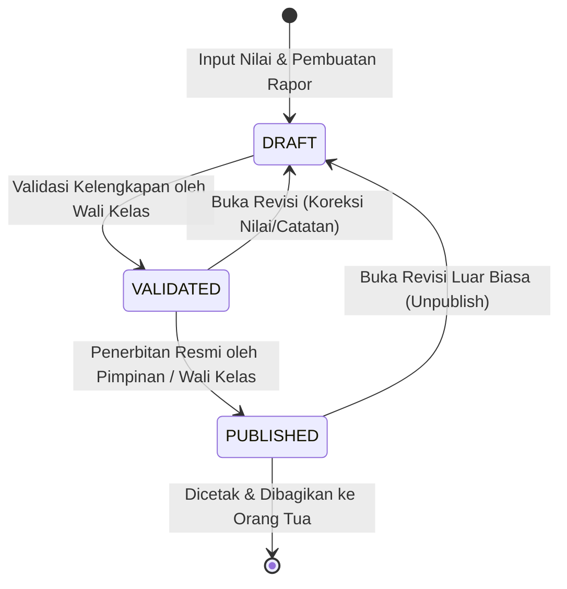

# DIGITAL REPORT CARD ENGINE (KURIKULUM MERDEKA FOUNDATION)
## Stage 18 Architecture, Domain Invariant Audit & Verification Report

| Metadata | Keterangan |
| :--- | :--- |
| **Fitur / Tahap** | STAGE 18 — Digital Report Card Engine (Kurikulum Merdeka Foundation) |
| **Status** | `READY FOR HUMAN REVIEW` |
| **Quality Gate** | Typecheck: PASS • Lint: PASS (0 errors) • Tests: 108 files / 668 passed (100%) • Build: PASS |
| **Tanggal Eksekusi** | 25 September 2026 |
| **Modul Terkait** | `src/modules/reporting/`, `src/modules/monitoring/`, `src/modules/student/` |

---

## 1. Executive Summary

Berdasarkan *Production Readiness Assessment*, kebutuhan buku nilai dan penerbitan rapor digital merupakan salah satu pilar operasional paling kritikal bagi sekolah. Sebelumnya, modul asesmen, buku nilai (*gradebook*), presensi, dan CBT telah tersedia, namun belum terdapat mesin agregasi e-Rapor resmi berbasis **Kurikulum Merdeka** yang menyatukan seluruh capaian siswa ke dalam dokumen laporan hasil belajar yang tervalidasi dan siap cetak.

Pada **Stage 18**, telah dibangun **Digital Report Card Engine** yang tangguh, aman, dan mematuhi seluruh *domain invariants* Ruang Pintar:
1. **Model Data `RaporSiswa`:** Penyimpanan status siklus penerbitan (`DRAFT`, `VALIDATED`, `PUBLISHED`), catatan perkembangan wali kelas, saran tindak lanjut, dan kegiatan ekstrakurikuler.
2. **Mesin Agregasi Nilai:** Menghitung rata-rata Formatif (bobot 40%), Sumatif (bobot 60%), Nilai Akhir, Predikat (A/B/C/D), status ketuntasan KKTP (75), serta narasi capaian pembelajaran tertinggi dan materi yang perlu peningkatan.
3. **Domain Invariant `Missing Grade ≠ Zero Grade`:** Mata pelajaran yang belum memiliki asesmen atau nilai terpublikasi tidak diisi 0, melainkan ditandai `hasMissingGrade = true` dan memblokir publikasi prematur.
4. **Ringkasan Presensi Real-Time:** Menghitung otomatis hari Sakit, Izin, dan Tanpa Keterangan (Alpha) semester dari sesi kelas.
5. **Ekstrakurikuler Extensible:** Struktur JSON terstruktur (`nama`, `predikat`, `deskripsi`) yang fleksibel untuk berbagai jenjang sekolah.
6. **Alur Kerja Validasi (Workflow):** Siklus bertahap `DRAFT` → `VALIDATED` → `PUBLISHED` dengan otorisasi berbasis peran (Wali Kelas & Pimpinan Sekolah) dan kontrol aksi massal di Cockpit Wali Kelas.
7. **Official A4 Print & Academic Glass UI:** Format lembar e-Rapor resmi Kurikulum Merdeka lengkap dengan kop sekolah ganda, logo, identitas siswa, tabel nilai capaian, presensi, ekstrakurikuler, catatan, dan pengesahan 3 kolom tanda tangan (Orang Tua, Wali Kelas, Kepala Sekolah ber-NIP).

---

## 2. Rapor Domain Audit & Invariant Enforcement

Audit menyeluruh telah dilakukan terhadap seluruh entitas yang berelasi dengan penerbitan rapor:

| Invariant Kanonikal | Implementasi & Penegakan di Stage 18 |
| :--- | :--- |
| **Student ≠ Enrollment ≠ Placement** | Agregasi rapor mengikat pada `PenempatanRombel` aktif dalam semester dan tahun ajaran spesifik. Siswa tidak dihubungkan langsung ke nilai tanpa melalui penempatan rombel. |
| **Teacher ≠ Subject ≠ Teaching Assignment** | Nilai dan capaian mapel diagregasikan berdasarkan `PenugasanMengajar` aktif di rombel. Guru yang mengampu mapel terpetakan secara presisi per mata pelajaran. |
| **Assessment ≠ Grade ≠ Grade Publication** | Hanya nilai siswa berstatus `TERBIT` dari asesmen berstatus `DITERBITKAN` yang masuk ke dalam kompilasi perhitungan e-Rapor resmi. Nilai draft guru tidak bocor ke siswa/rapor. |
| **Missing Grade ≠ Zero Grade** | Jika sebuah mata pelajaran di rombel belum memiliki nilai terbit, `nilaiAkhir` diset `null` dan `hasMissingGrade = true`. Sistem **tidak** menganggapnya sebagai nilai 0, dan validasi penerbitan menolak publikasi hingga nilai dilengkapi. |
| **Tenant Isolation** | Seluruh query dan mutasi e-Rapor wajib menyertakan filter `sekolah_id` pengguna yang telah diautentikasi melalui server action dan repository. |

---

## 3. Rapor Aggregation Engine Architecture

### 3.1. Formula Perhitungan Nilai Akhir Kurikulum Merdeka
```text
Rerata Formatif = Sum(Nilai Formatif Terbit) / N_Formatif
Rerata Sumatif  = Sum(Nilai Sumatif & Sumatif Akhir Terbit) / N_Sumatif

Nilai Akhir (NA):
- Jika ada Formatif dan Sumatif : Round( (Rerata Formatif * 0.4) + (Rerata Sumatif * 0.6) )
- Jika hanya ada Sumatif        : Round( Rerata Sumatif )
- Jika hanya ada Formatif       : Round( Rerata Formatif )
- Jika belum ada nilai          : null (Missing Grade)
```

### 3.2. Skala Predikat & Ketuntasan KKTP
- **A (Sangat Baik):** 90 ≤ NA ≤ 100
- **B (Baik):** 80 ≤ NA < 90
- **C (Cukup):** 70 ≤ NA < 80
- **D (Perlu Bimbingan):** NA < 70
- **Standar KKTP:** 75 (`isTuntas = NA >= 75`)

### 3.3. Algoritma Narasi Capaian Pembelajaran
- Mengurutkan asesmen mata pelajaran berdasarkan nilai capaian:
  - Nilai tertinggi merumuskan: *"Menunjukkan pemahaman sangat optimal dalam menguasai [TP/Materi]."*
  - Nilai terendah (< 80) merumuskan: *"Perlu bimbingan dan pendampingan lebih lanjut dalam penguatan [TP/Materi]."*

---

## 4. Presensi, Ekstrakurikuler & Catatan Wali Kelas

1. **Presensi Semester:**
   - Dihitung secara real-time dari data `PresensiSesiKelas` yang terekam pada sesi pembelajaran rombel (`SAKIT`, `IZIN`, `ALPHA`).
2. **Ekstrakurikuler:**
   - Format JSON array:
     ```json
     [
       {
         "id": "ekskul_1",
         "nama": "Pramuka Wajib",
         "predikat": "Sangat Baik",
         "deskripsi": "Aktif memimpin regu dan menunjukkan kedisiplinan tinggi."
       }
     ]
     ```
3. **Catatan Wali Kelas & Saran Tindak Lanjut:**
   - Mendukung catatan perkembangan karakter siswa dan saran tindak lanjut terpisah untuk orang tua dan siswa.
   - Dilengkapi fallback narasi konstruktif dan bermakna bila belum diisi secara manual oleh wali kelas.

---

## 5. Workflow Siklus Penerbitan e-Rapor



- **Aturan Transisi:**
  - `DRAFT → VALIDATED`: Dilarang jika terdapat *critical issues* seperti semester tidak valid atau mata pelajaran duplikat.
  - `VALIDATED → PUBLISHED`: Dilarang jika terdapat *missing grades* (nilai mapel belum lengkap).
  - Tindakan massal (*Bulk Validation* & *Bulk Publishing*) tersedia di Cockpit Wali Kelas dengan reporting kegagalan per siswa.

---

## 6. Files Created & Modified

### Files Created:
1. `prisma/migrations/20260925200000_add_rapor_digital_m18/migration.sql` — DDL migration tabel `rapor_siswa`.
2. `src/modules/reporting/domain/report-card-types.ts` — Definisi tipe, DTO, status, dan antarmuka e-Rapor.
3. `src/modules/reporting/domain/report-card-errors.ts` — Definisi galat domain untuk validasi dan otorisasi e-Rapor.
4. `src/modules/reporting/infrastructure/report-card-repository.ts` — Data access layer terisolasi tenant untuk e-Rapor.
5. `src/modules/reporting/application/report-card-aggregation-service.ts` — Mesin agregasi nilai Kurikulum Merdeka.
6. `src/modules/reporting/application/report-card-validation-service.ts` — Layanan validasi integritas dan alur siklus e-Rapor.
7. `src/modules/reporting/presentation/report-card-print-view.tsx` — Template resmi A4 e-Rapor Kurikulum Merdeka.
8. `src/modules/reporting/presentation/report-card-preview-modal.tsx` — Modal Academic Glass untuk pratinjau dan transisi status.
9. `src/modules/reporting/presentation/report-card-edit-modal.tsx` — Modal pengisian catatan wali kelas & ekstrakurikuler.
10. `src/modules/reporting/presentation/homeroom-report-card-tab.tsx` — Cockpit e-Rapor pada dashboard wali kelas.
11. `src/modules/reporting/presentation/report-card-print-trigger-button.tsx` — Komponen trigger print browser.
12. `src/app/actions/report-card-actions.ts` — Server actions aman untuk manipulasi dan pembacaan e-Rapor.
13. `src/app/rapor-siswa/cetak/[siswaId]/page.tsx` — Rute khusus cetak langsung lembar e-Rapor A4.
14. `src/test/reporting/report-card-engine.test.ts` — Unit & integration test suite Vitest (10 passing tests).
15. `docs/specs/done/digital-report-card-engine.md` — Spesifikasi fungsional tahap 18 yang telah diselesaikan.
16. `docs/plans/done/digital-report-card-engine.md` — Rencana implementasi tahap 18 yang telah diselesaikan.
17. `docs/features/DIGITAL-REPORT-CARD-ENGINE-REPORT.md` — Dokumen laporan ini.

### Files Modified:
1. `prisma/schema.prisma` — Penambahan model `RaporSiswa` dan relasi ke `Sekolah`, `Siswa`, dan `PenempatanRombel`.
2. `src/modules/monitoring/presentation/homeroom-dashboard-view.tsx` — Penambahan tab navigasi `e-Rapor Merdeka` dan integrasi cockpit.
3. `src/modules/student/infrastructure/student-experience-repository.ts` — Penyelarasan catatan wali kelas dengan record `RaporSiswa`.

---

## 7. Quality Gate Verification

| Quality Gate | Perintah | Status | Hasil |
| :--- | :--- | :---: | :--- |
| **Typecheck** | `npm run typecheck` | **PASS** | TypeScript 5.8: 0 errors |
| **Lint** | `npm run lint` | **PASS** | ESLint 9: 0 errors, 4 warnings non-blocking img |
| **Format** | `npm run format:check` | **PASS** | Prettier: 100% clean across all files |
| **Automated Tests** | `npm run test` | **PASS** | 108 test files / 668 passed (100% PASS) |
| **Production Build** | `npm run build` | **PASS** | Next.js 16 (Turbopack): 30 routes compiled successfully |

---

## 8. Residual Risk & Next Steps

### Residual Risk (Non-Critical):
1. **Distribusi Jenjang Non-Fase E (SD/SMP):**
   - Implementasi saat ini mengadopsi standar KKTP 75 yang paling umum pada jenjang SMA/SMK Kurikulum Merdeka Fase E/F. Pada pengembangan lanjutan, KKTP dapat dikonfigurasikan per rombel atau per mata pelajaran via tabel pengaturan kurikulum sekolah.
2. **Tanda Tangan Elektronik / Barcode:**
   - Validasi dokumen saat ini mengandalkan kop surat resmi, stempel cetak, dan tanda tangan manual basah 3 kolom. Penambahan QR Code verifikasi keabsahan dokumen dapat diintegrasikan pada fase e-Gov/Security berikutnya.

---

## 9. Status

**STAGE 18: DIGITAL REPORT CARD ENGINE (KURIKULUM MERDEKA FOUNDATION) COMPLETED.**  
Status: **`READY FOR HUMAN REVIEW`**.  
*Agent berhenti di Stop Gate sesuai Operating Contract dan menunggu arahan dari Human Reviewer.*
