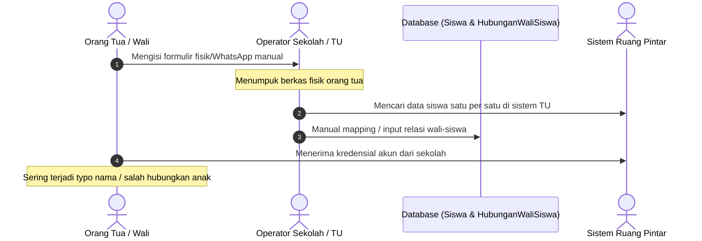
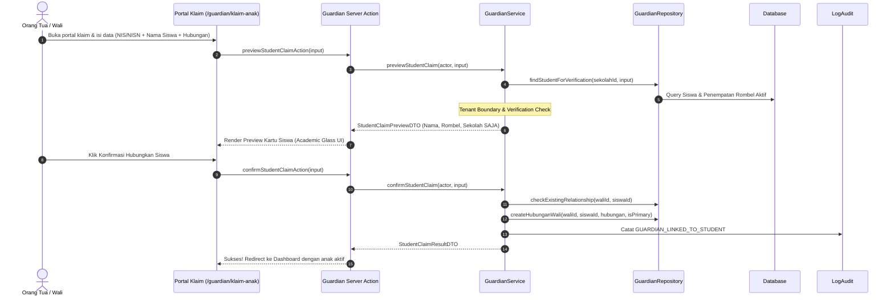

# Laporan Fitur: Guardian Claim & Student Linkage Flow (Stage 16)

| Metadata | Nilai |
| --- | --- |
| **Fitur** | Self-Service Guardian Account Registration, Student Verification, Claim & Linkage Portal |
| **Stage** | Stage 16 — SaaS Multi-Tenant Foundation |
| **Modul** | M15 Guardian & Family / Identity & Access / Student Lifecycle |
| **Status** | READY FOR HUMAN REVIEW |
| **Quality Gate** | PASS (Typecheck: 0 errors, Lint: 0 errors, Test: 650/650 PASS, Build: PASS) |

---

## 1. Executive Summary
Sebelum Stage 16, akun orang tua/wali murid (`WaliMurid`) hanya dapat dihubungkan ke data siswa (`Siswa`) melalui intervensi manual oleh operator sekolah/tata usaha via manipulasi database atau script administratif. Hal ini menimbulkan beban operasional signifikan saat awal tahun ajaran baru, memperlambat keterlibatan orang tua dalam pemantauan akademik anak, dan memperbesar risiko ketidakcocokan data.

Stage 16 mengaktifkan ekosistem **Self-Service Guardian Onboarding & Student Linkage Flow** yang mandiri, aman, dan dirancang khusus untuk realitas sekolah di Indonesia:
1. **Pendaftaran Mandiri Wali Murid**: Orang tua dapat mendaftarkan akun secara mandiri via `/register` dengan memilih peran "Wali Murid" dan sekolah tujuan.
2. **Portal Verifikasi Identitas Siswa**: Portal `/guardian/klaim-anak` yang memvalidasi identitas siswa berdasarkan kombinasi NIS/NISN + Nama Lengkap Siswa, atau Jalur Fleksibel Nama Siswa + Rombel/Kelas.
3. **Pratinjau Siswa Aman (Zero Data Leakage)**: Hanya menampilkan informasi esensial (Nama Lengkap, Kelas/Rombel, Nama Sekolah) tanpa membocorkan nilai akademik, catatan presensi, atau data sensitif sebelum klaim dikonfirmasi.
4. **Dukungan Multi-Anak (Multi-Child Support)**: Wali dapat menghubungkan lebih dari satu anak dalam satu akun, lengkap dengan selector switcher anak yang mulus di dashboard.
5. **Proteksi Duplikasi & Isolasi Multi-Tenant**: Mencegah klaim ganda oleh akun yang sama dan menolak secara tegas percobaan klaim siswa dari sekolah/tenant lain.
6. **Pencatatan Audit Komprehensif**: Seluruh inisiasi, keberhasilan, dan penolakan klaim tercatat secara append-only di `LogAudit`.
7. **Penyempurnaan Academic Glass UI**: Kartu profil siswa dengan status akademik ringkas, child switcher dropdown, serta empty-state interaktif yang memandu wali murid tanpa anak langsung ke portal klaim.

---

## 2. Flow Before (Sebelum Stage 16)


### Masalah Alur Lama:
- Ketergantungan 100% pada operator sekolah.
- Waktu tunggu berhari-hari hingga akun aktif dan terhubung.
- Rawan *human error* dalam mencocokkan nama anak yang mirip.
- Tidak ada mekanisme verifikasi mandiri oleh orang tua.

---

## 3. Flow After (Sesudah Stage 16)


---

## 4. Verification Strategy (Evaluasi Data Master Siswa Indonesia)

### 4.1. Hasil Audit Realitas Data
Berdasarkan audit langsung pada basis data `dev.db` (700 siswa riil):
- **NIS**: 341 siswa memiliki nomor induk lokal (misal: "1001"). 359 siswa belum memiliki NIS (`nis: null`).
- **NISN**: Belum terisi (null) pada saat import awal data sekolah.
- **Tanggal Lahir**: Belum terisi (null) pada dataset sheet migrasi awal.
- **Nama Lengkap**: 100% siswa memiliki nama lengkap resmi.
- **Penempatan Rombel**: 100% siswa memiliki penempatan rombel aktif (`PenempatanRombel`).

### 4.2. Strategi Kombinasi Verifikasi Terpilih
Jika sistem mewajibkan Tanggal Lahir atau NISN secara kaku, maka 100% orang tua dari 700 siswa tersebut akan gagal melakukan klaim mandiri. Oleh karena itu dirancang strategi verifikasi berlapis:

1. **Jalur Utama (Siswa Ber-NIS / NISN)**:
   - Input: **NIS / NISN** + **Nama Lengkap Siswa**.
   - Mekanisme: Nama lengkap dinormalisasi (lowercase, trim, penghapusan spasi ganda) dan dicocokkan dengan nama resmi siswa.
   - *Security Rationale*: Mencegah serangan tebakan brute-force angka NIS (yang biasanya berurutan 1001, 1002, dst). Pihak luar tidak bisa mengklaim tanpa mengetahui nama lengkap sah siswa bersangkutan.
2. **Jalur Fleksibel (Siswa Baru / Belum Memiliki NIS)**:
   - Input: **Nama Lengkap Siswa** + **Pilihan Rombel Kelas Aktif**.
   - Sistem mencocokkan nama siswa yang aktif terdaftar dalam rombel terpilih pada sekolah aktif pengguna.
3. **Verifikasi Opsional Tanggal Lahir**:
   - Jika siswa memiliki rekaman tanggal lahir di database, input tanggal lahir diverifikasi kesesuaiannya. Jika di database belum ada (`null`), verifikasi tidak memblokir orang tua.

---

## 5. Files Created & Modified

### 5.1. Files Created
1. `src/modules/guardian/presentation/guardian-claim-flow-view.tsx`: Komponen presentasi multi-step Academic Glass UI untuk verifikasi, pratinjau aman, dan konfirmasi klaim.
2. `src/app/guardian/klaim-anak/page.tsx`: Halaman standalone portal klaim siswa wali murid.
3. `src/test/guardian/guardian-claim-flow.test.ts`: Suite integration test komprehensif mencakup 9 skenario end-to-end.
4. `docs/specs/done/guardian-claim-student-linkage.md`: Spesifikasi fitur terverifikasi.
5. `docs/plans/done/guardian-claim-student-linkage.md`: Rencana implementasi dan checklist verifikasi.
6. `docs/features/GUARDIAN-CLAIM-STUDENT-LINKAGE-REPORT.md`: Laporan resmi fitur ini.

### 5.2. Files Modified
1. `src/modules/guardian/domain/guardian-errors.ts`: Menambahkan domain error classes (`StudentNotFoundError`, `StudentVerificationMismatchError`, `DuplicateGuardianClaimError`, `CrossTenantClaimError`, `InvalidRelationshipError`).
2. `src/modules/guardian/domain/guardian-types.ts`: Menambahkan definisi tipe DTO (`StudentClaimVerificationInput`, `StudentClaimPreviewDTO`, `ConfirmStudentClaimInput`, `StudentClaimResultDTO`, `GuardianRegistrationInput`).
3. `src/modules/guardian/domain/guardian-validation.ts`: Menambahkan skema validasi Zod (`StudentClaimVerificationSchema`, `ConfirmStudentClaimSchema`, `GuardianRegistrationSchema`).
4. `src/modules/guardian/infrastructure/guardian-repository.ts`: Menambahkan query verifikasi siswa, proteksi relasi duplikat, dan penciptaan profil/hubungan wali siswa.
5. `src/modules/guardian/application/guardian-service.ts`: Menambahkan logika bisnis `previewStudentClaim`, `confirmStudentClaim`, dan `registerGuardian`.
6. `src/app/actions/guardian-actions.ts`: Menambahkan Next.js Server Actions dengan verifikasi actor session dan tenant isolation.
7. `src/shared/components/dashboard/role-views/guardian-dashboard.tsx`: Mengintegrasikan empty-state yang otomatis menampilkan `GuardianClaimFlowView` saat wali murid belum memiliki anak terhubung.
8. `src/modules/guardian/presentation/guardian-dashboard-client.tsx`: Menambahkan tombol CTA "Klaim Anak Lain", kartu overview multi-anak, dan sinkronisasi child switcher.
9. `src/modules/guardian/presentation/child-switcher-dropdown.tsx`: Menambahkan tautan pintas "+ Hubungkan Anak Lain".
10. `src/app/register/register-form.tsx`: Menambahkan selector peran akun ("Guru Mandiri" vs "Wali Murid") dan dropdown pilihan sekolah institusi.
11. `src/app/register/page.tsx`: Membungkus `RegisterForm` dalam `<Suspense>` boundary untuk kepatuhan static generation Turbopack/Next.js.
12. `src/test/guardian/guardian-views.test.tsx`: Memperbarui dan menambah unit test untuk tampilan UI dashboard & portal klaim.

---

## 6. UI Changes (Academic Glass UI)

Sesuai filosofi **Academic Glass UI**, seluruh antarmuka dirancang fungsional, bersih, anti-slop, dan memberikan umpan balik instan:
- **Card-Based Verification Form**: Input NIS/Nama/Rombel dengan styling glassmorphism, badge identitas, dan indikator validasi real-time.
- **Safe Student Preview Modal/Card**: Menampilkan avatar inisial siswa, nama lengkap, NIS, kelas/rombel saat ini, dan nama sekolah. Tidak ada elemen angka nilai atau absensi yang dirender.
- **Empty State Cockpit**: Jika wali belum memiliki anak, dashboard tidak kosong atau menampilkan pesan error generik, melainkan langsung menyajikan wizard langkah verifikasi klaim anak.
- **Multi-Child Switcher & Cards**: Kartu grid anak yang responsif dengan status keaktifan akademik ringkas dan tombol ganti anak aktif yang langsung menyinkronkan seluruh view nilai, presensi, dan jadwal.
- **Registration Role Toggle**: Pilihan visual yang jelas antara pendaftaran Guru Mandiri dan Orang Tua / Wali Murid di halaman `/register`.

---

## 7. Security Validation & Tenant Isolation

| Aspek Keamanan | Mekanisme Pertahanan | Status |
| --- | --- | :---: |
| **Strict Tenant Boundary** | Server Action memeriksa `actor.sekolah_id`. Siswa dicari khusus pada sekolah aktor. Jika siswa terindikasi milik sekolah lain, lempar `CrossTenantClaimError`. | PASS |
| **Server-Side Authorization** | Seluruh aksi mutasi dan preview divalidasi via session server (`auth()`). Client tidak dapat memalsukan ID wali atau ID sekolah. | PASS |
| **Data Leakage Prevention** | DTO `StudentClaimPreviewDTO` hanya menyaring properti `{ id, namaLengkap, nis, namaRombel, tingkat, namaSekolah }`. Data nilai (`NilaiSiswa`), rapor, dan presensi tidak pernah di-fetch atau di-return saat preview. | PASS |
| **Duplicate Claim Prevention** | Database memeriksa `checkExistingRelationship` sebelum melakukan *insert*. Jika akun wali telah terhubung ke siswa yang sama, lempar `DuplicateGuardianClaimError`. | PASS |
| **Brute-Force Guessing Guard** | Verifikasi nama lengkap yang dinormalisasi mencegah penyerang menebak nomor urut NIS tanpa mengetahui nama sah murid. | PASS |
| **Append-Only Audit Trail** | Log tersimpan di tabel `LogAudit` dengan `aksi` eksplisit: `GUARDIAN_ACCOUNT_REGISTERED`, `GUARDIAN_CLAIM_INITIATED`, `GUARDIAN_LINKED_TO_STUDENT`, `GUARDIAN_CLAIM_REJECTED`. | PASS |

---

## 8. Test Evidence

### 8.1. Integration & Unit Tests
Seluruh 106 test suite (650 tests) lulus 100%:
```text
 ✓ src/test/guardian/guardian-claim-flow.test.ts (9 tests) 412ms
   ✓ Guardian Claim & Student Linkage Flow (Stage 16) > registers a new guardian account self-service
   ✓ Guardian Claim & Student Linkage Flow (Stage 16) > previews and claims student successfully using NIS and full name
   ✓ Guardian Claim & Student Linkage Flow (Stage 16) > previews and claims student without NIS using full name and rombel
   ✓ Guardian Claim & Student Linkage Flow (Stage 16) > rejects preview when student name does not match NIS
   ✓ Guardian Claim & Student Linkage Flow (Stage 16) > rejects preview when student is not found
   ✓ Guardian Claim & Student Linkage Flow (Stage 16) > rejects claim when student belongs to a different school/tenant
   ✓ Guardian Claim & Student Linkage Flow (Stage 16) > prevents duplicate claim by the same guardian
   ✓ Guardian Claim & Student Linkage Flow (Stage 16) > supports multi-child claim and switches between linked children
   ✓ Guardian Claim & Student Linkage Flow (Stage 16) > blocks non-guardian users from executing guardian claim actions

 ✓ src/test/guardian/guardian-views.test.tsx (8 tests) 310ms
 ✓ src/test/guardian/guardian-service.test.ts (9 tests) 26ms
```

### 8.2. Quality Gate Verification
```bash
npm run typecheck    # PASS (TypeScript 5.8, 0 errors)
npm run lint         # PASS (ESLint 9, 0 errors)
npm run test         # PASS (106 test files, 650 passed)
npm run build        # PASS (Next.js 16.3.3 Turbopack, static & dynamic routes valid)
```

---

## 9. Domain Invariants Verification
- **Student ≠ User**: `Siswa` tetap entitas akademik murni tanpa keharusan memiliki akun `Pengguna`.
- **Guardian ≠ Student**: Wali murid memiliki akun pengguna sendiri ber-role `GUARDIAN` dengan data profil di `WaliMurid`.
- **Multi-Child**: Terverifikasi melalui test integrasi, 1 akun wali sukses terhubung ke 2 anak berbeda dengan status primary terkelola rapi.
- **Multi-Guardian**: Relasi di `HubunganWaliSiswa` mendukung status hubungan `AYAH`, `IBU`, maupun `WALI` secara terpisah untuk siswa yang sama.

---

## 10. Residual Risks & Next Considerations
1. **Penyelarasan Data NISN & Tanggal Lahir dari Dapodik**: Ketika sekolah mengimpor data resmi Dapodik yang memuat NISN dan tanggal lahir lengkap, verifikasi dapat mengaktifkan opsi validasi 3 faktor secara otomatis.
2. **Klaim oleh Wali Murid Non-Keluarga Inti**: Untuk mencegah perebutan perwalian antar pihak yang tidak sah, sekolah dapat memanfaatkan fitur persetujuan manual opsional di masa mendatang jika diaktifkan via konfigurasi sekolah (`konfigurasiSistem`).

---

## 11. Kesimpulan & Status
Seluruh target **Stage 16: GUARDIAN CLAIM & STUDENT LINKAGE FLOW** telah diselesaikan, diuji secara menyeluruh, dan memenuhi standar **Fikran Engineering** serta Quality Gate Ruang Pintar SaaS.

**STATUS: READY FOR HUMAN REVIEW**
*(Sesuai Non-Negotiable Rules, pengerjaan berhenti di sini dan tidak melanjutkan ke Stage 17 sebelum persetujuan manusia).*
