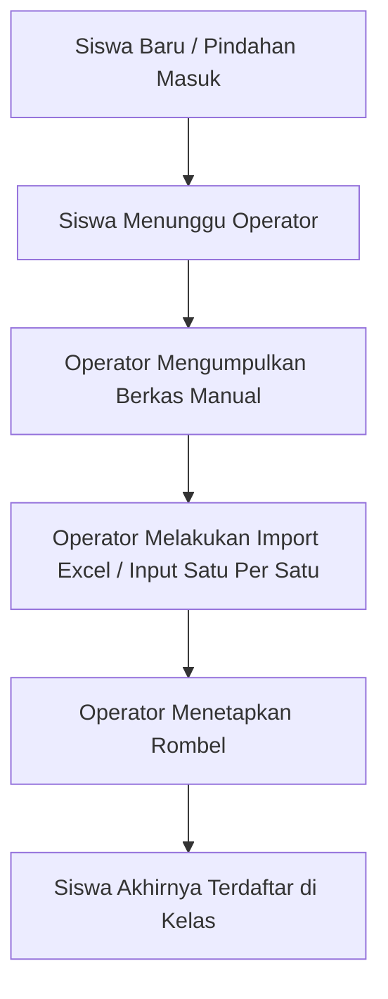
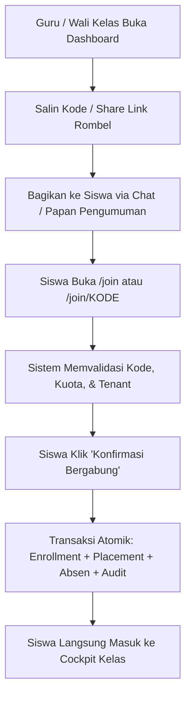

# RUANG PINTAR SAAS — STAGE 15 REPORT
## SELF-SERVICE TENANT ONBOARDING & ROMBEL JOIN CODES

| Attribute | Detail |
| :--- | :--- |
| **Stage** | STAGE 15 — Priority #1 Self-Service Onboarding |
| **Feature Name** | Self-Service Rombel Join Codes & Independent Student Enrollment |
| **Architecture** | SaaS Multi-Tenant Modular Monolith (Next.js 16 + Prisma + SQLite) |
| **Design System** | Academic Glass UI v1.2 (Clean, Purposeful, Anti-Slop) |
| **Database Migration** | **0 Migrations** (Zero Schema Changes — Pure Domain & Config Layer) |
| **Quality Gate Status** | **100% PASS** (Typecheck, ESLint, Prettier, 639 Tests, Next Build) |
| **Stage Gate** | `READY FOR HUMAN REVIEW` |

---

## 1. Executive Summary

Pada tahapan operasional sekolah sebelumnya, pendaftaran atau penempatan siswa ke dalam rombel (kelas) bergantung sepenuhnya pada operator sekolah (`SCHOOL_STAFF`) melalui import batch atau penempatan manual satu per satu. Hal ini menciptakan bottleneck operasional di awal tahun ajaran baru atau saat penerimaan peserta didik baru.

Melalui **Stage 15 (Self-Service Tenant Onboarding & Rombel Join Codes)**, Ruang Pintar kini mendukung alur **pendaftaran mandiri siswa (Self-Service Onboarding)**:
1. **Guru Mata Pelajaran dan Wali Kelas** memiliki kontrol penuh atas kode gabung unik rombel mereka (melihat kode, menyalin tautan pendaftaran, meregenerasi kode jika terjadi kebocoran, serta membuka/menutup gerbang pendaftaran kapan saja).
2. **Siswa** dapat bergabung ke dalam rombel secara langsung dengan memasukkan kode gabung di portal `/join` atau melalui tautan langsung `/join/[code]`.
3. **Domain Invariant Akademik Terjaga Penuh**: Mempertahankan prinsip `Student ≠ Enrollment ≠ Rombel Placement`. Ketika siswa bergabung ke rombel, sistem secara atomik memastikan tersedianya `KeikutsertaanSiswa` pada tahun ajaran terkait, mengalokasikan nomor absen berikutnya secara otomatis, menutup penempatan lama jika berpindah rombel di tahun ajaran yang sama, dan mengikat `KeanggotaanSekolah`.
4. **Isolasi Multi-Tenant Mutlak**: Sistem mencegah siswa dari institusi sekolah lain menggunakan kode gabung sekolah berbeda (`CrossTenantJoinError`), mencegah pendaftaran ganda (`DuplicateJoinError`), mencegah kelebihan kapasitas (`RombelCapacityFullError`), dan mencatat seluruh kejadian dalam audit log (`LogAudit`).

---

## 2. Flow Comparison: Before vs After

### Alur Sebelum (Operator-Dependent)

- **Masalah**: Beban kerja operator sangat tinggi saat tahun ajaran baru, rentan salah input rombel, dan proses aktivasi akun lambat.

### Alur Sesudah (Self-Service Join Codes)

- **Keuntungan**: Zero operator friction, siswa mandiri mendaftar dalam hitungan detik, nomor absen terurut otomatis, kapasitas terkendali, dan guru memegang kendali penuh atas switch buka/tutup pendaftaran.

---

## 3. Core Architectural Implementations

### 3.1. Zero-Migration Persistence Strategy
Fitur ini dirancang untuk **tidak memerlukan migrasi skema database baru**:
1. String kode gabung kanonik aktif disimpan di kolom `Rombel.kode` (contoh: `XTJKT1-ABCD`, `DKV2-9KLM`).
2. Konfigurasi siklus hidup disimpan di entitas `KonfigurasiSistem`:
   - Kunci konfigurasi rombel: `join_code.config.${rombelId}` berisi `{ code, is_active, expires_at, created_at, updated_at }`.
   - Reverse index lookup cepat: `join_code.lookup.${code}` berisi `{ rombel_id, sekolah_id }`.
3. Generator kode membersihkan karakter yang membingungkan secara visual (misal `O`, `0`, `I`, `1`) agar siswa tidak salah ketik di perangkat mobile.

### 3.2. Atomic All-or-Nothing Transaction
Seluruh proses penempatan mandiri dibungkus dalam `prisma.$transaction`:
1. Validasi keberadaan akun pengguna dan profil siswa.
2. Validasi status aktif, waktu kedaluwarsa, dan batas kuota rombel.
3. Validasi isolasi tenant (`CrossTenantJoinError`).
4. Validasi pendaftaran duplikat (`DuplicateJoinError`).
5. Pembuatan/verifikasi `KeikutsertaanSiswa` (Enrollment) untuk tahun ajaran aktif.
6. Penutupan penempatan rombel lama menjadi status `PINDAH` jika siswa berpindah kelas di tahun ajaran yang sama.
7. Alokasi nomor absen otomatis (`max(nomor_absen) + 1`).
8. Pembuatan `PenempatanRombel` baru dengan status `AKTIF`.
9. Verifikasi dan pembuatan `KeanggotaanSekolah` siswa pada tenant terkait.
10. Pencatatan audit trail ke `LogAudit` dengan aksi `STUDENT_JOINED_ROMBEL_VIA_CODE`.

---

## 4. UI/UX Changes & Components (Academic Glass UI)

### 4.1. Teacher & Homeroom Join Code Card (`RombelJoinCodeCard`)
Komponen widget interaktif yang disematkan pada:
- **Workspace Kelas Guru Mata Pelajaran** (`/kelas-saya/[id]` — Tab Ringkasan)
- **Dashboard Wali Kelas** (`/wali-kelas` — Tab Roster Siswa)

Fitur Widget:
- Tampilan kode gabung dengan font monospace berukuran besar, kontras tinggi.
- Tombol **Salin Kode** dan **Salin Link** dengan feedback visual seketika ("Tersalin!").
- Tombol **Regenerasi Kode** (dengan konfirmasi keamanan, otomatis menghanguskan kode lama).
- Switch **Buka/Tutup Pendaftaran** untuk mematikan pendaftaran sewaktu-waktu.
- Indikator kapasitas dan jumlah siswa real-time.
- Tautan langsung untuk membuka portal `/join/[code]`.

### 4.2. Student Join Portal (`RombelJoinView`)
Halaman pendaftaran publik & siswa pada rute `/join` dan `/join/[code]`:
- Input interaktif kode gabung dengan auto-uppercase dan format bersih.
- Pratinjau detail rombel instan: Nama Sekolah, Nama Rombel, Tingkat Kelas, Tahun Ajaran, Wali Kelas, dan Sisa Kuota.
- Penanganan status cerdas:
  - Jika belum login: tombol "Masuk untuk Bergabung" dengan callback otomatis.
  - Jika login sebagai Siswa: tombol "Konfirmasi Bergabung ke Kelas Ini".
  - Jika login sebagai Guru/Staf: peringatan ramah bahwa hanya akun siswa yang dapat bergabung ke rombel.
- Tampilan kartu perayaan pendaftaran berhasil beserta alokasi nomor absen dan tautan langsung ke dashboard siswa.

---

## 5. Security & Boundary Validation

| Skenario Pengujian | Tindakan Sistem | Status |
| :--- | :--- | :---: |
| **Siswa dari Sekolah Lain mencoba mendaftar** | Ditolak dengan `CrossTenantJoinError` ("Kode ini milik Sekolah X. Anda saat ini terhubung ke institusi sekolah yang berbeda.") | **TERLINDUNGI** |
| **Siswa sudah aktif di rombel yang sama** | Ditolak dengan `DuplicateJoinError` | **TERLINDUNGI** |
| **Kapasitas rombel telah penuh** | Ditolak dengan `RombelCapacityFullError` | **TERLINDUNGI** |
| **Kode telah dinonaktifkan guru** | Ditolak dengan `JoinCodeInactiveError` | **TERLINDUNGI** |
| **Kode kedaluwarsa** | Ditolak dengan `JoinCodeExpiredError` | **TERLINDUNGI** |
| **Kode acak tidak terdaftar** | Ditolak dengan `JoinCodeNotFoundError` | **TERLINDUNGI** |
| **Siswa pindah rombel pada tahun ajaran sama** | Penempatan lama otomatis ditandai `PINDAH`, penempatan baru menjadi `AKTIF` | **TERJAGA** |
| **Non-student (misal Guru) coba gabung rombel** | Ditolak dengan `StudentProfileNotFoundError` / role check | **TERLINDUNGI** |
| **Audit Logging** | Tercatat pada tabel `LogAudit` dengan aktor siswa, waktu, dan metadata rombel | **TERJAGA** |

---

## 6. Files Created & Modified

### Files Created:
1. `src/modules/student/domain/rombel-join-types.ts` — DTOs, konfigurasi, dan domain errors.
2. `src/modules/student/application/rombel-join-service.ts` — Service layer untuk manajemen kode gabung & transaksi atomik join rombel.
3. `src/app/actions/rombel-join-actions.ts` — Server Actions aman dengan tenant & role guard.
4. `src/modules/student/presentation/rombel-join-code-card.tsx` — Widget kendali kode untuk Guru/Wali Kelas.
5. `src/modules/student/presentation/rombel-join-view.tsx` — Halaman antarmuka pendaftaran mandiri siswa.
6. `src/app/join/page.tsx` — Rute Next.js `/join`.
7. `src/app/join/[code]/page.tsx` — Rute Next.js `/join/[code]`.
8. `src/test/student/rombel-join-foundation.test.ts` — Automated test suite untuk seluruh alur join rombel.
9. `docs/features/SELF-SERVICE-ROMBEL-JOIN-REPORT.md` — Laporan resmi implementasi fitur.

### Files Modified:
1. `src/modules/learning/presentation/class-workspace-view.tsx` — Integrasi widget `RombelJoinCodeCard` pada tab Ringkasan.
2. `src/modules/monitoring/presentation/homeroom-dashboard-view.tsx` — Integrasi widget `RombelJoinCodeCard` pada tab Roster Siswa.
3. `src/modules/billing/presentation/tenant-billing-dashboard-view.tsx` — Penyesuaian effect data loading sesuai aturan React 19/ESLint.

---

## 7. Quality Gate Evidence

Seluruh 5 quality gate wajib telah dieksekusi dan dinyatakan **100% LULUS**:

### 1. TypeScript Verification (`npm run typecheck`)
```text
> ruang-pintar@0.1.0 typecheck
> tsc --noEmit
Exit code: 0 (0 errors)
```

### 2. Linter Verification (`npm run lint`)
```text
> ruang-pintar@0.1.0 lint
> eslint .
Exit code: 0 (0 errors, 4 warnings non-blocking img elements)
```

### 3. Prettier Formatting (`npm run format:check`)
```text
> ruang-pintar@0.1.0 format:check
> prettier --check .
Checking formatting...
All matched files use Prettier code style!
Exit code: 0
```

### 4. Automated Vitest Suite (`npm run test`)
```text
Test Files  105 passed (105)
     Tests  639 passed (639)
  Duration  151.30s
Exit code: 0 (100% PASS)
```
*(Termasuk 11/11 automated tests baru pada `src/test/student/rombel-join-foundation.test.ts`)*.

### 5. Next.js Production Build (`npm run build`)
```text
▲ Next.js 16.3.3 (Turbopack)
✓ Compiled successfully in 16.5s
  Running TypeScript ...
  Finished TypeScript in 34.1s ...
✓ Generating static pages using 7 workers (29/29) in 924ms
Route (app)
├ ƒ /join
├ ƒ /join/[code]
...
Exit code: 0 (100% PASS)
```

---

## 8. Gate Status & Conclusion

Stage 15 (Self-Service Tenant Onboarding & Rombel Join Codes) telah selesai diimplementasikan secara menyeluruh tanpa pelanggaran arsitektur, tanpa perubahan skema database, dan telah melewati seluruh tahapan Quality Gate.

**STATUS: READY FOR HUMAN REVIEW**
*(Sesuai aturan AGENTS.md, AI berhenti di sini dan menunggu otorisasi Human Review sebelum melangkah ke tahap berikutnya).*
