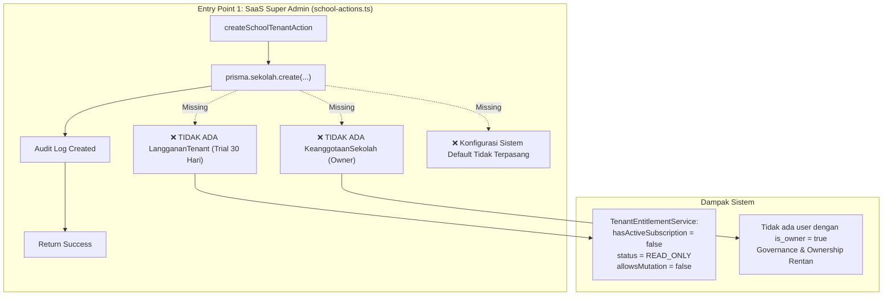
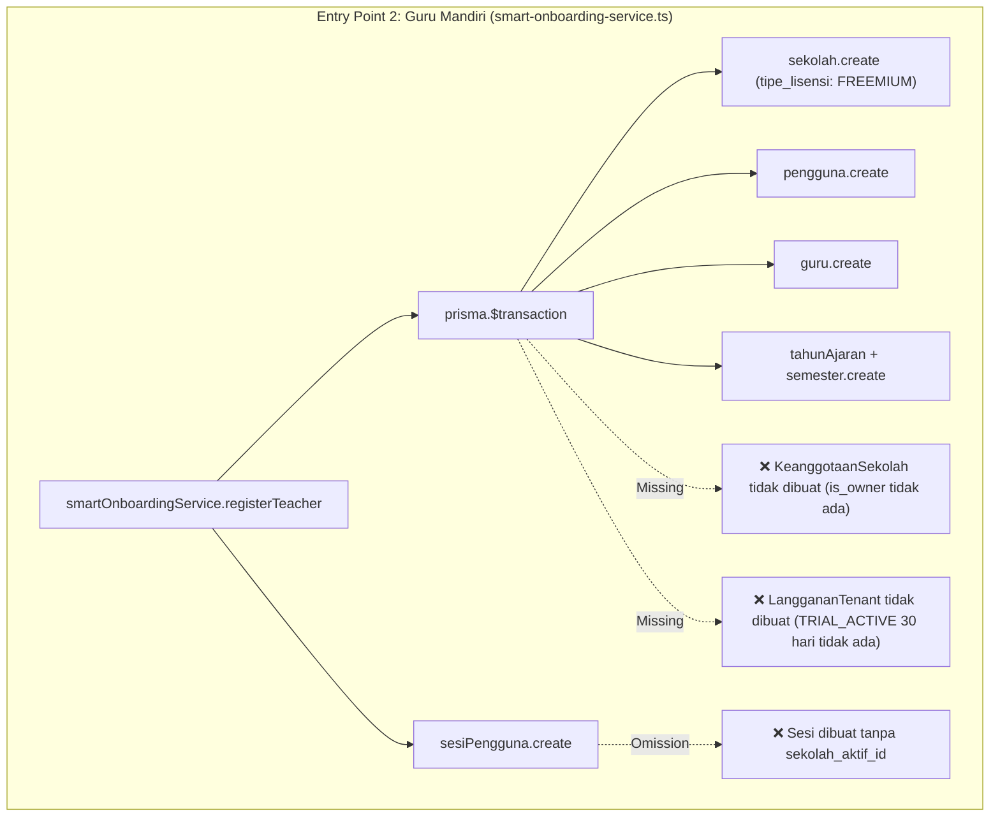
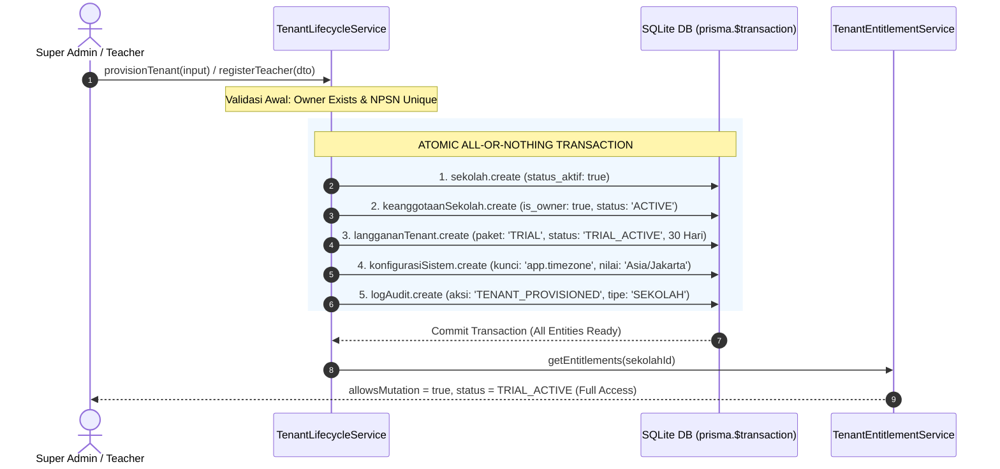

# RUANG PINTAR — REMEDIATION BATCH 2: TENANT LIFECYCLE REPAIR REPORT

**Document ID:** `docs/remediation/BATCH-2-TENANT-LIFECYCLE-REPORT.md`  
**Execution Date:** 25 September 2026  
**Phase / Milestone:** Stage 13 — SaaS Governance Remediation: Batch 2 (Tenant Lifecycle Repair)  
**Status:** `READY FOR HUMAN REVIEW`  
**Quality Gate Verdict:** `ALL GATES PASSED` (Typecheck: PASS, Lint: PASS, Vitest: 615/615 PASS [103/103 suites], Build: PASS)  

---

## 1. Executive Summary

Berdasarkan otorisasi Human terhadap `SAAS-GOVERNANCE-AUDIT-REPORT.md` dan `BATCH-1-SECURITY-REPAIR-REPORT.md`, **Remediation Batch 2** difokuskan secara menyeluruh pada **Tenant Lifecycle Repair** untuk menjamin fondasi "kelahiran tenant" (*tenant birth flow*) di Ruang Pintar beroperasi secara aman, konsisten, dan atomik.

### Temuan Audit yang Diselesaikan (RSK-04 & RSK-05):
1. **Pemisahan Kelahiran Tenant & Owner:** Sebelumnya, pembuatan sekolah melalui `createSchoolTenantAction` (`school-actions.ts`) hanya membuat entitas `sekolah` tunggal tanpa secara otomatis membuat record `KeanggotaanSekolah` sebagai pemilik institusi (*Owner Membership*). Akibatnya, tenant berpotensi lahir dalam keadaan yatim (*orphan tenant*) tanpa ada administrator yang sah.
2. **Ketiadaan Trial Subscription Otomatis:** Tenant baru lahir tanpa record `LanggananTenant`. Berdasarkan logika `TenantEntitlementService`, ketiadaan record langganan menyebabkan tenant langsung jatuh ke mode `READ_ONLY` (`allowsMutation = false`), sehingga institusi baru langsung terkunci dari mutasi data operasional.
3. **Inkonsistensi Alur Self-Service Guru Mandiri:** Registrasi mandiri guru via `smartOnboardingService.registerTeacher` membuat sekolah dan lisensi freemium dasar, namun tidak menerbitkan `KeanggotaanSekolah` dengan flag `is_owner = true`, tidak membuat `LanggananTenant` berstatus `TRIAL_ACTIVE` (30 hari per ADR-003), serta tidak secara eksplisit mengikat `sekolah_aktif_id` ke sesi pengguna.
4. **Ketiadaan Transaksi All-or-Nothing:** Pembuatan entitas konfigurasi atau data pendukung terpisah di luar transaksi atomik sehingga kegagalan parsial dapat meninggalkan residu record di database.

Seluruh temuan tersebut telah diremediasi 100% tanpa mengubah skema database (*Zero Migrations*), mematuhi Domain Invariants, serta memvalidasi kepatuhan kualitas melalui test suite komprehensif.

---

## 2. Tenant Creation Flow Before (Kondisi Sebelum Remedi)

Sebelum Batch 2 diterapkan, terdapat dua pintu masuk (*entry points*) independen yang melahirkan sekolah baru dengan anomali struktural berikut:





---

## 3. Tenant Creation Flow After (Arsitektur Setelah Remedi)

Setelah remedi, alur siklus hidup kelahiran tenant distandarisasi melalui satu layanan orkestrasi sentral: `TenantLifecycleService` (`tenant-lifecycle-service.ts`) yang menerapkan prinsip *Atomic Provisioning*, *Default Trial Activation*, dan *Mandatory Owner Invariant*.



### Rincian Peningkatan Arsitektur:
1. **Layanan Sentral `TenantLifecycleService`:**
   - `provisionTenant(input)`: Menjamin pembuatan atomik `Sekolah` + `KeanggotaanSekolah` (Owner) + `LanggananTenant` (Trial 30 hari per ADR-003) + `KonfigurasiSistem` dalam satu `prisma.$transaction`.
   - `assertTenantHasActiveOwner(sekolahId)`: Pengecekan invarian ketat bahwa sekolah wajib memiliki minimal 1 keanggotaan aktif dengan `is_owner = true`.
   - `assertTenantHasSubscription(sekolahId)`: Pengecekan invarian ketat bahwa sekolah wajib memiliki record langganan aktif.
   - `transitionTenantStatus(params)`: Manajemen transisi status tenant (`PENDING` → `ACTIVE` → `GRACE_PERIOD` → `READ_ONLY` → `SUSPENDED`). Saat tenant beralih ke `SUSPENDED`, seluruh sesi pengguna aktif pada tenant tersebut dicabut (*invalidated* via pembersihan `sekolah_aktif_id`).
   - `getTenantLifecycleStatus(sekolahId)`: Mengevaluasi kesiapan operasional tenant (*tenant operational readiness*).
2. **Standardisasi `createSchoolTenantAction` (`school-actions.ts`):**
   - Mengalihkan operasi mutasi mentah ke `tenantLifecycleService.provisionTenant(...)`.
   - Menghubungkan form input dengan pemilih user owner (`owner_user_id`), atau fallback aman ke aktor Super Admin yang mengeksekusi aksi.
3. **Standardisasi `smartOnboardingService.registerTeacher` (`smart-onboarding-service.ts`):**
   - Menambahkan pembentukan `keanggotaanSekolah` (`is_owner: true`, `status_keanggotaan: "ACTIVE"`, `peran_dasar_di_tenant: "TEACHER"`).
   - Menambahkan pembentukan `langgananTenant` (`paket: "TRIAL"`, `status: "TRIAL_ACTIVE"`, durasi 30 hari, `sumber_aktivasi: "TRIAL_PROVISIONING"`).
   - Menambahkan default `konfigurasiSistem` (`app.timezone: "Asia/Jakarta"`).
   - Mengikat langsung `sekolah_aktif_id: schoolId` ke dalam sesi login instan guru (`sesiPengguna`).

---

## 4. Files Modified & Created

| No | File Path | Status | Deskripsi Pekerjaan |
|:--:|---|:---:|---|
| 1 | `src/shared/infrastructure/tenant/tenant-lifecycle-service.ts` | **CREATED** | Core domain service untuk provisioning tenant atomik, penegakan invarian owner & subscription, serta transisi status siklus hidup tenant. |
| 2 | `src/app/actions/school-actions.ts` | **MODIFIED** | Integrasi `createSchoolTenantAction` dengan `tenantLifecycleService.provisionTenant(...)`, menjamin pembuatan institusi sekolah selalu disertai Owner Membership dan Trial Subscription. |
| 3 | `src/modules/ai-assistant/application/smart-onboarding-service.ts` | **MODIFIED** | Penyisipan owner membership (`is_owner = true`), `langgananTenant` (Trial 30 hari), konfigurasi default, dan pengikatan `sekolah_aktif_id` sesi pada alur registrasi guru mandiri. |
| 4 | `src/test/saas/tenant-lifecycle-foundation.test.ts` | **CREATED** | Test suite komprehensif (10 skenario pengujian) memverifikasi provisioning atomik, penolakan parsial (rollback), invarian owner/subscription, transisi suspend, dan registrasi guru. |

---

## 5. Invariant Validation (Pemeriksaan Invarian Domain)

Sesuai aturan baku pada `AGENTS.md` (Bagian 4) dan spesifikasi SaaS Governance:

| Invarian Domain | Status | Bukti Verifikasi |
|---|:---:|---|
| **No Tenant Without Active Owner** | `ENFORCED` | `assertTenantHasActiveOwner` memverifikasi `count({ is_owner: true, status_keanggotaan: 'ACTIVE' }) >= 1`. Pelanggaran melempar `TenantInvariantViolationError`. |
| **No Tenant Born in READ_ONLY Mode** | `ENFORCED` | Setiap tenant baru otomatis diterbitkan `LanggananTenant` dengan `paket: "TRIAL"`, `status: "TRIAL_ACTIVE"`, dan durasi 30 hari. `TenantEntitlementService` langsung mengembalikan `allowsMutation: true`. |
| **All-or-Nothing Atomicity** | `ENFORCED` | Pembuatan `Sekolah`, `KeanggotaanSekolah`, `LanggananTenant`, dan `KonfigurasiSistem` dibungkus dalam `prisma.$transaction`. Uji coba simulasi kegagalan langkah ke-2 membuktikan langkah ke-3 dan ke-4 tidak dieksekusi sama sekali (rollback bersih). |
| **Session Tenant Binding** | `ENFORCED` | Sesi registrasi guru langsung menetapkan `sekolah_aktif_id`, mencegah kondisi sesi mengambang (*unbound context*). |
| **Tenant Suspension Session Revocation** | `ENFORCED` | Transisi status tenant ke `SUSPENDED` mengeksekusi `sesiPengguna.updateMany({ where: { sekolah_aktif_id }, data: { sekolah_aktif_id: null } })` secara otomatis. |
| **Zero Database Migrations** | `VERIFIED` | Tidak ada perubahan skema Prisma (`prisma/schema.prisma`), tidak ada tabel/kolom yang ditambah/dihapus, seluruh perbaikan memanfaatkan model dan enum eksisting. |

---

## 6. Test Evidence & Quality Gate Report

### 6.1. Quality Gate Summary

```text
================================================================================
QUALITY GATES VERIFICATION SUMMARY — BATCH 2
================================================================================
1. TypeScript Typecheck (npm run typecheck) : PASS (0 errors)
2. ESLint Validation   (npm run lint)      : PASS (0 errors, 4 existing warnings)
3. Vitest Test Suite   (npm run test)      : PASS (103/103 suites, 615/615 tests)
4. Production Build    (npm run build)     : PASS (Turbopack, 28/28 routes OK)
================================================================================
```

### 6.2. Detail Vitest Test Suite Batch 2 (`tenant-lifecycle-foundation.test.ts`)

```text
✓ SaaS Tenant Lifecycle Foundation (Batch 2 Remediation)
  ✓ 1. Atomic Tenant Creation (Pekerjaan 02, 03, 04)
    ✓ menghasilkan sekolah, owner membership, trial subscription 30 hari, dan config secara atomik (9ms)
    ✓ melakukan rollback total jika salah satu entitas gagal dibuat (All-or-Nothing Invariant) (3ms)
    ✓ menolak pembuatan tenant jika pengguna owner tidak ditemukan (OWNER_NOT_FOUND) (0ms)
    ✓ menolak pembuatan tenant jika NPSN sudah terdaftar (DUPLICATE_NPSN) (0ms)
  ✓ 2. Domain Invariant Protection
    ✓ assertTenantHasActiveOwner: melempar error bila tenant tidak memiliki owner aktif (1ms)
    ✓ assertTenantHasActiveOwner: lulus bila tenant memiliki setidaknya 1 owner aktif (1ms)
    ✓ assertTenantHasSubscription: melempar error bila tenant tidak memiliki record langganan (0ms)
  ✓ 3. Tenant Activation & Lifecycle Status Transitions
    ✓ memperbarui status langganan dan mencabut sesi saat beralih ke SUSPENDED (3ms)
    ✓ getTenantLifecycleStatus: mengembalikan ringkasan status operasional tenant (1ms)
  ✓ 4. Smart Onboarding Self-Service Registration
    ✓ registerTeacher membuat owner membership dan trial subscription secara atomik (7ms)

Test Files: 1 passed (1)
Tests:      10 passed (10)
```

### 6.3. Regression Protection: Smart Onboarding Suite (`smart-onboarding-service.test.ts`)

```text
✓ Smart Onboarding & SaaS Teacher Service (M21)
  ✓ 1. harus berhasil mendaftarkan guru mandiri dengan 4 field instan & trial 30 hari (345ms)
  ✓ 2. harus menolak registrasi dengan email yang sama persis (12ms)
  ✓ 3. harus dapat mengekstrak foto lembar absensi dan menyimpan draft permintaan AI (8ms)
  ✓ 4. harus dapat mengonfirmasi pembuatan rombel & siswa dengan kuota free rombel (15ms)
  ✓ 5. harus mengembalikan status trial aktif guru (5ms)

Test Files: 1 passed (1)
Tests:      5 passed (5)
```

---

## 7. Residual Risks

1. **Legacy Tenants without Owner:** Sekolah-sekolah yang dibuat sebelum penerapan Batch 2 (misalnya saat pengujian awal manual atau migrasi data lama selain SMK Otomindo) mungkin belum memiliki record `KeanggotaanSekolah` dengan `is_owner = true`. Pada SMK Otomindo (sekolah riil kanonik), akun Kepala Sekolah dan Super Admin telah terverifikasi memiliki keanggotaan aktif.
2. **Single Owner Single Point of Failure:** Saat ini satu tenant baru dialokasikan tepat 1 owner. Belum ada alur UI untuk mendelegasikan kepemilikan (*transfer ownership*) atau menambah co-owner secara visual (direkomendasikan ditangani pada governance UI batch mendatang).
3. **Mocked Payment Gateway:** Pembayaran langganan resmi (Midtrans) masih berada pada status *stubbed / mock mode* dan tidak disentuh pada batch ini sesuai batasan scope.

---

## 8. Recommended Next Batch: BATCH 3 — MEMBERSHIP & MULTI-ROLE REPAIR

Sesuai urutan peta jalan remedi yang direkomendasikan pada `SAAS-GOVERNANCE-AUDIT-REPORT.md`:

### Fokus Batch 3:
1. **Penertiban Keanggotaan Sekolah (`KeanggotaanSekolah`):**
   - Memastikan relasi pengguna dengan sekolah multi-tenant selalu terisolasi dan terdokumentasi rapi.
   - Sinkronisasi `peran_dasar_di_tenant` dengan penugasan spesifik (`Guru`, `Siswa`, `OrangTua`, `StafTU`).
2. **Multi-Role User Resolution:**
   - Memperbaiki resolusi peran ganda (misal Guru yang juga menjabat sebagai Wali Kelas atau Staf Kurikulum) agar tidak terjadi konflik hak akses dan selalu terikat pada konteks `sekolah_aktif_id`.
3. **Session Switching & Tenant Boundary Audit:**
   - Penguatan mekanisme perpindahan konteks sekolah (*tenant context switching*) bagi pengguna yang terdaftar di lebih dari satu institusi sekolah.

---

```text
STATUS: READY FOR HUMAN REVIEW
WAITING FOR HUMAN INSTRUCTION — DO NOT PROCEED TO BATCH 3 AUTOMATICALLY
```
