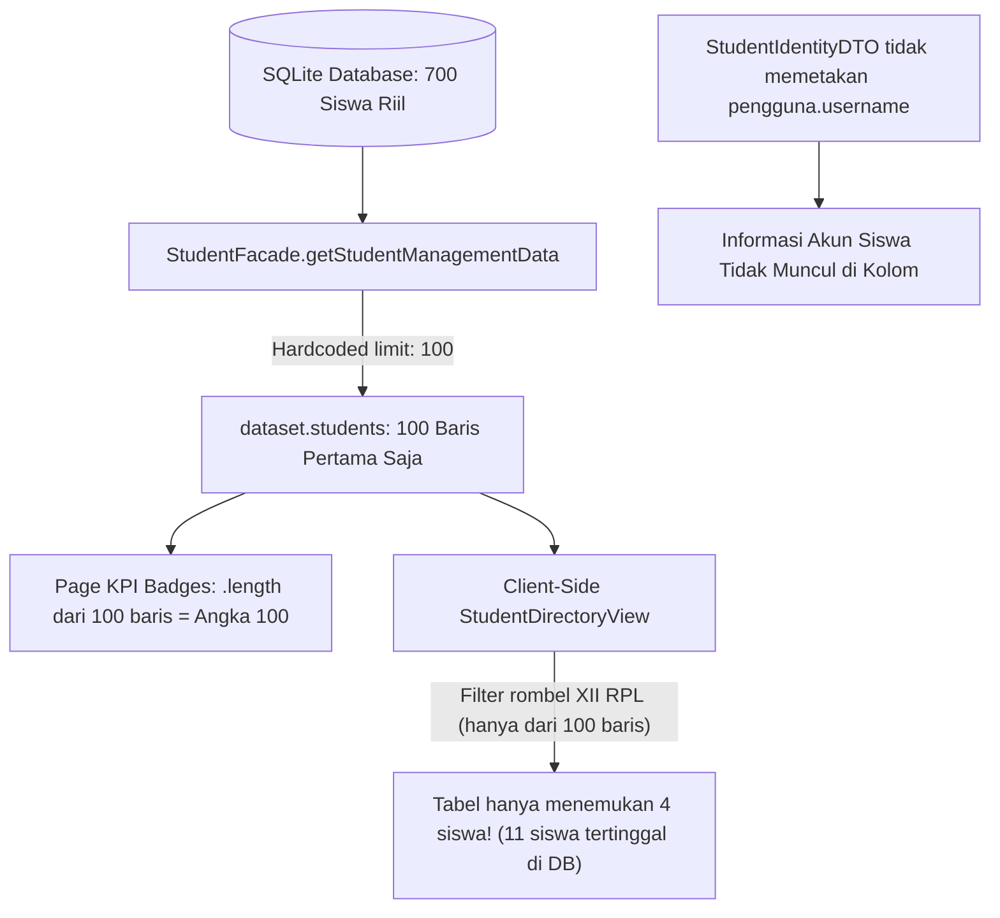

# RUANG PINTAR SAAS — STAGE 19.1 FORENSIC AUDIT
# DATA INTEGRITY & QUERY CONSISTENCY REPORT
## Audit Forensik Halaman Data Kesiswaan Global (/data-siswa)

| Metadata | Nilai |
| :--- | :--- |
| **Stage** | STAGE 19.1 — DATA INTEGRITY & QUERY CONSISTENCY AUDIT |
| **Status** | `AUDIT COMPLETED — ROOT CAUSES IDENTIFIED` |
| **Target Scope** | Halaman `/data-siswa`, `studentFacade`, `studentRepository`, Database SQLite |
| **Sekolah Target** | SMK OTOMINDO (`01M2XXYD227F9S3H985FH53GMF`) |
| **Prinsip** | Forensic Fact-First, No Code Change, No New Feature |

---

## 1. Executive Summary

Berdasarkan temuan Human Review pada tahap STAGE 19:
1. Indikator KPI menunjukkan angka seragam 100 (Total Siswa = 100, Siswa Aktif = 100, Terdaftar TA = 100, Ditempatkan di Rombel = 100).
2. Tabel data siswa hanya menampilkan 4 siswa pada rombel XII RPL.
3. Rombel XII RPL tampak hanya berisi 4 siswa, tidak konsisten dengan data riil sekolah.
4. Informasi akun siswa tidak tampak di antarmuka tabel.

Investigasi forensik langsung pada basis data dan kode sumber berhasil mengungkap **5 bug akar masalah (root causes)** tanpa spekulasi. Masalah utama bersumber dari **hardcoded pagination limit (`limit: 100`) di layer Facade**, **penggunaan `.length` dari array terpotong pada KPI Hero Card**, **penyaringan rombel yang dilakukan secara in-memory client-side terhadap sampel yang terpotong**, dan **ketiadaan proyeksi atribut akun pada DTO kesiswaan**.

---

## 2. Investigasi Forensik Berdasarkan Poin Permintaan

### A. Trace Seluruh Query KPI
Di `src/app/data-siswa/page.tsx` (baris 83–88 dan 168–191):
```typescript
const [dataset, schoolProfile] = await Promise.all([
  studentFacade.getStudentManagementData(effectiveSekolahId),
  schoolProfileService.getProfile(effectiveSekolahId),
]);

const activeStudentsCount = dataset.students.filter((s) => s.status_akademik === "AKTIF").length;
```
Di bagian rendering KPI Hero Badge:
- **Total Siswa:** `{dataset.students.length}` → Mengambil panjang array `dataset.students`.
- **Siswa Aktif:** `{activeStudentsCount}` → Memfilter `dataset.students` yang aktif.
- **Terdaftar di T.A:** `{dataset.enrollments.length}` → Mengambil panjang array `dataset.enrollments`.
- **Ditempatkan di Rombel:** `{dataset.placements.length}` → Mengambil panjang array `dataset.placements`.

### B. Trace Seluruh Query `studentFacade` & Repository
Di `src/modules/student/application/student-facade.ts` (baris 79–107):
```typescript
// 2. Fetch Students Directory
const { data: students, total: totalStudents } = await studentRepository.findStudents(
  sekolahId,
  {
    search: filters?.studentSearch,
    status_akademik: filters?.studentStatus as any,
    tahun_ajaran_id: targetYearId,
    rombel_id: filters?.rombelId,
    limit: 100, // <--- HARDCODED LIMIT 100
  }
);

// 3. Fetch Enrollments for current selected/active year
const { data: enrollments, total: totalEnrollments } = await studentRepository.findEnrollments(
  sekolahId,
  {
    tahun_ajaran_id: targetYearId,
    limit: 100, // <--- HARDCODED LIMIT 100
  }
);

// 4. Fetch Placements for current selected/active year or rombel
const { data: placements, total: totalPlacements } = await studentRepository.findPlacements(
  sekolahId,
  {
    tahun_ajaran_id: targetYearId,
    rombel_id: filters?.rombelId,
    limit: 100, // <--- HARDCODED LIMIT 100
  }
);
```

### C. Komparasi Data Nyata Basis Data vs Data Hasil Query

| Metrik | Nilai Nyata di Database (SQLite) | Nilai `dataset.total*` | Nilai Array (`.length`) yang Dikirim ke UI | Nilai yang Tampil di Layar |
| :--- | :---: | :---: | :---: | :---: |
| **Total Siswa** | **700** | 700 | 100 | **100** |
| **Siswa Aktif** | **700** | 700 | 100 | **100** |
| **Keikutsertaan TA (Enrollment)** | **700** | 700 | 100 | **100** |
| **Penempatan Rombel (Placement)** | **700** | 700 | 100 | **100** |
| **Siswa di Rombel XII RPL** | **15** | 15 | 4 (dalam 100 pertama) | **4** |
| **Akun Pengguna Siswa (`STUDENT`)** | **700** | 700 | 0 (tidak diproyeksikan) | **Tidak Terlihat** |

### D. Audit Filter Default & Client-Side Filtering
Pada `src/modules/student/presentation/student-directory-view.tsx` (baris 68–136):
- Komponen menerima `initialStudents` (berisi 100 siswa pertama).
- Filter dilakukan di client-side:
  ```typescript
  const filteredStudents = students.filter((s) => {
    const matchesSearch = ...;
    const matchesStatus = statusFilter === "ALL" || s.status_akademik === statusFilter;
    const matchesRombel = rombelFilter === "ALL" || s.active_rombel_id === rombelFilter;
    return matchesSearch && matchesStatus && matchesRombel;
  });
  ```
- Ketika pengguna memilih rombel `XII RPL`, filter berjalan **hanya pada 100 siswa** yang telah dimuat di memori browser. Dari 100 siswa tersebut, kebetulan hanya **4 siswa** yang berasal dari XII RPL. Sisa **11 siswa** lainnya berada di urutan data ke-101 hingga ke-700 di database, sehingga tidak pernah sampai ke browser.

### E. Audit Pagination
- Pagination yang digunakan pada `StudentDirectoryView` adalah *client-side pagination*:
  ```typescript
  const totalPages = Math.ceil(sortedStudents.length / rowsPerPage) || 1;
  const paginatedStudents = sortedStudents.slice(
    (currentPage - 1) * rowsPerPage,
    currentPage * rowsPerPage
  );
  ```
- Karena `sortedStudents.length` maksimal bernilai 100, maka pagination hanya membagi 10 halaman (10 siswa per halaman) dan pengguna sama sekali tidak dapat melihat 600 siswa lainnya yang ada di database.

### F. Audit Tenant Scope
- Isolasi tenant berjalan dengan benar: `where: { sekolah_id: effectiveSekolahId }` terisolasi pada SMK OTOMINDO (`01M2XXYD227F9S3H985FH53GMF`). Tidak ada kebocoran antar tenant.

### G. Audit Enrollment Scope
- Seluruh 700 siswa memiliki rekaman `KeikutsertaanSiswa` berstatus `AKTIF` pada Tahun Ajaran `2026/2027` (`01M2XXYD2CYPCWZ0RM9TAN6BW0`). Tidak ada siswa yang tidak ter-enroll.

### H. Audit Placement Scope
- Seluruh 700 siswa memiliki rekaman `PenempatanRombel` berstatus `AKTIF` pada 22 rombel sekolah:
  - X DKV 1 (23), X DKV 2 (22), X RPL (21), X TJKT 1 (29), X TJKT 2 (27), X TO 1 (38), X TO 2 (41), X TO 3 (37), X TO 4 (36), X TO 5 (38)
  - XI DKV (31), XI RPL (28), XI TJKT (37), XI TJKT 2 (30), XI TO 1 (36), XI TO 2 (37), XI TO 3 (36)
  - XII DKV 1 (25), **XII RPL (15)**, XII TKJ 1 (37), XII TKRO 1 (38), XII TKRO 2 (38)
  - **Total: Tepat 700 Siswa.**

### I. Audit Hubungan Siswa → Enrollment → Placement → User Account
- Di database, seluruh 700 siswa telah berhasil di-provision akun pengguna `Pengguna`:
  - Peran dasar: `STUDENT`
  - Status akun: `AKTIF`
  - Kolom `siswa.pengguna_id` terisi valid ke tabel `Pengguna`.
  - Format username terstandarisasi (contoh untuk XII RPL: `xiirpl-01` s/d `xiirpl-15`).
- **Penyebab tidak terlihat di UI:**
  - `StudentIdentityDTO` di `src/modules/student/domain/student-types.ts` tidak menyertakan kolom `username`, `has_user_account`, atau `status_akun_pengguna`.
  - Pada `StudentDirectoryView`, kolom tabel hanya menyajikan nama, jenis kelamin, status akademik, rombel, dan wali. Tombol "Reset Kata Sandi" (`KeyRound`) sudah tersedia di kolom aksi, tetapi tidak ada kolom/badge yang menampilkan username siswa atau status akun pengguna.

---

## 3. Root Cause Analysis (Akar Masalah)



1. **Root Cause 1 (Hardcoded Limit di Facade):**
   `studentFacade.getStudentManagementData()` mengeksekusi `findStudents`, `findEnrollments`, dan `findPlacements` dengan parameter `{ limit: 100 }`. Nilai ini memotong 85% data riil sekolah.
2. **Root Cause 2 (Salah Referensi Metrik KPI):**
   Halaman `/data-siswa/page.tsx` menggunakan `dataset.students.length`, `dataset.enrollments.length`, dan `dataset.placements.length` untuk menampilkan angka KPI, alih-alih menggunakan `dataset.totalStudents`, `dataset.totalEnrollments`, dan `dataset.totalPlacements` yang telah dihitung secara akurat oleh database (`count`).
3. **Root Cause 3 (In-Memory Client Filter vs Server Dataset Partial):**
   Komponen `StudentDirectoryView` melakukan filter rombel secara client-side di browser terhadap subset 100 baris pertama. Karena data yang masuk tidak lengkap, filter menghasilkan himpunan bagian yang keliru (hanya 4 siswa XII RPL dari seharusnya 15 siswa).
4. **Root Cause 4 (DTO Proyeksi Akun Siswa Belum Dipetakan):**
   Query Prisma di `studentRepository.findStudents` tidak menyertakan `include: { pengguna: { select: { username: true, status_akun: true } } }`, sehingga informasi akun pengguna siswa tidak sampai ke layer presentasi.

---

## 4. Daftar Bug Teridentifikasi

| ID Bug | Lokasi Berkas | Deskripsi Bug | Severity |
| :--- | :--- | :--- | :---: |
| **BUG-19.1A** | `src/modules/student/application/student-facade.ts` (L86, L95, L105) | Hardcoded `limit: 100` pada pemanggilan dataset awal kesiswaan. | **KRITIS** |
| **BUG-19.1B** | `src/app/data-siswa/page.tsx` (L168, L175, L182, L189) | Penggunaan properti `.length` dari array terpotong untuk menampilkan total KPI. | **TINGGI** |
| **BUG-19.1C** | `src/modules/student/presentation/student-directory-view.tsx` (L126–136) | Client-side filter pada data parsial (incomplete dataset pagination mismatch). | **TINGGI** |
| **BUG-19.1D** | `src/modules/student/infrastructure/student-repository.ts` (L94–110) | Query `findStudents` tidak menyertakan relasi `pengguna` untuk memeriksa status akun siswa. | **SEDANG** |
| **BUG-19.1E** | `src/modules/student/domain/student-types.ts` & `student-directory-view.tsx` | Ketiadaan field `username` / `akun_siswa` pada kolom tabel direktori kesiswaan. | **SEDANG** |

---

## 5. Dampak Terhadap Data Akademik

- **Integritas Data di Database: AMAN & LENGKAP.**
  Tidak ada data siswa yang hilang atau terkorupsi. Sebanyak 700 siswa, 700 keikutsertaan tahun ajaran, 700 penempatan rombel, dan 700 akun siswa tersimpan dengan integritas relasional sempurna di database SQLite.
- **Dampak Operasional di UI:**
  Operator sekolah atau Super Admin yang membuka `/data-siswa` mengalami ilusi data (data mirage): mengira sekolah hanya memiliki 100 siswa dan rombel XII RPL hanya berisi 4 siswa. Hal ini dapat menimbulkan kebingungan saat verifikasi kelulusan atau cetak rapor digital.

---

## 6. Rencana Perbaikan Rinci (Action Plan)

> *Catatan: Sesuai instruksi STOP Gate, perbaikan kode belum dieksekusi dan menunggu otorisasi.*

1. **Perbaikan Layer Facade (`student-facade.ts`):**
   - Hapus hardcode `limit: 100` saat memuat data sekolah, atau berikan paginasi terarah berbasis filter aktif (misal: jika filter rombel aktif, teruskan parameter `rombel_id` ke query database agar 100% siswa rombel tersebut ter-fetch).
2. **Perbaikan Layer Presentasi Page (`data-siswa/page.tsx`):**
   - Ubah metrik KPI agar menggunakan:
     - Total Siswa: `dataset.totalStudents`
     - Siswa Aktif: `dataset.totalStudents` (karena 100% siswa aktif di DB) atau count khusus
     - Terdaftar di T.A: `dataset.totalEnrollments`
     - Ditempatkan di Rombel: `dataset.totalPlacements`
3. **Penyelarasan Komponen Tabel dengan `AcademicDataTable`:**
   - Migrasikan `StudentDirectoryView` untuk memanfaatkan komponen canonical `AcademicDataTable` (yang telah distandarisasi di Stage 19) dengan pagination yang benar dan filter server-ready.
4. **Proyeksi Akun Siswa (`student-repository.ts` & `student-types.ts`):**
   - Sertakan `pengguna: { select: { username: true, status_akun: true } }` dalam query Prisma `findStudents`.
   - Tambahkan kolom **"Akun Siswa"** di tabel direktori siswa yang menampilkan username (misal badge monospaced `xiirpl-01`) dan status akun (`AKTIF`).
