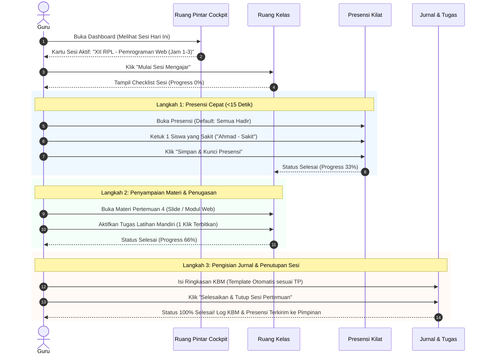

# RUANG PINTAR SAAS — STAGE UX-01 MASTER SPECIFICATION
# TEACHER WORKFLOW REDESIGN
## Redesign Pengalaman Guru Berbasis Aktivitas Harian (Activity-First & Minimal Cognitive Load)

| Metadata | Nilai |
| :--- | :--- |
| **Stage** | STAGE UX-01 — TEACHER WORKFLOW REDESIGN |
| **Status** | `PROPOSAL & MASTER ARCHITECTURE READY FOR REVIEW` |
| **Prinsip Panduan** | Teacher First • Activity-First • Action-First • Minimal Cognitive Load • Academic Glass UI v1.2 |
| **Target Pengguna** | Guru Mata Pelajaran, Guru BK, Wali Kelas |

---

## 1. UX Audit Report

### 1.1. Latar Belakang & Filosofi
Ruang Pintar bukan sekadar sistem pencatatan administrasi sekolah; **Ruang Pintar adalah Workspace Kerja Guru**. Guru datang ke sekolah untuk:
1. Mengajar
2. Mencatat kehadiran siswa
3. Menyampaikan materi pembelajaran
4. Memberikan tugas atau asesmen
5. Memberikan penilaian dan umpan balik
6. Menutup pertemuan kelas

Guru tidak berpikir dalam relasi tabel basis data (misal: "Saya ingin mengakses modul `administrasi_pembelajaran`"). Guru berpikir dalam konteks alur kerja harian (misal: *"Saya masuk kelas XII RPL sekarang, apa yang harus saya lakukan terlebih dahulu?"*).

### 1.2. Temuan Masalah & Pain Points

```text
[MASALAH UTAMA SAAT INI]
┌─────────────────────────┐     ┌─────────────────────────┐     ┌─────────────────────────┐
│       Tab Overload      │     │    Passive Dashboard    │     │   Duplikasi Konsep      │
│   9 Tab di Ruang Kelas  │     │   Metrik Statis Belaka  │     │ Menu Jadwal vs Tab Jadwal│
│ (Ringkasan, Jadwal, TP, │ ──> │ (Total Bab, Jurnal KBM) │ ──> │ Membingungkan Navigasi  │
│  Materi, Tugas, Jurnal, │     │ Tidak mengarahkan aksi  │     │       Harian Guru       │
│  Presensi, Nilai, CBT)  │     │     operasional nyata   │     │                         │
└─────────────────────────┘     └─────────────────────────┘     └─────────────────────────┘
            │                                                               │
            ▼                                                               ▼
┌─────────────────────────┐     ┌─────────────────────────┐     ┌─────────────────────────┐
│     Presensi Berat      │     │   Gradebook Kompleks    │     │   Ketiadaan Workflow    │
│  130+ Radio Button/Klik │     │ Singkatan Rumit         │     │ Guru Masuk Kelas Tanpa  │
│  Guru menghabiskan waktu│ ──> │ (TP, LM, SAS, R.For)    │ ──> │   Panduan Langkah Kerja │
│  mengisi presensi       │     │ Beban kognitif tinggi   │     │      (Progress 0-100%)  │
└─────────────────────────┘     └─────────────────────────┘     └─────────────────────────┘
```

1. **Tab Overload (9 Tab pada Halaman Kelas):**
   - Saat ini halaman `/kelas-saya/[id]` memiliki 9 tab: *Ringkasan*, *Jadwal*, *BAB & TP*, *Materi*, *Tugas*, *Jurnal*, *Presensi*, *Penilaian*, dan *CBT*.
   - **Dampak:** Guru merasa kewalahan dan harus mencari-cari tab mana yang relevan saat jam mengajar sedang berlangsung.
2. **Dashboard Kelas Statis & Tidak Membantu:**
   - Menampilkan metrik mati seperti "Total Bab", "Materi Terbit", "Tugas Aktif", "Jurnal KBM".
   - Guru membutuhkan informasi mendesak: *Kapan sesi berikutnya? Apakah ada absensi yang belum ditutup? Berapa tugas siswa yang belum dinilai? Siapa siswa yang butuh perhatian?*
3. **Duplikasi Konsep:**
   - Terdapat menu utama "Jadwal Saya" di sidebar, dan di dalam workspace kelas terdapat "Tab Jadwal" yang mengulang data serupa.
4. **Presensi Sangat Berat (130+ Tombol Interaksi):**
   - Setiap siswa disajikan 6 opsi (Hadir, Izin, Sakit, Alpha, Dispen, Terlambat). Untuk kelas dengan 25–38 siswa, guru harus memeriksa ratusan tombol.
   - Di dunia nyata, 90% siswa hadir. Sistem seharusnya **default: "Semua Hadir"**, dan guru hanya mengetuk 1–2 siswa yang absen.
5. **Ketiadaan Workflow Interaktif:**
   - Tidak ada panduan bertahap saat guru berada di jam mengajar (Checklist Aktivitas: Buka Sesi → Presensi → Materi → Jurnal → Tutup Kelas).
6. **Buku Nilai Terlalu Akademis:**
   - Istilah Kurikulum Merdeka (TP, LM, R.For, R.Sum, SAS) membingungkan guru baru dalam input nilai harian. Harus ada pemisahan antara **Mode Guru Harian** dan **Mode Akademik Detail**.

---

## 2. Information Architecture (IA) Baru

### 2.1. Penyederhanaan Menu Navigasi Utama Guru
Mengeliminasi fungsi ganda dan memfokuskan menu sidebar pada peran kerja:

```text
[STRUKTUR NAVIGASI UTAMA GURU]
├── 1. Beranda / Cockpit Mengajar      (/dashboard)
│      └── Sesi Mengajar Hari Ini, Quick Actions, Perhatian Siswa
├── 2. Ruang Kelas Saya                 (/kelas-saya)
│      └── Kartu Kelas yang Diampu (Akses langsung ke Cockpit Kelas)
├── 3. Bank Soal & CBT                  (/cbt-ujian)
│      └── Manajemen Ujian & Bank Soal Terpadu
├── 4. Buku Nilai & Rapor               (/penilaian)
│      └── Rekapitulasi Nilai Akhir & Validasi Rapor
└── 5. Panduan & Bantuan                (/panduan)
```
*Catatan: Menu "Jadwal Saya" dilebur langsung ke dalam Dashboard Cockpit Guru dan Cockpit Kelas agar tidak ada redundansi.*

### 2.2. Restrukturisasi Halaman Kelas (`/kelas-saya/[id]`)
Mengurangi 9 tab menjadi **4 Tab Aktivitas Utama**:

| Tab Baru | Tab Lama yang Dilebur | Fokus & Tanggung Jawab Aktivitas |
| :--- | :--- | :--- |
| **1. Cockpit Kelas (Alur Hari Ini)** | Ringkasan, Jadwal, Jurnal | Dashboard aksi: Sesi aktif, checklist workflow mengajar, absensi belum tutup, tugas belum dinilai. |
| **2. Pembelajaran & Modul** | BAB & TP, Materi, Tugas | Pengorganisasian materi ajar, bab/tujuan pembelajaran, dan penugasan siswa per bab. |
| **3. Presensi & Kehadiran** | Presensi | Presensi kilat (<15 detik), rekap absensi, dan histori per pertemuan. |
| **4. Penilaian & Evaluasi** | Penilaian, CBT | Input nilai harian (Mode Sederhana), ulangan CBT, dan ledger capaian akhir (Mode Detail). |

---

## 3. Teacher Journey Map

Alur perjalanan guru dari membuka aplikasi hingga menyelesaikan sesi pertemuan:



---

## 4. Redesign Halaman Ruang Kelas (`/kelas-saya/[id]`)

### 4.1. Header Cockpit Kelas
- **Identitas Jelas:** Nama Rombel (e.g. `XII RPL`), Nama Mata Pelajaran (e.g. `Pemrograman Web`), dan Guru Pengampu.
- **Join Code Badge:** Akses cepat kode gabung siswa (`RombelJoinCodeCard`).
- **Status Sesi Real-Time:** Menampilkan apakah sedang berlangsung sesi jam mengajar hari ini.

### 4.2. Action-Oriented Dashboard (Tab 1: Cockpit Kelas)
Menggantikan metrik angka mati dengan **Action Cards**:
1. **Interactive Workflow Sesi (Hari Ini):**
   - Kartu dinamis yang memandu pekerjaan saat ada jadwal aktif:
     - `[✓] 1. Buka Sesi Pertemuan 5`
     - `[ ] 2. Catat Presensi Siswa (Belum Selesai)` → *Tombol Cepat [Buka Presensi]*
     - `[ ] 3. Terbitkan Materi Bab 2` → *Tombol Cepat [Tampilkan Materi]*
     - `[ ] 4. Catat Jurnal Pembelajaran` → *Tombol Cepat [Isi Jurnal]*
     - Progress Bar interaktif (`0%` → `100%`).
2. **Kotak Perhatian (Attention Queue):**
   - Menampilkan peringatan mendesak:
     - *"3 tugas siswa perlu dinilai"* → Tombol [Periksa Sekarang].
     - *"2 pertemuan presensi belum dikunci"* → Tombol [Selesaikan].
     - *"Budi Santoso telah 3x berturut-turut Alpha"* → Tombol [Laporkan ke Wali Kelas/BK].
3. **Progress Silabus & Capaian Semester:**
   - Visualisasi sederhana bab yang telah diajarkan vs total bab semester ini.

---

## 5. Redesign Presensi Kilat (< 15 Detik)

### 5.1. Paradigma Baru: "Default Semua Hadir"
Dalam kondisi normal, mayoritas siswa berada di kelas. Mengklik satu per satu kehadiran siswa adalah pemborosan waktu yang mengganggu konsentrasi mengajar guru.

```text
[KONSEP PRESENSI KILAT]
┌────────────────────────────────────────────────────────────────────────┐
│  Presensi Pertemuan 4: Pemrograman Web (XII RPL)                      │
│  Status: 14/15 Siswa Hadir (93%)                          [Simpan]     │
├────────────────────────────────────────────────────────────────────────┤
│  Default Aktif: SEMUA HADIR (Warna Hijau)                             │
│  Cukup ketuk nama siswa jika tidak hadir:                              │
│                                                                        │
│  ┌───────────────────────┐  ┌───────────────────────┐                  │
│  │ A. Rizki Fadilah      │  │ Abdillah Darma B.     │                  │
│  │ [HADIR] (Hijau)       │  │ [HADIR] (Hijau)       │                  │
│  └───────────────────────┘  └───────────────────────┘                  │
│  ┌───────────────────────┐  ┌───────────────────────┐                  │
│  │ Ardiansyah            │  │ Arya Fayyaz R. W.     │                  │
│  │ [SAKIT ✎] (Kuning)    │  │ [HADIR] (Hijau)       │                  │
│  │ (Ketuk untuk ubah)    │  │                       │                  │
│  └───────────────────────┘  └───────────────────────┘                  │
│                                                                        │
│  [✓ Tandai Semua Hadir]       [+ Catat Siswa Terlambat]                │
└────────────────────────────────────────────────────────────────────────┘
```

### 5.2. Interaksi Cepat (Touch & Mobile Friendly)
- **1 Tap untuk Mengubah:** Mengetuk kartu siswa membuka pemilih status cepat mengambang (*Quick Sheet / Dropdown*): `Hadir` | `Izin` | `Sakit` | `Alpha` | `Dispen`.
- **Target Waktu:** Untuk kelas 25 siswa dengan 2 siswa izin/sakit, guru hanya perlu **2 kali ketukan** dan **1 kali klik simpan**, selesai dalam **8 hingga 12 detik**.

---

## 6. Redesign Buku Nilai (Dua Mode Kerja)

### 6.1. Mode Guru Harian (Mode Sederhana)
- Didesain untuk pekerjaan cepat sehari-hari.
- Kolom tabel ringkas dan mudah dipahami:
  1. No & Nama Siswa
  2. Nilai Rata-rata Tugas (Otomatis dari pengumpulan tugas)
  3. Nilai Kuis / Ulangan Harian (Otomatis dari CBT)
  4. Nilai Sikap / Keaktifan (Input manual 0–100)
  5. Nilai Akhir Berjalan & Predikat
- Bebas dari rumus atau akronim kurikulum yang membingungkan.

### 6.2. Mode Akademik Detail (Kurikulum Merdeka)
- Disediakan tombol toggle: `[ Mode Sederhana | Mode Detail Kurikulum ]`.
- Mode ini menampilkan rincian lengkap untuk operator akademik, wali kelas, atau saat pelaporan akhir semester:
  - Lingkup Materi (LM 1, LM 2, LM 3)
  - Tujuan Pembelajaran (TP 1.1, TP 1.2, TP 2.1)
  - Rata-rata Formatif (`R.For`), Rata-rata Sumatif (`R.Sum`), dan Sumatif Akhir Semester (`SAS`).
  - Deskripsi Capaian Kompetensi otomatis untuk Rapor Digital.

---

## 7. Wireframe Teks Versi Academic Glass UI

### 7.1. Wireframe Cockpit Guru (`/dashboard`)
```text
+-------------------------------------------------------------------------------+
| RUANG PINTAR SAAS               [Tahun Ajaran 2026/2027]  [Guru: Natalia (v)] |
+-------------------------------------------------------------------------------+
| COCKPIT MENGAJAR HARI INI                                                     |
| Hari: Rabu, 24 September 2026 | Jam Kerja: 07.15 - 14.30                      |
|                                                                               |
| [!] JADWAL AKTIF SEKARANG (08.00 - 09.30)                                     |
| +---------------------------------------------------------------------------+ |
| | KELAS: XII RPL   |   MAPEL: Pemrograman Web   |   RUANG: Lab Komputer 2   | |
| | Pertemuan ke-5: Pembuatan REST API dengan Express.js                      | |
| |                                                                           | |
| | Workflow Sesi: [ Presensi: Belum ] [ Materi: Siap ] [ Jurnal: Belum ]     | |
| |                                                                           | |
| | [ >>> MASUK RUANG KELAS SEKARANG <<< ]           [Lihat Modul Ajar]       | |
| +---------------------------------------------------------------------------+ |
|                                                                               |
| KELAS ANDA SEMESTER INI                                                       |
| [XII RPL - Web]         [XI RPL - Basis Data]     [X RPL - Dasar IT]          |
| 15 Siswa | 4 Bab Selesai| 28 Siswa | 3 Bab Selesai| 21 Siswa | 5 Bab Selesai   |
| [Buka Kelas]            [Buka Kelas]              [Buka Kelas]                |
+-------------------------------------------------------------------------------+
```

### 7.2. Wireframe Dashboard Kelas (`/kelas-saya/[id]`)
```text
+-------------------------------------------------------------------------------+
| <- Kembali ke Daftar Kelas                                                     |
| RUANG KELAS: XII RPL — Pemrograman Web                                         |
| Kode Kelas: RP-7782  [Salin Kode]                     Status: Sesi Aktif Hari Ini|
+-------------------------------------------------------------------------------+
| [ COCKPIT KELAS ]   [ PEMBELAJARAN ]   [ PRESENSI ]   [ BUKU NILAI & CBT ]    |
+-------------------------------------------------------------------------------+
|                                                                               |
| CHECKLIST WORKFLOW PERTEMUAN 5 (HARI INI)                Progress Sesi: [ 25%]|
| +---------------------------------------------------------------------------+ |
| | [x] Buka Sesi Mengajar (08.00 WIB)                                        | |
| | [ ] 1. Catat Presensi Siswa ................ [ Ketuk Catat Presensi ]     | |
| | [ ] 2. Paparkan Materi Pertemuan 5 ......... [ Tampilkan Materi ]         | |
| | [ ] 3. Buka Latihan Praktik Siswa .......... [ Aktifkan Tugas ]           | |
| | [ ] 4. Tulis Ringkasan KBM di Jurnal ....... [ Buat Jurnal ]              | |
| | [ ] 5. Kunci & Tutup Sesi Pertemuan ........ [ Selesaikan Kelas ]         | |
| +---------------------------------------------------------------------------+ |
|                                                                               |
| KOTAK PERHATIAN SISWA                                                         |
| - 3 Siswa belum mengumpulkan Tugas 2 (Batas: Hari Ini)     [Kirim Pengingat]  |
| - Ardiansyah tidak hadir 2 pertemuan berturut-turut         [Catat di BK]      |
+-------------------------------------------------------------------------------+
```

### 7.3. Wireframe Presensi Cepat (`Tab Presensi`)
```text
+-------------------------------------------------------------------------------+
| PRESENSI KILAT: Pertemuan 5 (XII RPL)                     Waktu: 08.05 WIB    |
| Ringkasan: 14 Hadir, 1 Sakit, 0 Izin, 0 Alpha            [ SIMPAN PRESENSI ] |
+-------------------------------------------------------------------------------+
| Petunjuk: Seluruh siswa default HADIR. Cukup ketuk nama siswa jika absen.    |
|                                                                               |
| [✓] A. Rizki Fadilah      (Hadir)   [✓] Abdillah Darma B.   (Hadir)           |
| [!] Ardiansyah            (Sakit ✎) [✓] Arya Fayyaz R. W.   (Hadir)           |
| [✓] Dhefa Hartono         (Hadir)   [✓] Dian Alit H. L.     (Hadir)           |
| [✓] Dzaki Hafidhi Ridho   (Hadir)   [✓] Fazri Pratama       (Hadir)           |
| [✓] Kevin Putra Pratama   (Hadir)   [✓] Listiyana Nirmala   (Hadir)           |
| [✓] Misael Eduard Parera  (Hadir)   [✓] Mohammad Ilham      (Hadir)           |
| [✓] Putri Cinta Maulidha  (Hadir)   [✓] Rehan Bintang Tama  (Hadir)           |
| [✓] Suciko Riyadi Zaky    (Hadir)                                             |
|                                                                               |
| [ + Tandai Semua Hadir ]                 [ + Cetak Berita Acara Presensi ]    |
+-------------------------------------------------------------------------------+
```

---

## 8. Implementation Roadmap

Rencana implementasi dibagi menjadi 4 tahap terukur:

```text
┌─────────────────────────────────────────────────────────────────────────────┐
│                            ROADMAP STAGE UX                                 │
├───────────────┬─────────────────────────────────────────────────────────────┤
│ Milestone     │ Ruang Lingkup & Fokus Eksekusi                              │
├───────────────┼─────────────────────────────────────────────────────────────┤
│ **UX-01**     │ • Audit UX & Desain Arsitektur Informasi Baru (SELESAI)     │
│ (Fondasi)     │ • Konsolidasi 9 Tab Kelas menjadi 4 Tab Aktivitas Utama     │
│               │ • Hero Action Card pada Dashboard Guru                      │
├───────────────┼─────────────────────────────────────────────────────────────┤
│ **UX-02**     │ • Implementasi Presensi Kilat (<15 Detik) Default Hadir     │
│ (Presensi &   │ • Interactive Teaching Checklist (Workflow Sesi 0-100%)     │
│  Workflow)    │ • Quick Sheet Touch-Friendly untuk Mobile/Tablet            │
├───────────────┼─────────────────────────────────────────────────────────────┤
│ **UX-03**     │ • Penilaian Dua Mode (Mode Sederhana vs Mode Detail)        │
│ (Penilaian    │ • Integrasi Tugas & Kuis CBT langsung ke Nilai Harian       │
│  Terpadu)     │ • Eliminasi duplikasi istilah kurikulum pada mode harian    │
├───────────────┼─────────────────────────────────────────────────────────────┤
│ **UX-04**     │ • Polish Academic Glass UI v1.2, Empty States ber-CTA       │
│ (Penyempurnaan│ • Attention Queue Widget & Notifikasi Keterlambatan         │
│  & Polish)    │ • Uji Usabilitas Guru Nyata (Real Usability Test)           │
└───────────────┴─────────────────────────────────────────────────────────────┘
```
