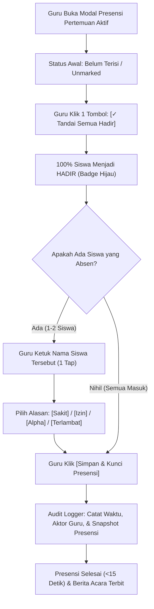

# RUANG PINTAR SAAS — STAGE UX-01.1 MASTER SPECIFICATION
# TEACHER WORKSPACE ARCHITECTURE REFINEMENT
## Refinement Arsitektur Ruang Kerja Guru: Teacher Command Center, Presensi Aman <15 Detik, dan Pelestarian Pilar CBT

| Metadata | Nilai |
| :--- | :--- |
| **Stage** | STAGE UX-01.1 — TEACHER WORKSPACE ARCHITECTURE REFINEMENT |
| **Status** | `PROPOSAL & STRATEGIC REFINEMENT COMPLETED` |
| **Prinsip Utama** | Teacher-First • Action-First • LMS + CBT + SIAKAD Triad • Minimal Cognitive Load |
| **Dokumen Acuan** | STAGE UX-01 Proposal, Human Review Strategic Directive |
| **Larangan Khusus** | JANGAN MENULIS KODE • JANGAN MEMBUAT KOMPONEN • HANYA ANALISIS PRODUK & ARSITEKTUR |

---

## 1. Final Teacher Workspace Architecture

### 1.1. Prinsip Triad Produk: LMS + CBT + SIAKAD
Ruang Pintar SaaS didesain dengan fondasi 3 pilar yang setara:
```text
               ┌────────────────────────────────────────────────────────┐
               │              RUANG PINTAR SAAS WORKSPACE               │
               └────────────────────────────────────────────────────────┘
                                           │
         ┌─────────────────────────────────┼─────────────────────────────────┐
         ▼                                 ▼                                 ▼
   [PILAR 1: LMS]                   [PILAR 2: CBT]                   [PILAR 3: SIAKAD]
Learning Management               Computer Based Test            Sistem Informasi Akademik
• Modul Ajar & Materi             • Bank Soal Terstandar         • Presensi Sesi & Harian
• Tugas Siswa & Pengumpulan       • Pelaksanaan Ujian Online     • Buku Nilai & Ledger
• Jurnal Pembelajaran KBM         • Monitoring Integritas Siswa  • Rapor Digital Kurikulum
• Diskusi & Aktivitas Kelas       • Transfer Nilai ke Ledger     • Riwayat Siswa & Mutasi
```

Sesuai **Revisi Strategis #1**, CBT tidak boleh dilebur ke dalam modul lain atau dianggap sekadar pelengkap. CBT adalah pilar evaluasi terpercaya yang berdiri mandiri dan berintegrasi dua arah dengan Buku Nilai.

### 1.2. Perbandingan Arsitektur Navigasi: Sebelum vs Sesudah

```text
[SEBELUM: 11 MENU TERPISAH & BERORIENTASI DATABASE]
Sidebar Guru:
├── 1. Dashboard                  (Hanya berisi KPI pasif & ringkasan)
├── 2. Kelas Saya                 (Daftar kartu kelas)
├── 3. Jadwal Mengajar            (Jadwal mingguan - redundan dengan kelas)
├── 4. Log Sesi KBM               (Log sesi KBM - redundan dengan jurnal kelas)
├── 5. Kalender Akademik          (Jadwal kalender libur/kegiatan)
├── 6. Rekap Presensi             (Tabel presensi terpisah dari kelas)
├── 7. Buku Nilai & Rapor         (Ledger nilai terpisah)
├── 8. CBT Ujian Online           (Bank soal terpisah)
├── 9. Wali Kelas                 (Khusus wali kelas)
├── 10. Portal Pimpinan           (Khusus guru dengan jabatan kepemimpinan)
└── 11. Asisten AI Guru           (Tool AI)

                     ▼ DISEDERHANAKAN MENJADI ▼

[SESUDAH: 5 MENU UTAMA KERJA GURU + CONTEXTUAL EXTENSIONS]
Sidebar Guru:
├── 1. Beranda Mengajar (Command Center)  (/dashboard)
│      └── Sesi Hari Ini, Timeline Mengajar, Attention Queue (Tugas/Presensi/Jurnal)
├── 2. Ruang Kelas Saya                   (/kelas-saya)
│      └── Pintu masuk ke seluruh aktivitas kelas spesifik (LMS + SIAKAD + CBT Kelas)
├── 3. CBT & Bank Soal                    (/cbt-ujian)
│      └── Pengelolaan Bank Soal, Bank Soal Kolektif, Pelaksanaan & Monitoring Ujian
├── 4. Buku Nilai & Ledger                (/penilaian)
│      └── Rekapitulasi Nilai Akhir Semester, Leger Kelas, dan Validasi e-Rapor
└── 5. Kalender Sekolah                   (/kalender-akademik)
       └── Agenda sekolah, hari libur, jadwal ujian semester

Menu Kontekstual (Hanya muncul jika guru memiliki SK penugasan resmi):
├── [*] Cockpit Wali Kelas                (/wali-kelas)  -> Jika guru = Homeroom Teacher
└── [*] Portal Kepemimpinan               (/pimpinan)    -> Jika guru = Kepala Sekolah / Waka
```

### 1.3. Alasan Rasional Setiap Perubahan
1. **Peleburan "Jadwal Mengajar" dan "Log Sesi KBM" ke dalam Dashboard:**
   Guru tidak perlu membuka halaman jadwal terpisah hanya untuk mengetahui jam mengajarnya hari ini. Timeline jadwal hari ini langsung disajikan di Dashboard dengan tombol aksi cepat.
2. **Peleburan "Rekap Presensi" ke dalam Ruang Kelas & Dashboard:**
   Presensi selalu terikat pada rombel dan jam mengajar. Membuka menu presensi di luar kelas membingungkan guru karena harus memilih kembali rombel, mata pelajaran, dan tanggal.
3. **Mempertahankan CBT sebagai Menu Utama:**
   Guru seringkali menyusun bank soal atau mengevaluasi hasil ujian di luar jam mengajar. Menu khusus CBT memudahkan guru bekerja tanpa harus terdistraksi oleh aktivitas kelas harian.

---

## 2. Teacher Command Center (Dashboard Guru sebagai Pusat Produk)

Sesuai **Revisi Strategis #2**, Dashboard Guru dirombak total dari sekadar menampilkan grafik pasif menjadi **Daily Operating Workspace** yang memandu hari kerja guru.

```text
+--------------------------------------------------------------------------------------------------+
| RUANG PINTAR SAAS                         [SMK OTOMINDO]  [2026/2027 GANJIL]  [Natalia, S.Kom]   |
+--------------------------------------------------------------------------------------------------+
|                                                                                                  |
|  COMMAND CENTER GURU — RABU, 24 SEPTEMBER 2026                                                   |
|  "Selamat pagi, Bu Natalia. Ada 3 sesi mengajar terjadwal untuk Anda hari ini."                  |
|                                                                                                  |
|  +--------------------------------------------------------------------------------------------+  |
|  | [!] SESI SEDANG BERLANGSUNG (08.00 - 09.30 WIB)                                            |  |
|  |                                                                                            |  |
|  | KELAS: XII RPL           MAPEL: Pemrograman Web            RUANG: Lab Komputer 2           |  |
|  | Topik Rencana: Bab 3 - Pembuatan REST API Controller                                       |  |
|  |                                                                                            |  |
|  | Alur Sesi:  [Presensi: Belum]  |  [Materi: Siap]  |  [Tugas: Aktif]  |  [Jurnal: Belum]    |  |
|  |                                                                                            |  |
|  | [ >>> MASUK RUANG KELAS SEKARANG <<< ]             [Lihat Modul Ajar]   [Salin Join Code]  |  |
|  +--------------------------------------------------------------------------------------------+  |
|                                                                                                  |
|  AGENDA MENGAJAR HARI INI                                                                        |
|  +--------------------+  +--------------------+  +--------------------+                          |
|  | 08:00 - 09:30      |  | 09:45 - 11:15      |  | 13:00 - 14:30      |                          |
|  | XII RPL            |  | XI RPL             |  | X RPL              |                          |
|  | Pemrograman Web    |  | Basis Data Relasional | Dasar Pemrograman  |                          |
|  | [SEDANG BERJALAN]  |  | [MENUNGGU WAKTU]   |  | [BELUM DIMULAI]    |                          |
|  +--------------------+  +--------------------+  +--------------------+                          |
|                                                                                                  |
|  KOTAK PERHATIAN & TINDAKAN GURU (ATTENTION QUEUE)                                               |
|  +--------------------------------------------------------------------------------------------+  |
|  | [!] 2 Pertemuan Presensi Belum Ditutup:                                                     |  |
|  |     • XI RPL - Pertemuan 3 (Selasa kemarin) ............................. [Tutup Presensi]  |  |
|  | [!] 12 Tugas Siswa Perlu Dinilai:                                                          |  |
|  |     • Tugas 2: ERD Database Toko Online (Batas: 23 Sep) ................. [Periksa Nilai]   |  |
|  | [!] 1 Ujian CBT Siap Dimulai Besok:                                                        |  |
|  |     • Kuis Harian Bab 2: Pemrograman Web (Token: RP882) ................. [Cek Kesiapan]    |  |
|  +--------------------------------------------------------------------------------------------+  |
|                                                                                                  |
|  KELAS YANG DIAMPU SEMESTER INI                                                                  |
|  [XII RPL - 15 Siswa]      [XI RPL - 28 Siswa]      [X RPL - 21 Siswa]      [+ Kelola Rombel]    |
|  Progress: 4/12 Pertemuan  Progress: 3/12 Pertemuan  Progress: 5/12 Pertemuan                    |
+--------------------------------------------------------------------------------------------------+
```

### 2.1. Prioritas Informasi Command Center (Top-to-Bottom)
1. **P0 — Live Session Banner:** Kartu beraksen cerah yang menyorot kelas yang sedang berjalan detik ini dengan tombol aksi primer `[Masuk Ruang Kelas Sekarang]`.
2. **P1 — Daily Schedule Rail:** Daftar horizontal atau timeline vertikal jadwal mengajar hari ini lengkap dengan badge status (`Sedang Berjalan`, `Menunggu Waktu`, `Selesai`).
3. **P1 — Attention Queue (Kotak Tindakan Tertunda):** Mengagregasi seluruh hutang administratif guru (presensi belum dikunci, tugas yang menunggu penilaian, jurnal yang belum diisi).
4. **P2 — Class Workspace Grid:** Kartu-kartu kelas semester berjalan dengan indikator progres silabus (pertemuan berjalan vs total rencana).

---

## 3. Class Workspace Redesign (Halaman Kelas)

Sesuai **Revisi Strategis #1 & #3**, halaman ruang kelas (`/kelas-saya/[id]`) disederhanakan dari 9 tab menjadi **5 Tab Spesifik Berbasis Pilar**:

```text
[TAB BAR BARU RUANG KELAS GURU]
┌───────────────────┬───────────────────┬───────────────────┬───────────────────┬───────────────────┐
│ 1. Cockpit Kelas  │ 2. Pembelajaran   │ 3. Presensi       │ 4. Penilaian      │ 5. CBT Ujian      │
│    (Hari Ini)     │    (Materi/Tugas) │    (Kehadiran)    │    (Buku Nilai)   │    (Online Exam)  │
└───────────────────┴───────────────────┴───────────────────┴───────────────────┴───────────────────┘
```

### 3.1. Tab 1: Cockpit Kelas (Alur Kerja Hari Ini)
Fokus pada eksekusi pertemuan kelas yang sedang aktif atau yang baru saja selesai:
- **Teaching Workflow Checklist:** Panduan terstruktur langkah kerja guru di dalam kelas:
  - `[✓] 1. Buka Sesi Kelas`
  - `[ ] 2. Ambil Presensi Siswa` → *Shortcut langsung ke modal Presensi Kilat*
  - `[ ] 3. Sajikan Materi Ajar` → *Pilihan materi Bab hari ini*
  - `[ ] 4. Aktifkan Penugasan / Latihan Praktik`
  - `[ ] 5. Ringkasan KBM di Jurnal Guru`
  - `[ ] 6. Kunci & Selesaikan Pertemuan`
- **Class Attention List:** Siswa di rombel ini yang memiliki catatan absensi bermasalah (>3x berturut-turut absen) atau belum mengumpulkan tugas batas waktu hari ini.

### 3.2. Tab 2: Pembelajaran (Materi & Penugasan LMS)
Mengintegrasikan Lingkup Materi (Bab), Modul Ajar, dan Tugas ke dalam satu hierarki logis:
- Susunan per Bab:
  - **Bab 1: Pengenalan Arsitektur REST**
    - 📄 Modul 1.1: Konsep Client-Server & HTTP Verbs
    - 📄 Modul 1.2: Instalasi Framework Backend
    - 📝 Tugas Praktik 1: Instalasi & Pengujian Endpoint GET (15/15 Siswa Mengumpulkan)
  - **Bab 2: Pembuatan Database Model & Controller**
    - 📄 Modul 2.1: Skema Relasi Database
    - 📝 Tugas Praktik 2: CRUD Siswa Controller (12/15 Siswa Mengumpulkan)

### 3.3. Tab 3: Presensi (Kehadiran Siswa)
- Mengelola absensi pertemuan aktif dengan metode **Presensi Kilat (<15 Detik)**.
- Menampilkan kalender rekapitulasi kehadiran kelas (Hadir, Sakit, Izin, Alpha, Terlambat) per siswa untuk seluruh pertemuan semester.

### 3.4. Tab 4: Penilaian (Buku Nilai Siswa)
- Menampilkan Buku Nilai dengan kemampuan toggle instan:
  - **Mode Guru Harian (Simple Mode):** Menampilkan Nilai Rata-rata Tugas, Kuis, Sikap, dan Nilai Berjalan.
  - **Mode Akademik Detail (Kurikulum Merdeka):** Menampilkan matriks TP, Lingkup Materi, Sumatif Akhir, dan deskripsi rapor.

### 3.5. Tab 5: CBT Ujian (Evaluasi & Bank Soal Kelas)
- Menampilkan daftar paket soal dan ujian CBT yang ditugaskan untuk rombel ini.
- Tombol aksi:
  - `[+ Buat Ujian CBT Baru untuk Kelas Ini]`
  - `[Pantau Ujian Berlangsung (Live Monitor)]`
  - `[Tarik Hasil Nilai CBT ke Buku Nilai]`

---

## 4. Attendance Workflow Redesign (Presensi Cepat Aman Audit < 15 Detik)

Sesuai **Revisi Strategis #4**, sistem **DILARANG** menandai hadir secara otomatis tanpa tindakan guru demi mempertahankan integritas data legal kehadiran. Namun, beban kerja guru dipangkas hingga 90% melalui pola **Preset Action "Tandai Semua Hadir"**.

### 4.1. Diagram Alur Presensi Aman & Kilat



### 4.2. Perbandingan Beban Kerja Presensi (Kelas 25 Siswa)

| Aspek | Metode Lama | Metode Presensi Kilat (Stage UX-01.1) |
| :--- | :---: | :---: |
| **Pilihan Status per Siswa** | 6 Radio Button (H/I/S/A/D/T) | Kartu Nama Bersih dengan Status Badge |
| **Total Klik (Kondisi 2 Siswa Sakit)** | 25 kali klik radio button + 1 simpan | **1 klik [Tandai Semua] + 2 ketukan ubah siswa + 1 simpan** |
| **Total Interaksi Guru** | **26 Interaksi** | **Hanya 4 Interaksi** |
| **Waktu Penyelesaian Rata-rata** | **70 – 90 Detik** | **8 – 14 Detik** |
| **Integritas Legal / Audit Trail** | Ada | **Ada (Eksplisit tindakan guru)** |
| **Kompatibilitas Layar Sentuh** | Rentan salah pencet (radio kecil) | **Sangat Nyaman (Kartu sentuh 48px)** |

---

## 5. Navigation Simplification Audit

Audit lengkap terhadap seluruh 11 menu sidebar guru yang ada saat ini:

| Menu Saat Ini | Rute | Status Rekomendasi | Rationale & Rekomendasi Konsolidasi |
| :--- | :--- | :---: | :--- |
| **Dashboard** | `/dashboard` | **DIPERTAHANKAN (UPGRADE)** | Ditransformasikan menjadi **Teacher Command Center** harian. |
| **Kelas Saya** | `/kelas-saya` | **DIPERTAHANKAN** | Gerbang utama seluruh rombel pengajaran guru (LMS + SIAKAD + CBT). |
| **Jadwal Mengajar** | `/jadwal-saya` | **DIGABUNG** | Dilebur ke dalam Timeline Hari Ini di Dashboard dan Tab Cockpit Kelas. Guru tidak perlu membuka rute terpisah. |
| **Log Sesi KBM** | `/sesi-pembelajaran`| **DIGABUNG** | Dilebur ke dalam Jurnal KBM di dalam kelas. Pengisian log sesi terjadi di ruang kelas, bukan menu terpisah. |
| **Kalender Akademik** | `/kalender-akademik`| **DIPERTAHANKAN** | Esensial untuk mengetahui kalender libur, kalender ujian, dan timeline tahun ajaran. |
| **Rekap Presensi** | `/presensi-kelas`| **DIGABUNG** | Dilebur ke dalam Tab Presensi di masing-masing kelas. Rekap multi-kelas diakses via Buku Nilai/Laporan. |
| **Buku Nilai & Rapor**| `/penilaian` | **DIPERTAHANKAN** | Pusat ledger nilai akhir, rekap capaian semester, dan cetak rapor digital. |
| **CBT Ujian Online** | `/cbt-ujian` | **DIPERTAHANKAN (PILAR UTAMA)** | Pilar utama evaluasi (Bank Soal, Penjadwalan Ujian, Monitoring Ujian Massal). |
| **Wali Kelas** | `/wali-kelas` | **KONTEKSTUAL** | Hanya muncul bagi guru yang memiliki SK penugasan sebagai Wali Kelas. |
| **Portal Pimpinan** | `/pimpinan` | **KONTEKSTUAL** | Hanya muncul bagi guru yang memiliki jabatan struktural (Kepala Sekolah / Waka). |
| **Asisten AI Guru** | `/asisten-ai` | **DISEDERHANAKAN** | Diposisikan sebagai tombol bantuan mengambang (*Floating Copilot*) di dalam persiapan materi/soal, bukan menu dominan di sidebar. |

---

## 6. Wireframe Teks Versi Academic Glass UI

### 6.1. Wireframe Dashboard Guru (Teacher Command Center)
```text
+--------------------------------------------------------------------------------------------------+
| RUANG PINTAR                   SMK OTOMINDO  |  TA 2026/2027 GANJIL           [Natalia, S.Kom v] |
+--------------------------------------------------------------------------------------------------+
| [ Beranda ]  [ Ruang Kelas Saya ]  [ CBT & Bank Soal ]  [ Buku Nilai ]  [ Kalender ]  [Wali Kelas] |
+--------------------------------------------------------------------------------------------------+
|                                                                                                  |
|  PUSAT KENDALI MENGAJAR HARI INI — RABU, 24 SEPTEMBER 2026                                       |
|                                                                                                  |
|  +--------------------------------------------------------------------------------------------+  |
|  | [*] SESI BERJALAN SEKARANG: JAM KE 1-3 (08.00 - 09.30 WIB)                                 |  |
|  |                                                                                            |  |
|  | XII RPL  •  Pemrograman Web  •  Lab Komputer 2                                              |  |
|  | Modul Rencana: Bab 3 - Membuat API Controller & Routing                                    |  |
|  |                                                                                            |  |
|  | Progress Sesi: [ Presensi: BELUM ] [ Materi: SIAP ] [ Tugas: AKTIF ] [ Jurnal: BELUM ]     |  |
|  |                                                                                            |  |
|  | [ >>> MASUK RUANG KELAS & MULAI MENGAJAR <<< ]                   [Buka Modul Ajar]         |  |
|  +--------------------------------------------------------------------------------------------+  |
|                                                                                                  |
|  JADWAL HARI INI                                                                                 |
|  +---------------------------+  +---------------------------+  +---------------------------+     |
|  | 08:00 - 09:30             |  | 09:45 - 11:15             |  | 13:00 - 14:30             |     |
|  | XII RPL (Web Programming) |  | XI RPL (Database SQL)     |  | X RPL (Dasar Pemrograman) |     |
|  | Status: [SEDANG MENGAJAR] |  | Status: [MENUNGGU WAKTU]  |  | Status: [BELUM DIMULAI]   |     |
|  +---------------------------+  +---------------------------+  +---------------------------+     |
|                                                                                                  |
|  KOTAK PERHATIAN GURU (TINDAKAN TERTUNDA)                                                        |
|  +--------------------------------------------------------------------------------------------+  |
|  | [!] 1 Sesi Presensi belum ditutup: XI RPL (Selasa kemarin) ............... [Tutup Sekarang] |  |
|  | [!] 12 Pengumpulan tugas siswa menunggu penilaian ....................... [Periksa & Nilai]|  |
|  | [i] 1 Ujian CBT dijadwalkan besok: Kuis Bab 2 Basis Data ................ [Lihat Kesiapan] |  |
|  +--------------------------------------------------------------------------------------------+  |
|                                                                                                  |
|  KELAS YANG DIAMPU SEMESTER INI                                                                  |
|  +-------------------------+  +-------------------------+  +-------------------------+           |
|  | KELAS XII RPL           |  | KELAS XI RPL            |  | KELAS X RPL             |           |
|  | 15 Siswa Terdaftar      |  | 28 Siswa Terdaftar      |  | 21 Siswa Terdaftar      |           |
|  | Pertemuan: 4 dari 14    |  | Pertemuan: 3 dari 14    |  | Pertemuan: 5 dari 14    |           |
|  | [Buka Ruang Kelas]      |  | [Buka Ruang Kelas]      |  | [Buka Ruang Kelas]      |           |
|  +-------------------------+  +-------------------------+  +-------------------------+           |
+--------------------------------------------------------------------------------------------------+
```

### 6.2. Wireframe Ruang Kelas Guru (Cockpit Sesi Pertemuan)
```text
+--------------------------------------------------------------------------------------------------+
| <- Kembali ke Daftar Kelas                                                                       |
| RUANG KELAS: XII RPL — Pemrograman Web (Lab Komputer 2)                                          |
| Kode Kelas: RP-7782  [Salin Kode Gabung Siswa]                        Status: Sesi Hari Ini Aktif|
+--------------------------------------------------------------------------------------------------+
| [ COCKPIT KELAS ]  [ PEMBELAJARAN (LMS) ]  [ PRESENSI ]  [ PENILAIAN ]  [ CBT UJIAN ONLINE ]     |
+--------------------------------------------------------------------------------------------------+
|                                                                                                  |
|  CHECKLIST WORKFLOW PERTEMUAN HARI INI (Pertemuan ke-5)                 Progress Sesi: [ 40% ]   |
|  +--------------------------------------------------------------------------------------------+  |
|  | [✓] Langkah 1: Buka Sesi Kelas (08.00 WIB) ........................................ SELESAI|  |
|  | [✓] Langkah 2: Catat Presensi Siswa (14 Hadir, 1 Sakit) .......................... SELESAI|  |
|  | [ ] Langkah 3: Sajikan Modul Ajar Hari Ini .................. [ Tampilkan Materi di Layar ]|  |
|  | [ ] Langkah 4: Aktifkan Tugas Praktik Siswa ................. [ Terbitkan Tugas Latihan ]  |  |
|  | [ ] Langkah 5: Tulis Catatan KBM & Jurnal Guru .............. [ Tulis Jurnal Sesi ]       |  |
|  | [ ] Langkah 6: Kunci & Selesaikan Pertemuan ................. [ Tutup Kelas Selesai ]      |  |
|  +--------------------------------------------------------------------------------------------+  |
|                                                                                                  |
|  RINGKASAN CEPAT KELAS HARI INI                                                                  |
|  • Kehadiran: 14 dari 15 Siswa (93%) — 1 Sakit: Ardiansyah                                       |
|  • Tugas Berjalan: Praktik REST API Controller (Batas Pengumpulan: 14.00 WIB)                    |
|  • Catatan Siswa: Arya Fayyaz membutuhkan bimbingan instalasi dependensi Express.                |
+--------------------------------------------------------------------------------------------------+
```

### 6.3. Wireframe Presensi Kilat (< 15 Detik)
```text
+--------------------------------------------------------------------------------------------------+
| MODAL PRESENSI KELAS — PERTEMUAN 5 (XII RPL)                                       [ X Tutup ]   |
| Waktu: Rabu, 24 Sep 2026 | Mata Pelajaran: Pemrograman Web                                       |
+--------------------------------------------------------------------------------------------------+
|                                                                                                  |
|  TOMBOL PRESET CEPAT:                                                                            |
|  [ ✓ TANDAI SEMUA HADIR (1 KLIK) ]                  Ringkasan: 14 Hadir, 1 Sakit, 0 Izin, 0 Alpha |
|                                                                                                  |
|  Petunjuk: Cukup ketuk nama siswa jika siswa tersebut berhalangan hadir.                        |
|                                                                                                  |
|  +-------------------------------+   +-------------------------------+                           |
|  | A. Rizki Fadilah              |   | Abdillah Darma Bhakti         |                           |
|  | NIS: 261001   [ HADIR (v) ]   |   | NIS: 261002   [ HADIR (v) ]   |                           |
|  +-------------------------------+   +-------------------------------+                           |
|  | Ardiansyah                    |   | Arya Fayyaz Reyhan W.         |                           |
|  | NIS: 261003   [ SAKIT (✎) ]   |   | NIS: 261004   [ HADIR (v) ]   |                           |
|  +-------------------------------+   +-------------------------------+                           |
|  | Dhefa Hartono                 |   | Dian Alit Hana Lena           |                           |
|  | NIS: 261005   [ HADIR (v) ]   |   | NIS: 261006   [ HADIR (v) ]   |                           |
|  +-------------------------------+   +-------------------------------+                           |
|  ... (15 Siswa)                                                                                  |
|                                                                                                  |
|  [ Batal ]                                           [ >>> SIMPAN & KUNCI PRESENSI <<< ]         |
+--------------------------------------------------------------------------------------------------+
```

### 6.4. Wireframe Buku Nilai (Dua Mode)
```text
+--------------------------------------------------------------------------------------------------+
| BUKU NILAI KELAS: XII RPL — Pemrograman Web                                                      |
| Mode Tampilan: [ [x] Mode Guru Harian (Simple)  |  [ ] Mode Detail Kurikulum Merdeka ]           |
+--------------------------------------------------------------------------------------------------+
|                                                                                                  |
| DAFTAR NILAI HARIAN BERJALAN                                                                     |
| +----+----------------------+--------------+--------------+-------------+-----------+----------+ |
| | No | Nama Siswa           | Rerata Tugas | Kuis CBT     | Keaktifan   | Nilai Akhir| Predikat | |
| +----+----------------------+--------------+--------------+-------------+-----------+----------+ |
| | 1  | A. Rizki Fadilah     | 88           | 85           | 90          | 87.5      | A        | |
| | 2  | Abdillah Darma B.    | 82           | 80           | 85          | 82.0      | B+       | |
| | 3  | Ardiansyah           | 78           | 75           | 80          | 77.5      | B        | |
| | 4  | Arya Fayyaz R. W.    | 90           | 92           | 95          | 92.0      | A        | |
| +----+----------------------+--------------+--------------+-------------+-----------+----------+ |
| [ + Tambah Kolom Nilai Manual ]       [ Ekspor Excel / CSV ]       [ Tarik Nilai dari CBT ]      |
+--------------------------------------------------------------------------------------------------+
```

### 6.5. Wireframe CBT Monitor & Bank Soal Kelas
```text
+--------------------------------------------------------------------------------------------------+
| CBT & EVALUASI ONLINE: XII RPL                                                                   |
| [ + Buat Paket Ujian Baru ]                     [ Buka Bank Soal Global ]                        |
+--------------------------------------------------------------------------------------------------+
|                                                                                                  |
| UJIAN AKTIF SAAT INI:                                                                            |
| +----------------------------------------------------------------------------------------------+ |
| | UJIAN: Ulangan Harian Bab 2 - REST API (Token: RP-9921)                                      | |
| | Jadwal: 08.15 - 09.15 WIB (60 Menit)                                                         | |
| | Status Peserta: 14 Sedang Mengerjakan  |  1 Selesai  |  0 Belum Mulai                        | |
| |                                                                                              | |
| | [ >>> BUKA LIVE EXAM MONITOR <<< ]              [ Rilis Token ]          [ Hentikan Ujian ]  | |
| +----------------------------------------------------------------------------------------------+ |
|                                                                                                  |
| RIWAYAT UJIAN CBT KELAS INI:                                                                     |
| • Pre-Test Arsitektur Web (15 Peserta • Rerata: 82.5) ................. [Salin Nilai ke Ledger]|
| • Kuis 1: Pengenalan HTTP (15 Peserta • Rerata: 86.0) ................ [Salin Nilai ke Ledger]|
+--------------------------------------------------------------------------------------------------+
```

---

## 7. Implementation Priority Matrix (P0 – P3)

Prioritas implementasi disusun berdasarkan dampak langsung terhadap pengurangan beban kerja harian guru:

```text
┌─────────────────────────────────────────────────────────────────────────────────────────────────┐
│                                PRIORITAS IMPLEMENTASI WORKSPACE GURU                            │
├───────────┬─────────────────────────────────────────────────────────────────────────────────────┤
│ Level     │ Item Pekerjaan & Dampak Pengalaman Pengguna                                         │
├───────────┼─────────────────────────────────────────────────────────────────────────────────────┤
│ **P0**    │ **Teacher Command Center Dashboard (/dashboard)**                                   │
│ (Kritis)  │ • Banner Live Session jadwal aktif sekarang dengan tombol [Mulai Mengajar].         │
│           │ • Timeline Mengajar Hari Ini secara kronologis.                                     │
│           │ • Attention Queue (Hutang presensi, tugas menunggu nilai, jurnal belum diisi).      │
│           │ *Dampak: Guru langsung tahu apa yang harus dikerjakan tanpa mencari menu.*          │
├───────────┼─────────────────────────────────────────────────────────────────────────────────────┤
│ **P1**    │ **Presensi Kilat Aman Audit (< 15 Detik)**                                          │
│ (Tinggi)  │ • Preset tombol eksplisit [✓ Tandai Semua Hadir].                                   │
│           │ • Quick Tap untuk mengubah siswa absen (Sakit/Izin/Alpha/Terlambat).                │
│           │ • Penyederhanaan alur 4 interaksi selesai dalam <15 detik.                          │
│           │ *Dampak: Memangkas 90% waktu presensi di setiap jam masuk kelas.*                   │
├───────────┼─────────────────────────────────────────────────────────────────────────────────────┤
│ **P1**    │ **Restrukturisasi 5 Tab Ruang Kelas (/kelas-saya/[id])**                            │
│ (Tinggi)  │ • Eliminasi 9 tab menjadi 5 Tab: Cockpit, Pembelajaran, Presensi, Penilaian, CBT.   │
│           │ • Interactive Teaching Checklist (Progress sesi 0% s/d 100%).                       │
│           │ • Menjaga CBT sebagai pilar utama terintegrasi.                                     │
│           │ *Dampak: Mengeliminasi beban kognitif guru saat mengajar di kelas.*                 │
├───────────┼─────────────────────────────────────────────────────────────────────────────────────┤
│ **P2**    │ **Penilaian Dua Mode (Simple vs Detail)**                                           │
│ (Sedang)  │ • Toggle Mode Guru Harian (Tugas + Kuis CBT + Nilai Akhir) vs Kurikulum Merdeka.    │
│           │ • Tombol 1-klik "Tarik Nilai dari CBT" langsung ke kolom buku nilai.                │
│           │ *Dampak: Guru tidak pusing dengan rumus dan akronim kurikulum saat input nilai.*    │
├───────────┼─────────────────────────────────────────────────────────────────────────────────────┤
│ **P3**    │ **Penyederhanaan Navigasi Sidebar & Micro-Interactions**                            │
│ (Rendah)  │ • Konsolidasi menu sidebar guru dari 11 menu menjadi 5 menu utama.                  │
│           │ • Polish Academic Glass UI v1.2, tactile button clicks, dan empty state ber-CTA.    │
│           │ *Dampak: Tampilan antarmuka bersih, tenang, dan profesional.*                       │
└───────────┴─────────────────────────────────────────────────────────────────────────────────────┘
```

---

## 8. Kesimpulan & Rekomendasi Langkah Berikutnya

Dengan refinement arsitektur STAGE UX-01.1 ini:
1. **Pilar Triad Terjaga Utuh:** Ruang Pintar tetap menjadi platform terpadu **LMS + CBT + SIAKAD**.
2. **Dashboard Menjadi Command Center:** Guru memiliki satu titik tolak harian yang proaktif.
3. **Presensi Efisien & Aman Audit:** Presensi diselesaikan dalam kurang dari 15 detik dengan tetap memiliki jejak aksi legal guru yang valid.
4. **Beban Kognitif Berkurang Drastis:** Tab kelas dipangkas dari 9 menjadi 5 tab yang jelas batas tugasnya.

> [!NOTE]
> Sesuai instruksi baku: **Tidak ada kode atau komponen yang dibuat pada tahap ini.** Seluruh analisis produk dan spesifikasi arsitektur telah selesai dan siap diajukan untuk ditinjau oleh Pengguna.
